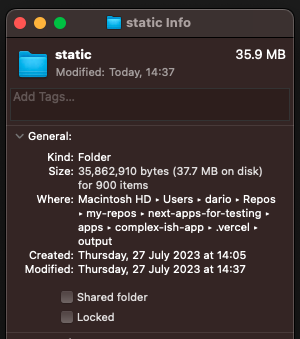
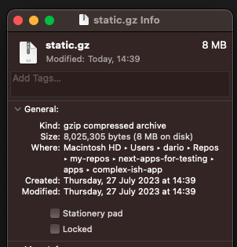

# Results

The produced `.vercel/output/static` directory is 35.9MB:



8MB gzipped (with `tar -czf static.gz .vercel/output/static`):



The application can still successfully get deployed (on a paid plan):
https://dc73d7f5.next-on-pages-test-5h3.pages.dev/

<details>

<summary>routeBs cap</summary>

180 routeB pages are the maximum I've manage to build, above that `next build` crashed because it can't allocate more space on the heap:
`FATAL ERROR: Reached heap limit Allocation failed - JavaScript heap out of memory`
(increasing the `max-old-space-size` didn't seem to help, I am not sure if that gets overridden by Next)

</details>

<details>

<summary>`nop-build-log.json` content</summary>

```
{
    "timestamp": 1690463153725,
    "outputDir": ".vercel/output/static/_worker.js",
    "versions": {
        "@cloudflare/next-on-pages": "1.4.0"
    },
    "buildFiles": {
        "functions": {
        "invalid": [],
        "middleware": [],
        "edge": [
            {
            "relativePath": "/antd.func",
            "config": {
                "runtime": "edge",
                "name": "antd",
                "deploymentTarget": "v8-worker",
                "entrypoint": "index.js",
                "assets": [],
                "framework": {
                "slug": "nextjs",
                "version": "13.4.6"
                }
            },
            "route": {
                "path": "/antd",
                "overrides": [
                "/antd.rsc"
                ]
            },
            "outputPath": "__next-on-pages-dist__/functions/antd.func.js"
            },
            {
            "relativePath": "/api/hello-pages.func",
            "config": {
                "runtime": "edge",
                "name": "api/hello-pages",
                "deploymentTarget": "v8-worker",
                "entrypoint": "index.js",
                "assets": [],
                "framework": {
                "slug": "nextjs",
                "version": "13.4.6"
                }
            },
            "route": {
                "path": "/api/hello-pages",
                "overrides": []
            },
            "outputPath": "__next-on-pages-dist__/functions/api/hello-pages.func.js"
            },
            {
            "relativePath": "/api/hello.func",
            "config": {
                "runtime": "edge",
                "name": "api/hello",
                "deploymentTarget": "v8-worker",
                "entrypoint": "index.js",
                "assets": [],
                "framework": {
                "slug": "nextjs",
                "version": "13.4.6"
                }
            },
            "route": {
                "path": "/api/hello",
                "overrides": []
            },
            "outputPath": "__next-on-pages-dist__/functions/api/hello.func.js"
            },
            {
            "relativePath": "/api/lorem-ipsum.func",
            "config": {
                "runtime": "edge",
                "name": "api/lorem-ipsum",
                "deploymentTarget": "v8-worker",
                "entrypoint": "index.js",
                "assets": [],
                "framework": {
                "slug": "nextjs",
                "version": "13.4.6"
                }
            },
            "route": {
                "path": "/api/lorem-ipsum",
                "overrides": []
            },
            "outputPath": "__next-on-pages-dist__/functions/api/lorem-ipsum.func.js"
            },
            {
            "relativePath": "/api/marked.func",
            "config": {
                "runtime": "edge",
                "name": "api/marked",
                "deploymentTarget": "v8-worker",
                "entrypoint": "index.js",
                "assets": [],
                "framework": {
                "slug": "nextjs",
                "version": "13.4.6"
                }
            },
            "route": {
                "path": "/api/marked",
                "overrides": []
            },
            "outputPath": "__next-on-pages-dist__/functions/api/marked.func.js"
            },
            {
            "relativePath": "/api/moment.func",
            "config": {
                "runtime": "edge",
                "name": "api/moment",
                "deploymentTarget": "v8-worker",
                "entrypoint": "index.js",
                "assets": [],
                "framework": {
                "slug": "nextjs",
                "version": "13.4.6"
                }
            },
            "route": {
                "path": "/api/moment",
                "overrides": []
            },
            "outputPath": "__next-on-pages-dist__/functions/api/moment.func.js"
            },
            {
            "relativePath": "/api/og.func",
            "config": {
                "runtime": "edge",
                "name": "api/og",
                "deploymentTarget": "v8-worker",
                "entrypoint": "index.js",
                "assets": [
                {
                    "name": "noto-sans-v27-latin-regular.5dda3fca77107598.ttf",
                    "path": "assets/noto-sans-v27-latin-regular.5dda3fca77107598.ttf"
                }
                ],
                "framework": {
                "slug": "nextjs",
                "version": "13.4.6"
                }
            },
            "route": {
                "path": "/api/og",
                "overrides": []
            },
            "outputPath": "__next-on-pages-dist__/functions/api/og.func.js"
            },
            {
            "relativePath": "/api/pretty-print-json.func",
            "config": {
                "runtime": "edge",
                "name": "api/pretty-print-json",
                "deploymentTarget": "v8-worker",
                "entrypoint": "index.js",
                "assets": [],
                "framework": {
                "slug": "nextjs",
                "version": "13.4.6"
                }
            },
            "route": {
                "path": "/api/pretty-print-json",
                "overrides": []
            },
            "outputPath": "__next-on-pages-dist__/functions/api/pretty-print-json.func.js"
            },
            {
            "relativePath": "/api/qs.func",
            "config": {
                "runtime": "edge",
                "name": "api/qs",
                "deploymentTarget": "v8-worker",
                "entrypoint": "index.js",
                "assets": [],
                "framework": {
                "slug": "nextjs",
                "version": "13.4.6"
                }
            },
            "route": {
                "path": "/api/qs",
                "overrides": []
            },
            "outputPath": "__next-on-pages-dist__/functions/api/qs.func.js"
            },
            {
            "relativePath": "/api/zod.func",
            "config": {
                "runtime": "edge",
                "name": "api/zod",
                "deploymentTarget": "v8-worker",
                "entrypoint": "index.js",
                "assets": [],
                "framework": {
                "slug": "nextjs",
                "version": "13.4.6"
                }
            },
            "route": {
                "path": "/api/zod",
                "overrides": []
            },
            "outputPath": "__next-on-pages-dist__/functions/api/zod.func.js"
            },
            {
            "relativePath": "/chakra-ui.func",
            "config": {
                "runtime": "edge",
                "name": "chakra-ui",
                "deploymentTarget": "v8-worker",
                "entrypoint": "index.js",
                "assets": [],
                "framework": {
                "slug": "nextjs",
                "version": "13.4.6"
                }
            },
            "route": {
                "path": "/chakra-ui",
                "overrides": [
                "/chakra-ui.rsc"
                ]
            },
            "outputPath": "__next-on-pages-dist__/functions/chakra-ui.func.js"
            },
            {
            "relativePath": "/font-awesome-icons.func",
            "config": {
                "runtime": "edge",
                "name": "font-awesome-icons",
                "deploymentTarget": "v8-worker",
                "entrypoint": "index.js",
                "assets": [],
                "framework": {
                "slug": "nextjs",
                "version": "13.4.6"
                }
            },
            "route": {
                "path": "/font-awesome-icons",
                "overrides": [
                "/font-awesome-icons.rsc"
                ]
            },
            "outputPath": "__next-on-pages-dist__/functions/font-awesome-icons.func.js"
            },
            {
            "relativePath": "/material-ui.func",
            "config": {
                "runtime": "edge",
                "name": "material-ui",
                "deploymentTarget": "v8-worker",
                "entrypoint": "index.js",
                "assets": [],
                "framework": {
                "slug": "nextjs",
                "version": "13.4.6"
                }
            },
            "route": {
                "path": "/material-ui",
                "overrides": [
                "/material-ui.rsc"
                ]
            },
            "outputPath": "__next-on-pages-dist__/functions/material-ui.func.js"
            },
            {
            "relativePath": "/nextui.func",
            "config": {
                "runtime": "edge",
                "name": "nextui",
                "deploymentTarget": "v8-worker",
                "entrypoint": "index.js",
                "assets": [],
                "framework": {
                "slug": "nextjs",
                "version": "13.4.6"
                }
            },
            "route": {
                "path": "/nextui",
                "overrides": [
                "/nextui.rsc"
                ]
            },
            "outputPath": "__next-on-pages-dist__/functions/nextui.func.js"
            },
            {
            "relativePath": "/react-bootstrap.func",
            "config": {
                "runtime": "edge",
                "name": "react-bootstrap",
                "deploymentTarget": "v8-worker",
                "entrypoint": "index.js",
                "assets": [],
                "framework": {
                "slug": "nextjs",
                "version": "13.4.6"
                }
            },
            "route": {
                "path": "/react-bootstrap",
                "overrides": [
                "/react-bootstrap.rsc"
                ]
            },
            "outputPath": "__next-on-pages-dist__/functions/react-bootstrap.func.js"
            },
            {
            "relativePath": "/uselessRoutes/routesA/routeA/dRoute/[routeName].func",
            "config": {
                "runtime": "edge",
                "name": "uselessRoutes/routesA/routeA/dRoute/[routeName]",
                "deploymentTarget": "v8-worker",
                "entrypoint": "index.js",
                "assets": [],
                "framework": {
                "slug": "nextjs",
                "version": "13.4.6"
                }
            },
            "route": {
                "path": "/uselessRoutes/routesA/routeA/dRoute/[routeName]",
                "overrides": [
                "/uselessRoutes/routesA/routeA/dRoute/[routeName].rsc"
                ]
            },
            "outputPath": "__next-on-pages-dist__/functions/uselessRoutes/routesA/routeA/dRoute/[routeName].func.js"
            },
            {
            "relativePath": "/uselessRoutes/routesA/routeA_copy/dRoute/[routeName].func",
            "config": {
                "runtime": "edge",
                "name": "uselessRoutes/routesA/routeA_copy/dRoute/[routeName]",
                "deploymentTarget": "v8-worker",
                "entrypoint": "index.js",
                "assets": [],
                "framework": {
                "slug": "nextjs",
                "version": "13.4.6"
                }
            },
            "route": {
                "path": "/uselessRoutes/routesA/routeA_copy/dRoute/[routeName]",
                "overrides": [
                "/uselessRoutes/routesA/routeA_copy/dRoute/[routeName].rsc"
                ]
            },
            "outputPath": "__next-on-pages-dist__/functions/uselessRoutes/routesA/routeA_copy/dRoute/[routeName].func.js"
            },
            {
            "relativePath": "/uselessRoutes/routesA/routeA_copy_1/dRoute/[routeName].func",
            "config": {
                "runtime": "edge",
                "name": "uselessRoutes/routesA/routeA_copy_1/dRoute/[routeName]",
                "deploymentTarget": "v8-worker",
                "entrypoint": "index.js",
                "assets": [],
                "framework": {
                "slug": "nextjs",
                "version": "13.4.6"
                }
            },
            "route": {
                "path": "/uselessRoutes/routesA/routeA_copy_1/dRoute/[routeName]",
                "overrides": [
                "/uselessRoutes/routesA/routeA_copy_1/dRoute/[routeName].rsc"
                ]
            },
            "outputPath": "__next-on-pages-dist__/functions/uselessRoutes/routesA/routeA_copy_1/dRoute/[routeName].func.js"
            },
            {
            "relativePath": "/uselessRoutes/routesA/routeA_copy_2/dRoute/[routeName].func",
            "config": {
                "runtime": "edge",
                "name": "uselessRoutes/routesA/routeA_copy_2/dRoute/[routeName]",
                "deploymentTarget": "v8-worker",
                "entrypoint": "index.js",
                "assets": [],
                "framework": {
                "slug": "nextjs",
                "version": "13.4.6"
                }
            },
            "route": {
                "path": "/uselessRoutes/routesA/routeA_copy_2/dRoute/[routeName]",
                "overrides": [
                "/uselessRoutes/routesA/routeA_copy_2/dRoute/[routeName].rsc"
                ]
            },
            "outputPath": "__next-on-pages-dist__/functions/uselessRoutes/routesA/routeA_copy_2/dRoute/[routeName].func.js"
            },
            {
            "relativePath": "/uselessRoutes/routesA/routeA_copy_3/dRoute/[routeName].func",
            "config": {
                "runtime": "edge",
                "name": "uselessRoutes/routesA/routeA_copy_3/dRoute/[routeName]",
                "deploymentTarget": "v8-worker",
                "entrypoint": "index.js",
                "assets": [],
                "framework": {
                "slug": "nextjs",
                "version": "13.4.6"
                }
            },
            "route": {
                "path": "/uselessRoutes/routesA/routeA_copy_3/dRoute/[routeName]",
                "overrides": [
                "/uselessRoutes/routesA/routeA_copy_3/dRoute/[routeName].rsc"
                ]
            },
            "outputPath": "__next-on-pages-dist__/functions/uselessRoutes/routesA/routeA_copy_3/dRoute/[routeName].func.js"
            },
            {
            "relativePath": "/uselessRoutes/routesA/routeA_copy_4/dRoute/[routeName].func",
            "config": {
                "runtime": "edge",
                "name": "uselessRoutes/routesA/routeA_copy_4/dRoute/[routeName]",
                "deploymentTarget": "v8-worker",
                "entrypoint": "index.js",
                "assets": [],
                "framework": {
                "slug": "nextjs",
                "version": "13.4.6"
                }
            },
            "route": {
                "path": "/uselessRoutes/routesA/routeA_copy_4/dRoute/[routeName]",
                "overrides": [
                "/uselessRoutes/routesA/routeA_copy_4/dRoute/[routeName].rsc"
                ]
            },
            "outputPath": "__next-on-pages-dist__/functions/uselessRoutes/routesA/routeA_copy_4/dRoute/[routeName].func.js"
            },
            {
            "relativePath": "/uselessRoutes/routesA/routeA_copy_5/dRoute/[routeName].func",
            "config": {
                "runtime": "edge",
                "name": "uselessRoutes/routesA/routeA_copy_5/dRoute/[routeName]",
                "deploymentTarget": "v8-worker",
                "entrypoint": "index.js",
                "assets": [],
                "framework": {
                "slug": "nextjs",
                "version": "13.4.6"
                }
            },
            "route": {
                "path": "/uselessRoutes/routesA/routeA_copy_5/dRoute/[routeName]",
                "overrides": [
                "/uselessRoutes/routesA/routeA_copy_5/dRoute/[routeName].rsc"
                ]
            },
            "outputPath": "__next-on-pages-dist__/functions/uselessRoutes/routesA/routeA_copy_5/dRoute/[routeName].func.js"
            },
            {
            "relativePath": "/uselessRoutes/routesA/routeA_copy_6/dRoute/[routeName].func",
            "config": {
                "runtime": "edge",
                "name": "uselessRoutes/routesA/routeA_copy_6/dRoute/[routeName]",
                "deploymentTarget": "v8-worker",
                "entrypoint": "index.js",
                "assets": [],
                "framework": {
                "slug": "nextjs",
                "version": "13.4.6"
                }
            },
            "route": {
                "path": "/uselessRoutes/routesA/routeA_copy_6/dRoute/[routeName]",
                "overrides": [
                "/uselessRoutes/routesA/routeA_copy_6/dRoute/[routeName].rsc"
                ]
            },
            "outputPath": "__next-on-pages-dist__/functions/uselessRoutes/routesA/routeA_copy_6/dRoute/[routeName].func.js"
            },
            {
            "relativePath": "/uselessRoutes/routesA/routeA_copy_7/dRoute/[routeName].func",
            "config": {
                "runtime": "edge",
                "name": "uselessRoutes/routesA/routeA_copy_7/dRoute/[routeName]",
                "deploymentTarget": "v8-worker",
                "entrypoint": "index.js",
                "assets": [],
                "framework": {
                "slug": "nextjs",
                "version": "13.4.6"
                }
            },
            "route": {
                "path": "/uselessRoutes/routesA/routeA_copy_7/dRoute/[routeName]",
                "overrides": [
                "/uselessRoutes/routesA/routeA_copy_7/dRoute/[routeName].rsc"
                ]
            },
            "outputPath": "__next-on-pages-dist__/functions/uselessRoutes/routesA/routeA_copy_7/dRoute/[routeName].func.js"
            },
            {
            "relativePath": "/uselessRoutes/routesA/routeA_copy_8/dRoute/[routeName].func",
            "config": {
                "runtime": "edge",
                "name": "uselessRoutes/routesA/routeA_copy_8/dRoute/[routeName]",
                "deploymentTarget": "v8-worker",
                "entrypoint": "index.js",
                "assets": [],
                "framework": {
                "slug": "nextjs",
                "version": "13.4.6"
                }
            },
            "route": {
                "path": "/uselessRoutes/routesA/routeA_copy_8/dRoute/[routeName]",
                "overrides": [
                "/uselessRoutes/routesA/routeA_copy_8/dRoute/[routeName].rsc"
                ]
            },
            "outputPath": "__next-on-pages-dist__/functions/uselessRoutes/routesA/routeA_copy_8/dRoute/[routeName].func.js"
            },
            {
            "relativePath": "/uselessRoutes/routesA/routeA_copy_9/dRoute/[routeName].func",
            "config": {
                "runtime": "edge",
                "name": "uselessRoutes/routesA/routeA_copy_9/dRoute/[routeName]",
                "deploymentTarget": "v8-worker",
                "entrypoint": "index.js",
                "assets": [],
                "framework": {
                "slug": "nextjs",
                "version": "13.4.6"
                }
            },
            "route": {
                "path": "/uselessRoutes/routesA/routeA_copy_9/dRoute/[routeName]",
                "overrides": [
                "/uselessRoutes/routesA/routeA_copy_9/dRoute/[routeName].rsc"
                ]
            },
            "outputPath": "__next-on-pages-dist__/functions/uselessRoutes/routesA/routeA_copy_9/dRoute/[routeName].func.js"
            },
            {
            "relativePath": "/uselessRoutes/routesB/routeB.func",
            "config": {
                "runtime": "edge",
                "name": "uselessRoutes/routesB/routeB",
                "deploymentTarget": "v8-worker",
                "entrypoint": "index.js",
                "assets": [],
                "framework": {
                "slug": "nextjs",
                "version": "13.4.6"
                }
            },
            "route": {
                "path": "/uselessRoutes/routesB/routeB",
                "overrides": [
                "/uselessRoutes/routesB/routeB.rsc"
                ]
            },
            "outputPath": "__next-on-pages-dist__/functions/uselessRoutes/routesB/routeB.func.js"
            },
            {
            "relativePath": "/uselessRoutes/routesB/routeB_copy_1.func",
            "config": {
                "runtime": "edge",
                "name": "uselessRoutes/routesB/routeB_copy_1",
                "deploymentTarget": "v8-worker",
                "entrypoint": "index.js",
                "assets": [],
                "framework": {
                "slug": "nextjs",
                "version": "13.4.6"
                }
            },
            "route": {
                "path": "/uselessRoutes/routesB/routeB_copy_1",
                "overrides": [
                "/uselessRoutes/routesB/routeB_copy_1.rsc"
                ]
            },
            "outputPath": "__next-on-pages-dist__/functions/uselessRoutes/routesB/routeB_copy_1.func.js"
            },
            {
            "relativePath": "/uselessRoutes/routesB/routeB_copy_10.func",
            "config": {
                "runtime": "edge",
                "name": "uselessRoutes/routesB/routeB_copy_10",
                "deploymentTarget": "v8-worker",
                "entrypoint": "index.js",
                "assets": [],
                "framework": {
                "slug": "nextjs",
                "version": "13.4.6"
                }
            },
            "route": {
                "path": "/uselessRoutes/routesB/routeB_copy_10",
                "overrides": [
                "/uselessRoutes/routesB/routeB_copy_10.rsc"
                ]
            },
            "outputPath": "__next-on-pages-dist__/functions/uselessRoutes/routesB/routeB_copy_10.func.js"
            },
            {
            "relativePath": "/uselessRoutes/routesB/routeB_copy_100.func",
            "config": {
                "runtime": "edge",
                "name": "uselessRoutes/routesB/routeB_copy_100",
                "deploymentTarget": "v8-worker",
                "entrypoint": "index.js",
                "assets": [],
                "framework": {
                "slug": "nextjs",
                "version": "13.4.6"
                }
            },
            "route": {
                "path": "/uselessRoutes/routesB/routeB_copy_100",
                "overrides": [
                "/uselessRoutes/routesB/routeB_copy_100.rsc"
                ]
            },
            "outputPath": "__next-on-pages-dist__/functions/uselessRoutes/routesB/routeB_copy_100.func.js"
            },
            {
            "relativePath": "/uselessRoutes/routesB/routeB_copy_101.func",
            "config": {
                "runtime": "edge",
                "name": "uselessRoutes/routesB/routeB_copy_101",
                "deploymentTarget": "v8-worker",
                "entrypoint": "index.js",
                "assets": [],
                "framework": {
                "slug": "nextjs",
                "version": "13.4.6"
                }
            },
            "route": {
                "path": "/uselessRoutes/routesB/routeB_copy_101",
                "overrides": [
                "/uselessRoutes/routesB/routeB_copy_101.rsc"
                ]
            },
            "outputPath": "__next-on-pages-dist__/functions/uselessRoutes/routesB/routeB_copy_101.func.js"
            },
            {
            "relativePath": "/uselessRoutes/routesB/routeB_copy_102.func",
            "config": {
                "runtime": "edge",
                "name": "uselessRoutes/routesB/routeB_copy_102",
                "deploymentTarget": "v8-worker",
                "entrypoint": "index.js",
                "assets": [],
                "framework": {
                "slug": "nextjs",
                "version": "13.4.6"
                }
            },
            "route": {
                "path": "/uselessRoutes/routesB/routeB_copy_102",
                "overrides": [
                "/uselessRoutes/routesB/routeB_copy_102.rsc"
                ]
            },
            "outputPath": "__next-on-pages-dist__/functions/uselessRoutes/routesB/routeB_copy_102.func.js"
            },
            {
            "relativePath": "/uselessRoutes/routesB/routeB_copy_103.func",
            "config": {
                "runtime": "edge",
                "name": "uselessRoutes/routesB/routeB_copy_103",
                "deploymentTarget": "v8-worker",
                "entrypoint": "index.js",
                "assets": [],
                "framework": {
                "slug": "nextjs",
                "version": "13.4.6"
                }
            },
            "route": {
                "path": "/uselessRoutes/routesB/routeB_copy_103",
                "overrides": [
                "/uselessRoutes/routesB/routeB_copy_103.rsc"
                ]
            },
            "outputPath": "__next-on-pages-dist__/functions/uselessRoutes/routesB/routeB_copy_103.func.js"
            },
            {
            "relativePath": "/uselessRoutes/routesB/routeB_copy_104.func",
            "config": {
                "runtime": "edge",
                "name": "uselessRoutes/routesB/routeB_copy_104",
                "deploymentTarget": "v8-worker",
                "entrypoint": "index.js",
                "assets": [],
                "framework": {
                "slug": "nextjs",
                "version": "13.4.6"
                }
            },
            "route": {
                "path": "/uselessRoutes/routesB/routeB_copy_104",
                "overrides": [
                "/uselessRoutes/routesB/routeB_copy_104.rsc"
                ]
            },
            "outputPath": "__next-on-pages-dist__/functions/uselessRoutes/routesB/routeB_copy_104.func.js"
            },
            {
            "relativePath": "/uselessRoutes/routesB/routeB_copy_105.func",
            "config": {
                "runtime": "edge",
                "name": "uselessRoutes/routesB/routeB_copy_105",
                "deploymentTarget": "v8-worker",
                "entrypoint": "index.js",
                "assets": [],
                "framework": {
                "slug": "nextjs",
                "version": "13.4.6"
                }
            },
            "route": {
                "path": "/uselessRoutes/routesB/routeB_copy_105",
                "overrides": [
                "/uselessRoutes/routesB/routeB_copy_105.rsc"
                ]
            },
            "outputPath": "__next-on-pages-dist__/functions/uselessRoutes/routesB/routeB_copy_105.func.js"
            },
            {
            "relativePath": "/uselessRoutes/routesB/routeB_copy_106.func",
            "config": {
                "runtime": "edge",
                "name": "uselessRoutes/routesB/routeB_copy_106",
                "deploymentTarget": "v8-worker",
                "entrypoint": "index.js",
                "assets": [],
                "framework": {
                "slug": "nextjs",
                "version": "13.4.6"
                }
            },
            "route": {
                "path": "/uselessRoutes/routesB/routeB_copy_106",
                "overrides": [
                "/uselessRoutes/routesB/routeB_copy_106.rsc"
                ]
            },
            "outputPath": "__next-on-pages-dist__/functions/uselessRoutes/routesB/routeB_copy_106.func.js"
            },
            {
            "relativePath": "/uselessRoutes/routesB/routeB_copy_107.func",
            "config": {
                "runtime": "edge",
                "name": "uselessRoutes/routesB/routeB_copy_107",
                "deploymentTarget": "v8-worker",
                "entrypoint": "index.js",
                "assets": [],
                "framework": {
                "slug": "nextjs",
                "version": "13.4.6"
                }
            },
            "route": {
                "path": "/uselessRoutes/routesB/routeB_copy_107",
                "overrides": [
                "/uselessRoutes/routesB/routeB_copy_107.rsc"
                ]
            },
            "outputPath": "__next-on-pages-dist__/functions/uselessRoutes/routesB/routeB_copy_107.func.js"
            },
            {
            "relativePath": "/uselessRoutes/routesB/routeB_copy_108.func",
            "config": {
                "runtime": "edge",
                "name": "uselessRoutes/routesB/routeB_copy_108",
                "deploymentTarget": "v8-worker",
                "entrypoint": "index.js",
                "assets": [],
                "framework": {
                "slug": "nextjs",
                "version": "13.4.6"
                }
            },
            "route": {
                "path": "/uselessRoutes/routesB/routeB_copy_108",
                "overrides": [
                "/uselessRoutes/routesB/routeB_copy_108.rsc"
                ]
            },
            "outputPath": "__next-on-pages-dist__/functions/uselessRoutes/routesB/routeB_copy_108.func.js"
            },
            {
            "relativePath": "/uselessRoutes/routesB/routeB_copy_109.func",
            "config": {
                "runtime": "edge",
                "name": "uselessRoutes/routesB/routeB_copy_109",
                "deploymentTarget": "v8-worker",
                "entrypoint": "index.js",
                "assets": [],
                "framework": {
                "slug": "nextjs",
                "version": "13.4.6"
                }
            },
            "route": {
                "path": "/uselessRoutes/routesB/routeB_copy_109",
                "overrides": [
                "/uselessRoutes/routesB/routeB_copy_109.rsc"
                ]
            },
            "outputPath": "__next-on-pages-dist__/functions/uselessRoutes/routesB/routeB_copy_109.func.js"
            },
            {
            "relativePath": "/uselessRoutes/routesB/routeB_copy_11.func",
            "config": {
                "runtime": "edge",
                "name": "uselessRoutes/routesB/routeB_copy_11",
                "deploymentTarget": "v8-worker",
                "entrypoint": "index.js",
                "assets": [],
                "framework": {
                "slug": "nextjs",
                "version": "13.4.6"
                }
            },
            "route": {
                "path": "/uselessRoutes/routesB/routeB_copy_11",
                "overrides": [
                "/uselessRoutes/routesB/routeB_copy_11.rsc"
                ]
            },
            "outputPath": "__next-on-pages-dist__/functions/uselessRoutes/routesB/routeB_copy_11.func.js"
            },
            {
            "relativePath": "/uselessRoutes/routesB/routeB_copy_110.func",
            "config": {
                "runtime": "edge",
                "name": "uselessRoutes/routesB/routeB_copy_110",
                "deploymentTarget": "v8-worker",
                "entrypoint": "index.js",
                "assets": [],
                "framework": {
                "slug": "nextjs",
                "version": "13.4.6"
                }
            },
            "route": {
                "path": "/uselessRoutes/routesB/routeB_copy_110",
                "overrides": [
                "/uselessRoutes/routesB/routeB_copy_110.rsc"
                ]
            },
            "outputPath": "__next-on-pages-dist__/functions/uselessRoutes/routesB/routeB_copy_110.func.js"
            },
            {
            "relativePath": "/uselessRoutes/routesB/routeB_copy_111.func",
            "config": {
                "runtime": "edge",
                "name": "uselessRoutes/routesB/routeB_copy_111",
                "deploymentTarget": "v8-worker",
                "entrypoint": "index.js",
                "assets": [],
                "framework": {
                "slug": "nextjs",
                "version": "13.4.6"
                }
            },
            "route": {
                "path": "/uselessRoutes/routesB/routeB_copy_111",
                "overrides": [
                "/uselessRoutes/routesB/routeB_copy_111.rsc"
                ]
            },
            "outputPath": "__next-on-pages-dist__/functions/uselessRoutes/routesB/routeB_copy_111.func.js"
            },
            {
            "relativePath": "/uselessRoutes/routesB/routeB_copy_112.func",
            "config": {
                "runtime": "edge",
                "name": "uselessRoutes/routesB/routeB_copy_112",
                "deploymentTarget": "v8-worker",
                "entrypoint": "index.js",
                "assets": [],
                "framework": {
                "slug": "nextjs",
                "version": "13.4.6"
                }
            },
            "route": {
                "path": "/uselessRoutes/routesB/routeB_copy_112",
                "overrides": [
                "/uselessRoutes/routesB/routeB_copy_112.rsc"
                ]
            },
            "outputPath": "__next-on-pages-dist__/functions/uselessRoutes/routesB/routeB_copy_112.func.js"
            },
            {
            "relativePath": "/uselessRoutes/routesB/routeB_copy_113.func",
            "config": {
                "runtime": "edge",
                "name": "uselessRoutes/routesB/routeB_copy_113",
                "deploymentTarget": "v8-worker",
                "entrypoint": "index.js",
                "assets": [],
                "framework": {
                "slug": "nextjs",
                "version": "13.4.6"
                }
            },
            "route": {
                "path": "/uselessRoutes/routesB/routeB_copy_113",
                "overrides": [
                "/uselessRoutes/routesB/routeB_copy_113.rsc"
                ]
            },
            "outputPath": "__next-on-pages-dist__/functions/uselessRoutes/routesB/routeB_copy_113.func.js"
            },
            {
            "relativePath": "/uselessRoutes/routesB/routeB_copy_114.func",
            "config": {
                "runtime": "edge",
                "name": "uselessRoutes/routesB/routeB_copy_114",
                "deploymentTarget": "v8-worker",
                "entrypoint": "index.js",
                "assets": [],
                "framework": {
                "slug": "nextjs",
                "version": "13.4.6"
                }
            },
            "route": {
                "path": "/uselessRoutes/routesB/routeB_copy_114",
                "overrides": [
                "/uselessRoutes/routesB/routeB_copy_114.rsc"
                ]
            },
            "outputPath": "__next-on-pages-dist__/functions/uselessRoutes/routesB/routeB_copy_114.func.js"
            },
            {
            "relativePath": "/uselessRoutes/routesB/routeB_copy_115.func",
            "config": {
                "runtime": "edge",
                "name": "uselessRoutes/routesB/routeB_copy_115",
                "deploymentTarget": "v8-worker",
                "entrypoint": "index.js",
                "assets": [],
                "framework": {
                "slug": "nextjs",
                "version": "13.4.6"
                }
            },
            "route": {
                "path": "/uselessRoutes/routesB/routeB_copy_115",
                "overrides": [
                "/uselessRoutes/routesB/routeB_copy_115.rsc"
                ]
            },
            "outputPath": "__next-on-pages-dist__/functions/uselessRoutes/routesB/routeB_copy_115.func.js"
            },
            {
            "relativePath": "/uselessRoutes/routesB/routeB_copy_116.func",
            "config": {
                "runtime": "edge",
                "name": "uselessRoutes/routesB/routeB_copy_116",
                "deploymentTarget": "v8-worker",
                "entrypoint": "index.js",
                "assets": [],
                "framework": {
                "slug": "nextjs",
                "version": "13.4.6"
                }
            },
            "route": {
                "path": "/uselessRoutes/routesB/routeB_copy_116",
                "overrides": [
                "/uselessRoutes/routesB/routeB_copy_116.rsc"
                ]
            },
            "outputPath": "__next-on-pages-dist__/functions/uselessRoutes/routesB/routeB_copy_116.func.js"
            },
            {
            "relativePath": "/uselessRoutes/routesB/routeB_copy_117.func",
            "config": {
                "runtime": "edge",
                "name": "uselessRoutes/routesB/routeB_copy_117",
                "deploymentTarget": "v8-worker",
                "entrypoint": "index.js",
                "assets": [],
                "framework": {
                "slug": "nextjs",
                "version": "13.4.6"
                }
            },
            "route": {
                "path": "/uselessRoutes/routesB/routeB_copy_117",
                "overrides": [
                "/uselessRoutes/routesB/routeB_copy_117.rsc"
                ]
            },
            "outputPath": "__next-on-pages-dist__/functions/uselessRoutes/routesB/routeB_copy_117.func.js"
            },
            {
            "relativePath": "/uselessRoutes/routesB/routeB_copy_118.func",
            "config": {
                "runtime": "edge",
                "name": "uselessRoutes/routesB/routeB_copy_118",
                "deploymentTarget": "v8-worker",
                "entrypoint": "index.js",
                "assets": [],
                "framework": {
                "slug": "nextjs",
                "version": "13.4.6"
                }
            },
            "route": {
                "path": "/uselessRoutes/routesB/routeB_copy_118",
                "overrides": [
                "/uselessRoutes/routesB/routeB_copy_118.rsc"
                ]
            },
            "outputPath": "__next-on-pages-dist__/functions/uselessRoutes/routesB/routeB_copy_118.func.js"
            },
            {
            "relativePath": "/uselessRoutes/routesB/routeB_copy_119.func",
            "config": {
                "runtime": "edge",
                "name": "uselessRoutes/routesB/routeB_copy_119",
                "deploymentTarget": "v8-worker",
                "entrypoint": "index.js",
                "assets": [],
                "framework": {
                "slug": "nextjs",
                "version": "13.4.6"
                }
            },
            "route": {
                "path": "/uselessRoutes/routesB/routeB_copy_119",
                "overrides": [
                "/uselessRoutes/routesB/routeB_copy_119.rsc"
                ]
            },
            "outputPath": "__next-on-pages-dist__/functions/uselessRoutes/routesB/routeB_copy_119.func.js"
            },
            {
            "relativePath": "/uselessRoutes/routesB/routeB_copy_12.func",
            "config": {
                "runtime": "edge",
                "name": "uselessRoutes/routesB/routeB_copy_12",
                "deploymentTarget": "v8-worker",
                "entrypoint": "index.js",
                "assets": [],
                "framework": {
                "slug": "nextjs",
                "version": "13.4.6"
                }
            },
            "route": {
                "path": "/uselessRoutes/routesB/routeB_copy_12",
                "overrides": [
                "/uselessRoutes/routesB/routeB_copy_12.rsc"
                ]
            },
            "outputPath": "__next-on-pages-dist__/functions/uselessRoutes/routesB/routeB_copy_12.func.js"
            },
            {
            "relativePath": "/uselessRoutes/routesB/routeB_copy_120.func",
            "config": {
                "runtime": "edge",
                "name": "uselessRoutes/routesB/routeB_copy_120",
                "deploymentTarget": "v8-worker",
                "entrypoint": "index.js",
                "assets": [],
                "framework": {
                "slug": "nextjs",
                "version": "13.4.6"
                }
            },
            "route": {
                "path": "/uselessRoutes/routesB/routeB_copy_120",
                "overrides": [
                "/uselessRoutes/routesB/routeB_copy_120.rsc"
                ]
            },
            "outputPath": "__next-on-pages-dist__/functions/uselessRoutes/routesB/routeB_copy_120.func.js"
            },
            {
            "relativePath": "/uselessRoutes/routesB/routeB_copy_121.func",
            "config": {
                "runtime": "edge",
                "name": "uselessRoutes/routesB/routeB_copy_121",
                "deploymentTarget": "v8-worker",
                "entrypoint": "index.js",
                "assets": [],
                "framework": {
                "slug": "nextjs",
                "version": "13.4.6"
                }
            },
            "route": {
                "path": "/uselessRoutes/routesB/routeB_copy_121",
                "overrides": [
                "/uselessRoutes/routesB/routeB_copy_121.rsc"
                ]
            },
            "outputPath": "__next-on-pages-dist__/functions/uselessRoutes/routesB/routeB_copy_121.func.js"
            },
            {
            "relativePath": "/uselessRoutes/routesB/routeB_copy_122.func",
            "config": {
                "runtime": "edge",
                "name": "uselessRoutes/routesB/routeB_copy_122",
                "deploymentTarget": "v8-worker",
                "entrypoint": "index.js",
                "assets": [],
                "framework": {
                "slug": "nextjs",
                "version": "13.4.6"
                }
            },
            "route": {
                "path": "/uselessRoutes/routesB/routeB_copy_122",
                "overrides": [
                "/uselessRoutes/routesB/routeB_copy_122.rsc"
                ]
            },
            "outputPath": "__next-on-pages-dist__/functions/uselessRoutes/routesB/routeB_copy_122.func.js"
            },
            {
            "relativePath": "/uselessRoutes/routesB/routeB_copy_123.func",
            "config": {
                "runtime": "edge",
                "name": "uselessRoutes/routesB/routeB_copy_123",
                "deploymentTarget": "v8-worker",
                "entrypoint": "index.js",
                "assets": [],
                "framework": {
                "slug": "nextjs",
                "version": "13.4.6"
                }
            },
            "route": {
                "path": "/uselessRoutes/routesB/routeB_copy_123",
                "overrides": [
                "/uselessRoutes/routesB/routeB_copy_123.rsc"
                ]
            },
            "outputPath": "__next-on-pages-dist__/functions/uselessRoutes/routesB/routeB_copy_123.func.js"
            },
            {
            "relativePath": "/uselessRoutes/routesB/routeB_copy_124.func",
            "config": {
                "runtime": "edge",
                "name": "uselessRoutes/routesB/routeB_copy_124",
                "deploymentTarget": "v8-worker",
                "entrypoint": "index.js",
                "assets": [],
                "framework": {
                "slug": "nextjs",
                "version": "13.4.6"
                }
            },
            "route": {
                "path": "/uselessRoutes/routesB/routeB_copy_124",
                "overrides": [
                "/uselessRoutes/routesB/routeB_copy_124.rsc"
                ]
            },
            "outputPath": "__next-on-pages-dist__/functions/uselessRoutes/routesB/routeB_copy_124.func.js"
            },
            {
            "relativePath": "/uselessRoutes/routesB/routeB_copy_125.func",
            "config": {
                "runtime": "edge",
                "name": "uselessRoutes/routesB/routeB_copy_125",
                "deploymentTarget": "v8-worker",
                "entrypoint": "index.js",
                "assets": [],
                "framework": {
                "slug": "nextjs",
                "version": "13.4.6"
                }
            },
            "route": {
                "path": "/uselessRoutes/routesB/routeB_copy_125",
                "overrides": [
                "/uselessRoutes/routesB/routeB_copy_125.rsc"
                ]
            },
            "outputPath": "__next-on-pages-dist__/functions/uselessRoutes/routesB/routeB_copy_125.func.js"
            },
            {
            "relativePath": "/uselessRoutes/routesB/routeB_copy_126.func",
            "config": {
                "runtime": "edge",
                "name": "uselessRoutes/routesB/routeB_copy_126",
                "deploymentTarget": "v8-worker",
                "entrypoint": "index.js",
                "assets": [],
                "framework": {
                "slug": "nextjs",
                "version": "13.4.6"
                }
            },
            "route": {
                "path": "/uselessRoutes/routesB/routeB_copy_126",
                "overrides": [
                "/uselessRoutes/routesB/routeB_copy_126.rsc"
                ]
            },
            "outputPath": "__next-on-pages-dist__/functions/uselessRoutes/routesB/routeB_copy_126.func.js"
            },
            {
            "relativePath": "/uselessRoutes/routesB/routeB_copy_127.func",
            "config": {
                "runtime": "edge",
                "name": "uselessRoutes/routesB/routeB_copy_127",
                "deploymentTarget": "v8-worker",
                "entrypoint": "index.js",
                "assets": [],
                "framework": {
                "slug": "nextjs",
                "version": "13.4.6"
                }
            },
            "route": {
                "path": "/uselessRoutes/routesB/routeB_copy_127",
                "overrides": [
                "/uselessRoutes/routesB/routeB_copy_127.rsc"
                ]
            },
            "outputPath": "__next-on-pages-dist__/functions/uselessRoutes/routesB/routeB_copy_127.func.js"
            },
            {
            "relativePath": "/uselessRoutes/routesB/routeB_copy_128.func",
            "config": {
                "runtime": "edge",
                "name": "uselessRoutes/routesB/routeB_copy_128",
                "deploymentTarget": "v8-worker",
                "entrypoint": "index.js",
                "assets": [],
                "framework": {
                "slug": "nextjs",
                "version": "13.4.6"
                }
            },
            "route": {
                "path": "/uselessRoutes/routesB/routeB_copy_128",
                "overrides": [
                "/uselessRoutes/routesB/routeB_copy_128.rsc"
                ]
            },
            "outputPath": "__next-on-pages-dist__/functions/uselessRoutes/routesB/routeB_copy_128.func.js"
            },
            {
            "relativePath": "/uselessRoutes/routesB/routeB_copy_129.func",
            "config": {
                "runtime": "edge",
                "name": "uselessRoutes/routesB/routeB_copy_129",
                "deploymentTarget": "v8-worker",
                "entrypoint": "index.js",
                "assets": [],
                "framework": {
                "slug": "nextjs",
                "version": "13.4.6"
                }
            },
            "route": {
                "path": "/uselessRoutes/routesB/routeB_copy_129",
                "overrides": [
                "/uselessRoutes/routesB/routeB_copy_129.rsc"
                ]
            },
            "outputPath": "__next-on-pages-dist__/functions/uselessRoutes/routesB/routeB_copy_129.func.js"
            },
            {
            "relativePath": "/uselessRoutes/routesB/routeB_copy_13.func",
            "config": {
                "runtime": "edge",
                "name": "uselessRoutes/routesB/routeB_copy_13",
                "deploymentTarget": "v8-worker",
                "entrypoint": "index.js",
                "assets": [],
                "framework": {
                "slug": "nextjs",
                "version": "13.4.6"
                }
            },
            "route": {
                "path": "/uselessRoutes/routesB/routeB_copy_13",
                "overrides": [
                "/uselessRoutes/routesB/routeB_copy_13.rsc"
                ]
            },
            "outputPath": "__next-on-pages-dist__/functions/uselessRoutes/routesB/routeB_copy_13.func.js"
            },
            {
            "relativePath": "/uselessRoutes/routesB/routeB_copy_130.func",
            "config": {
                "runtime": "edge",
                "name": "uselessRoutes/routesB/routeB_copy_130",
                "deploymentTarget": "v8-worker",
                "entrypoint": "index.js",
                "assets": [],
                "framework": {
                "slug": "nextjs",
                "version": "13.4.6"
                }
            },
            "route": {
                "path": "/uselessRoutes/routesB/routeB_copy_130",
                "overrides": [
                "/uselessRoutes/routesB/routeB_copy_130.rsc"
                ]
            },
            "outputPath": "__next-on-pages-dist__/functions/uselessRoutes/routesB/routeB_copy_130.func.js"
            },
            {
            "relativePath": "/uselessRoutes/routesB/routeB_copy_131.func",
            "config": {
                "runtime": "edge",
                "name": "uselessRoutes/routesB/routeB_copy_131",
                "deploymentTarget": "v8-worker",
                "entrypoint": "index.js",
                "assets": [],
                "framework": {
                "slug": "nextjs",
                "version": "13.4.6"
                }
            },
            "route": {
                "path": "/uselessRoutes/routesB/routeB_copy_131",
                "overrides": [
                "/uselessRoutes/routesB/routeB_copy_131.rsc"
                ]
            },
            "outputPath": "__next-on-pages-dist__/functions/uselessRoutes/routesB/routeB_copy_131.func.js"
            },
            {
            "relativePath": "/uselessRoutes/routesB/routeB_copy_132.func",
            "config": {
                "runtime": "edge",
                "name": "uselessRoutes/routesB/routeB_copy_132",
                "deploymentTarget": "v8-worker",
                "entrypoint": "index.js",
                "assets": [],
                "framework": {
                "slug": "nextjs",
                "version": "13.4.6"
                }
            },
            "route": {
                "path": "/uselessRoutes/routesB/routeB_copy_132",
                "overrides": [
                "/uselessRoutes/routesB/routeB_copy_132.rsc"
                ]
            },
            "outputPath": "__next-on-pages-dist__/functions/uselessRoutes/routesB/routeB_copy_132.func.js"
            },
            {
            "relativePath": "/uselessRoutes/routesB/routeB_copy_133.func",
            "config": {
                "runtime": "edge",
                "name": "uselessRoutes/routesB/routeB_copy_133",
                "deploymentTarget": "v8-worker",
                "entrypoint": "index.js",
                "assets": [],
                "framework": {
                "slug": "nextjs",
                "version": "13.4.6"
                }
            },
            "route": {
                "path": "/uselessRoutes/routesB/routeB_copy_133",
                "overrides": [
                "/uselessRoutes/routesB/routeB_copy_133.rsc"
                ]
            },
            "outputPath": "__next-on-pages-dist__/functions/uselessRoutes/routesB/routeB_copy_133.func.js"
            },
            {
            "relativePath": "/uselessRoutes/routesB/routeB_copy_134.func",
            "config": {
                "runtime": "edge",
                "name": "uselessRoutes/routesB/routeB_copy_134",
                "deploymentTarget": "v8-worker",
                "entrypoint": "index.js",
                "assets": [],
                "framework": {
                "slug": "nextjs",
                "version": "13.4.6"
                }
            },
            "route": {
                "path": "/uselessRoutes/routesB/routeB_copy_134",
                "overrides": [
                "/uselessRoutes/routesB/routeB_copy_134.rsc"
                ]
            },
            "outputPath": "__next-on-pages-dist__/functions/uselessRoutes/routesB/routeB_copy_134.func.js"
            },
            {
            "relativePath": "/uselessRoutes/routesB/routeB_copy_135.func",
            "config": {
                "runtime": "edge",
                "name": "uselessRoutes/routesB/routeB_copy_135",
                "deploymentTarget": "v8-worker",
                "entrypoint": "index.js",
                "assets": [],
                "framework": {
                "slug": "nextjs",
                "version": "13.4.6"
                }
            },
            "route": {
                "path": "/uselessRoutes/routesB/routeB_copy_135",
                "overrides": [
                "/uselessRoutes/routesB/routeB_copy_135.rsc"
                ]
            },
            "outputPath": "__next-on-pages-dist__/functions/uselessRoutes/routesB/routeB_copy_135.func.js"
            },
            {
            "relativePath": "/uselessRoutes/routesB/routeB_copy_136.func",
            "config": {
                "runtime": "edge",
                "name": "uselessRoutes/routesB/routeB_copy_136",
                "deploymentTarget": "v8-worker",
                "entrypoint": "index.js",
                "assets": [],
                "framework": {
                "slug": "nextjs",
                "version": "13.4.6"
                }
            },
            "route": {
                "path": "/uselessRoutes/routesB/routeB_copy_136",
                "overrides": [
                "/uselessRoutes/routesB/routeB_copy_136.rsc"
                ]
            },
            "outputPath": "__next-on-pages-dist__/functions/uselessRoutes/routesB/routeB_copy_136.func.js"
            },
            {
            "relativePath": "/uselessRoutes/routesB/routeB_copy_137.func",
            "config": {
                "runtime": "edge",
                "name": "uselessRoutes/routesB/routeB_copy_137",
                "deploymentTarget": "v8-worker",
                "entrypoint": "index.js",
                "assets": [],
                "framework": {
                "slug": "nextjs",
                "version": "13.4.6"
                }
            },
            "route": {
                "path": "/uselessRoutes/routesB/routeB_copy_137",
                "overrides": [
                "/uselessRoutes/routesB/routeB_copy_137.rsc"
                ]
            },
            "outputPath": "__next-on-pages-dist__/functions/uselessRoutes/routesB/routeB_copy_137.func.js"
            },
            {
            "relativePath": "/uselessRoutes/routesB/routeB_copy_138.func",
            "config": {
                "runtime": "edge",
                "name": "uselessRoutes/routesB/routeB_copy_138",
                "deploymentTarget": "v8-worker",
                "entrypoint": "index.js",
                "assets": [],
                "framework": {
                "slug": "nextjs",
                "version": "13.4.6"
                }
            },
            "route": {
                "path": "/uselessRoutes/routesB/routeB_copy_138",
                "overrides": [
                "/uselessRoutes/routesB/routeB_copy_138.rsc"
                ]
            },
            "outputPath": "__next-on-pages-dist__/functions/uselessRoutes/routesB/routeB_copy_138.func.js"
            },
            {
            "relativePath": "/uselessRoutes/routesB/routeB_copy_139.func",
            "config": {
                "runtime": "edge",
                "name": "uselessRoutes/routesB/routeB_copy_139",
                "deploymentTarget": "v8-worker",
                "entrypoint": "index.js",
                "assets": [],
                "framework": {
                "slug": "nextjs",
                "version": "13.4.6"
                }
            },
            "route": {
                "path": "/uselessRoutes/routesB/routeB_copy_139",
                "overrides": [
                "/uselessRoutes/routesB/routeB_copy_139.rsc"
                ]
            },
            "outputPath": "__next-on-pages-dist__/functions/uselessRoutes/routesB/routeB_copy_139.func.js"
            },
            {
            "relativePath": "/uselessRoutes/routesB/routeB_copy_14.func",
            "config": {
                "runtime": "edge",
                "name": "uselessRoutes/routesB/routeB_copy_14",
                "deploymentTarget": "v8-worker",
                "entrypoint": "index.js",
                "assets": [],
                "framework": {
                "slug": "nextjs",
                "version": "13.4.6"
                }
            },
            "route": {
                "path": "/uselessRoutes/routesB/routeB_copy_14",
                "overrides": [
                "/uselessRoutes/routesB/routeB_copy_14.rsc"
                ]
            },
            "outputPath": "__next-on-pages-dist__/functions/uselessRoutes/routesB/routeB_copy_14.func.js"
            },
            {
            "relativePath": "/uselessRoutes/routesB/routeB_copy_140.func",
            "config": {
                "runtime": "edge",
                "name": "uselessRoutes/routesB/routeB_copy_140",
                "deploymentTarget": "v8-worker",
                "entrypoint": "index.js",
                "assets": [],
                "framework": {
                "slug": "nextjs",
                "version": "13.4.6"
                }
            },
            "route": {
                "path": "/uselessRoutes/routesB/routeB_copy_140",
                "overrides": [
                "/uselessRoutes/routesB/routeB_copy_140.rsc"
                ]
            },
            "outputPath": "__next-on-pages-dist__/functions/uselessRoutes/routesB/routeB_copy_140.func.js"
            },
            {
            "relativePath": "/uselessRoutes/routesB/routeB_copy_141.func",
            "config": {
                "runtime": "edge",
                "name": "uselessRoutes/routesB/routeB_copy_141",
                "deploymentTarget": "v8-worker",
                "entrypoint": "index.js",
                "assets": [],
                "framework": {
                "slug": "nextjs",
                "version": "13.4.6"
                }
            },
            "route": {
                "path": "/uselessRoutes/routesB/routeB_copy_141",
                "overrides": [
                "/uselessRoutes/routesB/routeB_copy_141.rsc"
                ]
            },
            "outputPath": "__next-on-pages-dist__/functions/uselessRoutes/routesB/routeB_copy_141.func.js"
            },
            {
            "relativePath": "/uselessRoutes/routesB/routeB_copy_142.func",
            "config": {
                "runtime": "edge",
                "name": "uselessRoutes/routesB/routeB_copy_142",
                "deploymentTarget": "v8-worker",
                "entrypoint": "index.js",
                "assets": [],
                "framework": {
                "slug": "nextjs",
                "version": "13.4.6"
                }
            },
            "route": {
                "path": "/uselessRoutes/routesB/routeB_copy_142",
                "overrides": [
                "/uselessRoutes/routesB/routeB_copy_142.rsc"
                ]
            },
            "outputPath": "__next-on-pages-dist__/functions/uselessRoutes/routesB/routeB_copy_142.func.js"
            },
            {
            "relativePath": "/uselessRoutes/routesB/routeB_copy_143.func",
            "config": {
                "runtime": "edge",
                "name": "uselessRoutes/routesB/routeB_copy_143",
                "deploymentTarget": "v8-worker",
                "entrypoint": "index.js",
                "assets": [],
                "framework": {
                "slug": "nextjs",
                "version": "13.4.6"
                }
            },
            "route": {
                "path": "/uselessRoutes/routesB/routeB_copy_143",
                "overrides": [
                "/uselessRoutes/routesB/routeB_copy_143.rsc"
                ]
            },
            "outputPath": "__next-on-pages-dist__/functions/uselessRoutes/routesB/routeB_copy_143.func.js"
            },
            {
            "relativePath": "/uselessRoutes/routesB/routeB_copy_144.func",
            "config": {
                "runtime": "edge",
                "name": "uselessRoutes/routesB/routeB_copy_144",
                "deploymentTarget": "v8-worker",
                "entrypoint": "index.js",
                "assets": [],
                "framework": {
                "slug": "nextjs",
                "version": "13.4.6"
                }
            },
            "route": {
                "path": "/uselessRoutes/routesB/routeB_copy_144",
                "overrides": [
                "/uselessRoutes/routesB/routeB_copy_144.rsc"
                ]
            },
            "outputPath": "__next-on-pages-dist__/functions/uselessRoutes/routesB/routeB_copy_144.func.js"
            },
            {
            "relativePath": "/uselessRoutes/routesB/routeB_copy_145.func",
            "config": {
                "runtime": "edge",
                "name": "uselessRoutes/routesB/routeB_copy_145",
                "deploymentTarget": "v8-worker",
                "entrypoint": "index.js",
                "assets": [],
                "framework": {
                "slug": "nextjs",
                "version": "13.4.6"
                }
            },
            "route": {
                "path": "/uselessRoutes/routesB/routeB_copy_145",
                "overrides": [
                "/uselessRoutes/routesB/routeB_copy_145.rsc"
                ]
            },
            "outputPath": "__next-on-pages-dist__/functions/uselessRoutes/routesB/routeB_copy_145.func.js"
            },
            {
            "relativePath": "/uselessRoutes/routesB/routeB_copy_146.func",
            "config": {
                "runtime": "edge",
                "name": "uselessRoutes/routesB/routeB_copy_146",
                "deploymentTarget": "v8-worker",
                "entrypoint": "index.js",
                "assets": [],
                "framework": {
                "slug": "nextjs",
                "version": "13.4.6"
                }
            },
            "route": {
                "path": "/uselessRoutes/routesB/routeB_copy_146",
                "overrides": [
                "/uselessRoutes/routesB/routeB_copy_146.rsc"
                ]
            },
            "outputPath": "__next-on-pages-dist__/functions/uselessRoutes/routesB/routeB_copy_146.func.js"
            },
            {
            "relativePath": "/uselessRoutes/routesB/routeB_copy_147.func",
            "config": {
                "runtime": "edge",
                "name": "uselessRoutes/routesB/routeB_copy_147",
                "deploymentTarget": "v8-worker",
                "entrypoint": "index.js",
                "assets": [],
                "framework": {
                "slug": "nextjs",
                "version": "13.4.6"
                }
            },
            "route": {
                "path": "/uselessRoutes/routesB/routeB_copy_147",
                "overrides": [
                "/uselessRoutes/routesB/routeB_copy_147.rsc"
                ]
            },
            "outputPath": "__next-on-pages-dist__/functions/uselessRoutes/routesB/routeB_copy_147.func.js"
            },
            {
            "relativePath": "/uselessRoutes/routesB/routeB_copy_148.func",
            "config": {
                "runtime": "edge",
                "name": "uselessRoutes/routesB/routeB_copy_148",
                "deploymentTarget": "v8-worker",
                "entrypoint": "index.js",
                "assets": [],
                "framework": {
                "slug": "nextjs",
                "version": "13.4.6"
                }
            },
            "route": {
                "path": "/uselessRoutes/routesB/routeB_copy_148",
                "overrides": [
                "/uselessRoutes/routesB/routeB_copy_148.rsc"
                ]
            },
            "outputPath": "__next-on-pages-dist__/functions/uselessRoutes/routesB/routeB_copy_148.func.js"
            },
            {
            "relativePath": "/uselessRoutes/routesB/routeB_copy_149.func",
            "config": {
                "runtime": "edge",
                "name": "uselessRoutes/routesB/routeB_copy_149",
                "deploymentTarget": "v8-worker",
                "entrypoint": "index.js",
                "assets": [],
                "framework": {
                "slug": "nextjs",
                "version": "13.4.6"
                }
            },
            "route": {
                "path": "/uselessRoutes/routesB/routeB_copy_149",
                "overrides": [
                "/uselessRoutes/routesB/routeB_copy_149.rsc"
                ]
            },
            "outputPath": "__next-on-pages-dist__/functions/uselessRoutes/routesB/routeB_copy_149.func.js"
            },
            {
            "relativePath": "/uselessRoutes/routesB/routeB_copy_15.func",
            "config": {
                "runtime": "edge",
                "name": "uselessRoutes/routesB/routeB_copy_15",
                "deploymentTarget": "v8-worker",
                "entrypoint": "index.js",
                "assets": [],
                "framework": {
                "slug": "nextjs",
                "version": "13.4.6"
                }
            },
            "route": {
                "path": "/uselessRoutes/routesB/routeB_copy_15",
                "overrides": [
                "/uselessRoutes/routesB/routeB_copy_15.rsc"
                ]
            },
            "outputPath": "__next-on-pages-dist__/functions/uselessRoutes/routesB/routeB_copy_15.func.js"
            },
            {
            "relativePath": "/uselessRoutes/routesB/routeB_copy_150.func",
            "config": {
                "runtime": "edge",
                "name": "uselessRoutes/routesB/routeB_copy_150",
                "deploymentTarget": "v8-worker",
                "entrypoint": "index.js",
                "assets": [],
                "framework": {
                "slug": "nextjs",
                "version": "13.4.6"
                }
            },
            "route": {
                "path": "/uselessRoutes/routesB/routeB_copy_150",
                "overrides": [
                "/uselessRoutes/routesB/routeB_copy_150.rsc"
                ]
            },
            "outputPath": "__next-on-pages-dist__/functions/uselessRoutes/routesB/routeB_copy_150.func.js"
            },
            {
            "relativePath": "/uselessRoutes/routesB/routeB_copy_151.func",
            "config": {
                "runtime": "edge",
                "name": "uselessRoutes/routesB/routeB_copy_151",
                "deploymentTarget": "v8-worker",
                "entrypoint": "index.js",
                "assets": [],
                "framework": {
                "slug": "nextjs",
                "version": "13.4.6"
                }
            },
            "route": {
                "path": "/uselessRoutes/routesB/routeB_copy_151",
                "overrides": [
                "/uselessRoutes/routesB/routeB_copy_151.rsc"
                ]
            },
            "outputPath": "__next-on-pages-dist__/functions/uselessRoutes/routesB/routeB_copy_151.func.js"
            },
            {
            "relativePath": "/uselessRoutes/routesB/routeB_copy_152.func",
            "config": {
                "runtime": "edge",
                "name": "uselessRoutes/routesB/routeB_copy_152",
                "deploymentTarget": "v8-worker",
                "entrypoint": "index.js",
                "assets": [],
                "framework": {
                "slug": "nextjs",
                "version": "13.4.6"
                }
            },
            "route": {
                "path": "/uselessRoutes/routesB/routeB_copy_152",
                "overrides": [
                "/uselessRoutes/routesB/routeB_copy_152.rsc"
                ]
            },
            "outputPath": "__next-on-pages-dist__/functions/uselessRoutes/routesB/routeB_copy_152.func.js"
            },
            {
            "relativePath": "/uselessRoutes/routesB/routeB_copy_153.func",
            "config": {
                "runtime": "edge",
                "name": "uselessRoutes/routesB/routeB_copy_153",
                "deploymentTarget": "v8-worker",
                "entrypoint": "index.js",
                "assets": [],
                "framework": {
                "slug": "nextjs",
                "version": "13.4.6"
                }
            },
            "route": {
                "path": "/uselessRoutes/routesB/routeB_copy_153",
                "overrides": [
                "/uselessRoutes/routesB/routeB_copy_153.rsc"
                ]
            },
            "outputPath": "__next-on-pages-dist__/functions/uselessRoutes/routesB/routeB_copy_153.func.js"
            },
            {
            "relativePath": "/uselessRoutes/routesB/routeB_copy_154.func",
            "config": {
                "runtime": "edge",
                "name": "uselessRoutes/routesB/routeB_copy_154",
                "deploymentTarget": "v8-worker",
                "entrypoint": "index.js",
                "assets": [],
                "framework": {
                "slug": "nextjs",
                "version": "13.4.6"
                }
            },
            "route": {
                "path": "/uselessRoutes/routesB/routeB_copy_154",
                "overrides": [
                "/uselessRoutes/routesB/routeB_copy_154.rsc"
                ]
            },
            "outputPath": "__next-on-pages-dist__/functions/uselessRoutes/routesB/routeB_copy_154.func.js"
            },
            {
            "relativePath": "/uselessRoutes/routesB/routeB_copy_155.func",
            "config": {
                "runtime": "edge",
                "name": "uselessRoutes/routesB/routeB_copy_155",
                "deploymentTarget": "v8-worker",
                "entrypoint": "index.js",
                "assets": [],
                "framework": {
                "slug": "nextjs",
                "version": "13.4.6"
                }
            },
            "route": {
                "path": "/uselessRoutes/routesB/routeB_copy_155",
                "overrides": [
                "/uselessRoutes/routesB/routeB_copy_155.rsc"
                ]
            },
            "outputPath": "__next-on-pages-dist__/functions/uselessRoutes/routesB/routeB_copy_155.func.js"
            },
            {
            "relativePath": "/uselessRoutes/routesB/routeB_copy_156.func",
            "config": {
                "runtime": "edge",
                "name": "uselessRoutes/routesB/routeB_copy_156",
                "deploymentTarget": "v8-worker",
                "entrypoint": "index.js",
                "assets": [],
                "framework": {
                "slug": "nextjs",
                "version": "13.4.6"
                }
            },
            "route": {
                "path": "/uselessRoutes/routesB/routeB_copy_156",
                "overrides": [
                "/uselessRoutes/routesB/routeB_copy_156.rsc"
                ]
            },
            "outputPath": "__next-on-pages-dist__/functions/uselessRoutes/routesB/routeB_copy_156.func.js"
            },
            {
            "relativePath": "/uselessRoutes/routesB/routeB_copy_157.func",
            "config": {
                "runtime": "edge",
                "name": "uselessRoutes/routesB/routeB_copy_157",
                "deploymentTarget": "v8-worker",
                "entrypoint": "index.js",
                "assets": [],
                "framework": {
                "slug": "nextjs",
                "version": "13.4.6"
                }
            },
            "route": {
                "path": "/uselessRoutes/routesB/routeB_copy_157",
                "overrides": [
                "/uselessRoutes/routesB/routeB_copy_157.rsc"
                ]
            },
            "outputPath": "__next-on-pages-dist__/functions/uselessRoutes/routesB/routeB_copy_157.func.js"
            },
            {
            "relativePath": "/uselessRoutes/routesB/routeB_copy_158.func",
            "config": {
                "runtime": "edge",
                "name": "uselessRoutes/routesB/routeB_copy_158",
                "deploymentTarget": "v8-worker",
                "entrypoint": "index.js",
                "assets": [],
                "framework": {
                "slug": "nextjs",
                "version": "13.4.6"
                }
            },
            "route": {
                "path": "/uselessRoutes/routesB/routeB_copy_158",
                "overrides": [
                "/uselessRoutes/routesB/routeB_copy_158.rsc"
                ]
            },
            "outputPath": "__next-on-pages-dist__/functions/uselessRoutes/routesB/routeB_copy_158.func.js"
            },
            {
            "relativePath": "/uselessRoutes/routesB/routeB_copy_159.func",
            "config": {
                "runtime": "edge",
                "name": "uselessRoutes/routesB/routeB_copy_159",
                "deploymentTarget": "v8-worker",
                "entrypoint": "index.js",
                "assets": [],
                "framework": {
                "slug": "nextjs",
                "version": "13.4.6"
                }
            },
            "route": {
                "path": "/uselessRoutes/routesB/routeB_copy_159",
                "overrides": [
                "/uselessRoutes/routesB/routeB_copy_159.rsc"
                ]
            },
            "outputPath": "__next-on-pages-dist__/functions/uselessRoutes/routesB/routeB_copy_159.func.js"
            },
            {
            "relativePath": "/uselessRoutes/routesB/routeB_copy_16.func",
            "config": {
                "runtime": "edge",
                "name": "uselessRoutes/routesB/routeB_copy_16",
                "deploymentTarget": "v8-worker",
                "entrypoint": "index.js",
                "assets": [],
                "framework": {
                "slug": "nextjs",
                "version": "13.4.6"
                }
            },
            "route": {
                "path": "/uselessRoutes/routesB/routeB_copy_16",
                "overrides": [
                "/uselessRoutes/routesB/routeB_copy_16.rsc"
                ]
            },
            "outputPath": "__next-on-pages-dist__/functions/uselessRoutes/routesB/routeB_copy_16.func.js"
            },
            {
            "relativePath": "/uselessRoutes/routesB/routeB_copy_160.func",
            "config": {
                "runtime": "edge",
                "name": "uselessRoutes/routesB/routeB_copy_160",
                "deploymentTarget": "v8-worker",
                "entrypoint": "index.js",
                "assets": [],
                "framework": {
                "slug": "nextjs",
                "version": "13.4.6"
                }
            },
            "route": {
                "path": "/uselessRoutes/routesB/routeB_copy_160",
                "overrides": [
                "/uselessRoutes/routesB/routeB_copy_160.rsc"
                ]
            },
            "outputPath": "__next-on-pages-dist__/functions/uselessRoutes/routesB/routeB_copy_160.func.js"
            },
            {
            "relativePath": "/uselessRoutes/routesB/routeB_copy_161.func",
            "config": {
                "runtime": "edge",
                "name": "uselessRoutes/routesB/routeB_copy_161",
                "deploymentTarget": "v8-worker",
                "entrypoint": "index.js",
                "assets": [],
                "framework": {
                "slug": "nextjs",
                "version": "13.4.6"
                }
            },
            "route": {
                "path": "/uselessRoutes/routesB/routeB_copy_161",
                "overrides": [
                "/uselessRoutes/routesB/routeB_copy_161.rsc"
                ]
            },
            "outputPath": "__next-on-pages-dist__/functions/uselessRoutes/routesB/routeB_copy_161.func.js"
            },
            {
            "relativePath": "/uselessRoutes/routesB/routeB_copy_162.func",
            "config": {
                "runtime": "edge",
                "name": "uselessRoutes/routesB/routeB_copy_162",
                "deploymentTarget": "v8-worker",
                "entrypoint": "index.js",
                "assets": [],
                "framework": {
                "slug": "nextjs",
                "version": "13.4.6"
                }
            },
            "route": {
                "path": "/uselessRoutes/routesB/routeB_copy_162",
                "overrides": [
                "/uselessRoutes/routesB/routeB_copy_162.rsc"
                ]
            },
            "outputPath": "__next-on-pages-dist__/functions/uselessRoutes/routesB/routeB_copy_162.func.js"
            },
            {
            "relativePath": "/uselessRoutes/routesB/routeB_copy_163.func",
            "config": {
                "runtime": "edge",
                "name": "uselessRoutes/routesB/routeB_copy_163",
                "deploymentTarget": "v8-worker",
                "entrypoint": "index.js",
                "assets": [],
                "framework": {
                "slug": "nextjs",
                "version": "13.4.6"
                }
            },
            "route": {
                "path": "/uselessRoutes/routesB/routeB_copy_163",
                "overrides": [
                "/uselessRoutes/routesB/routeB_copy_163.rsc"
                ]
            },
            "outputPath": "__next-on-pages-dist__/functions/uselessRoutes/routesB/routeB_copy_163.func.js"
            },
            {
            "relativePath": "/uselessRoutes/routesB/routeB_copy_164.func",
            "config": {
                "runtime": "edge",
                "name": "uselessRoutes/routesB/routeB_copy_164",
                "deploymentTarget": "v8-worker",
                "entrypoint": "index.js",
                "assets": [],
                "framework": {
                "slug": "nextjs",
                "version": "13.4.6"
                }
            },
            "route": {
                "path": "/uselessRoutes/routesB/routeB_copy_164",
                "overrides": [
                "/uselessRoutes/routesB/routeB_copy_164.rsc"
                ]
            },
            "outputPath": "__next-on-pages-dist__/functions/uselessRoutes/routesB/routeB_copy_164.func.js"
            },
            {
            "relativePath": "/uselessRoutes/routesB/routeB_copy_165.func",
            "config": {
                "runtime": "edge",
                "name": "uselessRoutes/routesB/routeB_copy_165",
                "deploymentTarget": "v8-worker",
                "entrypoint": "index.js",
                "assets": [],
                "framework": {
                "slug": "nextjs",
                "version": "13.4.6"
                }
            },
            "route": {
                "path": "/uselessRoutes/routesB/routeB_copy_165",
                "overrides": [
                "/uselessRoutes/routesB/routeB_copy_165.rsc"
                ]
            },
            "outputPath": "__next-on-pages-dist__/functions/uselessRoutes/routesB/routeB_copy_165.func.js"
            },
            {
            "relativePath": "/uselessRoutes/routesB/routeB_copy_166.func",
            "config": {
                "runtime": "edge",
                "name": "uselessRoutes/routesB/routeB_copy_166",
                "deploymentTarget": "v8-worker",
                "entrypoint": "index.js",
                "assets": [],
                "framework": {
                "slug": "nextjs",
                "version": "13.4.6"
                }
            },
            "route": {
                "path": "/uselessRoutes/routesB/routeB_copy_166",
                "overrides": [
                "/uselessRoutes/routesB/routeB_copy_166.rsc"
                ]
            },
            "outputPath": "__next-on-pages-dist__/functions/uselessRoutes/routesB/routeB_copy_166.func.js"
            },
            {
            "relativePath": "/uselessRoutes/routesB/routeB_copy_167.func",
            "config": {
                "runtime": "edge",
                "name": "uselessRoutes/routesB/routeB_copy_167",
                "deploymentTarget": "v8-worker",
                "entrypoint": "index.js",
                "assets": [],
                "framework": {
                "slug": "nextjs",
                "version": "13.4.6"
                }
            },
            "route": {
                "path": "/uselessRoutes/routesB/routeB_copy_167",
                "overrides": [
                "/uselessRoutes/routesB/routeB_copy_167.rsc"
                ]
            },
            "outputPath": "__next-on-pages-dist__/functions/uselessRoutes/routesB/routeB_copy_167.func.js"
            },
            {
            "relativePath": "/uselessRoutes/routesB/routeB_copy_168.func",
            "config": {
                "runtime": "edge",
                "name": "uselessRoutes/routesB/routeB_copy_168",
                "deploymentTarget": "v8-worker",
                "entrypoint": "index.js",
                "assets": [],
                "framework": {
                "slug": "nextjs",
                "version": "13.4.6"
                }
            },
            "route": {
                "path": "/uselessRoutes/routesB/routeB_copy_168",
                "overrides": [
                "/uselessRoutes/routesB/routeB_copy_168.rsc"
                ]
            },
            "outputPath": "__next-on-pages-dist__/functions/uselessRoutes/routesB/routeB_copy_168.func.js"
            },
            {
            "relativePath": "/uselessRoutes/routesB/routeB_copy_169.func",
            "config": {
                "runtime": "edge",
                "name": "uselessRoutes/routesB/routeB_copy_169",
                "deploymentTarget": "v8-worker",
                "entrypoint": "index.js",
                "assets": [],
                "framework": {
                "slug": "nextjs",
                "version": "13.4.6"
                }
            },
            "route": {
                "path": "/uselessRoutes/routesB/routeB_copy_169",
                "overrides": [
                "/uselessRoutes/routesB/routeB_copy_169.rsc"
                ]
            },
            "outputPath": "__next-on-pages-dist__/functions/uselessRoutes/routesB/routeB_copy_169.func.js"
            },
            {
            "relativePath": "/uselessRoutes/routesB/routeB_copy_17.func",
            "config": {
                "runtime": "edge",
                "name": "uselessRoutes/routesB/routeB_copy_17",
                "deploymentTarget": "v8-worker",
                "entrypoint": "index.js",
                "assets": [],
                "framework": {
                "slug": "nextjs",
                "version": "13.4.6"
                }
            },
            "route": {
                "path": "/uselessRoutes/routesB/routeB_copy_17",
                "overrides": [
                "/uselessRoutes/routesB/routeB_copy_17.rsc"
                ]
            },
            "outputPath": "__next-on-pages-dist__/functions/uselessRoutes/routesB/routeB_copy_17.func.js"
            },
            {
            "relativePath": "/uselessRoutes/routesB/routeB_copy_170.func",
            "config": {
                "runtime": "edge",
                "name": "uselessRoutes/routesB/routeB_copy_170",
                "deploymentTarget": "v8-worker",
                "entrypoint": "index.js",
                "assets": [],
                "framework": {
                "slug": "nextjs",
                "version": "13.4.6"
                }
            },
            "route": {
                "path": "/uselessRoutes/routesB/routeB_copy_170",
                "overrides": [
                "/uselessRoutes/routesB/routeB_copy_170.rsc"
                ]
            },
            "outputPath": "__next-on-pages-dist__/functions/uselessRoutes/routesB/routeB_copy_170.func.js"
            },
            {
            "relativePath": "/uselessRoutes/routesB/routeB_copy_171.func",
            "config": {
                "runtime": "edge",
                "name": "uselessRoutes/routesB/routeB_copy_171",
                "deploymentTarget": "v8-worker",
                "entrypoint": "index.js",
                "assets": [],
                "framework": {
                "slug": "nextjs",
                "version": "13.4.6"
                }
            },
            "route": {
                "path": "/uselessRoutes/routesB/routeB_copy_171",
                "overrides": [
                "/uselessRoutes/routesB/routeB_copy_171.rsc"
                ]
            },
            "outputPath": "__next-on-pages-dist__/functions/uselessRoutes/routesB/routeB_copy_171.func.js"
            },
            {
            "relativePath": "/uselessRoutes/routesB/routeB_copy_172.func",
            "config": {
                "runtime": "edge",
                "name": "uselessRoutes/routesB/routeB_copy_172",
                "deploymentTarget": "v8-worker",
                "entrypoint": "index.js",
                "assets": [],
                "framework": {
                "slug": "nextjs",
                "version": "13.4.6"
                }
            },
            "route": {
                "path": "/uselessRoutes/routesB/routeB_copy_172",
                "overrides": [
                "/uselessRoutes/routesB/routeB_copy_172.rsc"
                ]
            },
            "outputPath": "__next-on-pages-dist__/functions/uselessRoutes/routesB/routeB_copy_172.func.js"
            },
            {
            "relativePath": "/uselessRoutes/routesB/routeB_copy_173.func",
            "config": {
                "runtime": "edge",
                "name": "uselessRoutes/routesB/routeB_copy_173",
                "deploymentTarget": "v8-worker",
                "entrypoint": "index.js",
                "assets": [],
                "framework": {
                "slug": "nextjs",
                "version": "13.4.6"
                }
            },
            "route": {
                "path": "/uselessRoutes/routesB/routeB_copy_173",
                "overrides": [
                "/uselessRoutes/routesB/routeB_copy_173.rsc"
                ]
            },
            "outputPath": "__next-on-pages-dist__/functions/uselessRoutes/routesB/routeB_copy_173.func.js"
            },
            {
            "relativePath": "/uselessRoutes/routesB/routeB_copy_174.func",
            "config": {
                "runtime": "edge",
                "name": "uselessRoutes/routesB/routeB_copy_174",
                "deploymentTarget": "v8-worker",
                "entrypoint": "index.js",
                "assets": [],
                "framework": {
                "slug": "nextjs",
                "version": "13.4.6"
                }
            },
            "route": {
                "path": "/uselessRoutes/routesB/routeB_copy_174",
                "overrides": [
                "/uselessRoutes/routesB/routeB_copy_174.rsc"
                ]
            },
            "outputPath": "__next-on-pages-dist__/functions/uselessRoutes/routesB/routeB_copy_174.func.js"
            },
            {
            "relativePath": "/uselessRoutes/routesB/routeB_copy_175.func",
            "config": {
                "runtime": "edge",
                "name": "uselessRoutes/routesB/routeB_copy_175",
                "deploymentTarget": "v8-worker",
                "entrypoint": "index.js",
                "assets": [],
                "framework": {
                "slug": "nextjs",
                "version": "13.4.6"
                }
            },
            "route": {
                "path": "/uselessRoutes/routesB/routeB_copy_175",
                "overrides": [
                "/uselessRoutes/routesB/routeB_copy_175.rsc"
                ]
            },
            "outputPath": "__next-on-pages-dist__/functions/uselessRoutes/routesB/routeB_copy_175.func.js"
            },
            {
            "relativePath": "/uselessRoutes/routesB/routeB_copy_176.func",
            "config": {
                "runtime": "edge",
                "name": "uselessRoutes/routesB/routeB_copy_176",
                "deploymentTarget": "v8-worker",
                "entrypoint": "index.js",
                "assets": [],
                "framework": {
                "slug": "nextjs",
                "version": "13.4.6"
                }
            },
            "route": {
                "path": "/uselessRoutes/routesB/routeB_copy_176",
                "overrides": [
                "/uselessRoutes/routesB/routeB_copy_176.rsc"
                ]
            },
            "outputPath": "__next-on-pages-dist__/functions/uselessRoutes/routesB/routeB_copy_176.func.js"
            },
            {
            "relativePath": "/uselessRoutes/routesB/routeB_copy_177.func",
            "config": {
                "runtime": "edge",
                "name": "uselessRoutes/routesB/routeB_copy_177",
                "deploymentTarget": "v8-worker",
                "entrypoint": "index.js",
                "assets": [],
                "framework": {
                "slug": "nextjs",
                "version": "13.4.6"
                }
            },
            "route": {
                "path": "/uselessRoutes/routesB/routeB_copy_177",
                "overrides": [
                "/uselessRoutes/routesB/routeB_copy_177.rsc"
                ]
            },
            "outputPath": "__next-on-pages-dist__/functions/uselessRoutes/routesB/routeB_copy_177.func.js"
            },
            {
            "relativePath": "/uselessRoutes/routesB/routeB_copy_178.func",
            "config": {
                "runtime": "edge",
                "name": "uselessRoutes/routesB/routeB_copy_178",
                "deploymentTarget": "v8-worker",
                "entrypoint": "index.js",
                "assets": [],
                "framework": {
                "slug": "nextjs",
                "version": "13.4.6"
                }
            },
            "route": {
                "path": "/uselessRoutes/routesB/routeB_copy_178",
                "overrides": [
                "/uselessRoutes/routesB/routeB_copy_178.rsc"
                ]
            },
            "outputPath": "__next-on-pages-dist__/functions/uselessRoutes/routesB/routeB_copy_178.func.js"
            },
            {
            "relativePath": "/uselessRoutes/routesB/routeB_copy_179.func",
            "config": {
                "runtime": "edge",
                "name": "uselessRoutes/routesB/routeB_copy_179",
                "deploymentTarget": "v8-worker",
                "entrypoint": "index.js",
                "assets": [],
                "framework": {
                "slug": "nextjs",
                "version": "13.4.6"
                }
            },
            "route": {
                "path": "/uselessRoutes/routesB/routeB_copy_179",
                "overrides": [
                "/uselessRoutes/routesB/routeB_copy_179.rsc"
                ]
            },
            "outputPath": "__next-on-pages-dist__/functions/uselessRoutes/routesB/routeB_copy_179.func.js"
            },
            {
            "relativePath": "/uselessRoutes/routesB/routeB_copy_18.func",
            "config": {
                "runtime": "edge",
                "name": "uselessRoutes/routesB/routeB_copy_18",
                "deploymentTarget": "v8-worker",
                "entrypoint": "index.js",
                "assets": [],
                "framework": {
                "slug": "nextjs",
                "version": "13.4.6"
                }
            },
            "route": {
                "path": "/uselessRoutes/routesB/routeB_copy_18",
                "overrides": [
                "/uselessRoutes/routesB/routeB_copy_18.rsc"
                ]
            },
            "outputPath": "__next-on-pages-dist__/functions/uselessRoutes/routesB/routeB_copy_18.func.js"
            },
            {
            "relativePath": "/uselessRoutes/routesB/routeB_copy_180.func",
            "config": {
                "runtime": "edge",
                "name": "uselessRoutes/routesB/routeB_copy_180",
                "deploymentTarget": "v8-worker",
                "entrypoint": "index.js",
                "assets": [],
                "framework": {
                "slug": "nextjs",
                "version": "13.4.6"
                }
            },
            "route": {
                "path": "/uselessRoutes/routesB/routeB_copy_180",
                "overrides": [
                "/uselessRoutes/routesB/routeB_copy_180.rsc"
                ]
            },
            "outputPath": "__next-on-pages-dist__/functions/uselessRoutes/routesB/routeB_copy_180.func.js"
            },
            {
            "relativePath": "/uselessRoutes/routesB/routeB_copy_19.func",
            "config": {
                "runtime": "edge",
                "name": "uselessRoutes/routesB/routeB_copy_19",
                "deploymentTarget": "v8-worker",
                "entrypoint": "index.js",
                "assets": [],
                "framework": {
                "slug": "nextjs",
                "version": "13.4.6"
                }
            },
            "route": {
                "path": "/uselessRoutes/routesB/routeB_copy_19",
                "overrides": [
                "/uselessRoutes/routesB/routeB_copy_19.rsc"
                ]
            },
            "outputPath": "__next-on-pages-dist__/functions/uselessRoutes/routesB/routeB_copy_19.func.js"
            },
            {
            "relativePath": "/uselessRoutes/routesB/routeB_copy_2.func",
            "config": {
                "runtime": "edge",
                "name": "uselessRoutes/routesB/routeB_copy_2",
                "deploymentTarget": "v8-worker",
                "entrypoint": "index.js",
                "assets": [],
                "framework": {
                "slug": "nextjs",
                "version": "13.4.6"
                }
            },
            "route": {
                "path": "/uselessRoutes/routesB/routeB_copy_2",
                "overrides": [
                "/uselessRoutes/routesB/routeB_copy_2.rsc"
                ]
            },
            "outputPath": "__next-on-pages-dist__/functions/uselessRoutes/routesB/routeB_copy_2.func.js"
            },
            {
            "relativePath": "/uselessRoutes/routesB/routeB_copy_20.func",
            "config": {
                "runtime": "edge",
                "name": "uselessRoutes/routesB/routeB_copy_20",
                "deploymentTarget": "v8-worker",
                "entrypoint": "index.js",
                "assets": [],
                "framework": {
                "slug": "nextjs",
                "version": "13.4.6"
                }
            },
            "route": {
                "path": "/uselessRoutes/routesB/routeB_copy_20",
                "overrides": [
                "/uselessRoutes/routesB/routeB_copy_20.rsc"
                ]
            },
            "outputPath": "__next-on-pages-dist__/functions/uselessRoutes/routesB/routeB_copy_20.func.js"
            },
            {
            "relativePath": "/uselessRoutes/routesB/routeB_copy_21.func",
            "config": {
                "runtime": "edge",
                "name": "uselessRoutes/routesB/routeB_copy_21",
                "deploymentTarget": "v8-worker",
                "entrypoint": "index.js",
                "assets": [],
                "framework": {
                "slug": "nextjs",
                "version": "13.4.6"
                }
            },
            "route": {
                "path": "/uselessRoutes/routesB/routeB_copy_21",
                "overrides": [
                "/uselessRoutes/routesB/routeB_copy_21.rsc"
                ]
            },
            "outputPath": "__next-on-pages-dist__/functions/uselessRoutes/routesB/routeB_copy_21.func.js"
            },
            {
            "relativePath": "/uselessRoutes/routesB/routeB_copy_22.func",
            "config": {
                "runtime": "edge",
                "name": "uselessRoutes/routesB/routeB_copy_22",
                "deploymentTarget": "v8-worker",
                "entrypoint": "index.js",
                "assets": [],
                "framework": {
                "slug": "nextjs",
                "version": "13.4.6"
                }
            },
            "route": {
                "path": "/uselessRoutes/routesB/routeB_copy_22",
                "overrides": [
                "/uselessRoutes/routesB/routeB_copy_22.rsc"
                ]
            },
            "outputPath": "__next-on-pages-dist__/functions/uselessRoutes/routesB/routeB_copy_22.func.js"
            },
            {
            "relativePath": "/uselessRoutes/routesB/routeB_copy_23.func",
            "config": {
                "runtime": "edge",
                "name": "uselessRoutes/routesB/routeB_copy_23",
                "deploymentTarget": "v8-worker",
                "entrypoint": "index.js",
                "assets": [],
                "framework": {
                "slug": "nextjs",
                "version": "13.4.6"
                }
            },
            "route": {
                "path": "/uselessRoutes/routesB/routeB_copy_23",
                "overrides": [
                "/uselessRoutes/routesB/routeB_copy_23.rsc"
                ]
            },
            "outputPath": "__next-on-pages-dist__/functions/uselessRoutes/routesB/routeB_copy_23.func.js"
            },
            {
            "relativePath": "/uselessRoutes/routesB/routeB_copy_24.func",
            "config": {
                "runtime": "edge",
                "name": "uselessRoutes/routesB/routeB_copy_24",
                "deploymentTarget": "v8-worker",
                "entrypoint": "index.js",
                "assets": [],
                "framework": {
                "slug": "nextjs",
                "version": "13.4.6"
                }
            },
            "route": {
                "path": "/uselessRoutes/routesB/routeB_copy_24",
                "overrides": [
                "/uselessRoutes/routesB/routeB_copy_24.rsc"
                ]
            },
            "outputPath": "__next-on-pages-dist__/functions/uselessRoutes/routesB/routeB_copy_24.func.js"
            },
            {
            "relativePath": "/uselessRoutes/routesB/routeB_copy_25.func",
            "config": {
                "runtime": "edge",
                "name": "uselessRoutes/routesB/routeB_copy_25",
                "deploymentTarget": "v8-worker",
                "entrypoint": "index.js",
                "assets": [],
                "framework": {
                "slug": "nextjs",
                "version": "13.4.6"
                }
            },
            "route": {
                "path": "/uselessRoutes/routesB/routeB_copy_25",
                "overrides": [
                "/uselessRoutes/routesB/routeB_copy_25.rsc"
                ]
            },
            "outputPath": "__next-on-pages-dist__/functions/uselessRoutes/routesB/routeB_copy_25.func.js"
            },
            {
            "relativePath": "/uselessRoutes/routesB/routeB_copy_26.func",
            "config": {
                "runtime": "edge",
                "name": "uselessRoutes/routesB/routeB_copy_26",
                "deploymentTarget": "v8-worker",
                "entrypoint": "index.js",
                "assets": [],
                "framework": {
                "slug": "nextjs",
                "version": "13.4.6"
                }
            },
            "route": {
                "path": "/uselessRoutes/routesB/routeB_copy_26",
                "overrides": [
                "/uselessRoutes/routesB/routeB_copy_26.rsc"
                ]
            },
            "outputPath": "__next-on-pages-dist__/functions/uselessRoutes/routesB/routeB_copy_26.func.js"
            },
            {
            "relativePath": "/uselessRoutes/routesB/routeB_copy_27.func",
            "config": {
                "runtime": "edge",
                "name": "uselessRoutes/routesB/routeB_copy_27",
                "deploymentTarget": "v8-worker",
                "entrypoint": "index.js",
                "assets": [],
                "framework": {
                "slug": "nextjs",
                "version": "13.4.6"
                }
            },
            "route": {
                "path": "/uselessRoutes/routesB/routeB_copy_27",
                "overrides": [
                "/uselessRoutes/routesB/routeB_copy_27.rsc"
                ]
            },
            "outputPath": "__next-on-pages-dist__/functions/uselessRoutes/routesB/routeB_copy_27.func.js"
            },
            {
            "relativePath": "/uselessRoutes/routesB/routeB_copy_28.func",
            "config": {
                "runtime": "edge",
                "name": "uselessRoutes/routesB/routeB_copy_28",
                "deploymentTarget": "v8-worker",
                "entrypoint": "index.js",
                "assets": [],
                "framework": {
                "slug": "nextjs",
                "version": "13.4.6"
                }
            },
            "route": {
                "path": "/uselessRoutes/routesB/routeB_copy_28",
                "overrides": [
                "/uselessRoutes/routesB/routeB_copy_28.rsc"
                ]
            },
            "outputPath": "__next-on-pages-dist__/functions/uselessRoutes/routesB/routeB_copy_28.func.js"
            },
            {
            "relativePath": "/uselessRoutes/routesB/routeB_copy_29.func",
            "config": {
                "runtime": "edge",
                "name": "uselessRoutes/routesB/routeB_copy_29",
                "deploymentTarget": "v8-worker",
                "entrypoint": "index.js",
                "assets": [],
                "framework": {
                "slug": "nextjs",
                "version": "13.4.6"
                }
            },
            "route": {
                "path": "/uselessRoutes/routesB/routeB_copy_29",
                "overrides": [
                "/uselessRoutes/routesB/routeB_copy_29.rsc"
                ]
            },
            "outputPath": "__next-on-pages-dist__/functions/uselessRoutes/routesB/routeB_copy_29.func.js"
            },
            {
            "relativePath": "/uselessRoutes/routesB/routeB_copy_3.func",
            "config": {
                "runtime": "edge",
                "name": "uselessRoutes/routesB/routeB_copy_3",
                "deploymentTarget": "v8-worker",
                "entrypoint": "index.js",
                "assets": [],
                "framework": {
                "slug": "nextjs",
                "version": "13.4.6"
                }
            },
            "route": {
                "path": "/uselessRoutes/routesB/routeB_copy_3",
                "overrides": [
                "/uselessRoutes/routesB/routeB_copy_3.rsc"
                ]
            },
            "outputPath": "__next-on-pages-dist__/functions/uselessRoutes/routesB/routeB_copy_3.func.js"
            },
            {
            "relativePath": "/uselessRoutes/routesB/routeB_copy_30.func",
            "config": {
                "runtime": "edge",
                "name": "uselessRoutes/routesB/routeB_copy_30",
                "deploymentTarget": "v8-worker",
                "entrypoint": "index.js",
                "assets": [],
                "framework": {
                "slug": "nextjs",
                "version": "13.4.6"
                }
            },
            "route": {
                "path": "/uselessRoutes/routesB/routeB_copy_30",
                "overrides": [
                "/uselessRoutes/routesB/routeB_copy_30.rsc"
                ]
            },
            "outputPath": "__next-on-pages-dist__/functions/uselessRoutes/routesB/routeB_copy_30.func.js"
            },
            {
            "relativePath": "/uselessRoutes/routesB/routeB_copy_31.func",
            "config": {
                "runtime": "edge",
                "name": "uselessRoutes/routesB/routeB_copy_31",
                "deploymentTarget": "v8-worker",
                "entrypoint": "index.js",
                "assets": [],
                "framework": {
                "slug": "nextjs",
                "version": "13.4.6"
                }
            },
            "route": {
                "path": "/uselessRoutes/routesB/routeB_copy_31",
                "overrides": [
                "/uselessRoutes/routesB/routeB_copy_31.rsc"
                ]
            },
            "outputPath": "__next-on-pages-dist__/functions/uselessRoutes/routesB/routeB_copy_31.func.js"
            },
            {
            "relativePath": "/uselessRoutes/routesB/routeB_copy_32.func",
            "config": {
                "runtime": "edge",
                "name": "uselessRoutes/routesB/routeB_copy_32",
                "deploymentTarget": "v8-worker",
                "entrypoint": "index.js",
                "assets": [],
                "framework": {
                "slug": "nextjs",
                "version": "13.4.6"
                }
            },
            "route": {
                "path": "/uselessRoutes/routesB/routeB_copy_32",
                "overrides": [
                "/uselessRoutes/routesB/routeB_copy_32.rsc"
                ]
            },
            "outputPath": "__next-on-pages-dist__/functions/uselessRoutes/routesB/routeB_copy_32.func.js"
            },
            {
            "relativePath": "/uselessRoutes/routesB/routeB_copy_33.func",
            "config": {
                "runtime": "edge",
                "name": "uselessRoutes/routesB/routeB_copy_33",
                "deploymentTarget": "v8-worker",
                "entrypoint": "index.js",
                "assets": [],
                "framework": {
                "slug": "nextjs",
                "version": "13.4.6"
                }
            },
            "route": {
                "path": "/uselessRoutes/routesB/routeB_copy_33",
                "overrides": [
                "/uselessRoutes/routesB/routeB_copy_33.rsc"
                ]
            },
            "outputPath": "__next-on-pages-dist__/functions/uselessRoutes/routesB/routeB_copy_33.func.js"
            },
            {
            "relativePath": "/uselessRoutes/routesB/routeB_copy_34.func",
            "config": {
                "runtime": "edge",
                "name": "uselessRoutes/routesB/routeB_copy_34",
                "deploymentTarget": "v8-worker",
                "entrypoint": "index.js",
                "assets": [],
                "framework": {
                "slug": "nextjs",
                "version": "13.4.6"
                }
            },
            "route": {
                "path": "/uselessRoutes/routesB/routeB_copy_34",
                "overrides": [
                "/uselessRoutes/routesB/routeB_copy_34.rsc"
                ]
            },
            "outputPath": "__next-on-pages-dist__/functions/uselessRoutes/routesB/routeB_copy_34.func.js"
            },
            {
            "relativePath": "/uselessRoutes/routesB/routeB_copy_35.func",
            "config": {
                "runtime": "edge",
                "name": "uselessRoutes/routesB/routeB_copy_35",
                "deploymentTarget": "v8-worker",
                "entrypoint": "index.js",
                "assets": [],
                "framework": {
                "slug": "nextjs",
                "version": "13.4.6"
                }
            },
            "route": {
                "path": "/uselessRoutes/routesB/routeB_copy_35",
                "overrides": [
                "/uselessRoutes/routesB/routeB_copy_35.rsc"
                ]
            },
            "outputPath": "__next-on-pages-dist__/functions/uselessRoutes/routesB/routeB_copy_35.func.js"
            },
            {
            "relativePath": "/uselessRoutes/routesB/routeB_copy_36.func",
            "config": {
                "runtime": "edge",
                "name": "uselessRoutes/routesB/routeB_copy_36",
                "deploymentTarget": "v8-worker",
                "entrypoint": "index.js",
                "assets": [],
                "framework": {
                "slug": "nextjs",
                "version": "13.4.6"
                }
            },
            "route": {
                "path": "/uselessRoutes/routesB/routeB_copy_36",
                "overrides": [
                "/uselessRoutes/routesB/routeB_copy_36.rsc"
                ]
            },
            "outputPath": "__next-on-pages-dist__/functions/uselessRoutes/routesB/routeB_copy_36.func.js"
            },
            {
            "relativePath": "/uselessRoutes/routesB/routeB_copy_37.func",
            "config": {
                "runtime": "edge",
                "name": "uselessRoutes/routesB/routeB_copy_37",
                "deploymentTarget": "v8-worker",
                "entrypoint": "index.js",
                "assets": [],
                "framework": {
                "slug": "nextjs",
                "version": "13.4.6"
                }
            },
            "route": {
                "path": "/uselessRoutes/routesB/routeB_copy_37",
                "overrides": [
                "/uselessRoutes/routesB/routeB_copy_37.rsc"
                ]
            },
            "outputPath": "__next-on-pages-dist__/functions/uselessRoutes/routesB/routeB_copy_37.func.js"
            },
            {
            "relativePath": "/uselessRoutes/routesB/routeB_copy_38.func",
            "config": {
                "runtime": "edge",
                "name": "uselessRoutes/routesB/routeB_copy_38",
                "deploymentTarget": "v8-worker",
                "entrypoint": "index.js",
                "assets": [],
                "framework": {
                "slug": "nextjs",
                "version": "13.4.6"
                }
            },
            "route": {
                "path": "/uselessRoutes/routesB/routeB_copy_38",
                "overrides": [
                "/uselessRoutes/routesB/routeB_copy_38.rsc"
                ]
            },
            "outputPath": "__next-on-pages-dist__/functions/uselessRoutes/routesB/routeB_copy_38.func.js"
            },
            {
            "relativePath": "/uselessRoutes/routesB/routeB_copy_39.func",
            "config": {
                "runtime": "edge",
                "name": "uselessRoutes/routesB/routeB_copy_39",
                "deploymentTarget": "v8-worker",
                "entrypoint": "index.js",
                "assets": [],
                "framework": {
                "slug": "nextjs",
                "version": "13.4.6"
                }
            },
            "route": {
                "path": "/uselessRoutes/routesB/routeB_copy_39",
                "overrides": [
                "/uselessRoutes/routesB/routeB_copy_39.rsc"
                ]
            },
            "outputPath": "__next-on-pages-dist__/functions/uselessRoutes/routesB/routeB_copy_39.func.js"
            },
            {
            "relativePath": "/uselessRoutes/routesB/routeB_copy_4.func",
            "config": {
                "runtime": "edge",
                "name": "uselessRoutes/routesB/routeB_copy_4",
                "deploymentTarget": "v8-worker",
                "entrypoint": "index.js",
                "assets": [],
                "framework": {
                "slug": "nextjs",
                "version": "13.4.6"
                }
            },
            "route": {
                "path": "/uselessRoutes/routesB/routeB_copy_4",
                "overrides": [
                "/uselessRoutes/routesB/routeB_copy_4.rsc"
                ]
            },
            "outputPath": "__next-on-pages-dist__/functions/uselessRoutes/routesB/routeB_copy_4.func.js"
            },
            {
            "relativePath": "/uselessRoutes/routesB/routeB_copy_40.func",
            "config": {
                "runtime": "edge",
                "name": "uselessRoutes/routesB/routeB_copy_40",
                "deploymentTarget": "v8-worker",
                "entrypoint": "index.js",
                "assets": [],
                "framework": {
                "slug": "nextjs",
                "version": "13.4.6"
                }
            },
            "route": {
                "path": "/uselessRoutes/routesB/routeB_copy_40",
                "overrides": [
                "/uselessRoutes/routesB/routeB_copy_40.rsc"
                ]
            },
            "outputPath": "__next-on-pages-dist__/functions/uselessRoutes/routesB/routeB_copy_40.func.js"
            },
            {
            "relativePath": "/uselessRoutes/routesB/routeB_copy_41.func",
            "config": {
                "runtime": "edge",
                "name": "uselessRoutes/routesB/routeB_copy_41",
                "deploymentTarget": "v8-worker",
                "entrypoint": "index.js",
                "assets": [],
                "framework": {
                "slug": "nextjs",
                "version": "13.4.6"
                }
            },
            "route": {
                "path": "/uselessRoutes/routesB/routeB_copy_41",
                "overrides": [
                "/uselessRoutes/routesB/routeB_copy_41.rsc"
                ]
            },
            "outputPath": "__next-on-pages-dist__/functions/uselessRoutes/routesB/routeB_copy_41.func.js"
            },
            {
            "relativePath": "/uselessRoutes/routesB/routeB_copy_42.func",
            "config": {
                "runtime": "edge",
                "name": "uselessRoutes/routesB/routeB_copy_42",
                "deploymentTarget": "v8-worker",
                "entrypoint": "index.js",
                "assets": [],
                "framework": {
                "slug": "nextjs",
                "version": "13.4.6"
                }
            },
            "route": {
                "path": "/uselessRoutes/routesB/routeB_copy_42",
                "overrides": [
                "/uselessRoutes/routesB/routeB_copy_42.rsc"
                ]
            },
            "outputPath": "__next-on-pages-dist__/functions/uselessRoutes/routesB/routeB_copy_42.func.js"
            },
            {
            "relativePath": "/uselessRoutes/routesB/routeB_copy_43.func",
            "config": {
                "runtime": "edge",
                "name": "uselessRoutes/routesB/routeB_copy_43",
                "deploymentTarget": "v8-worker",
                "entrypoint": "index.js",
                "assets": [],
                "framework": {
                "slug": "nextjs",
                "version": "13.4.6"
                }
            },
            "route": {
                "path": "/uselessRoutes/routesB/routeB_copy_43",
                "overrides": [
                "/uselessRoutes/routesB/routeB_copy_43.rsc"
                ]
            },
            "outputPath": "__next-on-pages-dist__/functions/uselessRoutes/routesB/routeB_copy_43.func.js"
            },
            {
            "relativePath": "/uselessRoutes/routesB/routeB_copy_44.func",
            "config": {
                "runtime": "edge",
                "name": "uselessRoutes/routesB/routeB_copy_44",
                "deploymentTarget": "v8-worker",
                "entrypoint": "index.js",
                "assets": [],
                "framework": {
                "slug": "nextjs",
                "version": "13.4.6"
                }
            },
            "route": {
                "path": "/uselessRoutes/routesB/routeB_copy_44",
                "overrides": [
                "/uselessRoutes/routesB/routeB_copy_44.rsc"
                ]
            },
            "outputPath": "__next-on-pages-dist__/functions/uselessRoutes/routesB/routeB_copy_44.func.js"
            },
            {
            "relativePath": "/uselessRoutes/routesB/routeB_copy_45.func",
            "config": {
                "runtime": "edge",
                "name": "uselessRoutes/routesB/routeB_copy_45",
                "deploymentTarget": "v8-worker",
                "entrypoint": "index.js",
                "assets": [],
                "framework": {
                "slug": "nextjs",
                "version": "13.4.6"
                }
            },
            "route": {
                "path": "/uselessRoutes/routesB/routeB_copy_45",
                "overrides": [
                "/uselessRoutes/routesB/routeB_copy_45.rsc"
                ]
            },
            "outputPath": "__next-on-pages-dist__/functions/uselessRoutes/routesB/routeB_copy_45.func.js"
            },
            {
            "relativePath": "/uselessRoutes/routesB/routeB_copy_46.func",
            "config": {
                "runtime": "edge",
                "name": "uselessRoutes/routesB/routeB_copy_46",
                "deploymentTarget": "v8-worker",
                "entrypoint": "index.js",
                "assets": [],
                "framework": {
                "slug": "nextjs",
                "version": "13.4.6"
                }
            },
            "route": {
                "path": "/uselessRoutes/routesB/routeB_copy_46",
                "overrides": [
                "/uselessRoutes/routesB/routeB_copy_46.rsc"
                ]
            },
            "outputPath": "__next-on-pages-dist__/functions/uselessRoutes/routesB/routeB_copy_46.func.js"
            },
            {
            "relativePath": "/uselessRoutes/routesB/routeB_copy_47.func",
            "config": {
                "runtime": "edge",
                "name": "uselessRoutes/routesB/routeB_copy_47",
                "deploymentTarget": "v8-worker",
                "entrypoint": "index.js",
                "assets": [],
                "framework": {
                "slug": "nextjs",
                "version": "13.4.6"
                }
            },
            "route": {
                "path": "/uselessRoutes/routesB/routeB_copy_47",
                "overrides": [
                "/uselessRoutes/routesB/routeB_copy_47.rsc"
                ]
            },
            "outputPath": "__next-on-pages-dist__/functions/uselessRoutes/routesB/routeB_copy_47.func.js"
            },
            {
            "relativePath": "/uselessRoutes/routesB/routeB_copy_48.func",
            "config": {
                "runtime": "edge",
                "name": "uselessRoutes/routesB/routeB_copy_48",
                "deploymentTarget": "v8-worker",
                "entrypoint": "index.js",
                "assets": [],
                "framework": {
                "slug": "nextjs",
                "version": "13.4.6"
                }
            },
            "route": {
                "path": "/uselessRoutes/routesB/routeB_copy_48",
                "overrides": [
                "/uselessRoutes/routesB/routeB_copy_48.rsc"
                ]
            },
            "outputPath": "__next-on-pages-dist__/functions/uselessRoutes/routesB/routeB_copy_48.func.js"
            },
            {
            "relativePath": "/uselessRoutes/routesB/routeB_copy_49.func",
            "config": {
                "runtime": "edge",
                "name": "uselessRoutes/routesB/routeB_copy_49",
                "deploymentTarget": "v8-worker",
                "entrypoint": "index.js",
                "assets": [],
                "framework": {
                "slug": "nextjs",
                "version": "13.4.6"
                }
            },
            "route": {
                "path": "/uselessRoutes/routesB/routeB_copy_49",
                "overrides": [
                "/uselessRoutes/routesB/routeB_copy_49.rsc"
                ]
            },
            "outputPath": "__next-on-pages-dist__/functions/uselessRoutes/routesB/routeB_copy_49.func.js"
            },
            {
            "relativePath": "/uselessRoutes/routesB/routeB_copy_5.func",
            "config": {
                "runtime": "edge",
                "name": "uselessRoutes/routesB/routeB_copy_5",
                "deploymentTarget": "v8-worker",
                "entrypoint": "index.js",
                "assets": [],
                "framework": {
                "slug": "nextjs",
                "version": "13.4.6"
                }
            },
            "route": {
                "path": "/uselessRoutes/routesB/routeB_copy_5",
                "overrides": [
                "/uselessRoutes/routesB/routeB_copy_5.rsc"
                ]
            },
            "outputPath": "__next-on-pages-dist__/functions/uselessRoutes/routesB/routeB_copy_5.func.js"
            },
            {
            "relativePath": "/uselessRoutes/routesB/routeB_copy_50.func",
            "config": {
                "runtime": "edge",
                "name": "uselessRoutes/routesB/routeB_copy_50",
                "deploymentTarget": "v8-worker",
                "entrypoint": "index.js",
                "assets": [],
                "framework": {
                "slug": "nextjs",
                "version": "13.4.6"
                }
            },
            "route": {
                "path": "/uselessRoutes/routesB/routeB_copy_50",
                "overrides": [
                "/uselessRoutes/routesB/routeB_copy_50.rsc"
                ]
            },
            "outputPath": "__next-on-pages-dist__/functions/uselessRoutes/routesB/routeB_copy_50.func.js"
            },
            {
            "relativePath": "/uselessRoutes/routesB/routeB_copy_51.func",
            "config": {
                "runtime": "edge",
                "name": "uselessRoutes/routesB/routeB_copy_51",
                "deploymentTarget": "v8-worker",
                "entrypoint": "index.js",
                "assets": [],
                "framework": {
                "slug": "nextjs",
                "version": "13.4.6"
                }
            },
            "route": {
                "path": "/uselessRoutes/routesB/routeB_copy_51",
                "overrides": [
                "/uselessRoutes/routesB/routeB_copy_51.rsc"
                ]
            },
            "outputPath": "__next-on-pages-dist__/functions/uselessRoutes/routesB/routeB_copy_51.func.js"
            },
            {
            "relativePath": "/uselessRoutes/routesB/routeB_copy_52.func",
            "config": {
                "runtime": "edge",
                "name": "uselessRoutes/routesB/routeB_copy_52",
                "deploymentTarget": "v8-worker",
                "entrypoint": "index.js",
                "assets": [],
                "framework": {
                "slug": "nextjs",
                "version": "13.4.6"
                }
            },
            "route": {
                "path": "/uselessRoutes/routesB/routeB_copy_52",
                "overrides": [
                "/uselessRoutes/routesB/routeB_copy_52.rsc"
                ]
            },
            "outputPath": "__next-on-pages-dist__/functions/uselessRoutes/routesB/routeB_copy_52.func.js"
            },
            {
            "relativePath": "/uselessRoutes/routesB/routeB_copy_53.func",
            "config": {
                "runtime": "edge",
                "name": "uselessRoutes/routesB/routeB_copy_53",
                "deploymentTarget": "v8-worker",
                "entrypoint": "index.js",
                "assets": [],
                "framework": {
                "slug": "nextjs",
                "version": "13.4.6"
                }
            },
            "route": {
                "path": "/uselessRoutes/routesB/routeB_copy_53",
                "overrides": [
                "/uselessRoutes/routesB/routeB_copy_53.rsc"
                ]
            },
            "outputPath": "__next-on-pages-dist__/functions/uselessRoutes/routesB/routeB_copy_53.func.js"
            },
            {
            "relativePath": "/uselessRoutes/routesB/routeB_copy_54.func",
            "config": {
                "runtime": "edge",
                "name": "uselessRoutes/routesB/routeB_copy_54",
                "deploymentTarget": "v8-worker",
                "entrypoint": "index.js",
                "assets": [],
                "framework": {
                "slug": "nextjs",
                "version": "13.4.6"
                }
            },
            "route": {
                "path": "/uselessRoutes/routesB/routeB_copy_54",
                "overrides": [
                "/uselessRoutes/routesB/routeB_copy_54.rsc"
                ]
            },
            "outputPath": "__next-on-pages-dist__/functions/uselessRoutes/routesB/routeB_copy_54.func.js"
            },
            {
            "relativePath": "/uselessRoutes/routesB/routeB_copy_55.func",
            "config": {
                "runtime": "edge",
                "name": "uselessRoutes/routesB/routeB_copy_55",
                "deploymentTarget": "v8-worker",
                "entrypoint": "index.js",
                "assets": [],
                "framework": {
                "slug": "nextjs",
                "version": "13.4.6"
                }
            },
            "route": {
                "path": "/uselessRoutes/routesB/routeB_copy_55",
                "overrides": [
                "/uselessRoutes/routesB/routeB_copy_55.rsc"
                ]
            },
            "outputPath": "__next-on-pages-dist__/functions/uselessRoutes/routesB/routeB_copy_55.func.js"
            },
            {
            "relativePath": "/uselessRoutes/routesB/routeB_copy_56.func",
            "config": {
                "runtime": "edge",
                "name": "uselessRoutes/routesB/routeB_copy_56",
                "deploymentTarget": "v8-worker",
                "entrypoint": "index.js",
                "assets": [],
                "framework": {
                "slug": "nextjs",
                "version": "13.4.6"
                }
            },
            "route": {
                "path": "/uselessRoutes/routesB/routeB_copy_56",
                "overrides": [
                "/uselessRoutes/routesB/routeB_copy_56.rsc"
                ]
            },
            "outputPath": "__next-on-pages-dist__/functions/uselessRoutes/routesB/routeB_copy_56.func.js"
            },
            {
            "relativePath": "/uselessRoutes/routesB/routeB_copy_57.func",
            "config": {
                "runtime": "edge",
                "name": "uselessRoutes/routesB/routeB_copy_57",
                "deploymentTarget": "v8-worker",
                "entrypoint": "index.js",
                "assets": [],
                "framework": {
                "slug": "nextjs",
                "version": "13.4.6"
                }
            },
            "route": {
                "path": "/uselessRoutes/routesB/routeB_copy_57",
                "overrides": [
                "/uselessRoutes/routesB/routeB_copy_57.rsc"
                ]
            },
            "outputPath": "__next-on-pages-dist__/functions/uselessRoutes/routesB/routeB_copy_57.func.js"
            },
            {
            "relativePath": "/uselessRoutes/routesB/routeB_copy_58.func",
            "config": {
                "runtime": "edge",
                "name": "uselessRoutes/routesB/routeB_copy_58",
                "deploymentTarget": "v8-worker",
                "entrypoint": "index.js",
                "assets": [],
                "framework": {
                "slug": "nextjs",
                "version": "13.4.6"
                }
            },
            "route": {
                "path": "/uselessRoutes/routesB/routeB_copy_58",
                "overrides": [
                "/uselessRoutes/routesB/routeB_copy_58.rsc"
                ]
            },
            "outputPath": "__next-on-pages-dist__/functions/uselessRoutes/routesB/routeB_copy_58.func.js"
            },
            {
            "relativePath": "/uselessRoutes/routesB/routeB_copy_59.func",
            "config": {
                "runtime": "edge",
                "name": "uselessRoutes/routesB/routeB_copy_59",
                "deploymentTarget": "v8-worker",
                "entrypoint": "index.js",
                "assets": [],
                "framework": {
                "slug": "nextjs",
                "version": "13.4.6"
                }
            },
            "route": {
                "path": "/uselessRoutes/routesB/routeB_copy_59",
                "overrides": [
                "/uselessRoutes/routesB/routeB_copy_59.rsc"
                ]
            },
            "outputPath": "__next-on-pages-dist__/functions/uselessRoutes/routesB/routeB_copy_59.func.js"
            },
            {
            "relativePath": "/uselessRoutes/routesB/routeB_copy_6.func",
            "config": {
                "runtime": "edge",
                "name": "uselessRoutes/routesB/routeB_copy_6",
                "deploymentTarget": "v8-worker",
                "entrypoint": "index.js",
                "assets": [],
                "framework": {
                "slug": "nextjs",
                "version": "13.4.6"
                }
            },
            "route": {
                "path": "/uselessRoutes/routesB/routeB_copy_6",
                "overrides": [
                "/uselessRoutes/routesB/routeB_copy_6.rsc"
                ]
            },
            "outputPath": "__next-on-pages-dist__/functions/uselessRoutes/routesB/routeB_copy_6.func.js"
            },
            {
            "relativePath": "/uselessRoutes/routesB/routeB_copy_60.func",
            "config": {
                "runtime": "edge",
                "name": "uselessRoutes/routesB/routeB_copy_60",
                "deploymentTarget": "v8-worker",
                "entrypoint": "index.js",
                "assets": [],
                "framework": {
                "slug": "nextjs",
                "version": "13.4.6"
                }
            },
            "route": {
                "path": "/uselessRoutes/routesB/routeB_copy_60",
                "overrides": [
                "/uselessRoutes/routesB/routeB_copy_60.rsc"
                ]
            },
            "outputPath": "__next-on-pages-dist__/functions/uselessRoutes/routesB/routeB_copy_60.func.js"
            },
            {
            "relativePath": "/uselessRoutes/routesB/routeB_copy_61.func",
            "config": {
                "runtime": "edge",
                "name": "uselessRoutes/routesB/routeB_copy_61",
                "deploymentTarget": "v8-worker",
                "entrypoint": "index.js",
                "assets": [],
                "framework": {
                "slug": "nextjs",
                "version": "13.4.6"
                }
            },
            "route": {
                "path": "/uselessRoutes/routesB/routeB_copy_61",
                "overrides": [
                "/uselessRoutes/routesB/routeB_copy_61.rsc"
                ]
            },
            "outputPath": "__next-on-pages-dist__/functions/uselessRoutes/routesB/routeB_copy_61.func.js"
            },
            {
            "relativePath": "/uselessRoutes/routesB/routeB_copy_62.func",
            "config": {
                "runtime": "edge",
                "name": "uselessRoutes/routesB/routeB_copy_62",
                "deploymentTarget": "v8-worker",
                "entrypoint": "index.js",
                "assets": [],
                "framework": {
                "slug": "nextjs",
                "version": "13.4.6"
                }
            },
            "route": {
                "path": "/uselessRoutes/routesB/routeB_copy_62",
                "overrides": [
                "/uselessRoutes/routesB/routeB_copy_62.rsc"
                ]
            },
            "outputPath": "__next-on-pages-dist__/functions/uselessRoutes/routesB/routeB_copy_62.func.js"
            },
            {
            "relativePath": "/uselessRoutes/routesB/routeB_copy_63.func",
            "config": {
                "runtime": "edge",
                "name": "uselessRoutes/routesB/routeB_copy_63",
                "deploymentTarget": "v8-worker",
                "entrypoint": "index.js",
                "assets": [],
                "framework": {
                "slug": "nextjs",
                "version": "13.4.6"
                }
            },
            "route": {
                "path": "/uselessRoutes/routesB/routeB_copy_63",
                "overrides": [
                "/uselessRoutes/routesB/routeB_copy_63.rsc"
                ]
            },
            "outputPath": "__next-on-pages-dist__/functions/uselessRoutes/routesB/routeB_copy_63.func.js"
            },
            {
            "relativePath": "/uselessRoutes/routesB/routeB_copy_64.func",
            "config": {
                "runtime": "edge",
                "name": "uselessRoutes/routesB/routeB_copy_64",
                "deploymentTarget": "v8-worker",
                "entrypoint": "index.js",
                "assets": [],
                "framework": {
                "slug": "nextjs",
                "version": "13.4.6"
                }
            },
            "route": {
                "path": "/uselessRoutes/routesB/routeB_copy_64",
                "overrides": [
                "/uselessRoutes/routesB/routeB_copy_64.rsc"
                ]
            },
            "outputPath": "__next-on-pages-dist__/functions/uselessRoutes/routesB/routeB_copy_64.func.js"
            },
            {
            "relativePath": "/uselessRoutes/routesB/routeB_copy_65.func",
            "config": {
                "runtime": "edge",
                "name": "uselessRoutes/routesB/routeB_copy_65",
                "deploymentTarget": "v8-worker",
                "entrypoint": "index.js",
                "assets": [],
                "framework": {
                "slug": "nextjs",
                "version": "13.4.6"
                }
            },
            "route": {
                "path": "/uselessRoutes/routesB/routeB_copy_65",
                "overrides": [
                "/uselessRoutes/routesB/routeB_copy_65.rsc"
                ]
            },
            "outputPath": "__next-on-pages-dist__/functions/uselessRoutes/routesB/routeB_copy_65.func.js"
            },
            {
            "relativePath": "/uselessRoutes/routesB/routeB_copy_66.func",
            "config": {
                "runtime": "edge",
                "name": "uselessRoutes/routesB/routeB_copy_66",
                "deploymentTarget": "v8-worker",
                "entrypoint": "index.js",
                "assets": [],
                "framework": {
                "slug": "nextjs",
                "version": "13.4.6"
                }
            },
            "route": {
                "path": "/uselessRoutes/routesB/routeB_copy_66",
                "overrides": [
                "/uselessRoutes/routesB/routeB_copy_66.rsc"
                ]
            },
            "outputPath": "__next-on-pages-dist__/functions/uselessRoutes/routesB/routeB_copy_66.func.js"
            },
            {
            "relativePath": "/uselessRoutes/routesB/routeB_copy_67.func",
            "config": {
                "runtime": "edge",
                "name": "uselessRoutes/routesB/routeB_copy_67",
                "deploymentTarget": "v8-worker",
                "entrypoint": "index.js",
                "assets": [],
                "framework": {
                "slug": "nextjs",
                "version": "13.4.6"
                }
            },
            "route": {
                "path": "/uselessRoutes/routesB/routeB_copy_67",
                "overrides": [
                "/uselessRoutes/routesB/routeB_copy_67.rsc"
                ]
            },
            "outputPath": "__next-on-pages-dist__/functions/uselessRoutes/routesB/routeB_copy_67.func.js"
            },
            {
            "relativePath": "/uselessRoutes/routesB/routeB_copy_68.func",
            "config": {
                "runtime": "edge",
                "name": "uselessRoutes/routesB/routeB_copy_68",
                "deploymentTarget": "v8-worker",
                "entrypoint": "index.js",
                "assets": [],
                "framework": {
                "slug": "nextjs",
                "version": "13.4.6"
                }
            },
            "route": {
                "path": "/uselessRoutes/routesB/routeB_copy_68",
                "overrides": [
                "/uselessRoutes/routesB/routeB_copy_68.rsc"
                ]
            },
            "outputPath": "__next-on-pages-dist__/functions/uselessRoutes/routesB/routeB_copy_68.func.js"
            },
            {
            "relativePath": "/uselessRoutes/routesB/routeB_copy_69.func",
            "config": {
                "runtime": "edge",
                "name": "uselessRoutes/routesB/routeB_copy_69",
                "deploymentTarget": "v8-worker",
                "entrypoint": "index.js",
                "assets": [],
                "framework": {
                "slug": "nextjs",
                "version": "13.4.6"
                }
            },
            "route": {
                "path": "/uselessRoutes/routesB/routeB_copy_69",
                "overrides": [
                "/uselessRoutes/routesB/routeB_copy_69.rsc"
                ]
            },
            "outputPath": "__next-on-pages-dist__/functions/uselessRoutes/routesB/routeB_copy_69.func.js"
            },
            {
            "relativePath": "/uselessRoutes/routesB/routeB_copy_7.func",
            "config": {
                "runtime": "edge",
                "name": "uselessRoutes/routesB/routeB_copy_7",
                "deploymentTarget": "v8-worker",
                "entrypoint": "index.js",
                "assets": [],
                "framework": {
                "slug": "nextjs",
                "version": "13.4.6"
                }
            },
            "route": {
                "path": "/uselessRoutes/routesB/routeB_copy_7",
                "overrides": [
                "/uselessRoutes/routesB/routeB_copy_7.rsc"
                ]
            },
            "outputPath": "__next-on-pages-dist__/functions/uselessRoutes/routesB/routeB_copy_7.func.js"
            },
            {
            "relativePath": "/uselessRoutes/routesB/routeB_copy_70.func",
            "config": {
                "runtime": "edge",
                "name": "uselessRoutes/routesB/routeB_copy_70",
                "deploymentTarget": "v8-worker",
                "entrypoint": "index.js",
                "assets": [],
                "framework": {
                "slug": "nextjs",
                "version": "13.4.6"
                }
            },
            "route": {
                "path": "/uselessRoutes/routesB/routeB_copy_70",
                "overrides": [
                "/uselessRoutes/routesB/routeB_copy_70.rsc"
                ]
            },
            "outputPath": "__next-on-pages-dist__/functions/uselessRoutes/routesB/routeB_copy_70.func.js"
            },
            {
            "relativePath": "/uselessRoutes/routesB/routeB_copy_71.func",
            "config": {
                "runtime": "edge",
                "name": "uselessRoutes/routesB/routeB_copy_71",
                "deploymentTarget": "v8-worker",
                "entrypoint": "index.js",
                "assets": [],
                "framework": {
                "slug": "nextjs",
                "version": "13.4.6"
                }
            },
            "route": {
                "path": "/uselessRoutes/routesB/routeB_copy_71",
                "overrides": [
                "/uselessRoutes/routesB/routeB_copy_71.rsc"
                ]
            },
            "outputPath": "__next-on-pages-dist__/functions/uselessRoutes/routesB/routeB_copy_71.func.js"
            },
            {
            "relativePath": "/uselessRoutes/routesB/routeB_copy_72.func",
            "config": {
                "runtime": "edge",
                "name": "uselessRoutes/routesB/routeB_copy_72",
                "deploymentTarget": "v8-worker",
                "entrypoint": "index.js",
                "assets": [],
                "framework": {
                "slug": "nextjs",
                "version": "13.4.6"
                }
            },
            "route": {
                "path": "/uselessRoutes/routesB/routeB_copy_72",
                "overrides": [
                "/uselessRoutes/routesB/routeB_copy_72.rsc"
                ]
            },
            "outputPath": "__next-on-pages-dist__/functions/uselessRoutes/routesB/routeB_copy_72.func.js"
            },
            {
            "relativePath": "/uselessRoutes/routesB/routeB_copy_73.func",
            "config": {
                "runtime": "edge",
                "name": "uselessRoutes/routesB/routeB_copy_73",
                "deploymentTarget": "v8-worker",
                "entrypoint": "index.js",
                "assets": [],
                "framework": {
                "slug": "nextjs",
                "version": "13.4.6"
                }
            },
            "route": {
                "path": "/uselessRoutes/routesB/routeB_copy_73",
                "overrides": [
                "/uselessRoutes/routesB/routeB_copy_73.rsc"
                ]
            },
            "outputPath": "__next-on-pages-dist__/functions/uselessRoutes/routesB/routeB_copy_73.func.js"
            },
            {
            "relativePath": "/uselessRoutes/routesB/routeB_copy_74.func",
            "config": {
                "runtime": "edge",
                "name": "uselessRoutes/routesB/routeB_copy_74",
                "deploymentTarget": "v8-worker",
                "entrypoint": "index.js",
                "assets": [],
                "framework": {
                "slug": "nextjs",
                "version": "13.4.6"
                }
            },
            "route": {
                "path": "/uselessRoutes/routesB/routeB_copy_74",
                "overrides": [
                "/uselessRoutes/routesB/routeB_copy_74.rsc"
                ]
            },
            "outputPath": "__next-on-pages-dist__/functions/uselessRoutes/routesB/routeB_copy_74.func.js"
            },
            {
            "relativePath": "/uselessRoutes/routesB/routeB_copy_75.func",
            "config": {
                "runtime": "edge",
                "name": "uselessRoutes/routesB/routeB_copy_75",
                "deploymentTarget": "v8-worker",
                "entrypoint": "index.js",
                "assets": [],
                "framework": {
                "slug": "nextjs",
                "version": "13.4.6"
                }
            },
            "route": {
                "path": "/uselessRoutes/routesB/routeB_copy_75",
                "overrides": [
                "/uselessRoutes/routesB/routeB_copy_75.rsc"
                ]
            },
            "outputPath": "__next-on-pages-dist__/functions/uselessRoutes/routesB/routeB_copy_75.func.js"
            },
            {
            "relativePath": "/uselessRoutes/routesB/routeB_copy_76.func",
            "config": {
                "runtime": "edge",
                "name": "uselessRoutes/routesB/routeB_copy_76",
                "deploymentTarget": "v8-worker",
                "entrypoint": "index.js",
                "assets": [],
                "framework": {
                "slug": "nextjs",
                "version": "13.4.6"
                }
            },
            "route": {
                "path": "/uselessRoutes/routesB/routeB_copy_76",
                "overrides": [
                "/uselessRoutes/routesB/routeB_copy_76.rsc"
                ]
            },
            "outputPath": "__next-on-pages-dist__/functions/uselessRoutes/routesB/routeB_copy_76.func.js"
            },
            {
            "relativePath": "/uselessRoutes/routesB/routeB_copy_77.func",
            "config": {
                "runtime": "edge",
                "name": "uselessRoutes/routesB/routeB_copy_77",
                "deploymentTarget": "v8-worker",
                "entrypoint": "index.js",
                "assets": [],
                "framework": {
                "slug": "nextjs",
                "version": "13.4.6"
                }
            },
            "route": {
                "path": "/uselessRoutes/routesB/routeB_copy_77",
                "overrides": [
                "/uselessRoutes/routesB/routeB_copy_77.rsc"
                ]
            },
            "outputPath": "__next-on-pages-dist__/functions/uselessRoutes/routesB/routeB_copy_77.func.js"
            },
            {
            "relativePath": "/uselessRoutes/routesB/routeB_copy_78.func",
            "config": {
                "runtime": "edge",
                "name": "uselessRoutes/routesB/routeB_copy_78",
                "deploymentTarget": "v8-worker",
                "entrypoint": "index.js",
                "assets": [],
                "framework": {
                "slug": "nextjs",
                "version": "13.4.6"
                }
            },
            "route": {
                "path": "/uselessRoutes/routesB/routeB_copy_78",
                "overrides": [
                "/uselessRoutes/routesB/routeB_copy_78.rsc"
                ]
            },
            "outputPath": "__next-on-pages-dist__/functions/uselessRoutes/routesB/routeB_copy_78.func.js"
            },
            {
            "relativePath": "/uselessRoutes/routesB/routeB_copy_79.func",
            "config": {
                "runtime": "edge",
                "name": "uselessRoutes/routesB/routeB_copy_79",
                "deploymentTarget": "v8-worker",
                "entrypoint": "index.js",
                "assets": [],
                "framework": {
                "slug": "nextjs",
                "version": "13.4.6"
                }
            },
            "route": {
                "path": "/uselessRoutes/routesB/routeB_copy_79",
                "overrides": [
                "/uselessRoutes/routesB/routeB_copy_79.rsc"
                ]
            },
            "outputPath": "__next-on-pages-dist__/functions/uselessRoutes/routesB/routeB_copy_79.func.js"
            },
            {
            "relativePath": "/uselessRoutes/routesB/routeB_copy_8.func",
            "config": {
                "runtime": "edge",
                "name": "uselessRoutes/routesB/routeB_copy_8",
                "deploymentTarget": "v8-worker",
                "entrypoint": "index.js",
                "assets": [],
                "framework": {
                "slug": "nextjs",
                "version": "13.4.6"
                }
            },
            "route": {
                "path": "/uselessRoutes/routesB/routeB_copy_8",
                "overrides": [
                "/uselessRoutes/routesB/routeB_copy_8.rsc"
                ]
            },
            "outputPath": "__next-on-pages-dist__/functions/uselessRoutes/routesB/routeB_copy_8.func.js"
            },
            {
            "relativePath": "/uselessRoutes/routesB/routeB_copy_80.func",
            "config": {
                "runtime": "edge",
                "name": "uselessRoutes/routesB/routeB_copy_80",
                "deploymentTarget": "v8-worker",
                "entrypoint": "index.js",
                "assets": [],
                "framework": {
                "slug": "nextjs",
                "version": "13.4.6"
                }
            },
            "route": {
                "path": "/uselessRoutes/routesB/routeB_copy_80",
                "overrides": [
                "/uselessRoutes/routesB/routeB_copy_80.rsc"
                ]
            },
            "outputPath": "__next-on-pages-dist__/functions/uselessRoutes/routesB/routeB_copy_80.func.js"
            },
            {
            "relativePath": "/uselessRoutes/routesB/routeB_copy_81.func",
            "config": {
                "runtime": "edge",
                "name": "uselessRoutes/routesB/routeB_copy_81",
                "deploymentTarget": "v8-worker",
                "entrypoint": "index.js",
                "assets": [],
                "framework": {
                "slug": "nextjs",
                "version": "13.4.6"
                }
            },
            "route": {
                "path": "/uselessRoutes/routesB/routeB_copy_81",
                "overrides": [
                "/uselessRoutes/routesB/routeB_copy_81.rsc"
                ]
            },
            "outputPath": "__next-on-pages-dist__/functions/uselessRoutes/routesB/routeB_copy_81.func.js"
            },
            {
            "relativePath": "/uselessRoutes/routesB/routeB_copy_82.func",
            "config": {
                "runtime": "edge",
                "name": "uselessRoutes/routesB/routeB_copy_82",
                "deploymentTarget": "v8-worker",
                "entrypoint": "index.js",
                "assets": [],
                "framework": {
                "slug": "nextjs",
                "version": "13.4.6"
                }
            },
            "route": {
                "path": "/uselessRoutes/routesB/routeB_copy_82",
                "overrides": [
                "/uselessRoutes/routesB/routeB_copy_82.rsc"
                ]
            },
            "outputPath": "__next-on-pages-dist__/functions/uselessRoutes/routesB/routeB_copy_82.func.js"
            },
            {
            "relativePath": "/uselessRoutes/routesB/routeB_copy_83.func",
            "config": {
                "runtime": "edge",
                "name": "uselessRoutes/routesB/routeB_copy_83",
                "deploymentTarget": "v8-worker",
                "entrypoint": "index.js",
                "assets": [],
                "framework": {
                "slug": "nextjs",
                "version": "13.4.6"
                }
            },
            "route": {
                "path": "/uselessRoutes/routesB/routeB_copy_83",
                "overrides": [
                "/uselessRoutes/routesB/routeB_copy_83.rsc"
                ]
            },
            "outputPath": "__next-on-pages-dist__/functions/uselessRoutes/routesB/routeB_copy_83.func.js"
            },
            {
            "relativePath": "/uselessRoutes/routesB/routeB_copy_84.func",
            "config": {
                "runtime": "edge",
                "name": "uselessRoutes/routesB/routeB_copy_84",
                "deploymentTarget": "v8-worker",
                "entrypoint": "index.js",
                "assets": [],
                "framework": {
                "slug": "nextjs",
                "version": "13.4.6"
                }
            },
            "route": {
                "path": "/uselessRoutes/routesB/routeB_copy_84",
                "overrides": [
                "/uselessRoutes/routesB/routeB_copy_84.rsc"
                ]
            },
            "outputPath": "__next-on-pages-dist__/functions/uselessRoutes/routesB/routeB_copy_84.func.js"
            },
            {
            "relativePath": "/uselessRoutes/routesB/routeB_copy_85.func",
            "config": {
                "runtime": "edge",
                "name": "uselessRoutes/routesB/routeB_copy_85",
                "deploymentTarget": "v8-worker",
                "entrypoint": "index.js",
                "assets": [],
                "framework": {
                "slug": "nextjs",
                "version": "13.4.6"
                }
            },
            "route": {
                "path": "/uselessRoutes/routesB/routeB_copy_85",
                "overrides": [
                "/uselessRoutes/routesB/routeB_copy_85.rsc"
                ]
            },
            "outputPath": "__next-on-pages-dist__/functions/uselessRoutes/routesB/routeB_copy_85.func.js"
            },
            {
            "relativePath": "/uselessRoutes/routesB/routeB_copy_86.func",
            "config": {
                "runtime": "edge",
                "name": "uselessRoutes/routesB/routeB_copy_86",
                "deploymentTarget": "v8-worker",
                "entrypoint": "index.js",
                "assets": [],
                "framework": {
                "slug": "nextjs",
                "version": "13.4.6"
                }
            },
            "route": {
                "path": "/uselessRoutes/routesB/routeB_copy_86",
                "overrides": [
                "/uselessRoutes/routesB/routeB_copy_86.rsc"
                ]
            },
            "outputPath": "__next-on-pages-dist__/functions/uselessRoutes/routesB/routeB_copy_86.func.js"
            },
            {
            "relativePath": "/uselessRoutes/routesB/routeB_copy_87.func",
            "config": {
                "runtime": "edge",
                "name": "uselessRoutes/routesB/routeB_copy_87",
                "deploymentTarget": "v8-worker",
                "entrypoint": "index.js",
                "assets": [],
                "framework": {
                "slug": "nextjs",
                "version": "13.4.6"
                }
            },
            "route": {
                "path": "/uselessRoutes/routesB/routeB_copy_87",
                "overrides": [
                "/uselessRoutes/routesB/routeB_copy_87.rsc"
                ]
            },
            "outputPath": "__next-on-pages-dist__/functions/uselessRoutes/routesB/routeB_copy_87.func.js"
            },
            {
            "relativePath": "/uselessRoutes/routesB/routeB_copy_88.func",
            "config": {
                "runtime": "edge",
                "name": "uselessRoutes/routesB/routeB_copy_88",
                "deploymentTarget": "v8-worker",
                "entrypoint": "index.js",
                "assets": [],
                "framework": {
                "slug": "nextjs",
                "version": "13.4.6"
                }
            },
            "route": {
                "path": "/uselessRoutes/routesB/routeB_copy_88",
                "overrides": [
                "/uselessRoutes/routesB/routeB_copy_88.rsc"
                ]
            },
            "outputPath": "__next-on-pages-dist__/functions/uselessRoutes/routesB/routeB_copy_88.func.js"
            },
            {
            "relativePath": "/uselessRoutes/routesB/routeB_copy_89.func",
            "config": {
                "runtime": "edge",
                "name": "uselessRoutes/routesB/routeB_copy_89",
                "deploymentTarget": "v8-worker",
                "entrypoint": "index.js",
                "assets": [],
                "framework": {
                "slug": "nextjs",
                "version": "13.4.6"
                }
            },
            "route": {
                "path": "/uselessRoutes/routesB/routeB_copy_89",
                "overrides": [
                "/uselessRoutes/routesB/routeB_copy_89.rsc"
                ]
            },
            "outputPath": "__next-on-pages-dist__/functions/uselessRoutes/routesB/routeB_copy_89.func.js"
            },
            {
            "relativePath": "/uselessRoutes/routesB/routeB_copy_9.func",
            "config": {
                "runtime": "edge",
                "name": "uselessRoutes/routesB/routeB_copy_9",
                "deploymentTarget": "v8-worker",
                "entrypoint": "index.js",
                "assets": [],
                "framework": {
                "slug": "nextjs",
                "version": "13.4.6"
                }
            },
            "route": {
                "path": "/uselessRoutes/routesB/routeB_copy_9",
                "overrides": [
                "/uselessRoutes/routesB/routeB_copy_9.rsc"
                ]
            },
            "outputPath": "__next-on-pages-dist__/functions/uselessRoutes/routesB/routeB_copy_9.func.js"
            },
            {
            "relativePath": "/uselessRoutes/routesB/routeB_copy_90.func",
            "config": {
                "runtime": "edge",
                "name": "uselessRoutes/routesB/routeB_copy_90",
                "deploymentTarget": "v8-worker",
                "entrypoint": "index.js",
                "assets": [],
                "framework": {
                "slug": "nextjs",
                "version": "13.4.6"
                }
            },
            "route": {
                "path": "/uselessRoutes/routesB/routeB_copy_90",
                "overrides": [
                "/uselessRoutes/routesB/routeB_copy_90.rsc"
                ]
            },
            "outputPath": "__next-on-pages-dist__/functions/uselessRoutes/routesB/routeB_copy_90.func.js"
            },
            {
            "relativePath": "/uselessRoutes/routesB/routeB_copy_91.func",
            "config": {
                "runtime": "edge",
                "name": "uselessRoutes/routesB/routeB_copy_91",
                "deploymentTarget": "v8-worker",
                "entrypoint": "index.js",
                "assets": [],
                "framework": {
                "slug": "nextjs",
                "version": "13.4.6"
                }
            },
            "route": {
                "path": "/uselessRoutes/routesB/routeB_copy_91",
                "overrides": [
                "/uselessRoutes/routesB/routeB_copy_91.rsc"
                ]
            },
            "outputPath": "__next-on-pages-dist__/functions/uselessRoutes/routesB/routeB_copy_91.func.js"
            },
            {
            "relativePath": "/uselessRoutes/routesB/routeB_copy_92.func",
            "config": {
                "runtime": "edge",
                "name": "uselessRoutes/routesB/routeB_copy_92",
                "deploymentTarget": "v8-worker",
                "entrypoint": "index.js",
                "assets": [],
                "framework": {
                "slug": "nextjs",
                "version": "13.4.6"
                }
            },
            "route": {
                "path": "/uselessRoutes/routesB/routeB_copy_92",
                "overrides": [
                "/uselessRoutes/routesB/routeB_copy_92.rsc"
                ]
            },
            "outputPath": "__next-on-pages-dist__/functions/uselessRoutes/routesB/routeB_copy_92.func.js"
            },
            {
            "relativePath": "/uselessRoutes/routesB/routeB_copy_93.func",
            "config": {
                "runtime": "edge",
                "name": "uselessRoutes/routesB/routeB_copy_93",
                "deploymentTarget": "v8-worker",
                "entrypoint": "index.js",
                "assets": [],
                "framework": {
                "slug": "nextjs",
                "version": "13.4.6"
                }
            },
            "route": {
                "path": "/uselessRoutes/routesB/routeB_copy_93",
                "overrides": [
                "/uselessRoutes/routesB/routeB_copy_93.rsc"
                ]
            },
            "outputPath": "__next-on-pages-dist__/functions/uselessRoutes/routesB/routeB_copy_93.func.js"
            },
            {
            "relativePath": "/uselessRoutes/routesB/routeB_copy_94.func",
            "config": {
                "runtime": "edge",
                "name": "uselessRoutes/routesB/routeB_copy_94",
                "deploymentTarget": "v8-worker",
                "entrypoint": "index.js",
                "assets": [],
                "framework": {
                "slug": "nextjs",
                "version": "13.4.6"
                }
            },
            "route": {
                "path": "/uselessRoutes/routesB/routeB_copy_94",
                "overrides": [
                "/uselessRoutes/routesB/routeB_copy_94.rsc"
                ]
            },
            "outputPath": "__next-on-pages-dist__/functions/uselessRoutes/routesB/routeB_copy_94.func.js"
            },
            {
            "relativePath": "/uselessRoutes/routesB/routeB_copy_95.func",
            "config": {
                "runtime": "edge",
                "name": "uselessRoutes/routesB/routeB_copy_95",
                "deploymentTarget": "v8-worker",
                "entrypoint": "index.js",
                "assets": [],
                "framework": {
                "slug": "nextjs",
                "version": "13.4.6"
                }
            },
            "route": {
                "path": "/uselessRoutes/routesB/routeB_copy_95",
                "overrides": [
                "/uselessRoutes/routesB/routeB_copy_95.rsc"
                ]
            },
            "outputPath": "__next-on-pages-dist__/functions/uselessRoutes/routesB/routeB_copy_95.func.js"
            },
            {
            "relativePath": "/uselessRoutes/routesB/routeB_copy_96.func",
            "config": {
                "runtime": "edge",
                "name": "uselessRoutes/routesB/routeB_copy_96",
                "deploymentTarget": "v8-worker",
                "entrypoint": "index.js",
                "assets": [],
                "framework": {
                "slug": "nextjs",
                "version": "13.4.6"
                }
            },
            "route": {
                "path": "/uselessRoutes/routesB/routeB_copy_96",
                "overrides": [
                "/uselessRoutes/routesB/routeB_copy_96.rsc"
                ]
            },
            "outputPath": "__next-on-pages-dist__/functions/uselessRoutes/routesB/routeB_copy_96.func.js"
            },
            {
            "relativePath": "/uselessRoutes/routesB/routeB_copy_97.func",
            "config": {
                "runtime": "edge",
                "name": "uselessRoutes/routesB/routeB_copy_97",
                "deploymentTarget": "v8-worker",
                "entrypoint": "index.js",
                "assets": [],
                "framework": {
                "slug": "nextjs",
                "version": "13.4.6"
                }
            },
            "route": {
                "path": "/uselessRoutes/routesB/routeB_copy_97",
                "overrides": [
                "/uselessRoutes/routesB/routeB_copy_97.rsc"
                ]
            },
            "outputPath": "__next-on-pages-dist__/functions/uselessRoutes/routesB/routeB_copy_97.func.js"
            },
            {
            "relativePath": "/uselessRoutes/routesB/routeB_copy_98.func",
            "config": {
                "runtime": "edge",
                "name": "uselessRoutes/routesB/routeB_copy_98",
                "deploymentTarget": "v8-worker",
                "entrypoint": "index.js",
                "assets": [],
                "framework": {
                "slug": "nextjs",
                "version": "13.4.6"
                }
            },
            "route": {
                "path": "/uselessRoutes/routesB/routeB_copy_98",
                "overrides": [
                "/uselessRoutes/routesB/routeB_copy_98.rsc"
                ]
            },
            "outputPath": "__next-on-pages-dist__/functions/uselessRoutes/routesB/routeB_copy_98.func.js"
            },
            {
            "relativePath": "/uselessRoutes/routesB/routeB_copy_99.func",
            "config": {
                "runtime": "edge",
                "name": "uselessRoutes/routesB/routeB_copy_99",
                "deploymentTarget": "v8-worker",
                "entrypoint": "index.js",
                "assets": [],
                "framework": {
                "slug": "nextjs",
                "version": "13.4.6"
                }
            },
            "route": {
                "path": "/uselessRoutes/routesB/routeB_copy_99",
                "overrides": [
                "/uselessRoutes/routesB/routeB_copy_99.rsc"
                ]
            },
            "outputPath": "__next-on-pages-dist__/functions/uselessRoutes/routesB/routeB_copy_99.func.js"
            },
            {
            "relativePath": "/wasms/wasm.func",
            "config": {
                "runtime": "edge",
                "name": "wasms/wasm",
                "deploymentTarget": "v8-worker",
                "entrypoint": "index.js",
                "assets": [],
                "framework": {
                "slug": "nextjs",
                "version": "13.4.6"
                }
            },
            "route": {
                "path": "/wasms/wasm",
                "overrides": [
                "/wasms/wasm.rsc"
                ]
            },
            "outputPath": "__next-on-pages-dist__/functions/wasms/wasm.func.js"
            },
            {
            "relativePath": "/wasms/wasm_copy.func",
            "config": {
                "runtime": "edge",
                "name": "wasms/wasm_copy",
                "deploymentTarget": "v8-worker",
                "entrypoint": "index.js",
                "assets": [],
                "framework": {
                "slug": "nextjs",
                "version": "13.4.6"
                }
            },
            "route": {
                "path": "/wasms/wasm_copy",
                "overrides": [
                "/wasms/wasm_copy.rsc"
                ]
            },
            "outputPath": "__next-on-pages-dist__/functions/wasms/wasm_copy.func.js"
            },
            {
            "relativePath": "/wasms/wasm_copy_1.func",
            "config": {
                "runtime": "edge",
                "name": "wasms/wasm_copy_1",
                "deploymentTarget": "v8-worker",
                "entrypoint": "index.js",
                "assets": [],
                "framework": {
                "slug": "nextjs",
                "version": "13.4.6"
                }
            },
            "route": {
                "path": "/wasms/wasm_copy_1",
                "overrides": [
                "/wasms/wasm_copy_1.rsc"
                ]
            },
            "outputPath": "__next-on-pages-dist__/functions/wasms/wasm_copy_1.func.js"
            },
            {
            "relativePath": "/wasms/wasm_copy_2.func",
            "config": {
                "runtime": "edge",
                "name": "wasms/wasm_copy_2",
                "deploymentTarget": "v8-worker",
                "entrypoint": "index.js",
                "assets": [],
                "framework": {
                "slug": "nextjs",
                "version": "13.4.6"
                }
            },
            "route": {
                "path": "/wasms/wasm_copy_2",
                "overrides": [
                "/wasms/wasm_copy_2.rsc"
                ]
            },
            "outputPath": "__next-on-pages-dist__/functions/wasms/wasm_copy_2.func.js"
            },
            {
            "relativePath": "/wasms/wasm_copy_3.func",
            "config": {
                "runtime": "edge",
                "name": "wasms/wasm_copy_3",
                "deploymentTarget": "v8-worker",
                "entrypoint": "index.js",
                "assets": [],
                "framework": {
                "slug": "nextjs",
                "version": "13.4.6"
                }
            },
            "route": {
                "path": "/wasms/wasm_copy_3",
                "overrides": [
                "/wasms/wasm_copy_3.rsc"
                ]
            },
            "outputPath": "__next-on-pages-dist__/functions/wasms/wasm_copy_3.func.js"
            }
        ],
        "prerendered": [
            {
            "relativePath": "/index.func",
            "config": {
                "operationType": "ISR",
                "handler": "___next_launcher.cjs",
                "runtime": "nodejs18.x",
                "environment": {},
                "supportsMultiPayloads": true,
                "framework": {
                "slug": "nextjs",
                "version": "13.4.6"
                },
                "launcherType": "Nodejs",
                "shouldAddHelpers": false,
                "shouldAddSourcemapSupport": false
            },
            "route": {
                "path": "/index.html",
                "headers": {
                "x-next-cache-tags": "/page",
                "vary": "RSC, Next-Router-State-Tree, Next-Router-Prefetch"
                },
                "overrides": [
                "/index",
                "/"
                ]
            }
            },
            {
            "relativePath": "/index.rsc.func",
            "config": {
                "operationType": "ISR",
                "handler": "___next_launcher.cjs",
                "runtime": "nodejs18.x",
                "environment": {},
                "supportsMultiPayloads": true,
                "framework": {
                "slug": "nextjs",
                "version": "13.4.6"
                },
                "launcherType": "Nodejs",
                "shouldAddHelpers": false,
                "shouldAddSourcemapSupport": false
            },
            "route": {
                "path": "/index.rsc",
                "headers": {
                "content-type": "text/x-component",
                "vary": "RSC, Next-Router-State-Tree, Next-Router-Prefetch"
                },
                "overrides": []
            }
            },
            {
            "relativePath": "/uselessRoutes/routesA/routeA/routeA1.func",
            "config": {
                "operationType": "ISR",
                "handler": "___next_launcher.cjs",
                "runtime": "nodejs18.x",
                "environment": {},
                "supportsMultiPayloads": true,
                "framework": {
                "slug": "nextjs",
                "version": "13.4.6"
                },
                "launcherType": "Nodejs",
                "shouldAddHelpers": false,
                "shouldAddSourcemapSupport": false
            },
            "route": {
                "path": "/uselessRoutes/routesA/routeA/routeA1.html",
                "headers": {
                "x-next-cache-tags": "/uselessRoutes/routesA/routeA/routeA1/page",
                "vary": "RSC, Next-Router-State-Tree, Next-Router-Prefetch"
                },
                "overrides": [
                "/uselessRoutes/routesA/routeA/routeA1"
                ]
            }
            },
            {
            "relativePath": "/uselessRoutes/routesA/routeA/routeA1.rsc.func",
            "config": {
                "operationType": "ISR",
                "handler": "___next_launcher.cjs",
                "runtime": "nodejs18.x",
                "environment": {},
                "supportsMultiPayloads": true,
                "framework": {
                "slug": "nextjs",
                "version": "13.4.6"
                },
                "launcherType": "Nodejs",
                "shouldAddHelpers": false,
                "shouldAddSourcemapSupport": false
            },
            "route": {
                "path": "/uselessRoutes/routesA/routeA/routeA1.rsc",
                "headers": {
                "content-type": "text/x-component",
                "vary": "RSC, Next-Router-State-Tree, Next-Router-Prefetch"
                },
                "overrides": []
            }
            },
            {
            "relativePath": "/uselessRoutes/routesA/routeA.func",
            "config": {
                "operationType": "ISR",
                "handler": "___next_launcher.cjs",
                "runtime": "nodejs18.x",
                "environment": {},
                "supportsMultiPayloads": true,
                "framework": {
                "slug": "nextjs",
                "version": "13.4.6"
                },
                "launcherType": "Nodejs",
                "shouldAddHelpers": false,
                "shouldAddSourcemapSupport": false
            },
            "route": {
                "path": "/uselessRoutes/routesA/routeA.html",
                "headers": {
                "x-next-cache-tags": "/uselessRoutes/routesA/routeA/page",
                "vary": "RSC, Next-Router-State-Tree, Next-Router-Prefetch"
                },
                "overrides": [
                "/uselessRoutes/routesA/routeA"
                ]
            }
            },
            {
            "relativePath": "/uselessRoutes/routesA/routeA.rsc.func",
            "config": {
                "operationType": "ISR",
                "handler": "___next_launcher.cjs",
                "runtime": "nodejs18.x",
                "environment": {},
                "supportsMultiPayloads": true,
                "framework": {
                "slug": "nextjs",
                "version": "13.4.6"
                },
                "launcherType": "Nodejs",
                "shouldAddHelpers": false,
                "shouldAddSourcemapSupport": false
            },
            "route": {
                "path": "/uselessRoutes/routesA/routeA.rsc",
                "headers": {
                "content-type": "text/x-component",
                "vary": "RSC, Next-Router-State-Tree, Next-Router-Prefetch"
                },
                "overrides": []
            }
            },
            {
            "relativePath": "/uselessRoutes/routesA/routeA_copy/routeA1.func",
            "config": {
                "operationType": "ISR",
                "handler": "___next_launcher.cjs",
                "runtime": "nodejs18.x",
                "environment": {},
                "supportsMultiPayloads": true,
                "framework": {
                "slug": "nextjs",
                "version": "13.4.6"
                },
                "launcherType": "Nodejs",
                "shouldAddHelpers": false,
                "shouldAddSourcemapSupport": false
            },
            "route": {
                "path": "/uselessRoutes/routesA/routeA_copy/routeA1.html",
                "headers": {
                "x-next-cache-tags": "/uselessRoutes/routesA/routeA_copy/routeA1/page",
                "vary": "RSC, Next-Router-State-Tree, Next-Router-Prefetch"
                },
                "overrides": [
                "/uselessRoutes/routesA/routeA_copy/routeA1"
                ]
            }
            },
            {
            "relativePath": "/uselessRoutes/routesA/routeA_copy/routeA1.rsc.func",
            "config": {
                "operationType": "ISR",
                "handler": "___next_launcher.cjs",
                "runtime": "nodejs18.x",
                "environment": {},
                "supportsMultiPayloads": true,
                "framework": {
                "slug": "nextjs",
                "version": "13.4.6"
                },
                "launcherType": "Nodejs",
                "shouldAddHelpers": false,
                "shouldAddSourcemapSupport": false
            },
            "route": {
                "path": "/uselessRoutes/routesA/routeA_copy/routeA1.rsc",
                "headers": {
                "content-type": "text/x-component",
                "vary": "RSC, Next-Router-State-Tree, Next-Router-Prefetch"
                },
                "overrides": []
            }
            },
            {
            "relativePath": "/uselessRoutes/routesA/routeA_copy.func",
            "config": {
                "operationType": "ISR",
                "handler": "___next_launcher.cjs",
                "runtime": "nodejs18.x",
                "environment": {},
                "supportsMultiPayloads": true,
                "framework": {
                "slug": "nextjs",
                "version": "13.4.6"
                },
                "launcherType": "Nodejs",
                "shouldAddHelpers": false,
                "shouldAddSourcemapSupport": false
            },
            "route": {
                "path": "/uselessRoutes/routesA/routeA_copy.html",
                "headers": {
                "x-next-cache-tags": "/uselessRoutes/routesA/routeA_copy/page",
                "vary": "RSC, Next-Router-State-Tree, Next-Router-Prefetch"
                },
                "overrides": [
                "/uselessRoutes/routesA/routeA_copy"
                ]
            }
            },
            {
            "relativePath": "/uselessRoutes/routesA/routeA_copy.rsc.func",
            "config": {
                "operationType": "ISR",
                "handler": "___next_launcher.cjs",
                "runtime": "nodejs18.x",
                "environment": {},
                "supportsMultiPayloads": true,
                "framework": {
                "slug": "nextjs",
                "version": "13.4.6"
                },
                "launcherType": "Nodejs",
                "shouldAddHelpers": false,
                "shouldAddSourcemapSupport": false
            },
            "route": {
                "path": "/uselessRoutes/routesA/routeA_copy.rsc",
                "headers": {
                "content-type": "text/x-component",
                "vary": "RSC, Next-Router-State-Tree, Next-Router-Prefetch"
                },
                "overrides": []
            }
            },
            {
            "relativePath": "/uselessRoutes/routesA/routeA_copy_1/routeA1.func",
            "config": {
                "operationType": "ISR",
                "handler": "___next_launcher.cjs",
                "runtime": "nodejs18.x",
                "environment": {},
                "supportsMultiPayloads": true,
                "framework": {
                "slug": "nextjs",
                "version": "13.4.6"
                },
                "launcherType": "Nodejs",
                "shouldAddHelpers": false,
                "shouldAddSourcemapSupport": false
            },
            "route": {
                "path": "/uselessRoutes/routesA/routeA_copy_1/routeA1.html",
                "headers": {
                "x-next-cache-tags": "/uselessRoutes/routesA/routeA_copy_1/routeA1/page",
                "vary": "RSC, Next-Router-State-Tree, Next-Router-Prefetch"
                },
                "overrides": [
                "/uselessRoutes/routesA/routeA_copy_1/routeA1"
                ]
            }
            },
            {
            "relativePath": "/uselessRoutes/routesA/routeA_copy_1/routeA1.rsc.func",
            "config": {
                "operationType": "ISR",
                "handler": "___next_launcher.cjs",
                "runtime": "nodejs18.x",
                "environment": {},
                "supportsMultiPayloads": true,
                "framework": {
                "slug": "nextjs",
                "version": "13.4.6"
                },
                "launcherType": "Nodejs",
                "shouldAddHelpers": false,
                "shouldAddSourcemapSupport": false
            },
            "route": {
                "path": "/uselessRoutes/routesA/routeA_copy_1/routeA1.rsc",
                "headers": {
                "content-type": "text/x-component",
                "vary": "RSC, Next-Router-State-Tree, Next-Router-Prefetch"
                },
                "overrides": []
            }
            },
            {
            "relativePath": "/uselessRoutes/routesA/routeA_copy_1.func",
            "config": {
                "operationType": "ISR",
                "handler": "___next_launcher.cjs",
                "runtime": "nodejs18.x",
                "environment": {},
                "supportsMultiPayloads": true,
                "framework": {
                "slug": "nextjs",
                "version": "13.4.6"
                },
                "launcherType": "Nodejs",
                "shouldAddHelpers": false,
                "shouldAddSourcemapSupport": false
            },
            "route": {
                "path": "/uselessRoutes/routesA/routeA_copy_1.html",
                "headers": {
                "x-next-cache-tags": "/uselessRoutes/routesA/routeA_copy_1/page",
                "vary": "RSC, Next-Router-State-Tree, Next-Router-Prefetch"
                },
                "overrides": [
                "/uselessRoutes/routesA/routeA_copy_1"
                ]
            }
            },
            {
            "relativePath": "/uselessRoutes/routesA/routeA_copy_1.rsc.func",
            "config": {
                "operationType": "ISR",
                "handler": "___next_launcher.cjs",
                "runtime": "nodejs18.x",
                "environment": {},
                "supportsMultiPayloads": true,
                "framework": {
                "slug": "nextjs",
                "version": "13.4.6"
                },
                "launcherType": "Nodejs",
                "shouldAddHelpers": false,
                "shouldAddSourcemapSupport": false
            },
            "route": {
                "path": "/uselessRoutes/routesA/routeA_copy_1.rsc",
                "headers": {
                "content-type": "text/x-component",
                "vary": "RSC, Next-Router-State-Tree, Next-Router-Prefetch"
                },
                "overrides": []
            }
            },
            {
            "relativePath": "/uselessRoutes/routesA/routeA_copy_2/routeA1.func",
            "config": {
                "operationType": "ISR",
                "handler": "___next_launcher.cjs",
                "runtime": "nodejs18.x",
                "environment": {},
                "supportsMultiPayloads": true,
                "framework": {
                "slug": "nextjs",
                "version": "13.4.6"
                },
                "launcherType": "Nodejs",
                "shouldAddHelpers": false,
                "shouldAddSourcemapSupport": false
            },
            "route": {
                "path": "/uselessRoutes/routesA/routeA_copy_2/routeA1.html",
                "headers": {
                "x-next-cache-tags": "/uselessRoutes/routesA/routeA_copy_2/routeA1/page",
                "vary": "RSC, Next-Router-State-Tree, Next-Router-Prefetch"
                },
                "overrides": [
                "/uselessRoutes/routesA/routeA_copy_2/routeA1"
                ]
            }
            },
            {
            "relativePath": "/uselessRoutes/routesA/routeA_copy_2/routeA1.rsc.func",
            "config": {
                "operationType": "ISR",
                "handler": "___next_launcher.cjs",
                "runtime": "nodejs18.x",
                "environment": {},
                "supportsMultiPayloads": true,
                "framework": {
                "slug": "nextjs",
                "version": "13.4.6"
                },
                "launcherType": "Nodejs",
                "shouldAddHelpers": false,
                "shouldAddSourcemapSupport": false
            },
            "route": {
                "path": "/uselessRoutes/routesA/routeA_copy_2/routeA1.rsc",
                "headers": {
                "content-type": "text/x-component",
                "vary": "RSC, Next-Router-State-Tree, Next-Router-Prefetch"
                },
                "overrides": []
            }
            },
            {
            "relativePath": "/uselessRoutes/routesA/routeA_copy_2.func",
            "config": {
                "operationType": "ISR",
                "handler": "___next_launcher.cjs",
                "runtime": "nodejs18.x",
                "environment": {},
                "supportsMultiPayloads": true,
                "framework": {
                "slug": "nextjs",
                "version": "13.4.6"
                },
                "launcherType": "Nodejs",
                "shouldAddHelpers": false,
                "shouldAddSourcemapSupport": false
            },
            "route": {
                "path": "/uselessRoutes/routesA/routeA_copy_2.html",
                "headers": {
                "x-next-cache-tags": "/uselessRoutes/routesA/routeA_copy_2/page",
                "vary": "RSC, Next-Router-State-Tree, Next-Router-Prefetch"
                },
                "overrides": [
                "/uselessRoutes/routesA/routeA_copy_2"
                ]
            }
            },
            {
            "relativePath": "/uselessRoutes/routesA/routeA_copy_2.rsc.func",
            "config": {
                "operationType": "ISR",
                "handler": "___next_launcher.cjs",
                "runtime": "nodejs18.x",
                "environment": {},
                "supportsMultiPayloads": true,
                "framework": {
                "slug": "nextjs",
                "version": "13.4.6"
                },
                "launcherType": "Nodejs",
                "shouldAddHelpers": false,
                "shouldAddSourcemapSupport": false
            },
            "route": {
                "path": "/uselessRoutes/routesA/routeA_copy_2.rsc",
                "headers": {
                "content-type": "text/x-component",
                "vary": "RSC, Next-Router-State-Tree, Next-Router-Prefetch"
                },
                "overrides": []
            }
            },
            {
            "relativePath": "/uselessRoutes/routesA/routeA_copy_3/routeA1.func",
            "config": {
                "operationType": "ISR",
                "handler": "___next_launcher.cjs",
                "runtime": "nodejs18.x",
                "environment": {},
                "supportsMultiPayloads": true,
                "framework": {
                "slug": "nextjs",
                "version": "13.4.6"
                },
                "launcherType": "Nodejs",
                "shouldAddHelpers": false,
                "shouldAddSourcemapSupport": false
            },
            "route": {
                "path": "/uselessRoutes/routesA/routeA_copy_3/routeA1.html",
                "headers": {
                "x-next-cache-tags": "/uselessRoutes/routesA/routeA_copy_3/routeA1/page",
                "vary": "RSC, Next-Router-State-Tree, Next-Router-Prefetch"
                },
                "overrides": [
                "/uselessRoutes/routesA/routeA_copy_3/routeA1"
                ]
            }
            },
            {
            "relativePath": "/uselessRoutes/routesA/routeA_copy_3/routeA1.rsc.func",
            "config": {
                "operationType": "ISR",
                "handler": "___next_launcher.cjs",
                "runtime": "nodejs18.x",
                "environment": {},
                "supportsMultiPayloads": true,
                "framework": {
                "slug": "nextjs",
                "version": "13.4.6"
                },
                "launcherType": "Nodejs",
                "shouldAddHelpers": false,
                "shouldAddSourcemapSupport": false
            },
            "route": {
                "path": "/uselessRoutes/routesA/routeA_copy_3/routeA1.rsc",
                "headers": {
                "content-type": "text/x-component",
                "vary": "RSC, Next-Router-State-Tree, Next-Router-Prefetch"
                },
                "overrides": []
            }
            },
            {
            "relativePath": "/uselessRoutes/routesA/routeA_copy_3.func",
            "config": {
                "operationType": "ISR",
                "handler": "___next_launcher.cjs",
                "runtime": "nodejs18.x",
                "environment": {},
                "supportsMultiPayloads": true,
                "framework": {
                "slug": "nextjs",
                "version": "13.4.6"
                },
                "launcherType": "Nodejs",
                "shouldAddHelpers": false,
                "shouldAddSourcemapSupport": false
            },
            "route": {
                "path": "/uselessRoutes/routesA/routeA_copy_3.html",
                "headers": {
                "x-next-cache-tags": "/uselessRoutes/routesA/routeA_copy_3/page",
                "vary": "RSC, Next-Router-State-Tree, Next-Router-Prefetch"
                },
                "overrides": [
                "/uselessRoutes/routesA/routeA_copy_3"
                ]
            }
            },
            {
            "relativePath": "/uselessRoutes/routesA/routeA_copy_3.rsc.func",
            "config": {
                "operationType": "ISR",
                "handler": "___next_launcher.cjs",
                "runtime": "nodejs18.x",
                "environment": {},
                "supportsMultiPayloads": true,
                "framework": {
                "slug": "nextjs",
                "version": "13.4.6"
                },
                "launcherType": "Nodejs",
                "shouldAddHelpers": false,
                "shouldAddSourcemapSupport": false
            },
            "route": {
                "path": "/uselessRoutes/routesA/routeA_copy_3.rsc",
                "headers": {
                "content-type": "text/x-component",
                "vary": "RSC, Next-Router-State-Tree, Next-Router-Prefetch"
                },
                "overrides": []
            }
            },
            {
            "relativePath": "/uselessRoutes/routesA/routeA_copy_4/routeA1.func",
            "config": {
                "operationType": "ISR",
                "handler": "___next_launcher.cjs",
                "runtime": "nodejs18.x",
                "environment": {},
                "supportsMultiPayloads": true,
                "framework": {
                "slug": "nextjs",
                "version": "13.4.6"
                },
                "launcherType": "Nodejs",
                "shouldAddHelpers": false,
                "shouldAddSourcemapSupport": false
            },
            "route": {
                "path": "/uselessRoutes/routesA/routeA_copy_4/routeA1.html",
                "headers": {
                "x-next-cache-tags": "/uselessRoutes/routesA/routeA_copy_4/routeA1/page",
                "vary": "RSC, Next-Router-State-Tree, Next-Router-Prefetch"
                },
                "overrides": [
                "/uselessRoutes/routesA/routeA_copy_4/routeA1"
                ]
            }
            },
            {
            "relativePath": "/uselessRoutes/routesA/routeA_copy_4/routeA1.rsc.func",
            "config": {
                "operationType": "ISR",
                "handler": "___next_launcher.cjs",
                "runtime": "nodejs18.x",
                "environment": {},
                "supportsMultiPayloads": true,
                "framework": {
                "slug": "nextjs",
                "version": "13.4.6"
                },
                "launcherType": "Nodejs",
                "shouldAddHelpers": false,
                "shouldAddSourcemapSupport": false
            },
            "route": {
                "path": "/uselessRoutes/routesA/routeA_copy_4/routeA1.rsc",
                "headers": {
                "content-type": "text/x-component",
                "vary": "RSC, Next-Router-State-Tree, Next-Router-Prefetch"
                },
                "overrides": []
            }
            },
            {
            "relativePath": "/uselessRoutes/routesA/routeA_copy_4.func",
            "config": {
                "operationType": "ISR",
                "handler": "___next_launcher.cjs",
                "runtime": "nodejs18.x",
                "environment": {},
                "supportsMultiPayloads": true,
                "framework": {
                "slug": "nextjs",
                "version": "13.4.6"
                },
                "launcherType": "Nodejs",
                "shouldAddHelpers": false,
                "shouldAddSourcemapSupport": false
            },
            "route": {
                "path": "/uselessRoutes/routesA/routeA_copy_4.html",
                "headers": {
                "x-next-cache-tags": "/uselessRoutes/routesA/routeA_copy_4/page",
                "vary": "RSC, Next-Router-State-Tree, Next-Router-Prefetch"
                },
                "overrides": [
                "/uselessRoutes/routesA/routeA_copy_4"
                ]
            }
            },
            {
            "relativePath": "/uselessRoutes/routesA/routeA_copy_4.rsc.func",
            "config": {
                "operationType": "ISR",
                "handler": "___next_launcher.cjs",
                "runtime": "nodejs18.x",
                "environment": {},
                "supportsMultiPayloads": true,
                "framework": {
                "slug": "nextjs",
                "version": "13.4.6"
                },
                "launcherType": "Nodejs",
                "shouldAddHelpers": false,
                "shouldAddSourcemapSupport": false
            },
            "route": {
                "path": "/uselessRoutes/routesA/routeA_copy_4.rsc",
                "headers": {
                "content-type": "text/x-component",
                "vary": "RSC, Next-Router-State-Tree, Next-Router-Prefetch"
                },
                "overrides": []
            }
            },
            {
            "relativePath": "/uselessRoutes/routesA/routeA_copy_5/routeA1.func",
            "config": {
                "operationType": "ISR",
                "handler": "___next_launcher.cjs",
                "runtime": "nodejs18.x",
                "environment": {},
                "supportsMultiPayloads": true,
                "framework": {
                "slug": "nextjs",
                "version": "13.4.6"
                },
                "launcherType": "Nodejs",
                "shouldAddHelpers": false,
                "shouldAddSourcemapSupport": false
            },
            "route": {
                "path": "/uselessRoutes/routesA/routeA_copy_5/routeA1.html",
                "headers": {
                "x-next-cache-tags": "/uselessRoutes/routesA/routeA_copy_5/routeA1/page",
                "vary": "RSC, Next-Router-State-Tree, Next-Router-Prefetch"
                },
                "overrides": [
                "/uselessRoutes/routesA/routeA_copy_5/routeA1"
                ]
            }
            },
            {
            "relativePath": "/uselessRoutes/routesA/routeA_copy_5/routeA1.rsc.func",
            "config": {
                "operationType": "ISR",
                "handler": "___next_launcher.cjs",
                "runtime": "nodejs18.x",
                "environment": {},
                "supportsMultiPayloads": true,
                "framework": {
                "slug": "nextjs",
                "version": "13.4.6"
                },
                "launcherType": "Nodejs",
                "shouldAddHelpers": false,
                "shouldAddSourcemapSupport": false
            },
            "route": {
                "path": "/uselessRoutes/routesA/routeA_copy_5/routeA1.rsc",
                "headers": {
                "content-type": "text/x-component",
                "vary": "RSC, Next-Router-State-Tree, Next-Router-Prefetch"
                },
                "overrides": []
            }
            },
            {
            "relativePath": "/uselessRoutes/routesA/routeA_copy_5.func",
            "config": {
                "operationType": "ISR",
                "handler": "___next_launcher.cjs",
                "runtime": "nodejs18.x",
                "environment": {},
                "supportsMultiPayloads": true,
                "framework": {
                "slug": "nextjs",
                "version": "13.4.6"
                },
                "launcherType": "Nodejs",
                "shouldAddHelpers": false,
                "shouldAddSourcemapSupport": false
            },
            "route": {
                "path": "/uselessRoutes/routesA/routeA_copy_5.html",
                "headers": {
                "x-next-cache-tags": "/uselessRoutes/routesA/routeA_copy_5/page",
                "vary": "RSC, Next-Router-State-Tree, Next-Router-Prefetch"
                },
                "overrides": [
                "/uselessRoutes/routesA/routeA_copy_5"
                ]
            }
            },
            {
            "relativePath": "/uselessRoutes/routesA/routeA_copy_5.rsc.func",
            "config": {
                "operationType": "ISR",
                "handler": "___next_launcher.cjs",
                "runtime": "nodejs18.x",
                "environment": {},
                "supportsMultiPayloads": true,
                "framework": {
                "slug": "nextjs",
                "version": "13.4.6"
                },
                "launcherType": "Nodejs",
                "shouldAddHelpers": false,
                "shouldAddSourcemapSupport": false
            },
            "route": {
                "path": "/uselessRoutes/routesA/routeA_copy_5.rsc",
                "headers": {
                "content-type": "text/x-component",
                "vary": "RSC, Next-Router-State-Tree, Next-Router-Prefetch"
                },
                "overrides": []
            }
            },
            {
            "relativePath": "/uselessRoutes/routesA/routeA_copy_6/routeA1.func",
            "config": {
                "operationType": "ISR",
                "handler": "___next_launcher.cjs",
                "runtime": "nodejs18.x",
                "environment": {},
                "supportsMultiPayloads": true,
                "framework": {
                "slug": "nextjs",
                "version": "13.4.6"
                },
                "launcherType": "Nodejs",
                "shouldAddHelpers": false,
                "shouldAddSourcemapSupport": false
            },
            "route": {
                "path": "/uselessRoutes/routesA/routeA_copy_6/routeA1.html",
                "headers": {
                "x-next-cache-tags": "/uselessRoutes/routesA/routeA_copy_6/routeA1/page",
                "vary": "RSC, Next-Router-State-Tree, Next-Router-Prefetch"
                },
                "overrides": [
                "/uselessRoutes/routesA/routeA_copy_6/routeA1"
                ]
            }
            },
            {
            "relativePath": "/uselessRoutes/routesA/routeA_copy_6/routeA1.rsc.func",
            "config": {
                "operationType": "ISR",
                "handler": "___next_launcher.cjs",
                "runtime": "nodejs18.x",
                "environment": {},
                "supportsMultiPayloads": true,
                "framework": {
                "slug": "nextjs",
                "version": "13.4.6"
                },
                "launcherType": "Nodejs",
                "shouldAddHelpers": false,
                "shouldAddSourcemapSupport": false
            },
            "route": {
                "path": "/uselessRoutes/routesA/routeA_copy_6/routeA1.rsc",
                "headers": {
                "content-type": "text/x-component",
                "vary": "RSC, Next-Router-State-Tree, Next-Router-Prefetch"
                },
                "overrides": []
            }
            },
            {
            "relativePath": "/uselessRoutes/routesA/routeA_copy_6.func",
            "config": {
                "operationType": "ISR",
                "handler": "___next_launcher.cjs",
                "runtime": "nodejs18.x",
                "environment": {},
                "supportsMultiPayloads": true,
                "framework": {
                "slug": "nextjs",
                "version": "13.4.6"
                },
                "launcherType": "Nodejs",
                "shouldAddHelpers": false,
                "shouldAddSourcemapSupport": false
            },
            "route": {
                "path": "/uselessRoutes/routesA/routeA_copy_6.html",
                "headers": {
                "x-next-cache-tags": "/uselessRoutes/routesA/routeA_copy_6/page",
                "vary": "RSC, Next-Router-State-Tree, Next-Router-Prefetch"
                },
                "overrides": [
                "/uselessRoutes/routesA/routeA_copy_6"
                ]
            }
            },
            {
            "relativePath": "/uselessRoutes/routesA/routeA_copy_6.rsc.func",
            "config": {
                "operationType": "ISR",
                "handler": "___next_launcher.cjs",
                "runtime": "nodejs18.x",
                "environment": {},
                "supportsMultiPayloads": true,
                "framework": {
                "slug": "nextjs",
                "version": "13.4.6"
                },
                "launcherType": "Nodejs",
                "shouldAddHelpers": false,
                "shouldAddSourcemapSupport": false
            },
            "route": {
                "path": "/uselessRoutes/routesA/routeA_copy_6.rsc",
                "headers": {
                "content-type": "text/x-component",
                "vary": "RSC, Next-Router-State-Tree, Next-Router-Prefetch"
                },
                "overrides": []
            }
            },
            {
            "relativePath": "/uselessRoutes/routesA/routeA_copy_7/routeA1.func",
            "config": {
                "operationType": "ISR",
                "handler": "___next_launcher.cjs",
                "runtime": "nodejs18.x",
                "environment": {},
                "supportsMultiPayloads": true,
                "framework": {
                "slug": "nextjs",
                "version": "13.4.6"
                },
                "launcherType": "Nodejs",
                "shouldAddHelpers": false,
                "shouldAddSourcemapSupport": false
            },
            "route": {
                "path": "/uselessRoutes/routesA/routeA_copy_7/routeA1.html",
                "headers": {
                "x-next-cache-tags": "/uselessRoutes/routesA/routeA_copy_7/routeA1/page",
                "vary": "RSC, Next-Router-State-Tree, Next-Router-Prefetch"
                },
                "overrides": [
                "/uselessRoutes/routesA/routeA_copy_7/routeA1"
                ]
            }
            },
            {
            "relativePath": "/uselessRoutes/routesA/routeA_copy_7/routeA1.rsc.func",
            "config": {
                "operationType": "ISR",
                "handler": "___next_launcher.cjs",
                "runtime": "nodejs18.x",
                "environment": {},
                "supportsMultiPayloads": true,
                "framework": {
                "slug": "nextjs",
                "version": "13.4.6"
                },
                "launcherType": "Nodejs",
                "shouldAddHelpers": false,
                "shouldAddSourcemapSupport": false
            },
            "route": {
                "path": "/uselessRoutes/routesA/routeA_copy_7/routeA1.rsc",
                "headers": {
                "content-type": "text/x-component",
                "vary": "RSC, Next-Router-State-Tree, Next-Router-Prefetch"
                },
                "overrides": []
            }
            },
            {
            "relativePath": "/uselessRoutes/routesA/routeA_copy_7.func",
            "config": {
                "operationType": "ISR",
                "handler": "___next_launcher.cjs",
                "runtime": "nodejs18.x",
                "environment": {},
                "supportsMultiPayloads": true,
                "framework": {
                "slug": "nextjs",
                "version": "13.4.6"
                },
                "launcherType": "Nodejs",
                "shouldAddHelpers": false,
                "shouldAddSourcemapSupport": false
            },
            "route": {
                "path": "/uselessRoutes/routesA/routeA_copy_7.html",
                "headers": {
                "x-next-cache-tags": "/uselessRoutes/routesA/routeA_copy_7/page",
                "vary": "RSC, Next-Router-State-Tree, Next-Router-Prefetch"
                },
                "overrides": [
                "/uselessRoutes/routesA/routeA_copy_7"
                ]
            }
            },
            {
            "relativePath": "/uselessRoutes/routesA/routeA_copy_7.rsc.func",
            "config": {
                "operationType": "ISR",
                "handler": "___next_launcher.cjs",
                "runtime": "nodejs18.x",
                "environment": {},
                "supportsMultiPayloads": true,
                "framework": {
                "slug": "nextjs",
                "version": "13.4.6"
                },
                "launcherType": "Nodejs",
                "shouldAddHelpers": false,
                "shouldAddSourcemapSupport": false
            },
            "route": {
                "path": "/uselessRoutes/routesA/routeA_copy_7.rsc",
                "headers": {
                "content-type": "text/x-component",
                "vary": "RSC, Next-Router-State-Tree, Next-Router-Prefetch"
                },
                "overrides": []
            }
            },
            {
            "relativePath": "/uselessRoutes/routesA/routeA_copy_8/routeA1.func",
            "config": {
                "operationType": "ISR",
                "handler": "___next_launcher.cjs",
                "runtime": "nodejs18.x",
                "environment": {},
                "supportsMultiPayloads": true,
                "framework": {
                "slug": "nextjs",
                "version": "13.4.6"
                },
                "launcherType": "Nodejs",
                "shouldAddHelpers": false,
                "shouldAddSourcemapSupport": false
            },
            "route": {
                "path": "/uselessRoutes/routesA/routeA_copy_8/routeA1.html",
                "headers": {
                "x-next-cache-tags": "/uselessRoutes/routesA/routeA_copy_8/routeA1/page",
                "vary": "RSC, Next-Router-State-Tree, Next-Router-Prefetch"
                },
                "overrides": [
                "/uselessRoutes/routesA/routeA_copy_8/routeA1"
                ]
            }
            },
            {
            "relativePath": "/uselessRoutes/routesA/routeA_copy_8/routeA1.rsc.func",
            "config": {
                "operationType": "ISR",
                "handler": "___next_launcher.cjs",
                "runtime": "nodejs18.x",
                "environment": {},
                "supportsMultiPayloads": true,
                "framework": {
                "slug": "nextjs",
                "version": "13.4.6"
                },
                "launcherType": "Nodejs",
                "shouldAddHelpers": false,
                "shouldAddSourcemapSupport": false
            },
            "route": {
                "path": "/uselessRoutes/routesA/routeA_copy_8/routeA1.rsc",
                "headers": {
                "content-type": "text/x-component",
                "vary": "RSC, Next-Router-State-Tree, Next-Router-Prefetch"
                },
                "overrides": []
            }
            },
            {
            "relativePath": "/uselessRoutes/routesA/routeA_copy_8.func",
            "config": {
                "operationType": "ISR",
                "handler": "___next_launcher.cjs",
                "runtime": "nodejs18.x",
                "environment": {},
                "supportsMultiPayloads": true,
                "framework": {
                "slug": "nextjs",
                "version": "13.4.6"
                },
                "launcherType": "Nodejs",
                "shouldAddHelpers": false,
                "shouldAddSourcemapSupport": false
            },
            "route": {
                "path": "/uselessRoutes/routesA/routeA_copy_8.html",
                "headers": {
                "x-next-cache-tags": "/uselessRoutes/routesA/routeA_copy_8/page",
                "vary": "RSC, Next-Router-State-Tree, Next-Router-Prefetch"
                },
                "overrides": [
                "/uselessRoutes/routesA/routeA_copy_8"
                ]
            }
            },
            {
            "relativePath": "/uselessRoutes/routesA/routeA_copy_8.rsc.func",
            "config": {
                "operationType": "ISR",
                "handler": "___next_launcher.cjs",
                "runtime": "nodejs18.x",
                "environment": {},
                "supportsMultiPayloads": true,
                "framework": {
                "slug": "nextjs",
                "version": "13.4.6"
                },
                "launcherType": "Nodejs",
                "shouldAddHelpers": false,
                "shouldAddSourcemapSupport": false
            },
            "route": {
                "path": "/uselessRoutes/routesA/routeA_copy_8.rsc",
                "headers": {
                "content-type": "text/x-component",
                "vary": "RSC, Next-Router-State-Tree, Next-Router-Prefetch"
                },
                "overrides": []
            }
            },
            {
            "relativePath": "/uselessRoutes/routesA/routeA_copy_9/routeA1.func",
            "config": {
                "operationType": "ISR",
                "handler": "___next_launcher.cjs",
                "runtime": "nodejs18.x",
                "environment": {},
                "supportsMultiPayloads": true,
                "framework": {
                "slug": "nextjs",
                "version": "13.4.6"
                },
                "launcherType": "Nodejs",
                "shouldAddHelpers": false,
                "shouldAddSourcemapSupport": false
            },
            "route": {
                "path": "/uselessRoutes/routesA/routeA_copy_9/routeA1.html",
                "headers": {
                "x-next-cache-tags": "/uselessRoutes/routesA/routeA_copy_9/routeA1/page",
                "vary": "RSC, Next-Router-State-Tree, Next-Router-Prefetch"
                },
                "overrides": [
                "/uselessRoutes/routesA/routeA_copy_9/routeA1"
                ]
            }
            },
            {
            "relativePath": "/uselessRoutes/routesA/routeA_copy_9/routeA1.rsc.func",
            "config": {
                "operationType": "ISR",
                "handler": "___next_launcher.cjs",
                "runtime": "nodejs18.x",
                "environment": {},
                "supportsMultiPayloads": true,
                "framework": {
                "slug": "nextjs",
                "version": "13.4.6"
                },
                "launcherType": "Nodejs",
                "shouldAddHelpers": false,
                "shouldAddSourcemapSupport": false
            },
            "route": {
                "path": "/uselessRoutes/routesA/routeA_copy_9/routeA1.rsc",
                "headers": {
                "content-type": "text/x-component",
                "vary": "RSC, Next-Router-State-Tree, Next-Router-Prefetch"
                },
                "overrides": []
            }
            },
            {
            "relativePath": "/uselessRoutes/routesA/routeA_copy_9.func",
            "config": {
                "operationType": "ISR",
                "handler": "___next_launcher.cjs",
                "runtime": "nodejs18.x",
                "environment": {},
                "supportsMultiPayloads": true,
                "framework": {
                "slug": "nextjs",
                "version": "13.4.6"
                },
                "launcherType": "Nodejs",
                "shouldAddHelpers": false,
                "shouldAddSourcemapSupport": false
            },
            "route": {
                "path": "/uselessRoutes/routesA/routeA_copy_9.html",
                "headers": {
                "x-next-cache-tags": "/uselessRoutes/routesA/routeA_copy_9/page",
                "vary": "RSC, Next-Router-State-Tree, Next-Router-Prefetch"
                },
                "overrides": [
                "/uselessRoutes/routesA/routeA_copy_9"
                ]
            }
            },
            {
            "relativePath": "/uselessRoutes/routesA/routeA_copy_9.rsc.func",
            "config": {
                "operationType": "ISR",
                "handler": "___next_launcher.cjs",
                "runtime": "nodejs18.x",
                "environment": {},
                "supportsMultiPayloads": true,
                "framework": {
                "slug": "nextjs",
                "version": "13.4.6"
                },
                "launcherType": "Nodejs",
                "shouldAddHelpers": false,
                "shouldAddSourcemapSupport": false
            },
            "route": {
                "path": "/uselessRoutes/routesA/routeA_copy_9.rsc",
                "headers": {
                "content-type": "text/x-component",
                "vary": "RSC, Next-Router-State-Tree, Next-Router-Prefetch"
                },
                "overrides": []
            }
            }
        ],
        "ignored": [
            {
            "relativePath": "/antd.rsc.func",
            "config": {
                "runtime": "edge",
                "name": "antd",
                "deploymentTarget": "v8-worker",
                "entrypoint": "index.js",
                "assets": [],
                "framework": {
                "slug": "nextjs",
                "version": "13.4.6"
                }
            },
            "route": {
                "path": "/antd.rsc",
                "overrides": []
            }
            },
            {
            "relativePath": "/chakra-ui.rsc.func",
            "config": {
                "runtime": "edge",
                "name": "chakra-ui",
                "deploymentTarget": "v8-worker",
                "entrypoint": "index.js",
                "assets": [],
                "framework": {
                "slug": "nextjs",
                "version": "13.4.6"
                }
            },
            "route": {
                "path": "/chakra-ui.rsc",
                "overrides": []
            }
            },
            {
            "relativePath": "/font-awesome-icons.rsc.func",
            "config": {
                "runtime": "edge",
                "name": "font-awesome-icons",
                "deploymentTarget": "v8-worker",
                "entrypoint": "index.js",
                "assets": [],
                "framework": {
                "slug": "nextjs",
                "version": "13.4.6"
                }
            },
            "route": {
                "path": "/font-awesome-icons.rsc",
                "overrides": []
            }
            },
            {
            "relativePath": "/material-ui.rsc.func",
            "config": {
                "runtime": "edge",
                "name": "material-ui",
                "deploymentTarget": "v8-worker",
                "entrypoint": "index.js",
                "assets": [],
                "framework": {
                "slug": "nextjs",
                "version": "13.4.6"
                }
            },
            "route": {
                "path": "/material-ui.rsc",
                "overrides": []
            }
            },
            {
            "relativePath": "/nextui.rsc.func",
            "config": {
                "runtime": "edge",
                "name": "nextui",
                "deploymentTarget": "v8-worker",
                "entrypoint": "index.js",
                "assets": [],
                "framework": {
                "slug": "nextjs",
                "version": "13.4.6"
                }
            },
            "route": {
                "path": "/nextui.rsc",
                "overrides": []
            }
            },
            {
            "relativePath": "/react-bootstrap.rsc.func",
            "config": {
                "runtime": "edge",
                "name": "react-bootstrap",
                "deploymentTarget": "v8-worker",
                "entrypoint": "index.js",
                "assets": [],
                "framework": {
                "slug": "nextjs",
                "version": "13.4.6"
                }
            },
            "route": {
                "path": "/react-bootstrap.rsc",
                "overrides": []
            }
            },
            {
            "relativePath": "/uselessRoutes/routesA/routeA/dRoute/[routeName].rsc.func",
            "config": {
                "runtime": "edge",
                "name": "uselessRoutes/routesA/routeA/dRoute/[routeName]",
                "deploymentTarget": "v8-worker",
                "entrypoint": "index.js",
                "assets": [],
                "framework": {
                "slug": "nextjs",
                "version": "13.4.6"
                }
            },
            "route": {
                "path": "/uselessRoutes/routesA/routeA/dRoute/[routeName].rsc",
                "overrides": []
            }
            },
            {
            "relativePath": "/uselessRoutes/routesA/routeA_copy/dRoute/[routeName].rsc.func",
            "config": {
                "runtime": "edge",
                "name": "uselessRoutes/routesA/routeA_copy/dRoute/[routeName]",
                "deploymentTarget": "v8-worker",
                "entrypoint": "index.js",
                "assets": [],
                "framework": {
                "slug": "nextjs",
                "version": "13.4.6"
                }
            },
            "route": {
                "path": "/uselessRoutes/routesA/routeA_copy/dRoute/[routeName].rsc",
                "overrides": []
            }
            },
            {
            "relativePath": "/uselessRoutes/routesA/routeA_copy_1/dRoute/[routeName].rsc.func",
            "config": {
                "runtime": "edge",
                "name": "uselessRoutes/routesA/routeA_copy_1/dRoute/[routeName]",
                "deploymentTarget": "v8-worker",
                "entrypoint": "index.js",
                "assets": [],
                "framework": {
                "slug": "nextjs",
                "version": "13.4.6"
                }
            },
            "route": {
                "path": "/uselessRoutes/routesA/routeA_copy_1/dRoute/[routeName].rsc",
                "overrides": []
            }
            },
            {
            "relativePath": "/uselessRoutes/routesA/routeA_copy_2/dRoute/[routeName].rsc.func",
            "config": {
                "runtime": "edge",
                "name": "uselessRoutes/routesA/routeA_copy_2/dRoute/[routeName]",
                "deploymentTarget": "v8-worker",
                "entrypoint": "index.js",
                "assets": [],
                "framework": {
                "slug": "nextjs",
                "version": "13.4.6"
                }
            },
            "route": {
                "path": "/uselessRoutes/routesA/routeA_copy_2/dRoute/[routeName].rsc",
                "overrides": []
            }
            },
            {
            "relativePath": "/uselessRoutes/routesA/routeA_copy_3/dRoute/[routeName].rsc.func",
            "config": {
                "runtime": "edge",
                "name": "uselessRoutes/routesA/routeA_copy_3/dRoute/[routeName]",
                "deploymentTarget": "v8-worker",
                "entrypoint": "index.js",
                "assets": [],
                "framework": {
                "slug": "nextjs",
                "version": "13.4.6"
                }
            },
            "route": {
                "path": "/uselessRoutes/routesA/routeA_copy_3/dRoute/[routeName].rsc",
                "overrides": []
            }
            },
            {
            "relativePath": "/uselessRoutes/routesA/routeA_copy_4/dRoute/[routeName].rsc.func",
            "config": {
                "runtime": "edge",
                "name": "uselessRoutes/routesA/routeA_copy_4/dRoute/[routeName]",
                "deploymentTarget": "v8-worker",
                "entrypoint": "index.js",
                "assets": [],
                "framework": {
                "slug": "nextjs",
                "version": "13.4.6"
                }
            },
            "route": {
                "path": "/uselessRoutes/routesA/routeA_copy_4/dRoute/[routeName].rsc",
                "overrides": []
            }
            },
            {
            "relativePath": "/uselessRoutes/routesA/routeA_copy_5/dRoute/[routeName].rsc.func",
            "config": {
                "runtime": "edge",
                "name": "uselessRoutes/routesA/routeA_copy_5/dRoute/[routeName]",
                "deploymentTarget": "v8-worker",
                "entrypoint": "index.js",
                "assets": [],
                "framework": {
                "slug": "nextjs",
                "version": "13.4.6"
                }
            },
            "route": {
                "path": "/uselessRoutes/routesA/routeA_copy_5/dRoute/[routeName].rsc",
                "overrides": []
            }
            },
            {
            "relativePath": "/uselessRoutes/routesA/routeA_copy_6/dRoute/[routeName].rsc.func",
            "config": {
                "runtime": "edge",
                "name": "uselessRoutes/routesA/routeA_copy_6/dRoute/[routeName]",
                "deploymentTarget": "v8-worker",
                "entrypoint": "index.js",
                "assets": [],
                "framework": {
                "slug": "nextjs",
                "version": "13.4.6"
                }
            },
            "route": {
                "path": "/uselessRoutes/routesA/routeA_copy_6/dRoute/[routeName].rsc",
                "overrides": []
            }
            },
            {
            "relativePath": "/uselessRoutes/routesA/routeA_copy_7/dRoute/[routeName].rsc.func",
            "config": {
                "runtime": "edge",
                "name": "uselessRoutes/routesA/routeA_copy_7/dRoute/[routeName]",
                "deploymentTarget": "v8-worker",
                "entrypoint": "index.js",
                "assets": [],
                "framework": {
                "slug": "nextjs",
                "version": "13.4.6"
                }
            },
            "route": {
                "path": "/uselessRoutes/routesA/routeA_copy_7/dRoute/[routeName].rsc",
                "overrides": []
            }
            },
            {
            "relativePath": "/uselessRoutes/routesA/routeA_copy_8/dRoute/[routeName].rsc.func",
            "config": {
                "runtime": "edge",
                "name": "uselessRoutes/routesA/routeA_copy_8/dRoute/[routeName]",
                "deploymentTarget": "v8-worker",
                "entrypoint": "index.js",
                "assets": [],
                "framework": {
                "slug": "nextjs",
                "version": "13.4.6"
                }
            },
            "route": {
                "path": "/uselessRoutes/routesA/routeA_copy_8/dRoute/[routeName].rsc",
                "overrides": []
            }
            },
            {
            "relativePath": "/uselessRoutes/routesA/routeA_copy_9/dRoute/[routeName].rsc.func",
            "config": {
                "runtime": "edge",
                "name": "uselessRoutes/routesA/routeA_copy_9/dRoute/[routeName]",
                "deploymentTarget": "v8-worker",
                "entrypoint": "index.js",
                "assets": [],
                "framework": {
                "slug": "nextjs",
                "version": "13.4.6"
                }
            },
            "route": {
                "path": "/uselessRoutes/routesA/routeA_copy_9/dRoute/[routeName].rsc",
                "overrides": []
            }
            },
            {
            "relativePath": "/uselessRoutes/routesB/routeB.rsc.func",
            "config": {
                "runtime": "edge",
                "name": "uselessRoutes/routesB/routeB",
                "deploymentTarget": "v8-worker",
                "entrypoint": "index.js",
                "assets": [],
                "framework": {
                "slug": "nextjs",
                "version": "13.4.6"
                }
            },
            "route": {
                "path": "/uselessRoutes/routesB/routeB.rsc",
                "overrides": []
            }
            },
            {
            "relativePath": "/uselessRoutes/routesB/routeB_copy_1.rsc.func",
            "config": {
                "runtime": "edge",
                "name": "uselessRoutes/routesB/routeB_copy_1",
                "deploymentTarget": "v8-worker",
                "entrypoint": "index.js",
                "assets": [],
                "framework": {
                "slug": "nextjs",
                "version": "13.4.6"
                }
            },
            "route": {
                "path": "/uselessRoutes/routesB/routeB_copy_1.rsc",
                "overrides": []
            }
            },
            {
            "relativePath": "/uselessRoutes/routesB/routeB_copy_10.rsc.func",
            "config": {
                "runtime": "edge",
                "name": "uselessRoutes/routesB/routeB_copy_10",
                "deploymentTarget": "v8-worker",
                "entrypoint": "index.js",
                "assets": [],
                "framework": {
                "slug": "nextjs",
                "version": "13.4.6"
                }
            },
            "route": {
                "path": "/uselessRoutes/routesB/routeB_copy_10.rsc",
                "overrides": []
            }
            },
            {
            "relativePath": "/uselessRoutes/routesB/routeB_copy_100.rsc.func",
            "config": {
                "runtime": "edge",
                "name": "uselessRoutes/routesB/routeB_copy_100",
                "deploymentTarget": "v8-worker",
                "entrypoint": "index.js",
                "assets": [],
                "framework": {
                "slug": "nextjs",
                "version": "13.4.6"
                }
            },
            "route": {
                "path": "/uselessRoutes/routesB/routeB_copy_100.rsc",
                "overrides": []
            }
            },
            {
            "relativePath": "/uselessRoutes/routesB/routeB_copy_101.rsc.func",
            "config": {
                "runtime": "edge",
                "name": "uselessRoutes/routesB/routeB_copy_101",
                "deploymentTarget": "v8-worker",
                "entrypoint": "index.js",
                "assets": [],
                "framework": {
                "slug": "nextjs",
                "version": "13.4.6"
                }
            },
            "route": {
                "path": "/uselessRoutes/routesB/routeB_copy_101.rsc",
                "overrides": []
            }
            },
            {
            "relativePath": "/uselessRoutes/routesB/routeB_copy_102.rsc.func",
            "config": {
                "runtime": "edge",
                "name": "uselessRoutes/routesB/routeB_copy_102",
                "deploymentTarget": "v8-worker",
                "entrypoint": "index.js",
                "assets": [],
                "framework": {
                "slug": "nextjs",
                "version": "13.4.6"
                }
            },
            "route": {
                "path": "/uselessRoutes/routesB/routeB_copy_102.rsc",
                "overrides": []
            }
            },
            {
            "relativePath": "/uselessRoutes/routesB/routeB_copy_103.rsc.func",
            "config": {
                "runtime": "edge",
                "name": "uselessRoutes/routesB/routeB_copy_103",
                "deploymentTarget": "v8-worker",
                "entrypoint": "index.js",
                "assets": [],
                "framework": {
                "slug": "nextjs",
                "version": "13.4.6"
                }
            },
            "route": {
                "path": "/uselessRoutes/routesB/routeB_copy_103.rsc",
                "overrides": []
            }
            },
            {
            "relativePath": "/uselessRoutes/routesB/routeB_copy_104.rsc.func",
            "config": {
                "runtime": "edge",
                "name": "uselessRoutes/routesB/routeB_copy_104",
                "deploymentTarget": "v8-worker",
                "entrypoint": "index.js",
                "assets": [],
                "framework": {
                "slug": "nextjs",
                "version": "13.4.6"
                }
            },
            "route": {
                "path": "/uselessRoutes/routesB/routeB_copy_104.rsc",
                "overrides": []
            }
            },
            {
            "relativePath": "/uselessRoutes/routesB/routeB_copy_105.rsc.func",
            "config": {
                "runtime": "edge",
                "name": "uselessRoutes/routesB/routeB_copy_105",
                "deploymentTarget": "v8-worker",
                "entrypoint": "index.js",
                "assets": [],
                "framework": {
                "slug": "nextjs",
                "version": "13.4.6"
                }
            },
            "route": {
                "path": "/uselessRoutes/routesB/routeB_copy_105.rsc",
                "overrides": []
            }
            },
            {
            "relativePath": "/uselessRoutes/routesB/routeB_copy_106.rsc.func",
            "config": {
                "runtime": "edge",
                "name": "uselessRoutes/routesB/routeB_copy_106",
                "deploymentTarget": "v8-worker",
                "entrypoint": "index.js",
                "assets": [],
                "framework": {
                "slug": "nextjs",
                "version": "13.4.6"
                }
            },
            "route": {
                "path": "/uselessRoutes/routesB/routeB_copy_106.rsc",
                "overrides": []
            }
            },
            {
            "relativePath": "/uselessRoutes/routesB/routeB_copy_107.rsc.func",
            "config": {
                "runtime": "edge",
                "name": "uselessRoutes/routesB/routeB_copy_107",
                "deploymentTarget": "v8-worker",
                "entrypoint": "index.js",
                "assets": [],
                "framework": {
                "slug": "nextjs",
                "version": "13.4.6"
                }
            },
            "route": {
                "path": "/uselessRoutes/routesB/routeB_copy_107.rsc",
                "overrides": []
            }
            },
            {
            "relativePath": "/uselessRoutes/routesB/routeB_copy_108.rsc.func",
            "config": {
                "runtime": "edge",
                "name": "uselessRoutes/routesB/routeB_copy_108",
                "deploymentTarget": "v8-worker",
                "entrypoint": "index.js",
                "assets": [],
                "framework": {
                "slug": "nextjs",
                "version": "13.4.6"
                }
            },
            "route": {
                "path": "/uselessRoutes/routesB/routeB_copy_108.rsc",
                "overrides": []
            }
            },
            {
            "relativePath": "/uselessRoutes/routesB/routeB_copy_109.rsc.func",
            "config": {
                "runtime": "edge",
                "name": "uselessRoutes/routesB/routeB_copy_109",
                "deploymentTarget": "v8-worker",
                "entrypoint": "index.js",
                "assets": [],
                "framework": {
                "slug": "nextjs",
                "version": "13.4.6"
                }
            },
            "route": {
                "path": "/uselessRoutes/routesB/routeB_copy_109.rsc",
                "overrides": []
            }
            },
            {
            "relativePath": "/uselessRoutes/routesB/routeB_copy_11.rsc.func",
            "config": {
                "runtime": "edge",
                "name": "uselessRoutes/routesB/routeB_copy_11",
                "deploymentTarget": "v8-worker",
                "entrypoint": "index.js",
                "assets": [],
                "framework": {
                "slug": "nextjs",
                "version": "13.4.6"
                }
            },
            "route": {
                "path": "/uselessRoutes/routesB/routeB_copy_11.rsc",
                "overrides": []
            }
            },
            {
            "relativePath": "/uselessRoutes/routesB/routeB_copy_110.rsc.func",
            "config": {
                "runtime": "edge",
                "name": "uselessRoutes/routesB/routeB_copy_110",
                "deploymentTarget": "v8-worker",
                "entrypoint": "index.js",
                "assets": [],
                "framework": {
                "slug": "nextjs",
                "version": "13.4.6"
                }
            },
            "route": {
                "path": "/uselessRoutes/routesB/routeB_copy_110.rsc",
                "overrides": []
            }
            },
            {
            "relativePath": "/uselessRoutes/routesB/routeB_copy_111.rsc.func",
            "config": {
                "runtime": "edge",
                "name": "uselessRoutes/routesB/routeB_copy_111",
                "deploymentTarget": "v8-worker",
                "entrypoint": "index.js",
                "assets": [],
                "framework": {
                "slug": "nextjs",
                "version": "13.4.6"
                }
            },
            "route": {
                "path": "/uselessRoutes/routesB/routeB_copy_111.rsc",
                "overrides": []
            }
            },
            {
            "relativePath": "/uselessRoutes/routesB/routeB_copy_112.rsc.func",
            "config": {
                "runtime": "edge",
                "name": "uselessRoutes/routesB/routeB_copy_112",
                "deploymentTarget": "v8-worker",
                "entrypoint": "index.js",
                "assets": [],
                "framework": {
                "slug": "nextjs",
                "version": "13.4.6"
                }
            },
            "route": {
                "path": "/uselessRoutes/routesB/routeB_copy_112.rsc",
                "overrides": []
            }
            },
            {
            "relativePath": "/uselessRoutes/routesB/routeB_copy_113.rsc.func",
            "config": {
                "runtime": "edge",
                "name": "uselessRoutes/routesB/routeB_copy_113",
                "deploymentTarget": "v8-worker",
                "entrypoint": "index.js",
                "assets": [],
                "framework": {
                "slug": "nextjs",
                "version": "13.4.6"
                }
            },
            "route": {
                "path": "/uselessRoutes/routesB/routeB_copy_113.rsc",
                "overrides": []
            }
            },
            {
            "relativePath": "/uselessRoutes/routesB/routeB_copy_114.rsc.func",
            "config": {
                "runtime": "edge",
                "name": "uselessRoutes/routesB/routeB_copy_114",
                "deploymentTarget": "v8-worker",
                "entrypoint": "index.js",
                "assets": [],
                "framework": {
                "slug": "nextjs",
                "version": "13.4.6"
                }
            },
            "route": {
                "path": "/uselessRoutes/routesB/routeB_copy_114.rsc",
                "overrides": []
            }
            },
            {
            "relativePath": "/uselessRoutes/routesB/routeB_copy_115.rsc.func",
            "config": {
                "runtime": "edge",
                "name": "uselessRoutes/routesB/routeB_copy_115",
                "deploymentTarget": "v8-worker",
                "entrypoint": "index.js",
                "assets": [],
                "framework": {
                "slug": "nextjs",
                "version": "13.4.6"
                }
            },
            "route": {
                "path": "/uselessRoutes/routesB/routeB_copy_115.rsc",
                "overrides": []
            }
            },
            {
            "relativePath": "/uselessRoutes/routesB/routeB_copy_116.rsc.func",
            "config": {
                "runtime": "edge",
                "name": "uselessRoutes/routesB/routeB_copy_116",
                "deploymentTarget": "v8-worker",
                "entrypoint": "index.js",
                "assets": [],
                "framework": {
                "slug": "nextjs",
                "version": "13.4.6"
                }
            },
            "route": {
                "path": "/uselessRoutes/routesB/routeB_copy_116.rsc",
                "overrides": []
            }
            },
            {
            "relativePath": "/uselessRoutes/routesB/routeB_copy_117.rsc.func",
            "config": {
                "runtime": "edge",
                "name": "uselessRoutes/routesB/routeB_copy_117",
                "deploymentTarget": "v8-worker",
                "entrypoint": "index.js",
                "assets": [],
                "framework": {
                "slug": "nextjs",
                "version": "13.4.6"
                }
            },
            "route": {
                "path": "/uselessRoutes/routesB/routeB_copy_117.rsc",
                "overrides": []
            }
            },
            {
            "relativePath": "/uselessRoutes/routesB/routeB_copy_118.rsc.func",
            "config": {
                "runtime": "edge",
                "name": "uselessRoutes/routesB/routeB_copy_118",
                "deploymentTarget": "v8-worker",
                "entrypoint": "index.js",
                "assets": [],
                "framework": {
                "slug": "nextjs",
                "version": "13.4.6"
                }
            },
            "route": {
                "path": "/uselessRoutes/routesB/routeB_copy_118.rsc",
                "overrides": []
            }
            },
            {
            "relativePath": "/uselessRoutes/routesB/routeB_copy_119.rsc.func",
            "config": {
                "runtime": "edge",
                "name": "uselessRoutes/routesB/routeB_copy_119",
                "deploymentTarget": "v8-worker",
                "entrypoint": "index.js",
                "assets": [],
                "framework": {
                "slug": "nextjs",
                "version": "13.4.6"
                }
            },
            "route": {
                "path": "/uselessRoutes/routesB/routeB_copy_119.rsc",
                "overrides": []
            }
            },
            {
            "relativePath": "/uselessRoutes/routesB/routeB_copy_12.rsc.func",
            "config": {
                "runtime": "edge",
                "name": "uselessRoutes/routesB/routeB_copy_12",
                "deploymentTarget": "v8-worker",
                "entrypoint": "index.js",
                "assets": [],
                "framework": {
                "slug": "nextjs",
                "version": "13.4.6"
                }
            },
            "route": {
                "path": "/uselessRoutes/routesB/routeB_copy_12.rsc",
                "overrides": []
            }
            },
            {
            "relativePath": "/uselessRoutes/routesB/routeB_copy_120.rsc.func",
            "config": {
                "runtime": "edge",
                "name": "uselessRoutes/routesB/routeB_copy_120",
                "deploymentTarget": "v8-worker",
                "entrypoint": "index.js",
                "assets": [],
                "framework": {
                "slug": "nextjs",
                "version": "13.4.6"
                }
            },
            "route": {
                "path": "/uselessRoutes/routesB/routeB_copy_120.rsc",
                "overrides": []
            }
            },
            {
            "relativePath": "/uselessRoutes/routesB/routeB_copy_121.rsc.func",
            "config": {
                "runtime": "edge",
                "name": "uselessRoutes/routesB/routeB_copy_121",
                "deploymentTarget": "v8-worker",
                "entrypoint": "index.js",
                "assets": [],
                "framework": {
                "slug": "nextjs",
                "version": "13.4.6"
                }
            },
            "route": {
                "path": "/uselessRoutes/routesB/routeB_copy_121.rsc",
                "overrides": []
            }
            },
            {
            "relativePath": "/uselessRoutes/routesB/routeB_copy_122.rsc.func",
            "config": {
                "runtime": "edge",
                "name": "uselessRoutes/routesB/routeB_copy_122",
                "deploymentTarget": "v8-worker",
                "entrypoint": "index.js",
                "assets": [],
                "framework": {
                "slug": "nextjs",
                "version": "13.4.6"
                }
            },
            "route": {
                "path": "/uselessRoutes/routesB/routeB_copy_122.rsc",
                "overrides": []
            }
            },
            {
            "relativePath": "/uselessRoutes/routesB/routeB_copy_123.rsc.func",
            "config": {
                "runtime": "edge",
                "name": "uselessRoutes/routesB/routeB_copy_123",
                "deploymentTarget": "v8-worker",
                "entrypoint": "index.js",
                "assets": [],
                "framework": {
                "slug": "nextjs",
                "version": "13.4.6"
                }
            },
            "route": {
                "path": "/uselessRoutes/routesB/routeB_copy_123.rsc",
                "overrides": []
            }
            },
            {
            "relativePath": "/uselessRoutes/routesB/routeB_copy_124.rsc.func",
            "config": {
                "runtime": "edge",
                "name": "uselessRoutes/routesB/routeB_copy_124",
                "deploymentTarget": "v8-worker",
                "entrypoint": "index.js",
                "assets": [],
                "framework": {
                "slug": "nextjs",
                "version": "13.4.6"
                }
            },
            "route": {
                "path": "/uselessRoutes/routesB/routeB_copy_124.rsc",
                "overrides": []
            }
            },
            {
            "relativePath": "/uselessRoutes/routesB/routeB_copy_125.rsc.func",
            "config": {
                "runtime": "edge",
                "name": "uselessRoutes/routesB/routeB_copy_125",
                "deploymentTarget": "v8-worker",
                "entrypoint": "index.js",
                "assets": [],
                "framework": {
                "slug": "nextjs",
                "version": "13.4.6"
                }
            },
            "route": {
                "path": "/uselessRoutes/routesB/routeB_copy_125.rsc",
                "overrides": []
            }
            },
            {
            "relativePath": "/uselessRoutes/routesB/routeB_copy_126.rsc.func",
            "config": {
                "runtime": "edge",
                "name": "uselessRoutes/routesB/routeB_copy_126",
                "deploymentTarget": "v8-worker",
                "entrypoint": "index.js",
                "assets": [],
                "framework": {
                "slug": "nextjs",
                "version": "13.4.6"
                }
            },
            "route": {
                "path": "/uselessRoutes/routesB/routeB_copy_126.rsc",
                "overrides": []
            }
            },
            {
            "relativePath": "/uselessRoutes/routesB/routeB_copy_127.rsc.func",
            "config": {
                "runtime": "edge",
                "name": "uselessRoutes/routesB/routeB_copy_127",
                "deploymentTarget": "v8-worker",
                "entrypoint": "index.js",
                "assets": [],
                "framework": {
                "slug": "nextjs",
                "version": "13.4.6"
                }
            },
            "route": {
                "path": "/uselessRoutes/routesB/routeB_copy_127.rsc",
                "overrides": []
            }
            },
            {
            "relativePath": "/uselessRoutes/routesB/routeB_copy_128.rsc.func",
            "config": {
                "runtime": "edge",
                "name": "uselessRoutes/routesB/routeB_copy_128",
                "deploymentTarget": "v8-worker",
                "entrypoint": "index.js",
                "assets": [],
                "framework": {
                "slug": "nextjs",
                "version": "13.4.6"
                }
            },
            "route": {
                "path": "/uselessRoutes/routesB/routeB_copy_128.rsc",
                "overrides": []
            }
            },
            {
            "relativePath": "/uselessRoutes/routesB/routeB_copy_129.rsc.func",
            "config": {
                "runtime": "edge",
                "name": "uselessRoutes/routesB/routeB_copy_129",
                "deploymentTarget": "v8-worker",
                "entrypoint": "index.js",
                "assets": [],
                "framework": {
                "slug": "nextjs",
                "version": "13.4.6"
                }
            },
            "route": {
                "path": "/uselessRoutes/routesB/routeB_copy_129.rsc",
                "overrides": []
            }
            },
            {
            "relativePath": "/uselessRoutes/routesB/routeB_copy_13.rsc.func",
            "config": {
                "runtime": "edge",
                "name": "uselessRoutes/routesB/routeB_copy_13",
                "deploymentTarget": "v8-worker",
                "entrypoint": "index.js",
                "assets": [],
                "framework": {
                "slug": "nextjs",
                "version": "13.4.6"
                }
            },
            "route": {
                "path": "/uselessRoutes/routesB/routeB_copy_13.rsc",
                "overrides": []
            }
            },
            {
            "relativePath": "/uselessRoutes/routesB/routeB_copy_130.rsc.func",
            "config": {
                "runtime": "edge",
                "name": "uselessRoutes/routesB/routeB_copy_130",
                "deploymentTarget": "v8-worker",
                "entrypoint": "index.js",
                "assets": [],
                "framework": {
                "slug": "nextjs",
                "version": "13.4.6"
                }
            },
            "route": {
                "path": "/uselessRoutes/routesB/routeB_copy_130.rsc",
                "overrides": []
            }
            },
            {
            "relativePath": "/uselessRoutes/routesB/routeB_copy_131.rsc.func",
            "config": {
                "runtime": "edge",
                "name": "uselessRoutes/routesB/routeB_copy_131",
                "deploymentTarget": "v8-worker",
                "entrypoint": "index.js",
                "assets": [],
                "framework": {
                "slug": "nextjs",
                "version": "13.4.6"
                }
            },
            "route": {
                "path": "/uselessRoutes/routesB/routeB_copy_131.rsc",
                "overrides": []
            }
            },
            {
            "relativePath": "/uselessRoutes/routesB/routeB_copy_132.rsc.func",
            "config": {
                "runtime": "edge",
                "name": "uselessRoutes/routesB/routeB_copy_132",
                "deploymentTarget": "v8-worker",
                "entrypoint": "index.js",
                "assets": [],
                "framework": {
                "slug": "nextjs",
                "version": "13.4.6"
                }
            },
            "route": {
                "path": "/uselessRoutes/routesB/routeB_copy_132.rsc",
                "overrides": []
            }
            },
            {
            "relativePath": "/uselessRoutes/routesB/routeB_copy_133.rsc.func",
            "config": {
                "runtime": "edge",
                "name": "uselessRoutes/routesB/routeB_copy_133",
                "deploymentTarget": "v8-worker",
                "entrypoint": "index.js",
                "assets": [],
                "framework": {
                "slug": "nextjs",
                "version": "13.4.6"
                }
            },
            "route": {
                "path": "/uselessRoutes/routesB/routeB_copy_133.rsc",
                "overrides": []
            }
            },
            {
            "relativePath": "/uselessRoutes/routesB/routeB_copy_134.rsc.func",
            "config": {
                "runtime": "edge",
                "name": "uselessRoutes/routesB/routeB_copy_134",
                "deploymentTarget": "v8-worker",
                "entrypoint": "index.js",
                "assets": [],
                "framework": {
                "slug": "nextjs",
                "version": "13.4.6"
                }
            },
            "route": {
                "path": "/uselessRoutes/routesB/routeB_copy_134.rsc",
                "overrides": []
            }
            },
            {
            "relativePath": "/uselessRoutes/routesB/routeB_copy_135.rsc.func",
            "config": {
                "runtime": "edge",
                "name": "uselessRoutes/routesB/routeB_copy_135",
                "deploymentTarget": "v8-worker",
                "entrypoint": "index.js",
                "assets": [],
                "framework": {
                "slug": "nextjs",
                "version": "13.4.6"
                }
            },
            "route": {
                "path": "/uselessRoutes/routesB/routeB_copy_135.rsc",
                "overrides": []
            }
            },
            {
            "relativePath": "/uselessRoutes/routesB/routeB_copy_136.rsc.func",
            "config": {
                "runtime": "edge",
                "name": "uselessRoutes/routesB/routeB_copy_136",
                "deploymentTarget": "v8-worker",
                "entrypoint": "index.js",
                "assets": [],
                "framework": {
                "slug": "nextjs",
                "version": "13.4.6"
                }
            },
            "route": {
                "path": "/uselessRoutes/routesB/routeB_copy_136.rsc",
                "overrides": []
            }
            },
            {
            "relativePath": "/uselessRoutes/routesB/routeB_copy_137.rsc.func",
            "config": {
                "runtime": "edge",
                "name": "uselessRoutes/routesB/routeB_copy_137",
                "deploymentTarget": "v8-worker",
                "entrypoint": "index.js",
                "assets": [],
                "framework": {
                "slug": "nextjs",
                "version": "13.4.6"
                }
            },
            "route": {
                "path": "/uselessRoutes/routesB/routeB_copy_137.rsc",
                "overrides": []
            }
            },
            {
            "relativePath": "/uselessRoutes/routesB/routeB_copy_138.rsc.func",
            "config": {
                "runtime": "edge",
                "name": "uselessRoutes/routesB/routeB_copy_138",
                "deploymentTarget": "v8-worker",
                "entrypoint": "index.js",
                "assets": [],
                "framework": {
                "slug": "nextjs",
                "version": "13.4.6"
                }
            },
            "route": {
                "path": "/uselessRoutes/routesB/routeB_copy_138.rsc",
                "overrides": []
            }
            },
            {
            "relativePath": "/uselessRoutes/routesB/routeB_copy_139.rsc.func",
            "config": {
                "runtime": "edge",
                "name": "uselessRoutes/routesB/routeB_copy_139",
                "deploymentTarget": "v8-worker",
                "entrypoint": "index.js",
                "assets": [],
                "framework": {
                "slug": "nextjs",
                "version": "13.4.6"
                }
            },
            "route": {
                "path": "/uselessRoutes/routesB/routeB_copy_139.rsc",
                "overrides": []
            }
            },
            {
            "relativePath": "/uselessRoutes/routesB/routeB_copy_14.rsc.func",
            "config": {
                "runtime": "edge",
                "name": "uselessRoutes/routesB/routeB_copy_14",
                "deploymentTarget": "v8-worker",
                "entrypoint": "index.js",
                "assets": [],
                "framework": {
                "slug": "nextjs",
                "version": "13.4.6"
                }
            },
            "route": {
                "path": "/uselessRoutes/routesB/routeB_copy_14.rsc",
                "overrides": []
            }
            },
            {
            "relativePath": "/uselessRoutes/routesB/routeB_copy_140.rsc.func",
            "config": {
                "runtime": "edge",
                "name": "uselessRoutes/routesB/routeB_copy_140",
                "deploymentTarget": "v8-worker",
                "entrypoint": "index.js",
                "assets": [],
                "framework": {
                "slug": "nextjs",
                "version": "13.4.6"
                }
            },
            "route": {
                "path": "/uselessRoutes/routesB/routeB_copy_140.rsc",
                "overrides": []
            }
            },
            {
            "relativePath": "/uselessRoutes/routesB/routeB_copy_141.rsc.func",
            "config": {
                "runtime": "edge",
                "name": "uselessRoutes/routesB/routeB_copy_141",
                "deploymentTarget": "v8-worker",
                "entrypoint": "index.js",
                "assets": [],
                "framework": {
                "slug": "nextjs",
                "version": "13.4.6"
                }
            },
            "route": {
                "path": "/uselessRoutes/routesB/routeB_copy_141.rsc",
                "overrides": []
            }
            },
            {
            "relativePath": "/uselessRoutes/routesB/routeB_copy_142.rsc.func",
            "config": {
                "runtime": "edge",
                "name": "uselessRoutes/routesB/routeB_copy_142",
                "deploymentTarget": "v8-worker",
                "entrypoint": "index.js",
                "assets": [],
                "framework": {
                "slug": "nextjs",
                "version": "13.4.6"
                }
            },
            "route": {
                "path": "/uselessRoutes/routesB/routeB_copy_142.rsc",
                "overrides": []
            }
            },
            {
            "relativePath": "/uselessRoutes/routesB/routeB_copy_143.rsc.func",
            "config": {
                "runtime": "edge",
                "name": "uselessRoutes/routesB/routeB_copy_143",
                "deploymentTarget": "v8-worker",
                "entrypoint": "index.js",
                "assets": [],
                "framework": {
                "slug": "nextjs",
                "version": "13.4.6"
                }
            },
            "route": {
                "path": "/uselessRoutes/routesB/routeB_copy_143.rsc",
                "overrides": []
            }
            },
            {
            "relativePath": "/uselessRoutes/routesB/routeB_copy_144.rsc.func",
            "config": {
                "runtime": "edge",
                "name": "uselessRoutes/routesB/routeB_copy_144",
                "deploymentTarget": "v8-worker",
                "entrypoint": "index.js",
                "assets": [],
                "framework": {
                "slug": "nextjs",
                "version": "13.4.6"
                }
            },
            "route": {
                "path": "/uselessRoutes/routesB/routeB_copy_144.rsc",
                "overrides": []
            }
            },
            {
            "relativePath": "/uselessRoutes/routesB/routeB_copy_145.rsc.func",
            "config": {
                "runtime": "edge",
                "name": "uselessRoutes/routesB/routeB_copy_145",
                "deploymentTarget": "v8-worker",
                "entrypoint": "index.js",
                "assets": [],
                "framework": {
                "slug": "nextjs",
                "version": "13.4.6"
                }
            },
            "route": {
                "path": "/uselessRoutes/routesB/routeB_copy_145.rsc",
                "overrides": []
            }
            },
            {
            "relativePath": "/uselessRoutes/routesB/routeB_copy_146.rsc.func",
            "config": {
                "runtime": "edge",
                "name": "uselessRoutes/routesB/routeB_copy_146",
                "deploymentTarget": "v8-worker",
                "entrypoint": "index.js",
                "assets": [],
                "framework": {
                "slug": "nextjs",
                "version": "13.4.6"
                }
            },
            "route": {
                "path": "/uselessRoutes/routesB/routeB_copy_146.rsc",
                "overrides": []
            }
            },
            {
            "relativePath": "/uselessRoutes/routesB/routeB_copy_147.rsc.func",
            "config": {
                "runtime": "edge",
                "name": "uselessRoutes/routesB/routeB_copy_147",
                "deploymentTarget": "v8-worker",
                "entrypoint": "index.js",
                "assets": [],
                "framework": {
                "slug": "nextjs",
                "version": "13.4.6"
                }
            },
            "route": {
                "path": "/uselessRoutes/routesB/routeB_copy_147.rsc",
                "overrides": []
            }
            },
            {
            "relativePath": "/uselessRoutes/routesB/routeB_copy_148.rsc.func",
            "config": {
                "runtime": "edge",
                "name": "uselessRoutes/routesB/routeB_copy_148",
                "deploymentTarget": "v8-worker",
                "entrypoint": "index.js",
                "assets": [],
                "framework": {
                "slug": "nextjs",
                "version": "13.4.6"
                }
            },
            "route": {
                "path": "/uselessRoutes/routesB/routeB_copy_148.rsc",
                "overrides": []
            }
            },
            {
            "relativePath": "/uselessRoutes/routesB/routeB_copy_149.rsc.func",
            "config": {
                "runtime": "edge",
                "name": "uselessRoutes/routesB/routeB_copy_149",
                "deploymentTarget": "v8-worker",
                "entrypoint": "index.js",
                "assets": [],
                "framework": {
                "slug": "nextjs",
                "version": "13.4.6"
                }
            },
            "route": {
                "path": "/uselessRoutes/routesB/routeB_copy_149.rsc",
                "overrides": []
            }
            },
            {
            "relativePath": "/uselessRoutes/routesB/routeB_copy_15.rsc.func",
            "config": {
                "runtime": "edge",
                "name": "uselessRoutes/routesB/routeB_copy_15",
                "deploymentTarget": "v8-worker",
                "entrypoint": "index.js",
                "assets": [],
                "framework": {
                "slug": "nextjs",
                "version": "13.4.6"
                }
            },
            "route": {
                "path": "/uselessRoutes/routesB/routeB_copy_15.rsc",
                "overrides": []
            }
            },
            {
            "relativePath": "/uselessRoutes/routesB/routeB_copy_150.rsc.func",
            "config": {
                "runtime": "edge",
                "name": "uselessRoutes/routesB/routeB_copy_150",
                "deploymentTarget": "v8-worker",
                "entrypoint": "index.js",
                "assets": [],
                "framework": {
                "slug": "nextjs",
                "version": "13.4.6"
                }
            },
            "route": {
                "path": "/uselessRoutes/routesB/routeB_copy_150.rsc",
                "overrides": []
            }
            },
            {
            "relativePath": "/uselessRoutes/routesB/routeB_copy_151.rsc.func",
            "config": {
                "runtime": "edge",
                "name": "uselessRoutes/routesB/routeB_copy_151",
                "deploymentTarget": "v8-worker",
                "entrypoint": "index.js",
                "assets": [],
                "framework": {
                "slug": "nextjs",
                "version": "13.4.6"
                }
            },
            "route": {
                "path": "/uselessRoutes/routesB/routeB_copy_151.rsc",
                "overrides": []
            }
            },
            {
            "relativePath": "/uselessRoutes/routesB/routeB_copy_152.rsc.func",
            "config": {
                "runtime": "edge",
                "name": "uselessRoutes/routesB/routeB_copy_152",
                "deploymentTarget": "v8-worker",
                "entrypoint": "index.js",
                "assets": [],
                "framework": {
                "slug": "nextjs",
                "version": "13.4.6"
                }
            },
            "route": {
                "path": "/uselessRoutes/routesB/routeB_copy_152.rsc",
                "overrides": []
            }
            },
            {
            "relativePath": "/uselessRoutes/routesB/routeB_copy_153.rsc.func",
            "config": {
                "runtime": "edge",
                "name": "uselessRoutes/routesB/routeB_copy_153",
                "deploymentTarget": "v8-worker",
                "entrypoint": "index.js",
                "assets": [],
                "framework": {
                "slug": "nextjs",
                "version": "13.4.6"
                }
            },
            "route": {
                "path": "/uselessRoutes/routesB/routeB_copy_153.rsc",
                "overrides": []
            }
            },
            {
            "relativePath": "/uselessRoutes/routesB/routeB_copy_154.rsc.func",
            "config": {
                "runtime": "edge",
                "name": "uselessRoutes/routesB/routeB_copy_154",
                "deploymentTarget": "v8-worker",
                "entrypoint": "index.js",
                "assets": [],
                "framework": {
                "slug": "nextjs",
                "version": "13.4.6"
                }
            },
            "route": {
                "path": "/uselessRoutes/routesB/routeB_copy_154.rsc",
                "overrides": []
            }
            },
            {
            "relativePath": "/uselessRoutes/routesB/routeB_copy_155.rsc.func",
            "config": {
                "runtime": "edge",
                "name": "uselessRoutes/routesB/routeB_copy_155",
                "deploymentTarget": "v8-worker",
                "entrypoint": "index.js",
                "assets": [],
                "framework": {
                "slug": "nextjs",
                "version": "13.4.6"
                }
            },
            "route": {
                "path": "/uselessRoutes/routesB/routeB_copy_155.rsc",
                "overrides": []
            }
            },
            {
            "relativePath": "/uselessRoutes/routesB/routeB_copy_156.rsc.func",
            "config": {
                "runtime": "edge",
                "name": "uselessRoutes/routesB/routeB_copy_156",
                "deploymentTarget": "v8-worker",
                "entrypoint": "index.js",
                "assets": [],
                "framework": {
                "slug": "nextjs",
                "version": "13.4.6"
                }
            },
            "route": {
                "path": "/uselessRoutes/routesB/routeB_copy_156.rsc",
                "overrides": []
            }
            },
            {
            "relativePath": "/uselessRoutes/routesB/routeB_copy_157.rsc.func",
            "config": {
                "runtime": "edge",
                "name": "uselessRoutes/routesB/routeB_copy_157",
                "deploymentTarget": "v8-worker",
                "entrypoint": "index.js",
                "assets": [],
                "framework": {
                "slug": "nextjs",
                "version": "13.4.6"
                }
            },
            "route": {
                "path": "/uselessRoutes/routesB/routeB_copy_157.rsc",
                "overrides": []
            }
            },
            {
            "relativePath": "/uselessRoutes/routesB/routeB_copy_158.rsc.func",
            "config": {
                "runtime": "edge",
                "name": "uselessRoutes/routesB/routeB_copy_158",
                "deploymentTarget": "v8-worker",
                "entrypoint": "index.js",
                "assets": [],
                "framework": {
                "slug": "nextjs",
                "version": "13.4.6"
                }
            },
            "route": {
                "path": "/uselessRoutes/routesB/routeB_copy_158.rsc",
                "overrides": []
            }
            },
            {
            "relativePath": "/uselessRoutes/routesB/routeB_copy_159.rsc.func",
            "config": {
                "runtime": "edge",
                "name": "uselessRoutes/routesB/routeB_copy_159",
                "deploymentTarget": "v8-worker",
                "entrypoint": "index.js",
                "assets": [],
                "framework": {
                "slug": "nextjs",
                "version": "13.4.6"
                }
            },
            "route": {
                "path": "/uselessRoutes/routesB/routeB_copy_159.rsc",
                "overrides": []
            }
            },
            {
            "relativePath": "/uselessRoutes/routesB/routeB_copy_16.rsc.func",
            "config": {
                "runtime": "edge",
                "name": "uselessRoutes/routesB/routeB_copy_16",
                "deploymentTarget": "v8-worker",
                "entrypoint": "index.js",
                "assets": [],
                "framework": {
                "slug": "nextjs",
                "version": "13.4.6"
                }
            },
            "route": {
                "path": "/uselessRoutes/routesB/routeB_copy_16.rsc",
                "overrides": []
            }
            },
            {
            "relativePath": "/uselessRoutes/routesB/routeB_copy_160.rsc.func",
            "config": {
                "runtime": "edge",
                "name": "uselessRoutes/routesB/routeB_copy_160",
                "deploymentTarget": "v8-worker",
                "entrypoint": "index.js",
                "assets": [],
                "framework": {
                "slug": "nextjs",
                "version": "13.4.6"
                }
            },
            "route": {
                "path": "/uselessRoutes/routesB/routeB_copy_160.rsc",
                "overrides": []
            }
            },
            {
            "relativePath": "/uselessRoutes/routesB/routeB_copy_161.rsc.func",
            "config": {
                "runtime": "edge",
                "name": "uselessRoutes/routesB/routeB_copy_161",
                "deploymentTarget": "v8-worker",
                "entrypoint": "index.js",
                "assets": [],
                "framework": {
                "slug": "nextjs",
                "version": "13.4.6"
                }
            },
            "route": {
                "path": "/uselessRoutes/routesB/routeB_copy_161.rsc",
                "overrides": []
            }
            },
            {
            "relativePath": "/uselessRoutes/routesB/routeB_copy_162.rsc.func",
            "config": {
                "runtime": "edge",
                "name": "uselessRoutes/routesB/routeB_copy_162",
                "deploymentTarget": "v8-worker",
                "entrypoint": "index.js",
                "assets": [],
                "framework": {
                "slug": "nextjs",
                "version": "13.4.6"
                }
            },
            "route": {
                "path": "/uselessRoutes/routesB/routeB_copy_162.rsc",
                "overrides": []
            }
            },
            {
            "relativePath": "/uselessRoutes/routesB/routeB_copy_163.rsc.func",
            "config": {
                "runtime": "edge",
                "name": "uselessRoutes/routesB/routeB_copy_163",
                "deploymentTarget": "v8-worker",
                "entrypoint": "index.js",
                "assets": [],
                "framework": {
                "slug": "nextjs",
                "version": "13.4.6"
                }
            },
            "route": {
                "path": "/uselessRoutes/routesB/routeB_copy_163.rsc",
                "overrides": []
            }
            },
            {
            "relativePath": "/uselessRoutes/routesB/routeB_copy_164.rsc.func",
            "config": {
                "runtime": "edge",
                "name": "uselessRoutes/routesB/routeB_copy_164",
                "deploymentTarget": "v8-worker",
                "entrypoint": "index.js",
                "assets": [],
                "framework": {
                "slug": "nextjs",
                "version": "13.4.6"
                }
            },
            "route": {
                "path": "/uselessRoutes/routesB/routeB_copy_164.rsc",
                "overrides": []
            }
            },
            {
            "relativePath": "/uselessRoutes/routesB/routeB_copy_165.rsc.func",
            "config": {
                "runtime": "edge",
                "name": "uselessRoutes/routesB/routeB_copy_165",
                "deploymentTarget": "v8-worker",
                "entrypoint": "index.js",
                "assets": [],
                "framework": {
                "slug": "nextjs",
                "version": "13.4.6"
                }
            },
            "route": {
                "path": "/uselessRoutes/routesB/routeB_copy_165.rsc",
                "overrides": []
            }
            },
            {
            "relativePath": "/uselessRoutes/routesB/routeB_copy_166.rsc.func",
            "config": {
                "runtime": "edge",
                "name": "uselessRoutes/routesB/routeB_copy_166",
                "deploymentTarget": "v8-worker",
                "entrypoint": "index.js",
                "assets": [],
                "framework": {
                "slug": "nextjs",
                "version": "13.4.6"
                }
            },
            "route": {
                "path": "/uselessRoutes/routesB/routeB_copy_166.rsc",
                "overrides": []
            }
            },
            {
            "relativePath": "/uselessRoutes/routesB/routeB_copy_167.rsc.func",
            "config": {
                "runtime": "edge",
                "name": "uselessRoutes/routesB/routeB_copy_167",
                "deploymentTarget": "v8-worker",
                "entrypoint": "index.js",
                "assets": [],
                "framework": {
                "slug": "nextjs",
                "version": "13.4.6"
                }
            },
            "route": {
                "path": "/uselessRoutes/routesB/routeB_copy_167.rsc",
                "overrides": []
            }
            },
            {
            "relativePath": "/uselessRoutes/routesB/routeB_copy_168.rsc.func",
            "config": {
                "runtime": "edge",
                "name": "uselessRoutes/routesB/routeB_copy_168",
                "deploymentTarget": "v8-worker",
                "entrypoint": "index.js",
                "assets": [],
                "framework": {
                "slug": "nextjs",
                "version": "13.4.6"
                }
            },
            "route": {
                "path": "/uselessRoutes/routesB/routeB_copy_168.rsc",
                "overrides": []
            }
            },
            {
            "relativePath": "/uselessRoutes/routesB/routeB_copy_169.rsc.func",
            "config": {
                "runtime": "edge",
                "name": "uselessRoutes/routesB/routeB_copy_169",
                "deploymentTarget": "v8-worker",
                "entrypoint": "index.js",
                "assets": [],
                "framework": {
                "slug": "nextjs",
                "version": "13.4.6"
                }
            },
            "route": {
                "path": "/uselessRoutes/routesB/routeB_copy_169.rsc",
                "overrides": []
            }
            },
            {
            "relativePath": "/uselessRoutes/routesB/routeB_copy_17.rsc.func",
            "config": {
                "runtime": "edge",
                "name": "uselessRoutes/routesB/routeB_copy_17",
                "deploymentTarget": "v8-worker",
                "entrypoint": "index.js",
                "assets": [],
                "framework": {
                "slug": "nextjs",
                "version": "13.4.6"
                }
            },
            "route": {
                "path": "/uselessRoutes/routesB/routeB_copy_17.rsc",
                "overrides": []
            }
            },
            {
            "relativePath": "/uselessRoutes/routesB/routeB_copy_170.rsc.func",
            "config": {
                "runtime": "edge",
                "name": "uselessRoutes/routesB/routeB_copy_170",
                "deploymentTarget": "v8-worker",
                "entrypoint": "index.js",
                "assets": [],
                "framework": {
                "slug": "nextjs",
                "version": "13.4.6"
                }
            },
            "route": {
                "path": "/uselessRoutes/routesB/routeB_copy_170.rsc",
                "overrides": []
            }
            },
            {
            "relativePath": "/uselessRoutes/routesB/routeB_copy_171.rsc.func",
            "config": {
                "runtime": "edge",
                "name": "uselessRoutes/routesB/routeB_copy_171",
                "deploymentTarget": "v8-worker",
                "entrypoint": "index.js",
                "assets": [],
                "framework": {
                "slug": "nextjs",
                "version": "13.4.6"
                }
            },
            "route": {
                "path": "/uselessRoutes/routesB/routeB_copy_171.rsc",
                "overrides": []
            }
            },
            {
            "relativePath": "/uselessRoutes/routesB/routeB_copy_172.rsc.func",
            "config": {
                "runtime": "edge",
                "name": "uselessRoutes/routesB/routeB_copy_172",
                "deploymentTarget": "v8-worker",
                "entrypoint": "index.js",
                "assets": [],
                "framework": {
                "slug": "nextjs",
                "version": "13.4.6"
                }
            },
            "route": {
                "path": "/uselessRoutes/routesB/routeB_copy_172.rsc",
                "overrides": []
            }
            },
            {
            "relativePath": "/uselessRoutes/routesB/routeB_copy_173.rsc.func",
            "config": {
                "runtime": "edge",
                "name": "uselessRoutes/routesB/routeB_copy_173",
                "deploymentTarget": "v8-worker",
                "entrypoint": "index.js",
                "assets": [],
                "framework": {
                "slug": "nextjs",
                "version": "13.4.6"
                }
            },
            "route": {
                "path": "/uselessRoutes/routesB/routeB_copy_173.rsc",
                "overrides": []
            }
            },
            {
            "relativePath": "/uselessRoutes/routesB/routeB_copy_174.rsc.func",
            "config": {
                "runtime": "edge",
                "name": "uselessRoutes/routesB/routeB_copy_174",
                "deploymentTarget": "v8-worker",
                "entrypoint": "index.js",
                "assets": [],
                "framework": {
                "slug": "nextjs",
                "version": "13.4.6"
                }
            },
            "route": {
                "path": "/uselessRoutes/routesB/routeB_copy_174.rsc",
                "overrides": []
            }
            },
            {
            "relativePath": "/uselessRoutes/routesB/routeB_copy_175.rsc.func",
            "config": {
                "runtime": "edge",
                "name": "uselessRoutes/routesB/routeB_copy_175",
                "deploymentTarget": "v8-worker",
                "entrypoint": "index.js",
                "assets": [],
                "framework": {
                "slug": "nextjs",
                "version": "13.4.6"
                }
            },
            "route": {
                "path": "/uselessRoutes/routesB/routeB_copy_175.rsc",
                "overrides": []
            }
            },
            {
            "relativePath": "/uselessRoutes/routesB/routeB_copy_176.rsc.func",
            "config": {
                "runtime": "edge",
                "name": "uselessRoutes/routesB/routeB_copy_176",
                "deploymentTarget": "v8-worker",
                "entrypoint": "index.js",
                "assets": [],
                "framework": {
                "slug": "nextjs",
                "version": "13.4.6"
                }
            },
            "route": {
                "path": "/uselessRoutes/routesB/routeB_copy_176.rsc",
                "overrides": []
            }
            },
            {
            "relativePath": "/uselessRoutes/routesB/routeB_copy_177.rsc.func",
            "config": {
                "runtime": "edge",
                "name": "uselessRoutes/routesB/routeB_copy_177",
                "deploymentTarget": "v8-worker",
                "entrypoint": "index.js",
                "assets": [],
                "framework": {
                "slug": "nextjs",
                "version": "13.4.6"
                }
            },
            "route": {
                "path": "/uselessRoutes/routesB/routeB_copy_177.rsc",
                "overrides": []
            }
            },
            {
            "relativePath": "/uselessRoutes/routesB/routeB_copy_178.rsc.func",
            "config": {
                "runtime": "edge",
                "name": "uselessRoutes/routesB/routeB_copy_178",
                "deploymentTarget": "v8-worker",
                "entrypoint": "index.js",
                "assets": [],
                "framework": {
                "slug": "nextjs",
                "version": "13.4.6"
                }
            },
            "route": {
                "path": "/uselessRoutes/routesB/routeB_copy_178.rsc",
                "overrides": []
            }
            },
            {
            "relativePath": "/uselessRoutes/routesB/routeB_copy_179.rsc.func",
            "config": {
                "runtime": "edge",
                "name": "uselessRoutes/routesB/routeB_copy_179",
                "deploymentTarget": "v8-worker",
                "entrypoint": "index.js",
                "assets": [],
                "framework": {
                "slug": "nextjs",
                "version": "13.4.6"
                }
            },
            "route": {
                "path": "/uselessRoutes/routesB/routeB_copy_179.rsc",
                "overrides": []
            }
            },
            {
            "relativePath": "/uselessRoutes/routesB/routeB_copy_18.rsc.func",
            "config": {
                "runtime": "edge",
                "name": "uselessRoutes/routesB/routeB_copy_18",
                "deploymentTarget": "v8-worker",
                "entrypoint": "index.js",
                "assets": [],
                "framework": {
                "slug": "nextjs",
                "version": "13.4.6"
                }
            },
            "route": {
                "path": "/uselessRoutes/routesB/routeB_copy_18.rsc",
                "overrides": []
            }
            },
            {
            "relativePath": "/uselessRoutes/routesB/routeB_copy_180.rsc.func",
            "config": {
                "runtime": "edge",
                "name": "uselessRoutes/routesB/routeB_copy_180",
                "deploymentTarget": "v8-worker",
                "entrypoint": "index.js",
                "assets": [],
                "framework": {
                "slug": "nextjs",
                "version": "13.4.6"
                }
            },
            "route": {
                "path": "/uselessRoutes/routesB/routeB_copy_180.rsc",
                "overrides": []
            }
            },
            {
            "relativePath": "/uselessRoutes/routesB/routeB_copy_19.rsc.func",
            "config": {
                "runtime": "edge",
                "name": "uselessRoutes/routesB/routeB_copy_19",
                "deploymentTarget": "v8-worker",
                "entrypoint": "index.js",
                "assets": [],
                "framework": {
                "slug": "nextjs",
                "version": "13.4.6"
                }
            },
            "route": {
                "path": "/uselessRoutes/routesB/routeB_copy_19.rsc",
                "overrides": []
            }
            },
            {
            "relativePath": "/uselessRoutes/routesB/routeB_copy_2.rsc.func",
            "config": {
                "runtime": "edge",
                "name": "uselessRoutes/routesB/routeB_copy_2",
                "deploymentTarget": "v8-worker",
                "entrypoint": "index.js",
                "assets": [],
                "framework": {
                "slug": "nextjs",
                "version": "13.4.6"
                }
            },
            "route": {
                "path": "/uselessRoutes/routesB/routeB_copy_2.rsc",
                "overrides": []
            }
            },
            {
            "relativePath": "/uselessRoutes/routesB/routeB_copy_20.rsc.func",
            "config": {
                "runtime": "edge",
                "name": "uselessRoutes/routesB/routeB_copy_20",
                "deploymentTarget": "v8-worker",
                "entrypoint": "index.js",
                "assets": [],
                "framework": {
                "slug": "nextjs",
                "version": "13.4.6"
                }
            },
            "route": {
                "path": "/uselessRoutes/routesB/routeB_copy_20.rsc",
                "overrides": []
            }
            },
            {
            "relativePath": "/uselessRoutes/routesB/routeB_copy_21.rsc.func",
            "config": {
                "runtime": "edge",
                "name": "uselessRoutes/routesB/routeB_copy_21",
                "deploymentTarget": "v8-worker",
                "entrypoint": "index.js",
                "assets": [],
                "framework": {
                "slug": "nextjs",
                "version": "13.4.6"
                }
            },
            "route": {
                "path": "/uselessRoutes/routesB/routeB_copy_21.rsc",
                "overrides": []
            }
            },
            {
            "relativePath": "/uselessRoutes/routesB/routeB_copy_22.rsc.func",
            "config": {
                "runtime": "edge",
                "name": "uselessRoutes/routesB/routeB_copy_22",
                "deploymentTarget": "v8-worker",
                "entrypoint": "index.js",
                "assets": [],
                "framework": {
                "slug": "nextjs",
                "version": "13.4.6"
                }
            },
            "route": {
                "path": "/uselessRoutes/routesB/routeB_copy_22.rsc",
                "overrides": []
            }
            },
            {
            "relativePath": "/uselessRoutes/routesB/routeB_copy_23.rsc.func",
            "config": {
                "runtime": "edge",
                "name": "uselessRoutes/routesB/routeB_copy_23",
                "deploymentTarget": "v8-worker",
                "entrypoint": "index.js",
                "assets": [],
                "framework": {
                "slug": "nextjs",
                "version": "13.4.6"
                }
            },
            "route": {
                "path": "/uselessRoutes/routesB/routeB_copy_23.rsc",
                "overrides": []
            }
            },
            {
            "relativePath": "/uselessRoutes/routesB/routeB_copy_24.rsc.func",
            "config": {
                "runtime": "edge",
                "name": "uselessRoutes/routesB/routeB_copy_24",
                "deploymentTarget": "v8-worker",
                "entrypoint": "index.js",
                "assets": [],
                "framework": {
                "slug": "nextjs",
                "version": "13.4.6"
                }
            },
            "route": {
                "path": "/uselessRoutes/routesB/routeB_copy_24.rsc",
                "overrides": []
            }
            },
            {
            "relativePath": "/uselessRoutes/routesB/routeB_copy_25.rsc.func",
            "config": {
                "runtime": "edge",
                "name": "uselessRoutes/routesB/routeB_copy_25",
                "deploymentTarget": "v8-worker",
                "entrypoint": "index.js",
                "assets": [],
                "framework": {
                "slug": "nextjs",
                "version": "13.4.6"
                }
            },
            "route": {
                "path": "/uselessRoutes/routesB/routeB_copy_25.rsc",
                "overrides": []
            }
            },
            {
            "relativePath": "/uselessRoutes/routesB/routeB_copy_26.rsc.func",
            "config": {
                "runtime": "edge",
                "name": "uselessRoutes/routesB/routeB_copy_26",
                "deploymentTarget": "v8-worker",
                "entrypoint": "index.js",
                "assets": [],
                "framework": {
                "slug": "nextjs",
                "version": "13.4.6"
                }
            },
            "route": {
                "path": "/uselessRoutes/routesB/routeB_copy_26.rsc",
                "overrides": []
            }
            },
            {
            "relativePath": "/uselessRoutes/routesB/routeB_copy_27.rsc.func",
            "config": {
                "runtime": "edge",
                "name": "uselessRoutes/routesB/routeB_copy_27",
                "deploymentTarget": "v8-worker",
                "entrypoint": "index.js",
                "assets": [],
                "framework": {
                "slug": "nextjs",
                "version": "13.4.6"
                }
            },
            "route": {
                "path": "/uselessRoutes/routesB/routeB_copy_27.rsc",
                "overrides": []
            }
            },
            {
            "relativePath": "/uselessRoutes/routesB/routeB_copy_28.rsc.func",
            "config": {
                "runtime": "edge",
                "name": "uselessRoutes/routesB/routeB_copy_28",
                "deploymentTarget": "v8-worker",
                "entrypoint": "index.js",
                "assets": [],
                "framework": {
                "slug": "nextjs",
                "version": "13.4.6"
                }
            },
            "route": {
                "path": "/uselessRoutes/routesB/routeB_copy_28.rsc",
                "overrides": []
            }
            },
            {
            "relativePath": "/uselessRoutes/routesB/routeB_copy_29.rsc.func",
            "config": {
                "runtime": "edge",
                "name": "uselessRoutes/routesB/routeB_copy_29",
                "deploymentTarget": "v8-worker",
                "entrypoint": "index.js",
                "assets": [],
                "framework": {
                "slug": "nextjs",
                "version": "13.4.6"
                }
            },
            "route": {
                "path": "/uselessRoutes/routesB/routeB_copy_29.rsc",
                "overrides": []
            }
            },
            {
            "relativePath": "/uselessRoutes/routesB/routeB_copy_3.rsc.func",
            "config": {
                "runtime": "edge",
                "name": "uselessRoutes/routesB/routeB_copy_3",
                "deploymentTarget": "v8-worker",
                "entrypoint": "index.js",
                "assets": [],
                "framework": {
                "slug": "nextjs",
                "version": "13.4.6"
                }
            },
            "route": {
                "path": "/uselessRoutes/routesB/routeB_copy_3.rsc",
                "overrides": []
            }
            },
            {
            "relativePath": "/uselessRoutes/routesB/routeB_copy_30.rsc.func",
            "config": {
                "runtime": "edge",
                "name": "uselessRoutes/routesB/routeB_copy_30",
                "deploymentTarget": "v8-worker",
                "entrypoint": "index.js",
                "assets": [],
                "framework": {
                "slug": "nextjs",
                "version": "13.4.6"
                }
            },
            "route": {
                "path": "/uselessRoutes/routesB/routeB_copy_30.rsc",
                "overrides": []
            }
            },
            {
            "relativePath": "/uselessRoutes/routesB/routeB_copy_31.rsc.func",
            "config": {
                "runtime": "edge",
                "name": "uselessRoutes/routesB/routeB_copy_31",
                "deploymentTarget": "v8-worker",
                "entrypoint": "index.js",
                "assets": [],
                "framework": {
                "slug": "nextjs",
                "version": "13.4.6"
                }
            },
            "route": {
                "path": "/uselessRoutes/routesB/routeB_copy_31.rsc",
                "overrides": []
            }
            },
            {
            "relativePath": "/uselessRoutes/routesB/routeB_copy_32.rsc.func",
            "config": {
                "runtime": "edge",
                "name": "uselessRoutes/routesB/routeB_copy_32",
                "deploymentTarget": "v8-worker",
                "entrypoint": "index.js",
                "assets": [],
                "framework": {
                "slug": "nextjs",
                "version": "13.4.6"
                }
            },
            "route": {
                "path": "/uselessRoutes/routesB/routeB_copy_32.rsc",
                "overrides": []
            }
            },
            {
            "relativePath": "/uselessRoutes/routesB/routeB_copy_33.rsc.func",
            "config": {
                "runtime": "edge",
                "name": "uselessRoutes/routesB/routeB_copy_33",
                "deploymentTarget": "v8-worker",
                "entrypoint": "index.js",
                "assets": [],
                "framework": {
                "slug": "nextjs",
                "version": "13.4.6"
                }
            },
            "route": {
                "path": "/uselessRoutes/routesB/routeB_copy_33.rsc",
                "overrides": []
            }
            },
            {
            "relativePath": "/uselessRoutes/routesB/routeB_copy_34.rsc.func",
            "config": {
                "runtime": "edge",
                "name": "uselessRoutes/routesB/routeB_copy_34",
                "deploymentTarget": "v8-worker",
                "entrypoint": "index.js",
                "assets": [],
                "framework": {
                "slug": "nextjs",
                "version": "13.4.6"
                }
            },
            "route": {
                "path": "/uselessRoutes/routesB/routeB_copy_34.rsc",
                "overrides": []
            }
            },
            {
            "relativePath": "/uselessRoutes/routesB/routeB_copy_35.rsc.func",
            "config": {
                "runtime": "edge",
                "name": "uselessRoutes/routesB/routeB_copy_35",
                "deploymentTarget": "v8-worker",
                "entrypoint": "index.js",
                "assets": [],
                "framework": {
                "slug": "nextjs",
                "version": "13.4.6"
                }
            },
            "route": {
                "path": "/uselessRoutes/routesB/routeB_copy_35.rsc",
                "overrides": []
            }
            },
            {
            "relativePath": "/uselessRoutes/routesB/routeB_copy_36.rsc.func",
            "config": {
                "runtime": "edge",
                "name": "uselessRoutes/routesB/routeB_copy_36",
                "deploymentTarget": "v8-worker",
                "entrypoint": "index.js",
                "assets": [],
                "framework": {
                "slug": "nextjs",
                "version": "13.4.6"
                }
            },
            "route": {
                "path": "/uselessRoutes/routesB/routeB_copy_36.rsc",
                "overrides": []
            }
            },
            {
            "relativePath": "/uselessRoutes/routesB/routeB_copy_37.rsc.func",
            "config": {
                "runtime": "edge",
                "name": "uselessRoutes/routesB/routeB_copy_37",
                "deploymentTarget": "v8-worker",
                "entrypoint": "index.js",
                "assets": [],
                "framework": {
                "slug": "nextjs",
                "version": "13.4.6"
                }
            },
            "route": {
                "path": "/uselessRoutes/routesB/routeB_copy_37.rsc",
                "overrides": []
            }
            },
            {
            "relativePath": "/uselessRoutes/routesB/routeB_copy_38.rsc.func",
            "config": {
                "runtime": "edge",
                "name": "uselessRoutes/routesB/routeB_copy_38",
                "deploymentTarget": "v8-worker",
                "entrypoint": "index.js",
                "assets": [],
                "framework": {
                "slug": "nextjs",
                "version": "13.4.6"
                }
            },
            "route": {
                "path": "/uselessRoutes/routesB/routeB_copy_38.rsc",
                "overrides": []
            }
            },
            {
            "relativePath": "/uselessRoutes/routesB/routeB_copy_39.rsc.func",
            "config": {
                "runtime": "edge",
                "name": "uselessRoutes/routesB/routeB_copy_39",
                "deploymentTarget": "v8-worker",
                "entrypoint": "index.js",
                "assets": [],
                "framework": {
                "slug": "nextjs",
                "version": "13.4.6"
                }
            },
            "route": {
                "path": "/uselessRoutes/routesB/routeB_copy_39.rsc",
                "overrides": []
            }
            },
            {
            "relativePath": "/uselessRoutes/routesB/routeB_copy_4.rsc.func",
            "config": {
                "runtime": "edge",
                "name": "uselessRoutes/routesB/routeB_copy_4",
                "deploymentTarget": "v8-worker",
                "entrypoint": "index.js",
                "assets": [],
                "framework": {
                "slug": "nextjs",
                "version": "13.4.6"
                }
            },
            "route": {
                "path": "/uselessRoutes/routesB/routeB_copy_4.rsc",
                "overrides": []
            }
            },
            {
            "relativePath": "/uselessRoutes/routesB/routeB_copy_40.rsc.func",
            "config": {
                "runtime": "edge",
                "name": "uselessRoutes/routesB/routeB_copy_40",
                "deploymentTarget": "v8-worker",
                "entrypoint": "index.js",
                "assets": [],
                "framework": {
                "slug": "nextjs",
                "version": "13.4.6"
                }
            },
            "route": {
                "path": "/uselessRoutes/routesB/routeB_copy_40.rsc",
                "overrides": []
            }
            },
            {
            "relativePath": "/uselessRoutes/routesB/routeB_copy_41.rsc.func",
            "config": {
                "runtime": "edge",
                "name": "uselessRoutes/routesB/routeB_copy_41",
                "deploymentTarget": "v8-worker",
                "entrypoint": "index.js",
                "assets": [],
                "framework": {
                "slug": "nextjs",
                "version": "13.4.6"
                }
            },
            "route": {
                "path": "/uselessRoutes/routesB/routeB_copy_41.rsc",
                "overrides": []
            }
            },
            {
            "relativePath": "/uselessRoutes/routesB/routeB_copy_42.rsc.func",
            "config": {
                "runtime": "edge",
                "name": "uselessRoutes/routesB/routeB_copy_42",
                "deploymentTarget": "v8-worker",
                "entrypoint": "index.js",
                "assets": [],
                "framework": {
                "slug": "nextjs",
                "version": "13.4.6"
                }
            },
            "route": {
                "path": "/uselessRoutes/routesB/routeB_copy_42.rsc",
                "overrides": []
            }
            },
            {
            "relativePath": "/uselessRoutes/routesB/routeB_copy_43.rsc.func",
            "config": {
                "runtime": "edge",
                "name": "uselessRoutes/routesB/routeB_copy_43",
                "deploymentTarget": "v8-worker",
                "entrypoint": "index.js",
                "assets": [],
                "framework": {
                "slug": "nextjs",
                "version": "13.4.6"
                }
            },
            "route": {
                "path": "/uselessRoutes/routesB/routeB_copy_43.rsc",
                "overrides": []
            }
            },
            {
            "relativePath": "/uselessRoutes/routesB/routeB_copy_44.rsc.func",
            "config": {
                "runtime": "edge",
                "name": "uselessRoutes/routesB/routeB_copy_44",
                "deploymentTarget": "v8-worker",
                "entrypoint": "index.js",
                "assets": [],
                "framework": {
                "slug": "nextjs",
                "version": "13.4.6"
                }
            },
            "route": {
                "path": "/uselessRoutes/routesB/routeB_copy_44.rsc",
                "overrides": []
            }
            },
            {
            "relativePath": "/uselessRoutes/routesB/routeB_copy_45.rsc.func",
            "config": {
                "runtime": "edge",
                "name": "uselessRoutes/routesB/routeB_copy_45",
                "deploymentTarget": "v8-worker",
                "entrypoint": "index.js",
                "assets": [],
                "framework": {
                "slug": "nextjs",
                "version": "13.4.6"
                }
            },
            "route": {
                "path": "/uselessRoutes/routesB/routeB_copy_45.rsc",
                "overrides": []
            }
            },
            {
            "relativePath": "/uselessRoutes/routesB/routeB_copy_46.rsc.func",
            "config": {
                "runtime": "edge",
                "name": "uselessRoutes/routesB/routeB_copy_46",
                "deploymentTarget": "v8-worker",
                "entrypoint": "index.js",
                "assets": [],
                "framework": {
                "slug": "nextjs",
                "version": "13.4.6"
                }
            },
            "route": {
                "path": "/uselessRoutes/routesB/routeB_copy_46.rsc",
                "overrides": []
            }
            },
            {
            "relativePath": "/uselessRoutes/routesB/routeB_copy_47.rsc.func",
            "config": {
                "runtime": "edge",
                "name": "uselessRoutes/routesB/routeB_copy_47",
                "deploymentTarget": "v8-worker",
                "entrypoint": "index.js",
                "assets": [],
                "framework": {
                "slug": "nextjs",
                "version": "13.4.6"
                }
            },
            "route": {
                "path": "/uselessRoutes/routesB/routeB_copy_47.rsc",
                "overrides": []
            }
            },
            {
            "relativePath": "/uselessRoutes/routesB/routeB_copy_48.rsc.func",
            "config": {
                "runtime": "edge",
                "name": "uselessRoutes/routesB/routeB_copy_48",
                "deploymentTarget": "v8-worker",
                "entrypoint": "index.js",
                "assets": [],
                "framework": {
                "slug": "nextjs",
                "version": "13.4.6"
                }
            },
            "route": {
                "path": "/uselessRoutes/routesB/routeB_copy_48.rsc",
                "overrides": []
            }
            },
            {
            "relativePath": "/uselessRoutes/routesB/routeB_copy_49.rsc.func",
            "config": {
                "runtime": "edge",
                "name": "uselessRoutes/routesB/routeB_copy_49",
                "deploymentTarget": "v8-worker",
                "entrypoint": "index.js",
                "assets": [],
                "framework": {
                "slug": "nextjs",
                "version": "13.4.6"
                }
            },
            "route": {
                "path": "/uselessRoutes/routesB/routeB_copy_49.rsc",
                "overrides": []
            }
            },
            {
            "relativePath": "/uselessRoutes/routesB/routeB_copy_5.rsc.func",
            "config": {
                "runtime": "edge",
                "name": "uselessRoutes/routesB/routeB_copy_5",
                "deploymentTarget": "v8-worker",
                "entrypoint": "index.js",
                "assets": [],
                "framework": {
                "slug": "nextjs",
                "version": "13.4.6"
                }
            },
            "route": {
                "path": "/uselessRoutes/routesB/routeB_copy_5.rsc",
                "overrides": []
            }
            },
            {
            "relativePath": "/uselessRoutes/routesB/routeB_copy_50.rsc.func",
            "config": {
                "runtime": "edge",
                "name": "uselessRoutes/routesB/routeB_copy_50",
                "deploymentTarget": "v8-worker",
                "entrypoint": "index.js",
                "assets": [],
                "framework": {
                "slug": "nextjs",
                "version": "13.4.6"
                }
            },
            "route": {
                "path": "/uselessRoutes/routesB/routeB_copy_50.rsc",
                "overrides": []
            }
            },
            {
            "relativePath": "/uselessRoutes/routesB/routeB_copy_51.rsc.func",
            "config": {
                "runtime": "edge",
                "name": "uselessRoutes/routesB/routeB_copy_51",
                "deploymentTarget": "v8-worker",
                "entrypoint": "index.js",
                "assets": [],
                "framework": {
                "slug": "nextjs",
                "version": "13.4.6"
                }
            },
            "route": {
                "path": "/uselessRoutes/routesB/routeB_copy_51.rsc",
                "overrides": []
            }
            },
            {
            "relativePath": "/uselessRoutes/routesB/routeB_copy_52.rsc.func",
            "config": {
                "runtime": "edge",
                "name": "uselessRoutes/routesB/routeB_copy_52",
                "deploymentTarget": "v8-worker",
                "entrypoint": "index.js",
                "assets": [],
                "framework": {
                "slug": "nextjs",
                "version": "13.4.6"
                }
            },
            "route": {
                "path": "/uselessRoutes/routesB/routeB_copy_52.rsc",
                "overrides": []
            }
            },
            {
            "relativePath": "/uselessRoutes/routesB/routeB_copy_53.rsc.func",
            "config": {
                "runtime": "edge",
                "name": "uselessRoutes/routesB/routeB_copy_53",
                "deploymentTarget": "v8-worker",
                "entrypoint": "index.js",
                "assets": [],
                "framework": {
                "slug": "nextjs",
                "version": "13.4.6"
                }
            },
            "route": {
                "path": "/uselessRoutes/routesB/routeB_copy_53.rsc",
                "overrides": []
            }
            },
            {
            "relativePath": "/uselessRoutes/routesB/routeB_copy_54.rsc.func",
            "config": {
                "runtime": "edge",
                "name": "uselessRoutes/routesB/routeB_copy_54",
                "deploymentTarget": "v8-worker",
                "entrypoint": "index.js",
                "assets": [],
                "framework": {
                "slug": "nextjs",
                "version": "13.4.6"
                }
            },
            "route": {
                "path": "/uselessRoutes/routesB/routeB_copy_54.rsc",
                "overrides": []
            }
            },
            {
            "relativePath": "/uselessRoutes/routesB/routeB_copy_55.rsc.func",
            "config": {
                "runtime": "edge",
                "name": "uselessRoutes/routesB/routeB_copy_55",
                "deploymentTarget": "v8-worker",
                "entrypoint": "index.js",
                "assets": [],
                "framework": {
                "slug": "nextjs",
                "version": "13.4.6"
                }
            },
            "route": {
                "path": "/uselessRoutes/routesB/routeB_copy_55.rsc",
                "overrides": []
            }
            },
            {
            "relativePath": "/uselessRoutes/routesB/routeB_copy_56.rsc.func",
            "config": {
                "runtime": "edge",
                "name": "uselessRoutes/routesB/routeB_copy_56",
                "deploymentTarget": "v8-worker",
                "entrypoint": "index.js",
                "assets": [],
                "framework": {
                "slug": "nextjs",
                "version": "13.4.6"
                }
            },
            "route": {
                "path": "/uselessRoutes/routesB/routeB_copy_56.rsc",
                "overrides": []
            }
            },
            {
            "relativePath": "/uselessRoutes/routesB/routeB_copy_57.rsc.func",
            "config": {
                "runtime": "edge",
                "name": "uselessRoutes/routesB/routeB_copy_57",
                "deploymentTarget": "v8-worker",
                "entrypoint": "index.js",
                "assets": [],
                "framework": {
                "slug": "nextjs",
                "version": "13.4.6"
                }
            },
            "route": {
                "path": "/uselessRoutes/routesB/routeB_copy_57.rsc",
                "overrides": []
            }
            },
            {
            "relativePath": "/uselessRoutes/routesB/routeB_copy_58.rsc.func",
            "config": {
                "runtime": "edge",
                "name": "uselessRoutes/routesB/routeB_copy_58",
                "deploymentTarget": "v8-worker",
                "entrypoint": "index.js",
                "assets": [],
                "framework": {
                "slug": "nextjs",
                "version": "13.4.6"
                }
            },
            "route": {
                "path": "/uselessRoutes/routesB/routeB_copy_58.rsc",
                "overrides": []
            }
            },
            {
            "relativePath": "/uselessRoutes/routesB/routeB_copy_59.rsc.func",
            "config": {
                "runtime": "edge",
                "name": "uselessRoutes/routesB/routeB_copy_59",
                "deploymentTarget": "v8-worker",
                "entrypoint": "index.js",
                "assets": [],
                "framework": {
                "slug": "nextjs",
                "version": "13.4.6"
                }
            },
            "route": {
                "path": "/uselessRoutes/routesB/routeB_copy_59.rsc",
                "overrides": []
            }
            },
            {
            "relativePath": "/uselessRoutes/routesB/routeB_copy_6.rsc.func",
            "config": {
                "runtime": "edge",
                "name": "uselessRoutes/routesB/routeB_copy_6",
                "deploymentTarget": "v8-worker",
                "entrypoint": "index.js",
                "assets": [],
                "framework": {
                "slug": "nextjs",
                "version": "13.4.6"
                }
            },
            "route": {
                "path": "/uselessRoutes/routesB/routeB_copy_6.rsc",
                "overrides": []
            }
            },
            {
            "relativePath": "/uselessRoutes/routesB/routeB_copy_60.rsc.func",
            "config": {
                "runtime": "edge",
                "name": "uselessRoutes/routesB/routeB_copy_60",
                "deploymentTarget": "v8-worker",
                "entrypoint": "index.js",
                "assets": [],
                "framework": {
                "slug": "nextjs",
                "version": "13.4.6"
                }
            },
            "route": {
                "path": "/uselessRoutes/routesB/routeB_copy_60.rsc",
                "overrides": []
            }
            },
            {
            "relativePath": "/uselessRoutes/routesB/routeB_copy_61.rsc.func",
            "config": {
                "runtime": "edge",
                "name": "uselessRoutes/routesB/routeB_copy_61",
                "deploymentTarget": "v8-worker",
                "entrypoint": "index.js",
                "assets": [],
                "framework": {
                "slug": "nextjs",
                "version": "13.4.6"
                }
            },
            "route": {
                "path": "/uselessRoutes/routesB/routeB_copy_61.rsc",
                "overrides": []
            }
            },
            {
            "relativePath": "/uselessRoutes/routesB/routeB_copy_62.rsc.func",
            "config": {
                "runtime": "edge",
                "name": "uselessRoutes/routesB/routeB_copy_62",
                "deploymentTarget": "v8-worker",
                "entrypoint": "index.js",
                "assets": [],
                "framework": {
                "slug": "nextjs",
                "version": "13.4.6"
                }
            },
            "route": {
                "path": "/uselessRoutes/routesB/routeB_copy_62.rsc",
                "overrides": []
            }
            },
            {
            "relativePath": "/uselessRoutes/routesB/routeB_copy_63.rsc.func",
            "config": {
                "runtime": "edge",
                "name": "uselessRoutes/routesB/routeB_copy_63",
                "deploymentTarget": "v8-worker",
                "entrypoint": "index.js",
                "assets": [],
                "framework": {
                "slug": "nextjs",
                "version": "13.4.6"
                }
            },
            "route": {
                "path": "/uselessRoutes/routesB/routeB_copy_63.rsc",
                "overrides": []
            }
            },
            {
            "relativePath": "/uselessRoutes/routesB/routeB_copy_64.rsc.func",
            "config": {
                "runtime": "edge",
                "name": "uselessRoutes/routesB/routeB_copy_64",
                "deploymentTarget": "v8-worker",
                "entrypoint": "index.js",
                "assets": [],
                "framework": {
                "slug": "nextjs",
                "version": "13.4.6"
                }
            },
            "route": {
                "path": "/uselessRoutes/routesB/routeB_copy_64.rsc",
                "overrides": []
            }
            },
            {
            "relativePath": "/uselessRoutes/routesB/routeB_copy_65.rsc.func",
            "config": {
                "runtime": "edge",
                "name": "uselessRoutes/routesB/routeB_copy_65",
                "deploymentTarget": "v8-worker",
                "entrypoint": "index.js",
                "assets": [],
                "framework": {
                "slug": "nextjs",
                "version": "13.4.6"
                }
            },
            "route": {
                "path": "/uselessRoutes/routesB/routeB_copy_65.rsc",
                "overrides": []
            }
            },
            {
            "relativePath": "/uselessRoutes/routesB/routeB_copy_66.rsc.func",
            "config": {
                "runtime": "edge",
                "name": "uselessRoutes/routesB/routeB_copy_66",
                "deploymentTarget": "v8-worker",
                "entrypoint": "index.js",
                "assets": [],
                "framework": {
                "slug": "nextjs",
                "version": "13.4.6"
                }
            },
            "route": {
                "path": "/uselessRoutes/routesB/routeB_copy_66.rsc",
                "overrides": []
            }
            },
            {
            "relativePath": "/uselessRoutes/routesB/routeB_copy_67.rsc.func",
            "config": {
                "runtime": "edge",
                "name": "uselessRoutes/routesB/routeB_copy_67",
                "deploymentTarget": "v8-worker",
                "entrypoint": "index.js",
                "assets": [],
                "framework": {
                "slug": "nextjs",
                "version": "13.4.6"
                }
            },
            "route": {
                "path": "/uselessRoutes/routesB/routeB_copy_67.rsc",
                "overrides": []
            }
            },
            {
            "relativePath": "/uselessRoutes/routesB/routeB_copy_68.rsc.func",
            "config": {
                "runtime": "edge",
                "name": "uselessRoutes/routesB/routeB_copy_68",
                "deploymentTarget": "v8-worker",
                "entrypoint": "index.js",
                "assets": [],
                "framework": {
                "slug": "nextjs",
                "version": "13.4.6"
                }
            },
            "route": {
                "path": "/uselessRoutes/routesB/routeB_copy_68.rsc",
                "overrides": []
            }
            },
            {
            "relativePath": "/uselessRoutes/routesB/routeB_copy_69.rsc.func",
            "config": {
                "runtime": "edge",
                "name": "uselessRoutes/routesB/routeB_copy_69",
                "deploymentTarget": "v8-worker",
                "entrypoint": "index.js",
                "assets": [],
                "framework": {
                "slug": "nextjs",
                "version": "13.4.6"
                }
            },
            "route": {
                "path": "/uselessRoutes/routesB/routeB_copy_69.rsc",
                "overrides": []
            }
            },
            {
            "relativePath": "/uselessRoutes/routesB/routeB_copy_7.rsc.func",
            "config": {
                "runtime": "edge",
                "name": "uselessRoutes/routesB/routeB_copy_7",
                "deploymentTarget": "v8-worker",
                "entrypoint": "index.js",
                "assets": [],
                "framework": {
                "slug": "nextjs",
                "version": "13.4.6"
                }
            },
            "route": {
                "path": "/uselessRoutes/routesB/routeB_copy_7.rsc",
                "overrides": []
            }
            },
            {
            "relativePath": "/uselessRoutes/routesB/routeB_copy_70.rsc.func",
            "config": {
                "runtime": "edge",
                "name": "uselessRoutes/routesB/routeB_copy_70",
                "deploymentTarget": "v8-worker",
                "entrypoint": "index.js",
                "assets": [],
                "framework": {
                "slug": "nextjs",
                "version": "13.4.6"
                }
            },
            "route": {
                "path": "/uselessRoutes/routesB/routeB_copy_70.rsc",
                "overrides": []
            }
            },
            {
            "relativePath": "/uselessRoutes/routesB/routeB_copy_71.rsc.func",
            "config": {
                "runtime": "edge",
                "name": "uselessRoutes/routesB/routeB_copy_71",
                "deploymentTarget": "v8-worker",
                "entrypoint": "index.js",
                "assets": [],
                "framework": {
                "slug": "nextjs",
                "version": "13.4.6"
                }
            },
            "route": {
                "path": "/uselessRoutes/routesB/routeB_copy_71.rsc",
                "overrides": []
            }
            },
            {
            "relativePath": "/uselessRoutes/routesB/routeB_copy_72.rsc.func",
            "config": {
                "runtime": "edge",
                "name": "uselessRoutes/routesB/routeB_copy_72",
                "deploymentTarget": "v8-worker",
                "entrypoint": "index.js",
                "assets": [],
                "framework": {
                "slug": "nextjs",
                "version": "13.4.6"
                }
            },
            "route": {
                "path": "/uselessRoutes/routesB/routeB_copy_72.rsc",
                "overrides": []
            }
            },
            {
            "relativePath": "/uselessRoutes/routesB/routeB_copy_73.rsc.func",
            "config": {
                "runtime": "edge",
                "name": "uselessRoutes/routesB/routeB_copy_73",
                "deploymentTarget": "v8-worker",
                "entrypoint": "index.js",
                "assets": [],
                "framework": {
                "slug": "nextjs",
                "version": "13.4.6"
                }
            },
            "route": {
                "path": "/uselessRoutes/routesB/routeB_copy_73.rsc",
                "overrides": []
            }
            },
            {
            "relativePath": "/uselessRoutes/routesB/routeB_copy_74.rsc.func",
            "config": {
                "runtime": "edge",
                "name": "uselessRoutes/routesB/routeB_copy_74",
                "deploymentTarget": "v8-worker",
                "entrypoint": "index.js",
                "assets": [],
                "framework": {
                "slug": "nextjs",
                "version": "13.4.6"
                }
            },
            "route": {
                "path": "/uselessRoutes/routesB/routeB_copy_74.rsc",
                "overrides": []
            }
            },
            {
            "relativePath": "/uselessRoutes/routesB/routeB_copy_75.rsc.func",
            "config": {
                "runtime": "edge",
                "name": "uselessRoutes/routesB/routeB_copy_75",
                "deploymentTarget": "v8-worker",
                "entrypoint": "index.js",
                "assets": [],
                "framework": {
                "slug": "nextjs",
                "version": "13.4.6"
                }
            },
            "route": {
                "path": "/uselessRoutes/routesB/routeB_copy_75.rsc",
                "overrides": []
            }
            },
            {
            "relativePath": "/uselessRoutes/routesB/routeB_copy_76.rsc.func",
            "config": {
                "runtime": "edge",
                "name": "uselessRoutes/routesB/routeB_copy_76",
                "deploymentTarget": "v8-worker",
                "entrypoint": "index.js",
                "assets": [],
                "framework": {
                "slug": "nextjs",
                "version": "13.4.6"
                }
            },
            "route": {
                "path": "/uselessRoutes/routesB/routeB_copy_76.rsc",
                "overrides": []
            }
            },
            {
            "relativePath": "/uselessRoutes/routesB/routeB_copy_77.rsc.func",
            "config": {
                "runtime": "edge",
                "name": "uselessRoutes/routesB/routeB_copy_77",
                "deploymentTarget": "v8-worker",
                "entrypoint": "index.js",
                "assets": [],
                "framework": {
                "slug": "nextjs",
                "version": "13.4.6"
                }
            },
            "route": {
                "path": "/uselessRoutes/routesB/routeB_copy_77.rsc",
                "overrides": []
            }
            },
            {
            "relativePath": "/uselessRoutes/routesB/routeB_copy_78.rsc.func",
            "config": {
                "runtime": "edge",
                "name": "uselessRoutes/routesB/routeB_copy_78",
                "deploymentTarget": "v8-worker",
                "entrypoint": "index.js",
                "assets": [],
                "framework": {
                "slug": "nextjs",
                "version": "13.4.6"
                }
            },
            "route": {
                "path": "/uselessRoutes/routesB/routeB_copy_78.rsc",
                "overrides": []
            }
            },
            {
            "relativePath": "/uselessRoutes/routesB/routeB_copy_79.rsc.func",
            "config": {
                "runtime": "edge",
                "name": "uselessRoutes/routesB/routeB_copy_79",
                "deploymentTarget": "v8-worker",
                "entrypoint": "index.js",
                "assets": [],
                "framework": {
                "slug": "nextjs",
                "version": "13.4.6"
                }
            },
            "route": {
                "path": "/uselessRoutes/routesB/routeB_copy_79.rsc",
                "overrides": []
            }
            },
            {
            "relativePath": "/uselessRoutes/routesB/routeB_copy_8.rsc.func",
            "config": {
                "runtime": "edge",
                "name": "uselessRoutes/routesB/routeB_copy_8",
                "deploymentTarget": "v8-worker",
                "entrypoint": "index.js",
                "assets": [],
                "framework": {
                "slug": "nextjs",
                "version": "13.4.6"
                }
            },
            "route": {
                "path": "/uselessRoutes/routesB/routeB_copy_8.rsc",
                "overrides": []
            }
            },
            {
            "relativePath": "/uselessRoutes/routesB/routeB_copy_80.rsc.func",
            "config": {
                "runtime": "edge",
                "name": "uselessRoutes/routesB/routeB_copy_80",
                "deploymentTarget": "v8-worker",
                "entrypoint": "index.js",
                "assets": [],
                "framework": {
                "slug": "nextjs",
                "version": "13.4.6"
                }
            },
            "route": {
                "path": "/uselessRoutes/routesB/routeB_copy_80.rsc",
                "overrides": []
            }
            },
            {
            "relativePath": "/uselessRoutes/routesB/routeB_copy_81.rsc.func",
            "config": {
                "runtime": "edge",
                "name": "uselessRoutes/routesB/routeB_copy_81",
                "deploymentTarget": "v8-worker",
                "entrypoint": "index.js",
                "assets": [],
                "framework": {
                "slug": "nextjs",
                "version": "13.4.6"
                }
            },
            "route": {
                "path": "/uselessRoutes/routesB/routeB_copy_81.rsc",
                "overrides": []
            }
            },
            {
            "relativePath": "/uselessRoutes/routesB/routeB_copy_82.rsc.func",
            "config": {
                "runtime": "edge",
                "name": "uselessRoutes/routesB/routeB_copy_82",
                "deploymentTarget": "v8-worker",
                "entrypoint": "index.js",
                "assets": [],
                "framework": {
                "slug": "nextjs",
                "version": "13.4.6"
                }
            },
            "route": {
                "path": "/uselessRoutes/routesB/routeB_copy_82.rsc",
                "overrides": []
            }
            },
            {
            "relativePath": "/uselessRoutes/routesB/routeB_copy_83.rsc.func",
            "config": {
                "runtime": "edge",
                "name": "uselessRoutes/routesB/routeB_copy_83",
                "deploymentTarget": "v8-worker",
                "entrypoint": "index.js",
                "assets": [],
                "framework": {
                "slug": "nextjs",
                "version": "13.4.6"
                }
            },
            "route": {
                "path": "/uselessRoutes/routesB/routeB_copy_83.rsc",
                "overrides": []
            }
            },
            {
            "relativePath": "/uselessRoutes/routesB/routeB_copy_84.rsc.func",
            "config": {
                "runtime": "edge",
                "name": "uselessRoutes/routesB/routeB_copy_84",
                "deploymentTarget": "v8-worker",
                "entrypoint": "index.js",
                "assets": [],
                "framework": {
                "slug": "nextjs",
                "version": "13.4.6"
                }
            },
            "route": {
                "path": "/uselessRoutes/routesB/routeB_copy_84.rsc",
                "overrides": []
            }
            },
            {
            "relativePath": "/uselessRoutes/routesB/routeB_copy_85.rsc.func",
            "config": {
                "runtime": "edge",
                "name": "uselessRoutes/routesB/routeB_copy_85",
                "deploymentTarget": "v8-worker",
                "entrypoint": "index.js",
                "assets": [],
                "framework": {
                "slug": "nextjs",
                "version": "13.4.6"
                }
            },
            "route": {
                "path": "/uselessRoutes/routesB/routeB_copy_85.rsc",
                "overrides": []
            }
            },
            {
            "relativePath": "/uselessRoutes/routesB/routeB_copy_86.rsc.func",
            "config": {
                "runtime": "edge",
                "name": "uselessRoutes/routesB/routeB_copy_86",
                "deploymentTarget": "v8-worker",
                "entrypoint": "index.js",
                "assets": [],
                "framework": {
                "slug": "nextjs",
                "version": "13.4.6"
                }
            },
            "route": {
                "path": "/uselessRoutes/routesB/routeB_copy_86.rsc",
                "overrides": []
            }
            },
            {
            "relativePath": "/uselessRoutes/routesB/routeB_copy_87.rsc.func",
            "config": {
                "runtime": "edge",
                "name": "uselessRoutes/routesB/routeB_copy_87",
                "deploymentTarget": "v8-worker",
                "entrypoint": "index.js",
                "assets": [],
                "framework": {
                "slug": "nextjs",
                "version": "13.4.6"
                }
            },
            "route": {
                "path": "/uselessRoutes/routesB/routeB_copy_87.rsc",
                "overrides": []
            }
            },
            {
            "relativePath": "/uselessRoutes/routesB/routeB_copy_88.rsc.func",
            "config": {
                "runtime": "edge",
                "name": "uselessRoutes/routesB/routeB_copy_88",
                "deploymentTarget": "v8-worker",
                "entrypoint": "index.js",
                "assets": [],
                "framework": {
                "slug": "nextjs",
                "version": "13.4.6"
                }
            },
            "route": {
                "path": "/uselessRoutes/routesB/routeB_copy_88.rsc",
                "overrides": []
            }
            },
            {
            "relativePath": "/uselessRoutes/routesB/routeB_copy_89.rsc.func",
            "config": {
                "runtime": "edge",
                "name": "uselessRoutes/routesB/routeB_copy_89",
                "deploymentTarget": "v8-worker",
                "entrypoint": "index.js",
                "assets": [],
                "framework": {
                "slug": "nextjs",
                "version": "13.4.6"
                }
            },
            "route": {
                "path": "/uselessRoutes/routesB/routeB_copy_89.rsc",
                "overrides": []
            }
            },
            {
            "relativePath": "/uselessRoutes/routesB/routeB_copy_9.rsc.func",
            "config": {
                "runtime": "edge",
                "name": "uselessRoutes/routesB/routeB_copy_9",
                "deploymentTarget": "v8-worker",
                "entrypoint": "index.js",
                "assets": [],
                "framework": {
                "slug": "nextjs",
                "version": "13.4.6"
                }
            },
            "route": {
                "path": "/uselessRoutes/routesB/routeB_copy_9.rsc",
                "overrides": []
            }
            },
            {
            "relativePath": "/uselessRoutes/routesB/routeB_copy_90.rsc.func",
            "config": {
                "runtime": "edge",
                "name": "uselessRoutes/routesB/routeB_copy_90",
                "deploymentTarget": "v8-worker",
                "entrypoint": "index.js",
                "assets": [],
                "framework": {
                "slug": "nextjs",
                "version": "13.4.6"
                }
            },
            "route": {
                "path": "/uselessRoutes/routesB/routeB_copy_90.rsc",
                "overrides": []
            }
            },
            {
            "relativePath": "/uselessRoutes/routesB/routeB_copy_91.rsc.func",
            "config": {
                "runtime": "edge",
                "name": "uselessRoutes/routesB/routeB_copy_91",
                "deploymentTarget": "v8-worker",
                "entrypoint": "index.js",
                "assets": [],
                "framework": {
                "slug": "nextjs",
                "version": "13.4.6"
                }
            },
            "route": {
                "path": "/uselessRoutes/routesB/routeB_copy_91.rsc",
                "overrides": []
            }
            },
            {
            "relativePath": "/uselessRoutes/routesB/routeB_copy_92.rsc.func",
            "config": {
                "runtime": "edge",
                "name": "uselessRoutes/routesB/routeB_copy_92",
                "deploymentTarget": "v8-worker",
                "entrypoint": "index.js",
                "assets": [],
                "framework": {
                "slug": "nextjs",
                "version": "13.4.6"
                }
            },
            "route": {
                "path": "/uselessRoutes/routesB/routeB_copy_92.rsc",
                "overrides": []
            }
            },
            {
            "relativePath": "/uselessRoutes/routesB/routeB_copy_93.rsc.func",
            "config": {
                "runtime": "edge",
                "name": "uselessRoutes/routesB/routeB_copy_93",
                "deploymentTarget": "v8-worker",
                "entrypoint": "index.js",
                "assets": [],
                "framework": {
                "slug": "nextjs",
                "version": "13.4.6"
                }
            },
            "route": {
                "path": "/uselessRoutes/routesB/routeB_copy_93.rsc",
                "overrides": []
            }
            },
            {
            "relativePath": "/uselessRoutes/routesB/routeB_copy_94.rsc.func",
            "config": {
                "runtime": "edge",
                "name": "uselessRoutes/routesB/routeB_copy_94",
                "deploymentTarget": "v8-worker",
                "entrypoint": "index.js",
                "assets": [],
                "framework": {
                "slug": "nextjs",
                "version": "13.4.6"
                }
            },
            "route": {
                "path": "/uselessRoutes/routesB/routeB_copy_94.rsc",
                "overrides": []
            }
            },
            {
            "relativePath": "/uselessRoutes/routesB/routeB_copy_95.rsc.func",
            "config": {
                "runtime": "edge",
                "name": "uselessRoutes/routesB/routeB_copy_95",
                "deploymentTarget": "v8-worker",
                "entrypoint": "index.js",
                "assets": [],
                "framework": {
                "slug": "nextjs",
                "version": "13.4.6"
                }
            },
            "route": {
                "path": "/uselessRoutes/routesB/routeB_copy_95.rsc",
                "overrides": []
            }
            },
            {
            "relativePath": "/uselessRoutes/routesB/routeB_copy_96.rsc.func",
            "config": {
                "runtime": "edge",
                "name": "uselessRoutes/routesB/routeB_copy_96",
                "deploymentTarget": "v8-worker",
                "entrypoint": "index.js",
                "assets": [],
                "framework": {
                "slug": "nextjs",
                "version": "13.4.6"
                }
            },
            "route": {
                "path": "/uselessRoutes/routesB/routeB_copy_96.rsc",
                "overrides": []
            }
            },
            {
            "relativePath": "/uselessRoutes/routesB/routeB_copy_97.rsc.func",
            "config": {
                "runtime": "edge",
                "name": "uselessRoutes/routesB/routeB_copy_97",
                "deploymentTarget": "v8-worker",
                "entrypoint": "index.js",
                "assets": [],
                "framework": {
                "slug": "nextjs",
                "version": "13.4.6"
                }
            },
            "route": {
                "path": "/uselessRoutes/routesB/routeB_copy_97.rsc",
                "overrides": []
            }
            },
            {
            "relativePath": "/uselessRoutes/routesB/routeB_copy_98.rsc.func",
            "config": {
                "runtime": "edge",
                "name": "uselessRoutes/routesB/routeB_copy_98",
                "deploymentTarget": "v8-worker",
                "entrypoint": "index.js",
                "assets": [],
                "framework": {
                "slug": "nextjs",
                "version": "13.4.6"
                }
            },
            "route": {
                "path": "/uselessRoutes/routesB/routeB_copy_98.rsc",
                "overrides": []
            }
            },
            {
            "relativePath": "/uselessRoutes/routesB/routeB_copy_99.rsc.func",
            "config": {
                "runtime": "edge",
                "name": "uselessRoutes/routesB/routeB_copy_99",
                "deploymentTarget": "v8-worker",
                "entrypoint": "index.js",
                "assets": [],
                "framework": {
                "slug": "nextjs",
                "version": "13.4.6"
                }
            },
            "route": {
                "path": "/uselessRoutes/routesB/routeB_copy_99.rsc",
                "overrides": []
            }
            },
            {
            "relativePath": "/wasms/wasm.rsc.func",
            "config": {
                "runtime": "edge",
                "name": "wasms/wasm",
                "deploymentTarget": "v8-worker",
                "entrypoint": "index.js",
                "assets": [],
                "framework": {
                "slug": "nextjs",
                "version": "13.4.6"
                }
            },
            "route": {
                "path": "/wasms/wasm.rsc",
                "overrides": []
            }
            },
            {
            "relativePath": "/wasms/wasm_copy.rsc.func",
            "config": {
                "runtime": "edge",
                "name": "wasms/wasm_copy",
                "deploymentTarget": "v8-worker",
                "entrypoint": "index.js",
                "assets": [],
                "framework": {
                "slug": "nextjs",
                "version": "13.4.6"
                }
            },
            "route": {
                "path": "/wasms/wasm_copy.rsc",
                "overrides": []
            }
            },
            {
            "relativePath": "/wasms/wasm_copy_1.rsc.func",
            "config": {
                "runtime": "edge",
                "name": "wasms/wasm_copy_1",
                "deploymentTarget": "v8-worker",
                "entrypoint": "index.js",
                "assets": [],
                "framework": {
                "slug": "nextjs",
                "version": "13.4.6"
                }
            },
            "route": {
                "path": "/wasms/wasm_copy_1.rsc",
                "overrides": []
            }
            },
            {
            "relativePath": "/wasms/wasm_copy_2.rsc.func",
            "config": {
                "runtime": "edge",
                "name": "wasms/wasm_copy_2",
                "deploymentTarget": "v8-worker",
                "entrypoint": "index.js",
                "assets": [],
                "framework": {
                "slug": "nextjs",
                "version": "13.4.6"
                }
            },
            "route": {
                "path": "/wasms/wasm_copy_2.rsc",
                "overrides": []
            }
            },
            {
            "relativePath": "/wasms/wasm_copy_3.rsc.func",
            "config": {
                "runtime": "edge",
                "name": "wasms/wasm_copy_3",
                "deploymentTarget": "v8-worker",
                "entrypoint": "index.js",
                "assets": [],
                "framework": {
                "slug": "nextjs",
                "version": "13.4.6"
                }
            },
            "route": {
                "path": "/wasms/wasm_copy_3.rsc",
                "overrides": []
            }
            }
        ]
        },
        "staticAssets": [
        "/404.html",
        "/500.html",
        "/_next/static/Wl_H8f-XdeAI6ELtphzPS/_buildManifest.js",
        "/_next/static/Wl_H8f-XdeAI6ELtphzPS/_ssgManifest.js",
        "/_next/static/chunks/1533-c452525c85300684.js",
        "/_next/static/chunks/3532-418b92039bc4cb01.js",
        "/_next/static/chunks/3914-0ec9c718f78ec212.js",
        "/_next/static/chunks/4602-8112a483a249dfb7.js",
        "/_next/static/chunks/5024b8cf-6d4eb3156d4803ab.js",
        "/_next/static/chunks/5140-b1a90c31516cae01.js",
        "/_next/static/chunks/5687-6c860d6a3c3c51b4.js",
        "/_next/static/chunks/7089-218085667ff6958d.js",
        "/_next/static/chunks/7683-edbdd5a41b36ee1a.js",
        "/_next/static/chunks/7991-0c093f393a39b445.js",
        "/_next/static/chunks/8943-94e5350514399922.js",
        "/_next/static/chunks/9049b70a-3ea03b0f25494205.js",
        "/_next/static/chunks/90adae0f-ff9db0e68edf7129.js",
        "/_next/static/chunks/app/antd/page-c8094797f1ffd9cd.js",
        "/_next/static/chunks/app/chakra-ui/page-42070a9ad0b98389.js",
        "/_next/static/chunks/app/font-awesome-icons/page-14448e08117101b9.js",
        "/_next/static/chunks/app/layout-e1d75943938eafad.js",
        "/_next/static/chunks/app/material-ui/page-cf714403137c044c.js",
        "/_next/static/chunks/app/nextui/page-82e2349591d035eb.js",
        "/_next/static/chunks/app/page-536460399c27eddb.js",
        "/_next/static/chunks/app/react-bootstrap/page-82476a3ca1fc2af7.js",
        "/_next/static/chunks/app/uselessRoutes/routesA/routeA/dRoute/[routeName]/page-c9c8d40f09e7ce54.js",
        "/_next/static/chunks/app/uselessRoutes/routesA/routeA/page-4022b9310db92b0b.js",
        "/_next/static/chunks/app/uselessRoutes/routesA/routeA/routeA1/page-780696d2148e8cc4.js",
        "/_next/static/chunks/app/uselessRoutes/routesA/routeA_copy/dRoute/[routeName]/page-6078cc24544ae050.js",
        "/_next/static/chunks/app/uselessRoutes/routesA/routeA_copy/page-d37c73bea1dbbaee.js",
        "/_next/static/chunks/app/uselessRoutes/routesA/routeA_copy/routeA1/page-3a7c74871b514c07.js",
        "/_next/static/chunks/app/uselessRoutes/routesA/routeA_copy_1/dRoute/[routeName]/page-b97f375497b4c596.js",
        "/_next/static/chunks/app/uselessRoutes/routesA/routeA_copy_1/page-479e7c6caf7266c0.js",
        "/_next/static/chunks/app/uselessRoutes/routesA/routeA_copy_1/routeA1/page-eb016475fcc323ef.js",
        "/_next/static/chunks/app/uselessRoutes/routesA/routeA_copy_2/dRoute/[routeName]/page-61790b893a5d868d.js",
        "/_next/static/chunks/app/uselessRoutes/routesA/routeA_copy_2/page-fe06e3dd7c5a544b.js",
        "/_next/static/chunks/app/uselessRoutes/routesA/routeA_copy_2/routeA1/page-223ccd719cdeaee4.js",
        "/_next/static/chunks/app/uselessRoutes/routesA/routeA_copy_3/dRoute/[routeName]/page-b95dc4d264d068ca.js",
        "/_next/static/chunks/app/uselessRoutes/routesA/routeA_copy_3/page-adf018ead32a6c22.js",
        "/_next/static/chunks/app/uselessRoutes/routesA/routeA_copy_3/routeA1/page-8d4a2e69eacdc649.js",
        "/_next/static/chunks/app/uselessRoutes/routesA/routeA_copy_4/dRoute/[routeName]/page-d81cb53173d6b836.js",
        "/_next/static/chunks/app/uselessRoutes/routesA/routeA_copy_4/page-43bd4f5049110761.js",
        "/_next/static/chunks/app/uselessRoutes/routesA/routeA_copy_4/routeA1/page-b97beb82282adb1e.js",
        "/_next/static/chunks/app/uselessRoutes/routesA/routeA_copy_5/dRoute/[routeName]/page-c83b37c4f03dd6f7.js",
        "/_next/static/chunks/app/uselessRoutes/routesA/routeA_copy_5/page-6c14273d0784b170.js",
        "/_next/static/chunks/app/uselessRoutes/routesA/routeA_copy_5/routeA1/page-a62277cd267092e7.js",
        "/_next/static/chunks/app/uselessRoutes/routesA/routeA_copy_6/dRoute/[routeName]/page-47912a73b5f85a28.js",
        "/_next/static/chunks/app/uselessRoutes/routesA/routeA_copy_6/page-42259a6defc60eef.js",
        "/_next/static/chunks/app/uselessRoutes/routesA/routeA_copy_6/routeA1/page-88243a1220fa216f.js",
        "/_next/static/chunks/app/uselessRoutes/routesA/routeA_copy_7/dRoute/[routeName]/page-fa2ac5cccd1e0575.js",
        "/_next/static/chunks/app/uselessRoutes/routesA/routeA_copy_7/page-60e5f0327d8b6fb6.js",
        "/_next/static/chunks/app/uselessRoutes/routesA/routeA_copy_7/routeA1/page-35fb4fce7ce4787d.js",
        "/_next/static/chunks/app/uselessRoutes/routesA/routeA_copy_8/dRoute/[routeName]/page-cdb38dcc8643437d.js",
        "/_next/static/chunks/app/uselessRoutes/routesA/routeA_copy_8/page-090e2160d019c87c.js",
        "/_next/static/chunks/app/uselessRoutes/routesA/routeA_copy_8/routeA1/page-37961ef04e15a7df.js",
        "/_next/static/chunks/app/uselessRoutes/routesA/routeA_copy_9/dRoute/[routeName]/page-7fae79d92af81890.js",
        "/_next/static/chunks/app/uselessRoutes/routesA/routeA_copy_9/page-dbb641f19a42e200.js",
        "/_next/static/chunks/app/uselessRoutes/routesA/routeA_copy_9/routeA1/page-72f29dac7f1700b6.js",
        "/_next/static/chunks/app/uselessRoutes/routesB/routeB/page-c24b8baa2fe038bc.js",
        "/_next/static/chunks/app/uselessRoutes/routesB/routeB_copy_1/page-00713569bc841040.js",
        "/_next/static/chunks/app/uselessRoutes/routesB/routeB_copy_10/page-fd5acc75f73627f1.js",
        "/_next/static/chunks/app/uselessRoutes/routesB/routeB_copy_100/page-a55bb08e730ee32b.js",
        "/_next/static/chunks/app/uselessRoutes/routesB/routeB_copy_101/page-2074d93350c97b19.js",
        "/_next/static/chunks/app/uselessRoutes/routesB/routeB_copy_102/page-555157fdfe18a2a9.js",
        "/_next/static/chunks/app/uselessRoutes/routesB/routeB_copy_103/page-e400b9eca658052b.js",
        "/_next/static/chunks/app/uselessRoutes/routesB/routeB_copy_104/page-0850ded88bf77e09.js",
        "/_next/static/chunks/app/uselessRoutes/routesB/routeB_copy_105/page-c24e19ba6cdb1f69.js",
        "/_next/static/chunks/app/uselessRoutes/routesB/routeB_copy_106/page-b05ae52b7e14167d.js",
        "/_next/static/chunks/app/uselessRoutes/routesB/routeB_copy_107/page-b88ed16d38c73d26.js",
        "/_next/static/chunks/app/uselessRoutes/routesB/routeB_copy_108/page-bdcb5cdae159d59d.js",
        "/_next/static/chunks/app/uselessRoutes/routesB/routeB_copy_109/page-7b0dd36ff501c45f.js",
        "/_next/static/chunks/app/uselessRoutes/routesB/routeB_copy_11/page-0a95f4c5729fadc0.js",
        "/_next/static/chunks/app/uselessRoutes/routesB/routeB_copy_110/page-0dc4f0af82363970.js",
        "/_next/static/chunks/app/uselessRoutes/routesB/routeB_copy_111/page-81160448f58d565a.js",
        "/_next/static/chunks/app/uselessRoutes/routesB/routeB_copy_112/page-e04e608f314d8c85.js",
        "/_next/static/chunks/app/uselessRoutes/routesB/routeB_copy_113/page-2a6133757f678454.js",
        "/_next/static/chunks/app/uselessRoutes/routesB/routeB_copy_114/page-c6bab82136e42bbf.js",
        "/_next/static/chunks/app/uselessRoutes/routesB/routeB_copy_115/page-c885dd31ff701b86.js",
        "/_next/static/chunks/app/uselessRoutes/routesB/routeB_copy_116/page-18d9deff0cccd4b6.js",
        "/_next/static/chunks/app/uselessRoutes/routesB/routeB_copy_117/page-6a65dd385daf5fe7.js",
        "/_next/static/chunks/app/uselessRoutes/routesB/routeB_copy_118/page-7478bc7419309a2d.js",
        "/_next/static/chunks/app/uselessRoutes/routesB/routeB_copy_119/page-93f57e4c9d22048c.js",
        "/_next/static/chunks/app/uselessRoutes/routesB/routeB_copy_12/page-18e0d13ff2f73e98.js",
        "/_next/static/chunks/app/uselessRoutes/routesB/routeB_copy_120/page-eddedf720d75d8a5.js",
        "/_next/static/chunks/app/uselessRoutes/routesB/routeB_copy_121/page-593b8a5e6a33f781.js",
        "/_next/static/chunks/app/uselessRoutes/routesB/routeB_copy_122/page-446f2993e9c5f639.js",
        "/_next/static/chunks/app/uselessRoutes/routesB/routeB_copy_123/page-a4e1e173e37fea18.js",
        "/_next/static/chunks/app/uselessRoutes/routesB/routeB_copy_124/page-3acfa15b056028ce.js",
        "/_next/static/chunks/app/uselessRoutes/routesB/routeB_copy_125/page-85f8398682e4f525.js",
        "/_next/static/chunks/app/uselessRoutes/routesB/routeB_copy_126/page-b96c21122a362cdc.js",
        "/_next/static/chunks/app/uselessRoutes/routesB/routeB_copy_127/page-0e407cc33f71b014.js",
        "/_next/static/chunks/app/uselessRoutes/routesB/routeB_copy_128/page-6dff99fc6273b3b3.js",
        "/_next/static/chunks/app/uselessRoutes/routesB/routeB_copy_129/page-bd2dc0eaa8bdef27.js",
        "/_next/static/chunks/app/uselessRoutes/routesB/routeB_copy_13/page-55832a2953f89a53.js",
        "/_next/static/chunks/app/uselessRoutes/routesB/routeB_copy_130/page-6e36132d74708bfe.js",
        "/_next/static/chunks/app/uselessRoutes/routesB/routeB_copy_131/page-234e206d65d102a1.js",
        "/_next/static/chunks/app/uselessRoutes/routesB/routeB_copy_132/page-4fd91fb4b3411531.js",
        "/_next/static/chunks/app/uselessRoutes/routesB/routeB_copy_133/page-5bfcc0b8f7d5de6c.js",
        "/_next/static/chunks/app/uselessRoutes/routesB/routeB_copy_134/page-2926c38b3413977d.js",
        "/_next/static/chunks/app/uselessRoutes/routesB/routeB_copy_135/page-4b9b9d0fe74911d4.js",
        "/_next/static/chunks/app/uselessRoutes/routesB/routeB_copy_136/page-ea3e60e140be6929.js",
        "/_next/static/chunks/app/uselessRoutes/routesB/routeB_copy_137/page-e5338496f2eff968.js",
        "/_next/static/chunks/app/uselessRoutes/routesB/routeB_copy_138/page-79d67115cf99858d.js",
        "/_next/static/chunks/app/uselessRoutes/routesB/routeB_copy_139/page-09df6bd83b88b913.js",
        "/_next/static/chunks/app/uselessRoutes/routesB/routeB_copy_14/page-bf3150e776686278.js",
        "/_next/static/chunks/app/uselessRoutes/routesB/routeB_copy_140/page-b226c277b5cfddd1.js",
        "/_next/static/chunks/app/uselessRoutes/routesB/routeB_copy_141/page-6f07386287444bad.js",
        "/_next/static/chunks/app/uselessRoutes/routesB/routeB_copy_142/page-e72d44c68f07fc8e.js",
        "/_next/static/chunks/app/uselessRoutes/routesB/routeB_copy_143/page-9180d55e4ba5c6ff.js",
        "/_next/static/chunks/app/uselessRoutes/routesB/routeB_copy_144/page-c77038765f00ff2b.js",
        "/_next/static/chunks/app/uselessRoutes/routesB/routeB_copy_145/page-c12eb717582209a0.js",
        "/_next/static/chunks/app/uselessRoutes/routesB/routeB_copy_146/page-6ecc5fd3dec04818.js",
        "/_next/static/chunks/app/uselessRoutes/routesB/routeB_copy_147/page-17bfb2cc6a911ef2.js",
        "/_next/static/chunks/app/uselessRoutes/routesB/routeB_copy_148/page-9d512fd572649155.js",
        "/_next/static/chunks/app/uselessRoutes/routesB/routeB_copy_149/page-1589eb11e6dc14f1.js",
        "/_next/static/chunks/app/uselessRoutes/routesB/routeB_copy_15/page-da8c0677b1d03a18.js",
        "/_next/static/chunks/app/uselessRoutes/routesB/routeB_copy_150/page-d85434f09c39b99d.js",
        "/_next/static/chunks/app/uselessRoutes/routesB/routeB_copy_151/page-5311d3f7ebfa9ced.js",
        "/_next/static/chunks/app/uselessRoutes/routesB/routeB_copy_152/page-ddbcc9d7dfe89a3a.js",
        "/_next/static/chunks/app/uselessRoutes/routesB/routeB_copy_153/page-cb8b7303f31a4ee2.js",
        "/_next/static/chunks/app/uselessRoutes/routesB/routeB_copy_154/page-bed27a310c742ba4.js",
        "/_next/static/chunks/app/uselessRoutes/routesB/routeB_copy_155/page-4208f795d436fdab.js",
        "/_next/static/chunks/app/uselessRoutes/routesB/routeB_copy_156/page-5f836794937bc259.js",
        "/_next/static/chunks/app/uselessRoutes/routesB/routeB_copy_157/page-99f7c57fe758aa38.js",
        "/_next/static/chunks/app/uselessRoutes/routesB/routeB_copy_158/page-12def592f0ea766f.js",
        "/_next/static/chunks/app/uselessRoutes/routesB/routeB_copy_159/page-01f5b89c41b8d57a.js",
        "/_next/static/chunks/app/uselessRoutes/routesB/routeB_copy_16/page-146e122ee3fc0669.js",
        "/_next/static/chunks/app/uselessRoutes/routesB/routeB_copy_160/page-517fbeea25b8e70e.js",
        "/_next/static/chunks/app/uselessRoutes/routesB/routeB_copy_161/page-abf4cd7f83919713.js",
        "/_next/static/chunks/app/uselessRoutes/routesB/routeB_copy_162/page-60bbcea4eec35cd7.js",
        "/_next/static/chunks/app/uselessRoutes/routesB/routeB_copy_163/page-7bc847b542404b18.js",
        "/_next/static/chunks/app/uselessRoutes/routesB/routeB_copy_164/page-41fc4fa37a46b2d0.js",
        "/_next/static/chunks/app/uselessRoutes/routesB/routeB_copy_165/page-741780d466f640a6.js",
        "/_next/static/chunks/app/uselessRoutes/routesB/routeB_copy_166/page-b92087d842ba7e40.js",
        "/_next/static/chunks/app/uselessRoutes/routesB/routeB_copy_167/page-44258fc89c61867a.js",
        "/_next/static/chunks/app/uselessRoutes/routesB/routeB_copy_168/page-9abac29e89974cb5.js",
        "/_next/static/chunks/app/uselessRoutes/routesB/routeB_copy_169/page-53e5eaa15a1d575c.js",
        "/_next/static/chunks/app/uselessRoutes/routesB/routeB_copy_17/page-567609f18805d7f8.js",
        "/_next/static/chunks/app/uselessRoutes/routesB/routeB_copy_170/page-a821e3b56f61172c.js",
        "/_next/static/chunks/app/uselessRoutes/routesB/routeB_copy_171/page-7c6e0ac3d9180041.js",
        "/_next/static/chunks/app/uselessRoutes/routesB/routeB_copy_172/page-234654686a75afda.js",
        "/_next/static/chunks/app/uselessRoutes/routesB/routeB_copy_173/page-b7f948d8341d9bf0.js",
        "/_next/static/chunks/app/uselessRoutes/routesB/routeB_copy_174/page-94c59ffa0834eb02.js",
        "/_next/static/chunks/app/uselessRoutes/routesB/routeB_copy_175/page-d53cd91392d062ec.js",
        "/_next/static/chunks/app/uselessRoutes/routesB/routeB_copy_176/page-c1beccb2d08c92e2.js",
        "/_next/static/chunks/app/uselessRoutes/routesB/routeB_copy_177/page-3044f32ae8f43b8a.js",
        "/_next/static/chunks/app/uselessRoutes/routesB/routeB_copy_178/page-152b61af44077b28.js",
        "/_next/static/chunks/app/uselessRoutes/routesB/routeB_copy_179/page-6a2d75f945c2ee86.js",
        "/_next/static/chunks/app/uselessRoutes/routesB/routeB_copy_18/page-efdaaeec2c09ff7a.js",
        "/_next/static/chunks/app/uselessRoutes/routesB/routeB_copy_180/page-258122bc4b1df589.js",
        "/_next/static/chunks/app/uselessRoutes/routesB/routeB_copy_19/page-6fd6981f83abd30c.js",
        "/_next/static/chunks/app/uselessRoutes/routesB/routeB_copy_2/page-e7db4fbf14079d6e.js",
        "/_next/static/chunks/app/uselessRoutes/routesB/routeB_copy_20/page-ddb4249bc99124e8.js",
        "/_next/static/chunks/app/uselessRoutes/routesB/routeB_copy_21/page-270a59b32dadba4d.js",
        "/_next/static/chunks/app/uselessRoutes/routesB/routeB_copy_22/page-ce3a6c000d920dd8.js",
        "/_next/static/chunks/app/uselessRoutes/routesB/routeB_copy_23/page-2feca7e73807cd66.js",
        "/_next/static/chunks/app/uselessRoutes/routesB/routeB_copy_24/page-5cb31b7b631a0e2c.js",
        "/_next/static/chunks/app/uselessRoutes/routesB/routeB_copy_25/page-c8b8b55d4c2479f5.js",
        "/_next/static/chunks/app/uselessRoutes/routesB/routeB_copy_26/page-c50315c18e5ab4ae.js",
        "/_next/static/chunks/app/uselessRoutes/routesB/routeB_copy_27/page-73e0fabb2d84b6ae.js",
        "/_next/static/chunks/app/uselessRoutes/routesB/routeB_copy_28/page-627dae54cca9599d.js",
        "/_next/static/chunks/app/uselessRoutes/routesB/routeB_copy_29/page-353e9b01d71a5760.js",
        "/_next/static/chunks/app/uselessRoutes/routesB/routeB_copy_3/page-546fb53efa96ee65.js",
        "/_next/static/chunks/app/uselessRoutes/routesB/routeB_copy_30/page-5c272758ac92727b.js",
        "/_next/static/chunks/app/uselessRoutes/routesB/routeB_copy_31/page-cc5acf54ce8efa10.js",
        "/_next/static/chunks/app/uselessRoutes/routesB/routeB_copy_32/page-a3bb30ea33426f1e.js",
        "/_next/static/chunks/app/uselessRoutes/routesB/routeB_copy_33/page-e46cd7aa1627e2db.js",
        "/_next/static/chunks/app/uselessRoutes/routesB/routeB_copy_34/page-e6bad92d4f13ea17.js",
        "/_next/static/chunks/app/uselessRoutes/routesB/routeB_copy_35/page-8fee70b6bc1e8fa8.js",
        "/_next/static/chunks/app/uselessRoutes/routesB/routeB_copy_36/page-59a371fb79186fe2.js",
        "/_next/static/chunks/app/uselessRoutes/routesB/routeB_copy_37/page-b356e3623920dc9f.js",
        "/_next/static/chunks/app/uselessRoutes/routesB/routeB_copy_38/page-f9f704a426d47ab8.js",
        "/_next/static/chunks/app/uselessRoutes/routesB/routeB_copy_39/page-0cf8130d07074bbb.js",
        "/_next/static/chunks/app/uselessRoutes/routesB/routeB_copy_4/page-64147c672821c45a.js",
        "/_next/static/chunks/app/uselessRoutes/routesB/routeB_copy_40/page-68ac5d4ec017e2f3.js",
        "/_next/static/chunks/app/uselessRoutes/routesB/routeB_copy_41/page-194c75bb84896cd2.js",
        "/_next/static/chunks/app/uselessRoutes/routesB/routeB_copy_42/page-5bc7d57471835bf8.js",
        "/_next/static/chunks/app/uselessRoutes/routesB/routeB_copy_43/page-07589e9aa8a0afca.js",
        "/_next/static/chunks/app/uselessRoutes/routesB/routeB_copy_44/page-b64618d927ef61c4.js",
        "/_next/static/chunks/app/uselessRoutes/routesB/routeB_copy_45/page-e80abfc7031f993e.js",
        "/_next/static/chunks/app/uselessRoutes/routesB/routeB_copy_46/page-3602855d94d044ae.js",
        "/_next/static/chunks/app/uselessRoutes/routesB/routeB_copy_47/page-8b1ad8d799b76ab4.js",
        "/_next/static/chunks/app/uselessRoutes/routesB/routeB_copy_48/page-eefb92dfd2e1b304.js",
        "/_next/static/chunks/app/uselessRoutes/routesB/routeB_copy_49/page-e8cf60dce196b5ca.js",
        "/_next/static/chunks/app/uselessRoutes/routesB/routeB_copy_5/page-3f53edb340ffb714.js",
        "/_next/static/chunks/app/uselessRoutes/routesB/routeB_copy_50/page-80e339052b753920.js",
        "/_next/static/chunks/app/uselessRoutes/routesB/routeB_copy_51/page-49bea79bf3744c97.js",
        "/_next/static/chunks/app/uselessRoutes/routesB/routeB_copy_52/page-e3678b8d73537c07.js",
        "/_next/static/chunks/app/uselessRoutes/routesB/routeB_copy_53/page-fabc79908d9d5cdc.js",
        "/_next/static/chunks/app/uselessRoutes/routesB/routeB_copy_54/page-c0d61cb7b2c4395a.js",
        "/_next/static/chunks/app/uselessRoutes/routesB/routeB_copy_55/page-03bc3ebcd07880c1.js",
        "/_next/static/chunks/app/uselessRoutes/routesB/routeB_copy_56/page-bfb8c0e01c91d310.js",
        "/_next/static/chunks/app/uselessRoutes/routesB/routeB_copy_57/page-63eb5febd57bcea6.js",
        "/_next/static/chunks/app/uselessRoutes/routesB/routeB_copy_58/page-4cd2411d08588535.js",
        "/_next/static/chunks/app/uselessRoutes/routesB/routeB_copy_59/page-f0f781164405c4bc.js",
        "/_next/static/chunks/app/uselessRoutes/routesB/routeB_copy_6/page-d37fc680ff44eaeb.js",
        "/_next/static/chunks/app/uselessRoutes/routesB/routeB_copy_60/page-ba6dcf2c4af59639.js",
        "/_next/static/chunks/app/uselessRoutes/routesB/routeB_copy_61/page-84562e037caad01a.js",
        "/_next/static/chunks/app/uselessRoutes/routesB/routeB_copy_62/page-78038194bbca3b93.js",
        "/_next/static/chunks/app/uselessRoutes/routesB/routeB_copy_63/page-5a3853ee57f5dc63.js",
        "/_next/static/chunks/app/uselessRoutes/routesB/routeB_copy_64/page-0182a9407e3472a7.js",
        "/_next/static/chunks/app/uselessRoutes/routesB/routeB_copy_65/page-e9b8ce0b5dde409b.js",
        "/_next/static/chunks/app/uselessRoutes/routesB/routeB_copy_66/page-dbcb356ccfc767b0.js",
        "/_next/static/chunks/app/uselessRoutes/routesB/routeB_copy_67/page-e6cc6413e022136e.js",
        "/_next/static/chunks/app/uselessRoutes/routesB/routeB_copy_68/page-b34b6d4156504331.js",
        "/_next/static/chunks/app/uselessRoutes/routesB/routeB_copy_69/page-87f5a596f21a5a08.js",
        "/_next/static/chunks/app/uselessRoutes/routesB/routeB_copy_7/page-4e177f44cdb84e30.js",
        "/_next/static/chunks/app/uselessRoutes/routesB/routeB_copy_70/page-7661bb93d2b141af.js",
        "/_next/static/chunks/app/uselessRoutes/routesB/routeB_copy_71/page-66041db990fcfe17.js",
        "/_next/static/chunks/app/uselessRoutes/routesB/routeB_copy_72/page-7097e04c4cc96994.js",
        "/_next/static/chunks/app/uselessRoutes/routesB/routeB_copy_73/page-0e0b9a2778a8fe8d.js",
        "/_next/static/chunks/app/uselessRoutes/routesB/routeB_copy_74/page-95fb5915d6cfb48d.js",
        "/_next/static/chunks/app/uselessRoutes/routesB/routeB_copy_75/page-5a546a53854923cc.js",
        "/_next/static/chunks/app/uselessRoutes/routesB/routeB_copy_76/page-81e833ee0acb1fdc.js",
        "/_next/static/chunks/app/uselessRoutes/routesB/routeB_copy_77/page-eedf78054a42cda6.js",
        "/_next/static/chunks/app/uselessRoutes/routesB/routeB_copy_78/page-0f3fb64d2e9d4b83.js",
        "/_next/static/chunks/app/uselessRoutes/routesB/routeB_copy_79/page-f6d41a8667435342.js",
        "/_next/static/chunks/app/uselessRoutes/routesB/routeB_copy_8/page-ffc0b3ad87f119f2.js",
        "/_next/static/chunks/app/uselessRoutes/routesB/routeB_copy_80/page-1085bedcaee5222d.js",
        "/_next/static/chunks/app/uselessRoutes/routesB/routeB_copy_81/page-aab94d217deb84bc.js",
        "/_next/static/chunks/app/uselessRoutes/routesB/routeB_copy_82/page-31680319dda9cd59.js",
        "/_next/static/chunks/app/uselessRoutes/routesB/routeB_copy_83/page-10ee07dba21e02d2.js",
        "/_next/static/chunks/app/uselessRoutes/routesB/routeB_copy_84/page-7427e2c73a5454e4.js",
        "/_next/static/chunks/app/uselessRoutes/routesB/routeB_copy_85/page-4126f97ac8417ef2.js",
        "/_next/static/chunks/app/uselessRoutes/routesB/routeB_copy_86/page-a5f2c5484ae62de9.js",
        "/_next/static/chunks/app/uselessRoutes/routesB/routeB_copy_87/page-2a00637b50ba8fe1.js",
        "/_next/static/chunks/app/uselessRoutes/routesB/routeB_copy_88/page-279e047a1df74020.js",
        "/_next/static/chunks/app/uselessRoutes/routesB/routeB_copy_89/page-ba1b51dc00a39283.js",
        "/_next/static/chunks/app/uselessRoutes/routesB/routeB_copy_9/page-164319faba64101e.js",
        "/_next/static/chunks/app/uselessRoutes/routesB/routeB_copy_90/page-0b907f7e5cb97fde.js",
        "/_next/static/chunks/app/uselessRoutes/routesB/routeB_copy_91/page-5adbe4a7bec9bdd5.js",
        "/_next/static/chunks/app/uselessRoutes/routesB/routeB_copy_92/page-a6bb5c5d8e4aca70.js",
        "/_next/static/chunks/app/uselessRoutes/routesB/routeB_copy_93/page-4a3bc2eeea72909f.js",
        "/_next/static/chunks/app/uselessRoutes/routesB/routeB_copy_94/page-b7cff07b6e9b9a28.js",
        "/_next/static/chunks/app/uselessRoutes/routesB/routeB_copy_95/page-5df1bc16b1752b51.js",
        "/_next/static/chunks/app/uselessRoutes/routesB/routeB_copy_96/page-c18485e70fcfe503.js",
        "/_next/static/chunks/app/uselessRoutes/routesB/routeB_copy_97/page-2d37631bf6b006b9.js",
        "/_next/static/chunks/app/uselessRoutes/routesB/routeB_copy_98/page-48ff408781d51f19.js",
        "/_next/static/chunks/app/uselessRoutes/routesB/routeB_copy_99/page-55b1dba40597133e.js",
        "/_next/static/chunks/app/wasms/wasm/page-906be4bcdb2f8fe9.js",
        "/_next/static/chunks/app/wasms/wasm_copy/page-1f5757bb7728c46e.js",
        "/_next/static/chunks/app/wasms/wasm_copy_1/page-81add7b04991f959.js",
        "/_next/static/chunks/app/wasms/wasm_copy_2/page-b10e6f268e39f6b4.js",
        "/_next/static/chunks/app/wasms/wasm_copy_3/page-fc07f6499b05174c.js",
        "/_next/static/chunks/framework-f7d0607e2d3062c0.js",
        "/_next/static/chunks/main-4de9a512044d33cb.js",
        "/_next/static/chunks/main-app-0a42360ff7dfde4f.js",
        "/_next/static/chunks/pages/_app-9bb7eb6061e590f2.js",
        "/_next/static/chunks/pages/_error-ebd5c93a82ac710c.js",
        "/_next/static/chunks/polyfills-78c92fac7aa8fdd8.js",
        "/_next/static/chunks/webpack-9882d4f92b59794c.js",
        "/_next/static/css/1660ff068a007d30.css",
        "/_next/static/css/28e373249dcaf245.css",
        "/_next/static/css/2c1d032feccaff2e.css",
        "/_next/static/css/32af35233f865623.css",
        "/_next/static/css/57f8a1725e0bfd20.css",
        "/_next/static/css/6efa35f01fb3c08d.css",
        "/_next/static/css/7c7d75f35b98e880.css",
        "/_next/static/css/9d39091ed6f9ca37.css",
        "/_next/static/css/d28790b12c60f928.css",
        "/_next/static/media/roboto-cyrillic-300-normal.17dc3449.woff",
        "/_next/static/media/roboto-cyrillic-300-normal.88798412.woff2",
        "/_next/static/media/roboto-cyrillic-400-normal.19f93502.woff",
        "/_next/static/media/roboto-cyrillic-400-normal.2d9c9d60.woff2",
        "/_next/static/media/roboto-cyrillic-500-normal.6e4060e5.woff",
        "/_next/static/media/roboto-cyrillic-500-normal.aa68ea54.woff2",
        "/_next/static/media/roboto-cyrillic-700-normal.1ea775f3.woff",
        "/_next/static/media/roboto-cyrillic-700-normal.258a358e.woff2",
        "/_next/static/media/roboto-cyrillic-ext-300-normal.cd7c5715.woff2",
        "/_next/static/media/roboto-cyrillic-ext-300-normal.de365ce5.woff",
        "/_next/static/media/roboto-cyrillic-ext-400-normal.02e18372.woff",
        "/_next/static/media/roboto-cyrillic-ext-400-normal.d7827ae3.woff2",
        "/_next/static/media/roboto-cyrillic-ext-500-normal.a05054d8.woff",
        "/_next/static/media/roboto-cyrillic-ext-500-normal.a1b5c90d.woff2",
        "/_next/static/media/roboto-cyrillic-ext-700-normal.46ca43b3.woff",
        "/_next/static/media/roboto-cyrillic-ext-700-normal.dd3651fb.woff2",
        "/_next/static/media/roboto-greek-300-normal.122e04f2.woff",
        "/_next/static/media/roboto-greek-300-normal.25dc89b0.woff2",
        "/_next/static/media/roboto-greek-400-normal.63e6dc18.woff2",
        "/_next/static/media/roboto-greek-400-normal.e3b5876b.woff",
        "/_next/static/media/roboto-greek-500-normal.533b03d2.woff2",
        "/_next/static/media/roboto-greek-500-normal.55bbf615.woff",
        "/_next/static/media/roboto-greek-700-normal.432b858b.woff2",
        "/_next/static/media/roboto-greek-700-normal.b3d9786c.woff",
        "/_next/static/media/roboto-greek-ext-300-normal.69dd9b06.woff",
        "/_next/static/media/roboto-greek-ext-300-normal.bc5ce703.woff2",
        "/_next/static/media/roboto-greek-ext-400-normal.2b547ded.woff2",
        "/_next/static/media/roboto-greek-ext-400-normal.d17f5f2b.woff",
        "/_next/static/media/roboto-greek-ext-500-normal.7ea6cffa.woff2",
        "/_next/static/media/roboto-greek-ext-500-normal.fcc37f63.woff",
        "/_next/static/media/roboto-greek-ext-700-normal.950178dd.woff",
        "/_next/static/media/roboto-greek-ext-700-normal.a8d16efd.woff2",
        "/_next/static/media/roboto-latin-300-normal.73b81266.woff",
        "/_next/static/media/roboto-latin-300-normal.a4eae32d.woff2",
        "/_next/static/media/roboto-latin-400-normal.d6d4cf7b.woff",
        "/_next/static/media/roboto-latin-400-normal.f2894edc.woff2",
        "/_next/static/media/roboto-latin-500-normal.3170fd9a.woff2",
        "/_next/static/media/roboto-latin-500-normal.cdad2023.woff",
        "/_next/static/media/roboto-latin-700-normal.71b2beb8.woff2",
        "/_next/static/media/roboto-latin-700-normal.f3ddaf9d.woff",
        "/_next/static/media/roboto-latin-ext-300-normal.37d4965d.woff2",
        "/_next/static/media/roboto-latin-ext-300-normal.b9b4688a.woff",
        "/_next/static/media/roboto-latin-ext-400-normal.21abc8c8.woff2",
        "/_next/static/media/roboto-latin-ext-400-normal.9600b4a6.woff",
        "/_next/static/media/roboto-latin-ext-500-normal.41845160.woff",
        "/_next/static/media/roboto-latin-ext-500-normal.85ebfb55.woff2",
        "/_next/static/media/roboto-latin-ext-700-normal.6af98c24.woff2",
        "/_next/static/media/roboto-latin-ext-700-normal.b6be88e2.woff",
        "/_next/static/media/roboto-vietnamese-300-normal.44e9a722.woff",
        "/_next/static/media/roboto-vietnamese-300-normal.b3d3e960.woff2",
        "/_next/static/media/roboto-vietnamese-400-normal.b339d926.woff",
        "/_next/static/media/roboto-vietnamese-400-normal.c95fc061.woff2",
        "/_next/static/media/roboto-vietnamese-500-normal.65b57a7f.woff",
        "/_next/static/media/roboto-vietnamese-500-normal.7f8c0554.woff2",
        "/_next/static/media/roboto-vietnamese-700-normal.72bf832f.woff2",
        "/_next/static/media/roboto-vietnamese-700-normal.82ca662a.woff",
        "/favicon.ico",
        "/next.svg",
        "/vercel.svg"
        ],
        "identifiers": {
        "wasm": {
            "wasm_a7e702bc5ba9227243abda7977c8096f59478d3f": {
            "consumers": 1,
            "newDest": "__next-on-pages-dist__/wasm/wasm_a7e702bc5ba9227243abda7977c8096f59478d3f.wasm"
            },
            "wasm_ef4866ecae192fd87727067cf2c0c0cf9fb8b020": {
            "consumers": 1,
            "newDest": "__next-on-pages-dist__/wasm/wasm_ef4866ecae192fd87727067cf2c0c0cf9fb8b020.wasm"
            },
            "wasm_fbeb8adedbc833032bda6f13925ba235b8d09114": {
            "consumers": 5,
            "newDest": "__next-on-pages-dist__/wasm/wasm_fbeb8adedbc833032bda6f13925ba235b8d09114.wasm"
            }
        },
        "manifest": {
            "__RSC_SERVER_MANIFEST": {
            "consumers": 203,
            "groupedPath": "ae61ba8f6865380a09350e534abbe2c8",
            "newDest": "__next-on-pages-dist__/manifest/ae61ba8f6865380a09350e534abbe2c8.js"
            },
            "__RSC_MANIFEST": {
            "consumers": 203,
            "groupedPath": "ae61ba8f6865380a09350e534abbe2c8",
            "newDest": "__next-on-pages-dist__/manifest/ae61ba8f6865380a09350e534abbe2c8.js"
            },
            "__BUILD_MANIFEST": {
            "consumers": 211,
            "groupedPath": "27d10e462fba646daaa29468a0656e12",
            "newDest": "__next-on-pages-dist__/manifest/27d10e462fba646daaa29468a0656e12.js"
            },
            "__REACT_LOADABLE_MANIFEST": {
            "consumers": 211,
            "groupedPath": "27d10e462fba646daaa29468a0656e12",
            "newDest": "__next-on-pages-dist__/manifest/27d10e462fba646daaa29468a0656e12.js"
            },
            "__NEXT_FONT_MANIFEST": {
            "consumers": 211,
            "groupedPath": "27d10e462fba646daaa29468a0656e12",
            "newDest": "__next-on-pages-dist__/manifest/27d10e462fba646daaa29468a0656e12.js"
            }
        },
        "webpack": {
            "31": {
            "consumers": 1,
            "groupedPath": "dd44a421c5526efbeed2f8bd675e97a4"
            },
            "202": {
            "consumers": 3,
            "groupedPath": "61527fd3648d3861a4173ac98e115e65",
            "newDest": "__next-on-pages-dist__/webpack/61527fd3648d3861a4173ac98e115e65.js"
            },
            "291": {
            "consumers": 1,
            "groupedPath": "2c1b297f25ac4a7e2e117df89f500b80"
            },
            "307": {
            "consumers": 1,
            "groupedPath": "bda24eaa2c81991fc8594e36872253c7"
            },
            "359": {
            "consumers": 1,
            "groupedPath": "ff8bf220dade961b880ed24cebfb7698"
            },
            "362": {
            "consumers": 4,
            "newDest": "__next-on-pages-dist__/webpack/362.js"
            },
            "414": {
            "consumers": 1,
            "groupedPath": "b194b34fc0f4d57ef1b7ab66ebf78f8b"
            },
            "451": {
            "consumers": 203,
            "groupedPath": "d2930d5739510e4c188ef0bc5a5665be",
            "newDest": "__next-on-pages-dist__/webpack/d2930d5739510e4c188ef0bc5a5665be.js"
            },
            "633": {
            "consumers": 1,
            "groupedPath": "7179610267a368988b9cf3d1f0b47164"
            },
            "692": {
            "consumers": 3,
            "groupedPath": "f2f2f01233e432bce1da03c149ad7371",
            "newDest": "__next-on-pages-dist__/webpack/f2f2f01233e432bce1da03c149ad7371.js"
            },
            "842": {
            "consumers": 2,
            "groupedPath": "2e400650ed8e994ddc2946174c9a6853",
            "newDest": "__next-on-pages-dist__/webpack/2e400650ed8e994ddc2946174c9a6853.js"
            },
            "911": {
            "consumers": 1,
            "groupedPath": "ae970b5041f0869b32122703fd006053"
            },
            "1106": {
            "consumers": 1,
            "groupedPath": "d0a288947a5e11367e1be35539c2202f"
            },
            "1267": {
            "consumers": 1,
            "groupedPath": "3228b78dbf7ffae007f447f9caf60feb"
            },
            "1339": {
            "consumers": 1,
            "groupedPath": "774728efc831e52a192596e13762f19b"
            },
            "1411": {
            "consumers": 8,
            "groupedPath": "61347be54072460bbb9bc56365176504",
            "newDest": "__next-on-pages-dist__/webpack/61347be54072460bbb9bc56365176504.js"
            },
            "1508": {
            "consumers": 1,
            "groupedPath": "5d786a8a7244f6ec65562a88f3a057f5"
            },
            "1739": {
            "consumers": 1,
            "groupedPath": "d99b909760596d983b0e4d281f316929"
            },
            "1846": {
            "consumers": 2,
            "groupedPath": "d24c7b908f4d624dffdca24306fba778",
            "newDest": "__next-on-pages-dist__/webpack/d24c7b908f4d624dffdca24306fba778.js"
            },
            "2061": {
            "consumers": 1,
            "groupedPath": "eef0b6c42c31f117a7d999cfaabdf96d"
            },
            "2090": {
            "consumers": 203,
            "groupedPath": "d2930d5739510e4c188ef0bc5a5665be",
            "newDest": "__next-on-pages-dist__/webpack/d2930d5739510e4c188ef0bc5a5665be.js"
            },
            "2109": {
            "consumers": 1,
            "groupedPath": "4df3ba1dc98b169b18f8dedbc775eb0e"
            },
            "2146": {
            "consumers": 1,
            "groupedPath": "2181463b7eaaabf1c1a4b5242b776970"
            },
            "2211": {
            "consumers": 203,
            "groupedPath": "d2930d5739510e4c188ef0bc5a5665be",
            "newDest": "__next-on-pages-dist__/webpack/d2930d5739510e4c188ef0bc5a5665be.js"
            },
            "2230": {
            "consumers": 1,
            "groupedPath": "1b1c48189f2fdc77386ef420e3936c21"
            },
            "2460": {
            "consumers": 1,
            "groupedPath": "994439848fffeb0a5061980d71054561"
            },
            "2738": {
            "consumers": 1,
            "groupedPath": "3d29acdd9fd9949d065ed46ae37df8c3"
            },
            "3211": {
            "consumers": 203,
            "groupedPath": "d2930d5739510e4c188ef0bc5a5665be",
            "newDest": "__next-on-pages-dist__/webpack/d2930d5739510e4c188ef0bc5a5665be.js"
            },
            "3350": {
            "consumers": 1,
            "groupedPath": "cc9f1ab4bbefe1136c896f5472d00cc0"
            },
            "3600": {
            "consumers": 1,
            "groupedPath": "d99b909760596d983b0e4d281f316929"
            },
            "3698": {
            "consumers": 203,
            "groupedPath": "d2930d5739510e4c188ef0bc5a5665be",
            "newDest": "__next-on-pages-dist__/webpack/d2930d5739510e4c188ef0bc5a5665be.js"
            },
            "3758": {
            "consumers": 8,
            "groupedPath": "61347be54072460bbb9bc56365176504",
            "newDest": "__next-on-pages-dist__/webpack/61347be54072460bbb9bc56365176504.js"
            },
            "4172": {
            "consumers": 1,
            "groupedPath": "d99b909760596d983b0e4d281f316929"
            },
            "4269": {
            "consumers": 1,
            "groupedPath": "6746022bd815d8f07a7715766fe84c29"
            },
            "4313": {
            "consumers": 1,
            "groupedPath": "88625099e126cab20907642493dac1d6"
            },
            "4334": {
            "consumers": 1,
            "groupedPath": "d99b909760596d983b0e4d281f316929"
            },
            "4360": {
            "consumers": 1,
            "groupedPath": "9fe119943f984e94439ce7ecdbf910eb"
            },
            "4397": {
            "consumers": 1,
            "groupedPath": "bda24eaa2c81991fc8594e36872253c7"
            },
            "4513": {
            "consumers": 1,
            "groupedPath": "dd44a421c5526efbeed2f8bd675e97a4"
            },
            "4531": {
            "consumers": 6,
            "groupedPath": "1b96fe8d55a97f14fcb980d840f913fd",
            "newDest": "__next-on-pages-dist__/webpack/1b96fe8d55a97f14fcb980d840f913fd.js"
            },
            "4555": {
            "consumers": 1,
            "groupedPath": "d99b909760596d983b0e4d281f316929"
            },
            "4637": {
            "consumers": 1,
            "groupedPath": "58242d3001ea3e378897c424eb34d46e"
            },
            "4724": {
            "consumers": 1,
            "groupedPath": "a4fc3b40de41454958e09be404c7dee7"
            },
            "4874": {
            "consumers": 2,
            "groupedPath": "2e400650ed8e994ddc2946174c9a6853",
            "newDest": "__next-on-pages-dist__/webpack/2e400650ed8e994ddc2946174c9a6853.js"
            },
            "4931": {
            "consumers": 1,
            "groupedPath": "d99b909760596d983b0e4d281f316929"
            },
            "4987": {
            "consumers": 8,
            "groupedPath": "61347be54072460bbb9bc56365176504",
            "newDest": "__next-on-pages-dist__/webpack/61347be54072460bbb9bc56365176504.js"
            },
            "5077": {
            "consumers": 1,
            "groupedPath": "9a442e9b7217b006c30f1946bc9fd5dc"
            },
            "5107": {
            "consumers": 1,
            "groupedPath": "23b8c53b13e97086e126d039c4bdd2e4"
            },
            "5130": {
            "consumers": 1,
            "groupedPath": "d99b909760596d983b0e4d281f316929"
            },
            "5668": {
            "consumers": 1,
            "groupedPath": "d99b909760596d983b0e4d281f316929"
            },
            "5885": {
            "consumers": 1,
            "groupedPath": "77f62c728440eb4b1889fb8e87a6c0ee"
            },
            "5961": {
            "consumers": 203,
            "groupedPath": "d2930d5739510e4c188ef0bc5a5665be",
            "newDest": "__next-on-pages-dist__/webpack/d2930d5739510e4c188ef0bc5a5665be.js"
            },
            "6009": {
            "consumers": 1,
            "groupedPath": "ef7bc202de9ee56daee5b38f5c2526b4"
            },
            "6369": {
            "consumers": 1,
            "groupedPath": "d99b909760596d983b0e4d281f316929"
            },
            "6547": {
            "consumers": 8,
            "groupedPath": "61347be54072460bbb9bc56365176504",
            "newDest": "__next-on-pages-dist__/webpack/61347be54072460bbb9bc56365176504.js"
            },
            "6641": {
            "consumers": 203,
            "groupedPath": "d2930d5739510e4c188ef0bc5a5665be",
            "newDest": "__next-on-pages-dist__/webpack/d2930d5739510e4c188ef0bc5a5665be.js"
            },
            "6670": {
            "consumers": 203,
            "groupedPath": "d2930d5739510e4c188ef0bc5a5665be",
            "newDest": "__next-on-pages-dist__/webpack/d2930d5739510e4c188ef0bc5a5665be.js"
            },
            "6710": {
            "consumers": 8,
            "groupedPath": "61347be54072460bbb9bc56365176504",
            "newDest": "__next-on-pages-dist__/webpack/61347be54072460bbb9bc56365176504.js"
            },
            "6774": {
            "consumers": 203,
            "groupedPath": "d2930d5739510e4c188ef0bc5a5665be",
            "newDest": "__next-on-pages-dist__/webpack/d2930d5739510e4c188ef0bc5a5665be.js"
            },
            "6791": {
            "consumers": 1,
            "groupedPath": "774728efc831e52a192596e13762f19b"
            },
            "6841": {
            "consumers": 1,
            "groupedPath": "d99b909760596d983b0e4d281f316929"
            },
            "6854": {
            "consumers": 203,
            "groupedPath": "d2930d5739510e4c188ef0bc5a5665be",
            "newDest": "__next-on-pages-dist__/webpack/d2930d5739510e4c188ef0bc5a5665be.js"
            },
            "6857": {
            "consumers": 1,
            "groupedPath": "d6688c0329617e12f4e4edb90f2be774"
            },
            "6905": {
            "consumers": 3,
            "groupedPath": "5b4998fe6a31ef70a3e35eb84fce49a1",
            "newDest": "__next-on-pages-dist__/webpack/5b4998fe6a31ef70a3e35eb84fce49a1.js"
            },
            "6958": {
            "consumers": 1,
            "groupedPath": "77621f18a0fbf8047c836e1048938fc0"
            },
            "7072": {
            "consumers": 8,
            "groupedPath": "61347be54072460bbb9bc56365176504",
            "newDest": "__next-on-pages-dist__/webpack/61347be54072460bbb9bc56365176504.js"
            },
            "7096": {
            "consumers": 203,
            "groupedPath": "d2930d5739510e4c188ef0bc5a5665be",
            "newDest": "__next-on-pages-dist__/webpack/d2930d5739510e4c188ef0bc5a5665be.js"
            },
            "7278": {
            "consumers": 1,
            "groupedPath": "77fc455a7011c00ff97472adf68240f5"
            },
            "7375": {
            "consumers": 1,
            "groupedPath": "f14a7f5f5aabcf6bae6db2f6b1138871"
            },
            "7434": {
            "consumers": 8,
            "groupedPath": "61347be54072460bbb9bc56365176504",
            "newDest": "__next-on-pages-dist__/webpack/61347be54072460bbb9bc56365176504.js"
            },
            "7550": {
            "consumers": 1,
            "groupedPath": "6c5a086f144f7d423ffc394a71c1bbab"
            },
            "7576": {
            "consumers": 203,
            "groupedPath": "d2930d5739510e4c188ef0bc5a5665be",
            "newDest": "__next-on-pages-dist__/webpack/d2930d5739510e4c188ef0bc5a5665be.js"
            },
            "7737": {
            "consumers": 1,
            "groupedPath": "61f6ee840b20aee95932b1b72cc0023e"
            },
            "8116": {
            "consumers": 1,
            "groupedPath": "dd44a421c5526efbeed2f8bd675e97a4"
            },
            "8396": {
            "consumers": 1,
            "groupedPath": "6ecbb75da7a887154f5034507f0f5015"
            },
            "8406": {
            "consumers": 1,
            "groupedPath": "59caf9a642eaa4016b343ccda95af086"
            },
            "8446": {
            "consumers": 8,
            "groupedPath": "61347be54072460bbb9bc56365176504",
            "newDest": "__next-on-pages-dist__/webpack/61347be54072460bbb9bc56365176504.js"
            },
            "8498": {
            "consumers": 1,
            "groupedPath": "d99b909760596d983b0e4d281f316929"
            },
            "8630": {
            "consumers": 1,
            "groupedPath": "6f1c6a6146a25dd64f1bbfaaba3e01d3"
            },
            "8745": {
            "consumers": 1,
            "groupedPath": "649aee48918eea1d1ea9707807b2db4f"
            },
            "8766": {
            "consumers": 1,
            "groupedPath": "ef7bc202de9ee56daee5b38f5c2526b4"
            },
            "8895": {
            "consumers": 1,
            "groupedPath": "895c09d38b4bfcc0a131a40b615b60ae"
            },
            "8938": {
            "consumers": 1,
            "groupedPath": "d99b909760596d983b0e4d281f316929"
            },
            "9105": {
            "consumers": 1,
            "groupedPath": "a4fc3b40de41454958e09be404c7dee7"
            },
            "9126": {
            "consumers": 1,
            "groupedPath": "77fc455a7011c00ff97472adf68240f5"
            },
            "9231": {
            "consumers": 204,
            "groupedPath": "535ccfa7d686b9c65496e0ff0f81c4ec",
            "newDest": "__next-on-pages-dist__/webpack/535ccfa7d686b9c65496e0ff0f81c4ec.js"
            },
            "9421": {
            "consumers": 1,
            "groupedPath": "e158641b72cadd6d45e11c56d56362a2"
            },
            "9424": {
            "consumers": 1,
            "groupedPath": "a77fd51a39c41f2b420454c08249932d"
            },
            "9481": {
            "consumers": 1,
            "groupedPath": "535f660f130da5e74d386f78c1d98f45"
            },
            "9505": {
            "consumers": 1,
            "groupedPath": "e2bf7f3b5e7d3fd2b50be77340fda806"
            },
            "9639": {
            "consumers": 1,
            "groupedPath": "204d5192065dce962a8912d392a03998"
            },
            "10394": {
            "consumers": 203,
            "groupedPath": "d2930d5739510e4c188ef0bc5a5665be",
            "newDest": "__next-on-pages-dist__/webpack/d2930d5739510e4c188ef0bc5a5665be.js"
            },
            "10395": {
            "consumers": 1,
            "groupedPath": "710223b636e45fd7f12cf7e43e63314c"
            },
            "10459": {
            "consumers": 1,
            "groupedPath": "5e9fb29a24957908e4ae2f64655a7d0b"
            },
            "10513": {
            "consumers": 1,
            "groupedPath": "ba82f5ec8bf8ce9634800e8c6519641d"
            },
            "10570": {
            "consumers": 203,
            "groupedPath": "d2930d5739510e4c188ef0bc5a5665be",
            "newDest": "__next-on-pages-dist__/webpack/d2930d5739510e4c188ef0bc5a5665be.js"
            },
            "10992": {
            "consumers": 1,
            "groupedPath": "5eb3be220ab2b63e3bbaf1e97d1b3d30"
            },
            "11004": {
            "consumers": 1,
            "groupedPath": "f0bdda7f10d5866a7b40435898d4fc96"
            },
            "11016": {
            "consumers": 1,
            "groupedPath": "d99b909760596d983b0e4d281f316929"
            },
            "11106": {
            "consumers": 1,
            "groupedPath": "5ee6ea6ad4f640c456dde85124600877"
            },
            "11164": {
            "consumers": 1,
            "groupedPath": "f8e73488a0bb2d4ee509fc9f893e909b"
            },
            "11210": {
            "consumers": 8,
            "groupedPath": "61347be54072460bbb9bc56365176504",
            "newDest": "__next-on-pages-dist__/webpack/61347be54072460bbb9bc56365176504.js"
            },
            "11228": {
            "consumers": 203,
            "groupedPath": "d2930d5739510e4c188ef0bc5a5665be",
            "newDest": "__next-on-pages-dist__/webpack/d2930d5739510e4c188ef0bc5a5665be.js"
            },
            "11260": {
            "consumers": 1,
            "groupedPath": "2636131ad124df6fef789faee2df8c28"
            },
            "11433": {
            "consumers": 1,
            "groupedPath": "d99b909760596d983b0e4d281f316929"
            },
            "11475": {
            "consumers": 202,
            "newDest": "__next-on-pages-dist__/webpack/11475.js"
            },
            "11682": {
            "consumers": 203,
            "groupedPath": "d2930d5739510e4c188ef0bc5a5665be",
            "newDest": "__next-on-pages-dist__/webpack/d2930d5739510e4c188ef0bc5a5665be.js"
            },
            "11921": {
            "consumers": 1,
            "groupedPath": "d99b909760596d983b0e4d281f316929"
            },
            "12000": {
            "consumers": 1,
            "groupedPath": "a4fc3b40de41454958e09be404c7dee7"
            },
            "12028": {
            "consumers": 1,
            "groupedPath": "d99b909760596d983b0e4d281f316929"
            },
            "12179": {
            "consumers": 8,
            "groupedPath": "61347be54072460bbb9bc56365176504",
            "newDest": "__next-on-pages-dist__/webpack/61347be54072460bbb9bc56365176504.js"
            },
            "12277": {
            "consumers": 1,
            "groupedPath": "6c526bbf4cdb02d2d333fad7ac75860c"
            },
            "12292": {
            "consumers": 1,
            "groupedPath": "92e9aff556a0a4ba0b740542d9be90d4"
            },
            "12379": {
            "consumers": 1,
            "groupedPath": "a4fc3b40de41454958e09be404c7dee7"
            },
            "12432": {
            "consumers": 1,
            "groupedPath": "141bde57540d3f5f4e5a0a66a0600313"
            },
            "12503": {
            "consumers": 1,
            "groupedPath": "c08e0aed77539328b25275c955d4a9e0"
            },
            "12573": {
            "consumers": 203,
            "groupedPath": "d2930d5739510e4c188ef0bc5a5665be",
            "newDest": "__next-on-pages-dist__/webpack/d2930d5739510e4c188ef0bc5a5665be.js"
            },
            "12613": {
            "consumers": 1,
            "groupedPath": "80635e95083496e2c2947fe2579cf8d7"
            },
            "12721": {
            "consumers": 1,
            "groupedPath": "c05812c959a69d0f09d27e2a4c662ea7"
            },
            "13370": {
            "consumers": 1,
            "groupedPath": "bfc7c271603f2cd74887846ee2b6d8e7"
            },
            "13382": {
            "consumers": 1,
            "groupedPath": "a4fc3b40de41454958e09be404c7dee7"
            },
            "13410": {
            "consumers": 1,
            "groupedPath": "58242d3001ea3e378897c424eb34d46e"
            },
            "13543": {
            "consumers": 1,
            "groupedPath": "ab2be0729bccef8b5c305cc3b19777e2"
            },
            "13646": {
            "consumers": 1,
            "groupedPath": "f0bdda7f10d5866a7b40435898d4fc96"
            },
            "13657": {
            "consumers": 1,
            "groupedPath": "5d786a8a7244f6ec65562a88f3a057f5"
            },
            "13844": {
            "consumers": 1,
            "groupedPath": "04e1a7fdc695eb12e8563cfab06aa752"
            },
            "13846": {
            "consumers": 1,
            "groupedPath": "d99b909760596d983b0e4d281f316929"
            },
            "14003": {
            "consumers": 2,
            "groupedPath": "2e400650ed8e994ddc2946174c9a6853",
            "newDest": "__next-on-pages-dist__/webpack/2e400650ed8e994ddc2946174c9a6853.js"
            },
            "14133": {
            "consumers": 203,
            "groupedPath": "d2930d5739510e4c188ef0bc5a5665be",
            "newDest": "__next-on-pages-dist__/webpack/d2930d5739510e4c188ef0bc5a5665be.js"
            },
            "14208": {
            "consumers": 1,
            "groupedPath": "dae7d3b135ceab12a6ca30aebb5b47c8"
            },
            "14218": {
            "consumers": 1,
            "groupedPath": "dd44a421c5526efbeed2f8bd675e97a4"
            },
            "14491": {
            "consumers": 1,
            "groupedPath": "9e87122557e5bb70f8e73fa85e47f26b"
            },
            "14598": {
            "consumers": 1,
            "groupedPath": "dd44a421c5526efbeed2f8bd675e97a4"
            },
            "14783": {
            "consumers": 8,
            "groupedPath": "61347be54072460bbb9bc56365176504",
            "newDest": "__next-on-pages-dist__/webpack/61347be54072460bbb9bc56365176504.js"
            },
            "14803": {
            "consumers": 203,
            "groupedPath": "d2930d5739510e4c188ef0bc5a5665be",
            "newDest": "__next-on-pages-dist__/webpack/d2930d5739510e4c188ef0bc5a5665be.js"
            },
            "14882": {
            "consumers": 1,
            "groupedPath": "c0cdb2364f5e47d117c4d8f54a23171f"
            },
            "14946": {
            "consumers": 1,
            "groupedPath": "d99b909760596d983b0e4d281f316929"
            },
            "14991": {
            "consumers": 1,
            "groupedPath": "eed0c3650ca3978a35b04e5cb69ec473"
            },
            "14995": {
            "consumers": 1,
            "groupedPath": "28e4e793ac107193b43685ac3c2b203d"
            },
            "15123": {
            "consumers": 1,
            "groupedPath": "1926301b99780e3a30cac37edd021819"
            },
            "15125": {
            "consumers": 203,
            "groupedPath": "d2930d5739510e4c188ef0bc5a5665be",
            "newDest": "__next-on-pages-dist__/webpack/d2930d5739510e4c188ef0bc5a5665be.js"
            },
            "15233": {
            "consumers": 203,
            "groupedPath": "d2930d5739510e4c188ef0bc5a5665be",
            "newDest": "__next-on-pages-dist__/webpack/d2930d5739510e4c188ef0bc5a5665be.js"
            },
            "15312": {
            "consumers": 1,
            "groupedPath": "77fc455a7011c00ff97472adf68240f5"
            },
            "15410": {
            "consumers": 1,
            "groupedPath": "3afa2883d68f94b5b62e0e8fc0a6b19a"
            },
            "15523": {
            "consumers": 1,
            "groupedPath": "5ded13d79762ee94e796f39493bd81e5"
            },
            "15664": {
            "consumers": 1,
            "groupedPath": "1a841af8803663bdcfce9a3ea22ccd18"
            },
            "15707": {
            "consumers": 203,
            "groupedPath": "d2930d5739510e4c188ef0bc5a5665be",
            "newDest": "__next-on-pages-dist__/webpack/d2930d5739510e4c188ef0bc5a5665be.js"
            },
            "15773": {
            "consumers": 1,
            "groupedPath": "7665165a0d78a6c82c7151442ca9a7d8"
            },
            "15876": {
            "consumers": 203,
            "groupedPath": "d2930d5739510e4c188ef0bc5a5665be",
            "newDest": "__next-on-pages-dist__/webpack/d2930d5739510e4c188ef0bc5a5665be.js"
            },
            "15889": {
            "consumers": 1,
            "groupedPath": "1926301b99780e3a30cac37edd021819"
            },
            "16117": {
            "consumers": 1,
            "groupedPath": "d99b909760596d983b0e4d281f316929"
            },
            "16453": {
            "consumers": 1,
            "groupedPath": "dd44a421c5526efbeed2f8bd675e97a4"
            },
            "16506": {
            "consumers": 2,
            "groupedPath": "2e400650ed8e994ddc2946174c9a6853",
            "newDest": "__next-on-pages-dist__/webpack/2e400650ed8e994ddc2946174c9a6853.js"
            },
            "16627": {
            "consumers": 2,
            "groupedPath": "2e400650ed8e994ddc2946174c9a6853",
            "newDest": "__next-on-pages-dist__/webpack/2e400650ed8e994ddc2946174c9a6853.js"
            },
            "16656": {
            "consumers": 1,
            "groupedPath": "5ee6ea6ad4f640c456dde85124600877"
            },
            "16799": {
            "consumers": 204,
            "groupedPath": "535ccfa7d686b9c65496e0ff0f81c4ec",
            "newDest": "__next-on-pages-dist__/webpack/535ccfa7d686b9c65496e0ff0f81c4ec.js"
            },
            "16809": {
            "consumers": 1,
            "groupedPath": "5ded13d79762ee94e796f39493bd81e5"
            },
            "16862": {
            "consumers": 8,
            "groupedPath": "61347be54072460bbb9bc56365176504",
            "newDest": "__next-on-pages-dist__/webpack/61347be54072460bbb9bc56365176504.js"
            },
            "17002": {
            "consumers": 1,
            "groupedPath": "60947f84f90c31920cf7a95787763f59"
            },
            "17109": {
            "consumers": 1,
            "groupedPath": "d99b909760596d983b0e4d281f316929"
            },
            "17394": {
            "consumers": 2,
            "groupedPath": "2e400650ed8e994ddc2946174c9a6853",
            "newDest": "__next-on-pages-dist__/webpack/2e400650ed8e994ddc2946174c9a6853.js"
            },
            "17421": {
            "consumers": 1,
            "groupedPath": "87c4960db326110b269df05964996f72"
            },
            "17544": {
            "consumers": 1,
            "groupedPath": "ab9be8e909c2ca3f3c2c06dc398b8ea5"
            },
            "17650": {
            "consumers": 1,
            "groupedPath": "a1da7c8c8f1aaf07f21daf5a32f3a55f"
            },
            "17915": {
            "consumers": 1,
            "groupedPath": "28e4e793ac107193b43685ac3c2b203d"
            },
            "17973": {
            "consumers": 203,
            "groupedPath": "d2930d5739510e4c188ef0bc5a5665be",
            "newDest": "__next-on-pages-dist__/webpack/d2930d5739510e4c188ef0bc5a5665be.js"
            },
            "18064": {
            "consumers": 2,
            "groupedPath": "2e400650ed8e994ddc2946174c9a6853",
            "newDest": "__next-on-pages-dist__/webpack/2e400650ed8e994ddc2946174c9a6853.js"
            },
            "18073": {
            "consumers": 1,
            "groupedPath": "ee8b840636be3c01e5e05c1f3558f5f5"
            },
            "18083": {
            "consumers": 1,
            "groupedPath": "c40ccbaa78c5f489baec2f6eec6cad8d"
            },
            "18127": {
            "consumers": 1,
            "groupedPath": "18b197ff465269e7ca713a9af71ae8ba"
            },
            "18272": {
            "consumers": 1,
            "groupedPath": "6b79741b4438d980a72eb23a7ca8eafa"
            },
            "18386": {
            "consumers": 2,
            "groupedPath": "2e400650ed8e994ddc2946174c9a6853",
            "newDest": "__next-on-pages-dist__/webpack/2e400650ed8e994ddc2946174c9a6853.js"
            },
            "18515": {
            "consumers": 1,
            "groupedPath": "6839560148b7e392646f9f8024d5a55e"
            },
            "18559": {
            "consumers": 1,
            "groupedPath": "0ba84dfb1aacff4f932f0c460347b122"
            },
            "18606": {
            "consumers": 2,
            "groupedPath": "2e400650ed8e994ddc2946174c9a6853",
            "newDest": "__next-on-pages-dist__/webpack/2e400650ed8e994ddc2946174c9a6853.js"
            },
            "18638": {
            "consumers": 1,
            "groupedPath": "d6688c0329617e12f4e4edb90f2be774"
            },
            "18639": {
            "consumers": 1,
            "groupedPath": "166f623e70e1d1f65736cc2e8967613b"
            },
            "18908": {
            "consumers": 203,
            "groupedPath": "d2930d5739510e4c188ef0bc5a5665be",
            "newDest": "__next-on-pages-dist__/webpack/d2930d5739510e4c188ef0bc5a5665be.js"
            },
            "18920": {
            "consumers": 1,
            "groupedPath": "dd44a421c5526efbeed2f8bd675e97a4"
            },
            "18966": {
            "consumers": 1,
            "groupedPath": "969b6033218a5e0d8cbfdd37eb638cc7"
            },
            "18998": {
            "consumers": 1,
            "groupedPath": "6f11c65ac170699a3032226492acc9ad"
            },
            "19091": {
            "consumers": 1,
            "groupedPath": "58242d3001ea3e378897c424eb34d46e"
            },
            "19127": {
            "consumers": 1,
            "groupedPath": "d99b909760596d983b0e4d281f316929"
            },
            "19242": {
            "consumers": 1,
            "groupedPath": "8b508d73d92f823ce5085f86a43ac35f"
            },
            "19308": {
            "consumers": 211,
            "groupedPath": "aa740fb1a6c3381fcda2d9128a3fee8b",
            "newDest": "__next-on-pages-dist__/webpack/aa740fb1a6c3381fcda2d9128a3fee8b.js"
            },
            "19355": {
            "consumers": 1,
            "groupedPath": "77fc455a7011c00ff97472adf68240f5"
            },
            "19379": {
            "consumers": 203,
            "groupedPath": "d2930d5739510e4c188ef0bc5a5665be",
            "newDest": "__next-on-pages-dist__/webpack/d2930d5739510e4c188ef0bc5a5665be.js"
            },
            "19494": {
            "consumers": 8,
            "groupedPath": "61347be54072460bbb9bc56365176504",
            "newDest": "__next-on-pages-dist__/webpack/61347be54072460bbb9bc56365176504.js"
            },
            "19581": {
            "consumers": 203,
            "groupedPath": "d2930d5739510e4c188ef0bc5a5665be",
            "newDest": "__next-on-pages-dist__/webpack/d2930d5739510e4c188ef0bc5a5665be.js"
            },
            "19628": {
            "consumers": 1,
            "groupedPath": "80246945be6da1f90d2cf647ce38c30c"
            },
            "19701": {
            "consumers": 1,
            "groupedPath": "5995c57c71b3bfbf9ebbf375962863de"
            },
            "19707": {
            "consumers": 1,
            "groupedPath": "0ec417939d014f37b5312a58142a9a6c"
            },
            "19741": {
            "consumers": 1,
            "groupedPath": "3adf2263bc2143276b34059bb532e3ff"
            },
            "19968": {
            "consumers": 1,
            "groupedPath": "1458270027a422a41e0ab170ad2f2a4c"
            },
            "20019": {
            "consumers": 1,
            "groupedPath": "45967a65f7af199cf081375f65f055d0"
            },
            "20022": {
            "consumers": 1,
            "groupedPath": "17c431d2ac92149e0eba529c796a58d6"
            },
            "20044": {
            "consumers": 1,
            "groupedPath": "198389e255f54839e92a96aef8955249"
            },
            "20068": {
            "consumers": 1,
            "groupedPath": "6fd3ece40eafb9a63706a88daa7f9b5c"
            },
            "20340": {
            "consumers": 1,
            "groupedPath": "17c431d2ac92149e0eba529c796a58d6"
            },
            "20411": {
            "consumers": 1,
            "groupedPath": "d99b909760596d983b0e4d281f316929"
            },
            "20552": {
            "consumers": 1,
            "groupedPath": "59caf9a642eaa4016b343ccda95af086"
            },
            "20555": {
            "consumers": 1,
            "groupedPath": "d99b909760596d983b0e4d281f316929"
            },
            "20723": {
            "consumers": 203,
            "groupedPath": "d2930d5739510e4c188ef0bc5a5665be",
            "newDest": "__next-on-pages-dist__/webpack/d2930d5739510e4c188ef0bc5a5665be.js"
            },
            "20826": {
            "consumers": 1,
            "groupedPath": "d99b909760596d983b0e4d281f316929"
            },
            "20848": {
            "consumers": 1,
            "groupedPath": "c62433b8620c0011d1564abb5b5a668b"
            },
            "21034": {
            "consumers": 1,
            "groupedPath": "c0cdb2364f5e47d117c4d8f54a23171f"
            },
            "21135": {
            "consumers": 1,
            "groupedPath": "b87b7507521f2d8fbbfbfc2476f96342"
            },
            "21200": {
            "consumers": 1,
            "groupedPath": "dd44a421c5526efbeed2f8bd675e97a4"
            },
            "21247": {
            "consumers": 1,
            "groupedPath": "b40b24c44076299d6ea8592f299cd299"
            },
            "21265": {
            "consumers": 1,
            "groupedPath": "51430c41b4df33df2fdf0cd20f8712dc"
            },
            "21454": {
            "consumers": 1,
            "groupedPath": "c05812c959a69d0f09d27e2a4c662ea7"
            },
            "21592": {
            "consumers": 1,
            "groupedPath": "29e481e0efea77c971e1f01c80b9e525"
            },
            "21809": {
            "consumers": 1,
            "groupedPath": "a3b401d5628d9423293220f13ef2b98c"
            },
            "21859": {
            "consumers": 203,
            "groupedPath": "d2930d5739510e4c188ef0bc5a5665be",
            "newDest": "__next-on-pages-dist__/webpack/d2930d5739510e4c188ef0bc5a5665be.js"
            },
            "22013": {
            "consumers": 2,
            "groupedPath": "2e400650ed8e994ddc2946174c9a6853",
            "newDest": "__next-on-pages-dist__/webpack/2e400650ed8e994ddc2946174c9a6853.js"
            },
            "22256": {
            "consumers": 211,
            "groupedPath": "aa740fb1a6c3381fcda2d9128a3fee8b",
            "newDest": "__next-on-pages-dist__/webpack/aa740fb1a6c3381fcda2d9128a3fee8b.js"
            },
            "22281": {
            "consumers": 1,
            "groupedPath": "f61dc385835954e22b11e65dba8afe9b"
            },
            "22645": {
            "consumers": 1,
            "groupedPath": "58242d3001ea3e378897c424eb34d46e"
            },
            "22723": {
            "consumers": 8,
            "groupedPath": "61347be54072460bbb9bc56365176504",
            "newDest": "__next-on-pages-dist__/webpack/61347be54072460bbb9bc56365176504.js"
            },
            "22855": {
            "consumers": 1,
            "groupedPath": "59caf9a642eaa4016b343ccda95af086"
            },
            "22927": {
            "consumers": 1,
            "groupedPath": "4a1cd19cf3b0d67748ac1734c34f5d5a"
            },
            "23110": {
            "consumers": 1,
            "groupedPath": "f5fde33281db9a6c26d6f92dfec443b9"
            },
            "23243": {
            "consumers": 2,
            "groupedPath": "2e400650ed8e994ddc2946174c9a6853",
            "newDest": "__next-on-pages-dist__/webpack/2e400650ed8e994ddc2946174c9a6853.js"
            },
            "23448": {
            "consumers": 1,
            "groupedPath": "fd77fac909b886c77b636c8aaf833d7d"
            },
            "23513": {
            "consumers": 1,
            "groupedPath": "d42ec5024e4322bc403c87d0b0b7e09f"
            },
            "23531": {
            "consumers": 1,
            "groupedPath": "298f618238854c0191c3f07a18b90701"
            },
            "23834": {
            "consumers": 1,
            "groupedPath": "a4a3cef9372defbc0cab99f008d171b3"
            },
            "24040": {
            "consumers": 1,
            "groupedPath": "d99b909760596d983b0e4d281f316929"
            },
            "24361": {
            "consumers": 1,
            "groupedPath": "04e1a7fdc695eb12e8563cfab06aa752"
            },
            "24478": {
            "consumers": 1,
            "groupedPath": "04e1a7fdc695eb12e8563cfab06aa752"
            },
            "24578": {
            "consumers": 203,
            "groupedPath": "d2930d5739510e4c188ef0bc5a5665be",
            "newDest": "__next-on-pages-dist__/webpack/d2930d5739510e4c188ef0bc5a5665be.js"
            },
            "24589": {
            "consumers": 1,
            "groupedPath": "5ed2ab90fd883189a73cbc339c6692d4"
            },
            "24627": {
            "consumers": 1,
            "groupedPath": "f14a7f5f5aabcf6bae6db2f6b1138871"
            },
            "24659": {
            "consumers": 1,
            "groupedPath": "77fc455a7011c00ff97472adf68240f5"
            },
            "24688": {
            "consumers": 1,
            "groupedPath": "994439848fffeb0a5061980d71054561"
            },
            "24775": {
            "consumers": 1,
            "groupedPath": "1707056fac1a69411985e755508a81ba"
            },
            "24964": {
            "consumers": 203,
            "groupedPath": "d2930d5739510e4c188ef0bc5a5665be",
            "newDest": "__next-on-pages-dist__/webpack/d2930d5739510e4c188ef0bc5a5665be.js"
            },
            "24980": {
            "consumers": 1,
            "groupedPath": "29e481e0efea77c971e1f01c80b9e525"
            },
            "25048": {
            "consumers": 197,
            "newDest": "__next-on-pages-dist__/webpack/25048.js"
            },
            "25177": {
            "consumers": 1,
            "groupedPath": "799a2fb4b45a4e3666ff19701629aeb6"
            },
            "25274": {
            "consumers": 1,
            "groupedPath": "d99b909760596d983b0e4d281f316929"
            },
            "25635": {
            "consumers": 1,
            "groupedPath": "9fe119943f984e94439ce7ecdbf910eb"
            },
            "25730": {
            "consumers": 1,
            "groupedPath": "45967a65f7af199cf081375f65f055d0"
            },
            "25981": {
            "consumers": 203,
            "groupedPath": "d2930d5739510e4c188ef0bc5a5665be",
            "newDest": "__next-on-pages-dist__/webpack/d2930d5739510e4c188ef0bc5a5665be.js"
            },
            "26050": {
            "consumers": 1,
            "groupedPath": "f8d74799d75cbecc729e0dd23d29dae5"
            },
            "26076": {
            "consumers": 1,
            "groupedPath": "f5316b82033fcf69fa5f86971101f43d"
            },
            "26120": {
            "consumers": 2,
            "groupedPath": "2e400650ed8e994ddc2946174c9a6853",
            "newDest": "__next-on-pages-dist__/webpack/2e400650ed8e994ddc2946174c9a6853.js"
            },
            "26195": {
            "consumers": 211,
            "groupedPath": "aa740fb1a6c3381fcda2d9128a3fee8b",
            "newDest": "__next-on-pages-dist__/webpack/aa740fb1a6c3381fcda2d9128a3fee8b.js"
            },
            "26273": {
            "consumers": 203,
            "groupedPath": "d2930d5739510e4c188ef0bc5a5665be",
            "newDest": "__next-on-pages-dist__/webpack/d2930d5739510e4c188ef0bc5a5665be.js"
            },
            "26339": {
            "consumers": 1,
            "groupedPath": "fcc93f89a1f0a6dd2391834e57e328fa"
            },
            "26495": {
            "consumers": 1,
            "groupedPath": "5d97e09a3e688fbe469c87ae3ff39ff2"
            },
            "26573": {
            "consumers": 1,
            "groupedPath": "da5419f297c3ba80725b2ca9c1f89d9a"
            },
            "26830": {
            "consumers": 1,
            "groupedPath": "b5b69b9141d7e17a662b6d437dbe8571"
            },
            "26914": {
            "consumers": 203,
            "groupedPath": "d2930d5739510e4c188ef0bc5a5665be",
            "newDest": "__next-on-pages-dist__/webpack/d2930d5739510e4c188ef0bc5a5665be.js"
            },
            "27068": {
            "consumers": 1,
            "groupedPath": "d99b909760596d983b0e4d281f316929"
            },
            "27105": {
            "consumers": 1,
            "groupedPath": "81b8f3e5d6961fb71445a25c0bbdbd81"
            },
            "27131": {
            "consumers": 1,
            "groupedPath": "d99b909760596d983b0e4d281f316929"
            },
            "27426": {
            "consumers": 1,
            "groupedPath": "e68d976723b1daf6f96dd3617999f3ee"
            },
            "27433": {
            "consumers": 203,
            "groupedPath": "d2930d5739510e4c188ef0bc5a5665be",
            "newDest": "__next-on-pages-dist__/webpack/d2930d5739510e4c188ef0bc5a5665be.js"
            },
            "27491": {
            "consumers": 1,
            "groupedPath": "ee8b840636be3c01e5e05c1f3558f5f5"
            },
            "27602": {
            "consumers": 1,
            "groupedPath": "1b1c48189f2fdc77386ef420e3936c21"
            },
            "27928": {
            "consumers": 2,
            "groupedPath": "d24c7b908f4d624dffdca24306fba778",
            "newDest": "__next-on-pages-dist__/webpack/d24c7b908f4d624dffdca24306fba778.js"
            },
            "28044": {
            "consumers": 1,
            "groupedPath": "860d97128b138669545a2333b8907c5a"
            },
            "28070": {
            "consumers": 1,
            "groupedPath": "d2a1bb905c0c7ce5b108e2b29ffb25d6"
            },
            "28245": {
            "consumers": 1,
            "groupedPath": "d99b909760596d983b0e4d281f316929"
            },
            "28541": {
            "consumers": 203,
            "groupedPath": "d2930d5739510e4c188ef0bc5a5665be",
            "newDest": "__next-on-pages-dist__/webpack/d2930d5739510e4c188ef0bc5a5665be.js"
            },
            "28669": {
            "consumers": 1,
            "groupedPath": "04e1a7fdc695eb12e8563cfab06aa752"
            },
            "28746": {
            "consumers": 1,
            "groupedPath": "afc9190fcaf440ad39afe4808e0618eb"
            },
            "28817": {
            "consumers": 1,
            "groupedPath": "d99b909760596d983b0e4d281f316929"
            },
            "28860": {
            "consumers": 1,
            "groupedPath": "58242d3001ea3e378897c424eb34d46e"
            },
            "28966": {
            "consumers": 3,
            "groupedPath": "f2f2f01233e432bce1da03c149ad7371",
            "newDest": "__next-on-pages-dist__/webpack/f2f2f01233e432bce1da03c149ad7371.js"
            },
            "28975": {
            "consumers": 203,
            "groupedPath": "d2930d5739510e4c188ef0bc5a5665be",
            "newDest": "__next-on-pages-dist__/webpack/d2930d5739510e4c188ef0bc5a5665be.js"
            },
            "28987": {
            "consumers": 203,
            "groupedPath": "d2930d5739510e4c188ef0bc5a5665be",
            "newDest": "__next-on-pages-dist__/webpack/d2930d5739510e4c188ef0bc5a5665be.js"
            },
            "29067": {
            "consumers": 1,
            "groupedPath": "d99b909760596d983b0e4d281f316929"
            },
            "29160": {
            "consumers": 1,
            "groupedPath": "d99b909760596d983b0e4d281f316929"
            },
            "29222": {
            "consumers": 1,
            "groupedPath": "0d662f844928b6d7369767d3da5bebc5"
            },
            "29309": {
            "consumers": 1,
            "groupedPath": "c45c30d4ed8c1ce48791817f4244981b"
            },
            "29746": {
            "consumers": 1,
            "groupedPath": "1458270027a422a41e0ab170ad2f2a4c"
            },
            "29756": {
            "consumers": 203,
            "groupedPath": "d2930d5739510e4c188ef0bc5a5665be",
            "newDest": "__next-on-pages-dist__/webpack/d2930d5739510e4c188ef0bc5a5665be.js"
            },
            "29878": {
            "consumers": 2,
            "groupedPath": "2e400650ed8e994ddc2946174c9a6853",
            "newDest": "__next-on-pages-dist__/webpack/2e400650ed8e994ddc2946174c9a6853.js"
            },
            "30052": {
            "consumers": 2,
            "groupedPath": "2e400650ed8e994ddc2946174c9a6853",
            "newDest": "__next-on-pages-dist__/webpack/2e400650ed8e994ddc2946174c9a6853.js"
            },
            "30428": {
            "consumers": 203,
            "groupedPath": "d2930d5739510e4c188ef0bc5a5665be",
            "newDest": "__next-on-pages-dist__/webpack/d2930d5739510e4c188ef0bc5a5665be.js"
            },
            "30465": {
            "consumers": 2,
            "newDest": "__next-on-pages-dist__/webpack/30465.js"
            },
            "30643": {
            "consumers": 203,
            "groupedPath": "d2930d5739510e4c188ef0bc5a5665be",
            "newDest": "__next-on-pages-dist__/webpack/d2930d5739510e4c188ef0bc5a5665be.js"
            },
            "30655": {
            "consumers": 203,
            "groupedPath": "d2930d5739510e4c188ef0bc5a5665be",
            "newDest": "__next-on-pages-dist__/webpack/d2930d5739510e4c188ef0bc5a5665be.js"
            },
            "30774": {
            "consumers": 1,
            "groupedPath": "d99b909760596d983b0e4d281f316929"
            },
            "30838": {
            "consumers": 1,
            "groupedPath": "1a43e1d598d725a5b74742e54e5e347e"
            },
            "30895": {
            "consumers": 1,
            "groupedPath": "e2bf7f3b5e7d3fd2b50be77340fda806"
            },
            "31158": {
            "consumers": 203,
            "groupedPath": "d2930d5739510e4c188ef0bc5a5665be",
            "newDest": "__next-on-pages-dist__/webpack/d2930d5739510e4c188ef0bc5a5665be.js"
            },
            "31192": {
            "consumers": 203,
            "groupedPath": "d2930d5739510e4c188ef0bc5a5665be",
            "newDest": "__next-on-pages-dist__/webpack/d2930d5739510e4c188ef0bc5a5665be.js"
            },
            "31297": {
            "consumers": 1,
            "groupedPath": "196336953cd7dc03bc76b37c5501cb63"
            },
            "31340": {
            "consumers": 1,
            "groupedPath": "80f34b7fb676ea906fe9dee52a4dc5b4"
            },
            "31378": {
            "consumers": 1,
            "groupedPath": "3a366f79d1b655a7cd9a5676a58fe14e"
            },
            "31699": {
            "consumers": 203,
            "groupedPath": "d2930d5739510e4c188ef0bc5a5665be",
            "newDest": "__next-on-pages-dist__/webpack/d2930d5739510e4c188ef0bc5a5665be.js"
            },
            "31709": {
            "consumers": 1,
            "groupedPath": "9e87122557e5bb70f8e73fa85e47f26b"
            },
            "31909": {
            "consumers": 1,
            "groupedPath": "3a2f2c80f1199e80e453bcc61bb6a2b5"
            },
            "31953": {
            "consumers": 203,
            "groupedPath": "d2930d5739510e4c188ef0bc5a5665be",
            "newDest": "__next-on-pages-dist__/webpack/d2930d5739510e4c188ef0bc5a5665be.js"
            },
            "32005": {
            "consumers": 1,
            "groupedPath": "3ea558df67a713423ff341dbb6e69224"
            },
            "32024": {
            "consumers": 8,
            "groupedPath": "61347be54072460bbb9bc56365176504",
            "newDest": "__next-on-pages-dist__/webpack/61347be54072460bbb9bc56365176504.js"
            },
            "32257": {
            "consumers": 1,
            "groupedPath": "ee27e44a81b43ec7601b44b7e681fea3"
            },
            "32293": {
            "consumers": 1,
            "groupedPath": "3228b78dbf7ffae007f447f9caf60feb"
            },
            "32358": {
            "consumers": 1,
            "groupedPath": "aa1858f4253d14f02521b6deac3d7043"
            },
            "32457": {
            "consumers": 211,
            "groupedPath": "aa740fb1a6c3381fcda2d9128a3fee8b",
            "newDest": "__next-on-pages-dist__/webpack/aa740fb1a6c3381fcda2d9128a3fee8b.js"
            },
            "32512": {
            "consumers": 1,
            "groupedPath": "88625099e126cab20907642493dac1d6"
            },
            "32572": {
            "consumers": 1,
            "groupedPath": "77fc455a7011c00ff97472adf68240f5"
            },
            "32739": {
            "consumers": 1,
            "groupedPath": "6b79741b4438d980a72eb23a7ca8eafa"
            },
            "32852": {
            "consumers": 2,
            "groupedPath": "2e400650ed8e994ddc2946174c9a6853",
            "newDest": "__next-on-pages-dist__/webpack/2e400650ed8e994ddc2946174c9a6853.js"
            },
            "32942": {
            "consumers": 1,
            "groupedPath": "3a2f2c80f1199e80e453bcc61bb6a2b5"
            },
            "33050": {
            "consumers": 1,
            "groupedPath": "77fc455a7011c00ff97472adf68240f5"
            },
            "33330": {
            "consumers": 1,
            "groupedPath": "d99b909760596d983b0e4d281f316929"
            },
            "33336": {
            "consumers": 1,
            "groupedPath": "dd44a421c5526efbeed2f8bd675e97a4"
            },
            "33439": {
            "consumers": 203,
            "groupedPath": "d2930d5739510e4c188ef0bc5a5665be",
            "newDest": "__next-on-pages-dist__/webpack/d2930d5739510e4c188ef0bc5a5665be.js"
            },
            "33505": {
            "consumers": 3,
            "groupedPath": "5b4998fe6a31ef70a3e35eb84fce49a1",
            "newDest": "__next-on-pages-dist__/webpack/5b4998fe6a31ef70a3e35eb84fce49a1.js"
            },
            "33732": {
            "consumers": 1,
            "groupedPath": "d99b909760596d983b0e4d281f316929"
            },
            "33764": {
            "consumers": 1,
            "groupedPath": "26e91218f4b74f8fc69b39b91409a1e1"
            },
            "33852": {
            "consumers": 2,
            "groupedPath": "d24c7b908f4d624dffdca24306fba778",
            "newDest": "__next-on-pages-dist__/webpack/d24c7b908f4d624dffdca24306fba778.js"
            },
            "34118": {
            "consumers": 1,
            "groupedPath": "842f5bec3f6d8433e2c693df9b10b647"
            },
            "34126": {
            "consumers": 1,
            "groupedPath": "e14e026ee2968737f4c01d27fb699cfc"
            },
            "34127": {
            "consumers": 8,
            "groupedPath": "61347be54072460bbb9bc56365176504",
            "newDest": "__next-on-pages-dist__/webpack/61347be54072460bbb9bc56365176504.js"
            },
            "34146": {
            "consumers": 1,
            "groupedPath": "59caf9a642eaa4016b343ccda95af086"
            },
            "34346": {
            "consumers": 1,
            "groupedPath": "f5fde33281db9a6c26d6f92dfec443b9"
            },
            "34393": {
            "consumers": 1,
            "groupedPath": "6ecbb75da7a887154f5034507f0f5015"
            },
            "34773": {
            "consumers": 1,
            "groupedPath": "dd44a421c5526efbeed2f8bd675e97a4"
            },
            "34964": {
            "consumers": 2,
            "groupedPath": "d24c7b908f4d624dffdca24306fba778",
            "newDest": "__next-on-pages-dist__/webpack/d24c7b908f4d624dffdca24306fba778.js"
            },
            "35054": {
            "consumers": 1,
            "groupedPath": "f60b9631358be1fe192e0025bf05ae49"
            },
            "35367": {
            "consumers": 1,
            "groupedPath": "d99b909760596d983b0e4d281f316929"
            },
            "35980": {
            "consumers": 1,
            "groupedPath": "9cabdefdddb361d5aed91b72eacf3f14"
            },
            "36182": {
            "consumers": 1,
            "groupedPath": "bd65a95a4f607bc19cafade1391aff56"
            },
            "36235": {
            "consumers": 1,
            "groupedPath": "2c1b297f25ac4a7e2e117df89f500b80"
            },
            "36305": {
            "consumers": 1,
            "groupedPath": "ba95ccb06291317d60e57f69ce09083a"
            },
            "36338": {
            "consumers": 1,
            "groupedPath": "32ba9a527d4460156bf1af9ff63bef9b"
            },
            "36414": {
            "consumers": 1,
            "groupedPath": "bd60d4681f5e5fb606d88368237523fd"
            },
            "36422": {
            "consumers": 1,
            "groupedPath": "2636131ad124df6fef789faee2df8c28"
            },
            "36439": {
            "consumers": 211,
            "groupedPath": "aa740fb1a6c3381fcda2d9128a3fee8b",
            "newDest": "__next-on-pages-dist__/webpack/aa740fb1a6c3381fcda2d9128a3fee8b.js"
            },
            "36447": {
            "consumers": 2,
            "groupedPath": "2e400650ed8e994ddc2946174c9a6853",
            "newDest": "__next-on-pages-dist__/webpack/2e400650ed8e994ddc2946174c9a6853.js"
            },
            "36496": {
            "consumers": 203,
            "groupedPath": "d2930d5739510e4c188ef0bc5a5665be",
            "newDest": "__next-on-pages-dist__/webpack/d2930d5739510e4c188ef0bc5a5665be.js"
            },
            "36531": {
            "consumers": 2,
            "groupedPath": "2e400650ed8e994ddc2946174c9a6853",
            "newDest": "__next-on-pages-dist__/webpack/2e400650ed8e994ddc2946174c9a6853.js"
            },
            "37060": {
            "consumers": 2,
            "groupedPath": "2e400650ed8e994ddc2946174c9a6853",
            "newDest": "__next-on-pages-dist__/webpack/2e400650ed8e994ddc2946174c9a6853.js"
            },
            "37172": {
            "consumers": 203,
            "groupedPath": "d2930d5739510e4c188ef0bc5a5665be",
            "newDest": "__next-on-pages-dist__/webpack/d2930d5739510e4c188ef0bc5a5665be.js"
            },
            "37232": {
            "consumers": 1,
            "groupedPath": "c3a01bb3c88ddf56a9271c19bc4f9c4d"
            },
            "37306": {
            "consumers": 203,
            "groupedPath": "d2930d5739510e4c188ef0bc5a5665be",
            "newDest": "__next-on-pages-dist__/webpack/d2930d5739510e4c188ef0bc5a5665be.js"
            },
            "37358": {
            "consumers": 203,
            "groupedPath": "d2930d5739510e4c188ef0bc5a5665be",
            "newDest": "__next-on-pages-dist__/webpack/d2930d5739510e4c188ef0bc5a5665be.js"
            },
            "37391": {
            "consumers": 1,
            "groupedPath": "e68d976723b1daf6f96dd3617999f3ee"
            },
            "37413": {
            "consumers": 1,
            "groupedPath": "f0342dd12c45fe8d9e5bc74647bfb29a"
            },
            "37473": {
            "consumers": 1,
            "groupedPath": "aa1858f4253d14f02521b6deac3d7043"
            },
            "37548": {
            "consumers": 1,
            "groupedPath": "977e8dbeec39792dc5c6ae86c171b7d8"
            },
            "37809": {
            "consumers": 1,
            "groupedPath": "895c09d38b4bfcc0a131a40b615b60ae"
            },
            "37893": {
            "consumers": 1,
            "groupedPath": "693c26c2de4bb9b842a5580d1020a8cc"
            },
            "38065": {
            "consumers": 1,
            "groupedPath": "b7bde7e5f78fc740df4a8f2cf3cd227c"
            },
            "38655": {
            "consumers": 203,
            "groupedPath": "d2930d5739510e4c188ef0bc5a5665be",
            "newDest": "__next-on-pages-dist__/webpack/d2930d5739510e4c188ef0bc5a5665be.js"
            },
            "38757": {
            "consumers": 204,
            "groupedPath": "535ccfa7d686b9c65496e0ff0f81c4ec",
            "newDest": "__next-on-pages-dist__/webpack/535ccfa7d686b9c65496e0ff0f81c4ec.js"
            },
            "38807": {
            "consumers": 2,
            "groupedPath": "81941334c1400be21692c977c0976553",
            "newDest": "__next-on-pages-dist__/webpack/81941334c1400be21692c977c0976553.js"
            },
            "38815": {
            "consumers": 1,
            "groupedPath": "3f18203d65a3a93819e83206211ae7bc"
            },
            "38831": {
            "consumers": 1,
            "groupedPath": "3db4801ea336514bb3148f111e7b19de"
            },
            "39129": {
            "consumers": 3,
            "groupedPath": "f2f2f01233e432bce1da03c149ad7371",
            "newDest": "__next-on-pages-dist__/webpack/f2f2f01233e432bce1da03c149ad7371.js"
            },
            "39197": {
            "consumers": 1,
            "groupedPath": "04e1a7fdc695eb12e8563cfab06aa752"
            },
            "39440": {
            "consumers": 1,
            "groupedPath": "d99b909760596d983b0e4d281f316929"
            },
            "39472": {
            "consumers": 1,
            "groupedPath": "9df3fd4b3fc4d0c950372cf93ec74f67"
            },
            "39527": {
            "consumers": 1,
            "groupedPath": "b194b34fc0f4d57ef1b7ab66ebf78f8b"
            },
            "39563": {
            "consumers": 1,
            "groupedPath": "eef0b6c42c31f117a7d999cfaabdf96d"
            },
            "39613": {
            "consumers": 1,
            "groupedPath": "8e318a2cfbed7654e79ee7964b2fd287"
            },
            "40050": {
            "consumers": 1,
            "groupedPath": "f4af406f1693cf8fc58094446da6e26f"
            },
            "40312": {
            "consumers": 1,
            "groupedPath": "bfc7c271603f2cd74887846ee2b6d8e7"
            },
            "40346": {
            "consumers": 1,
            "groupedPath": "0bdd6070d536d35d13a5f772b02f181d"
            },
            "40384": {
            "consumers": 1,
            "groupedPath": "f8e73488a0bb2d4ee509fc9f893e909b"
            },
            "40425": {
            "consumers": 1,
            "groupedPath": "977e8dbeec39792dc5c6ae86c171b7d8"
            },
            "40426": {
            "consumers": 203,
            "groupedPath": "d2930d5739510e4c188ef0bc5a5665be",
            "newDest": "__next-on-pages-dist__/webpack/d2930d5739510e4c188ef0bc5a5665be.js"
            },
            "40507": {
            "consumers": 1,
            "groupedPath": "0bdd6070d536d35d13a5f772b02f181d"
            },
            "40546": {
            "consumers": 1,
            "groupedPath": "7665165a0d78a6c82c7151442ca9a7d8"
            },
            "40658": {
            "consumers": 1,
            "groupedPath": "d99b909760596d983b0e4d281f316929"
            },
            "40707": {
            "consumers": 1,
            "groupedPath": "5eb3be220ab2b63e3bbaf1e97d1b3d30"
            },
            "40711": {
            "consumers": 203,
            "groupedPath": "d2930d5739510e4c188ef0bc5a5665be",
            "newDest": "__next-on-pages-dist__/webpack/d2930d5739510e4c188ef0bc5a5665be.js"
            },
            "40737": {
            "consumers": 1,
            "groupedPath": "d99b909760596d983b0e4d281f316929"
            },
            "40833": {
            "consumers": 1,
            "groupedPath": "d99b909760596d983b0e4d281f316929"
            },
            "40847": {
            "consumers": 1,
            "groupedPath": "43a581b2e9ba2de1381c2bf3eca7c0e5"
            },
            "41000": {
            "consumers": 1,
            "groupedPath": "d99b909760596d983b0e4d281f316929"
            },
            "41346": {
            "consumers": 1,
            "groupedPath": "6ed6550c0525e7a1e11c2ea508329637"
            },
            "41442": {
            "consumers": 1,
            "groupedPath": "3a366f79d1b655a7cd9a5676a58fe14e"
            },
            "41450": {
            "consumers": 1,
            "groupedPath": "535f660f130da5e74d386f78c1d98f45"
            },
            "41682": {
            "consumers": 203,
            "groupedPath": "d2930d5739510e4c188ef0bc5a5665be",
            "newDest": "__next-on-pages-dist__/webpack/d2930d5739510e4c188ef0bc5a5665be.js"
            },
            "41709": {
            "consumers": 1,
            "groupedPath": "6d842fc6a33abb69d50c26c2d268b45f"
            },
            "41963": {
            "consumers": 1,
            "groupedPath": "92e3a9db2f0d125691e757eafb6f3647"
            },
            "41971": {
            "consumers": 1,
            "groupedPath": "59caf9a642eaa4016b343ccda95af086"
            },
            "42295": {
            "consumers": 1,
            "groupedPath": "b279d69ba097c5863b95ff756a42f2d6"
            },
            "42329": {
            "consumers": 1,
            "groupedPath": "5aeeb9c30bf578bf2ef818b1c94315f4"
            },
            "42384": {
            "consumers": 1,
            "groupedPath": "77fc455a7011c00ff97472adf68240f5"
            },
            "42528": {
            "consumers": 2,
            "groupedPath": "2e400650ed8e994ddc2946174c9a6853",
            "newDest": "__next-on-pages-dist__/webpack/2e400650ed8e994ddc2946174c9a6853.js"
            },
            "42556": {
            "consumers": 1,
            "groupedPath": "d99b909760596d983b0e4d281f316929"
            },
            "42783": {
            "consumers": 8,
            "groupedPath": "61347be54072460bbb9bc56365176504",
            "newDest": "__next-on-pages-dist__/webpack/61347be54072460bbb9bc56365176504.js"
            },
            "42986": {
            "consumers": 1,
            "groupedPath": "b7bde7e5f78fc740df4a8f2cf3cd227c"
            },
            "42991": {
            "consumers": 1,
            "groupedPath": "d0a288947a5e11367e1be35539c2202f"
            },
            "43093": {
            "consumers": 2,
            "groupedPath": "d24c7b908f4d624dffdca24306fba778",
            "newDest": "__next-on-pages-dist__/webpack/d24c7b908f4d624dffdca24306fba778.js"
            },
            "43126": {
            "consumers": 1,
            "groupedPath": "d99b909760596d983b0e4d281f316929"
            },
            "43202": {
            "consumers": 1,
            "groupedPath": "ee27e44a81b43ec7601b44b7e681fea3"
            },
            "43281": {
            "consumers": 203,
            "groupedPath": "d2930d5739510e4c188ef0bc5a5665be",
            "newDest": "__next-on-pages-dist__/webpack/d2930d5739510e4c188ef0bc5a5665be.js"
            },
            "43293": {
            "consumers": 1,
            "groupedPath": "ba95ccb06291317d60e57f69ce09083a"
            },
            "43300": {
            "consumers": 2,
            "groupedPath": "2e400650ed8e994ddc2946174c9a6853",
            "newDest": "__next-on-pages-dist__/webpack/2e400650ed8e994ddc2946174c9a6853.js"
            },
            "43395": {
            "consumers": 1,
            "groupedPath": "5ed2ab90fd883189a73cbc339c6692d4"
            },
            "43419": {
            "consumers": 1,
            "groupedPath": "dc27bbd6f44e434fac240aa62e37065d"
            },
            "43435": {
            "consumers": 1,
            "groupedPath": "48f531cc059cbbe53d01a915c761ba75"
            },
            "43499": {
            "consumers": 1,
            "groupedPath": "dae7d3b135ceab12a6ca30aebb5b47c8"
            },
            "43643": {
            "consumers": 1,
            "groupedPath": "3ea558df67a713423ff341dbb6e69224"
            },
            "43667": {
            "consumers": 2,
            "groupedPath": "81941334c1400be21692c977c0976553",
            "newDest": "__next-on-pages-dist__/webpack/81941334c1400be21692c977c0976553.js"
            },
            "43735": {
            "consumers": 1,
            "groupedPath": "eed2dfbd9bcddfedc938d225be135664"
            },
            "44022": {
            "consumers": 1,
            "groupedPath": "fd77fac909b886c77b636c8aaf833d7d"
            },
            "44280": {
            "consumers": 1,
            "groupedPath": "d99b909760596d983b0e4d281f316929"
            },
            "44355": {
            "consumers": 1,
            "groupedPath": "da5419f297c3ba80725b2ca9c1f89d9a"
            },
            "44510": {
            "consumers": 1,
            "groupedPath": "d99b909760596d983b0e4d281f316929"
            },
            "44512": {
            "consumers": 203,
            "groupedPath": "d2930d5739510e4c188ef0bc5a5665be",
            "newDest": "__next-on-pages-dist__/webpack/d2930d5739510e4c188ef0bc5a5665be.js"
            },
            "44547": {
            "consumers": 1,
            "groupedPath": "bd65a95a4f607bc19cafade1391aff56"
            },
            "44558": {
            "consumers": 2,
            "groupedPath": "2e400650ed8e994ddc2946174c9a6853",
            "newDest": "__next-on-pages-dist__/webpack/2e400650ed8e994ddc2946174c9a6853.js"
            },
            "44817": {
            "consumers": 2,
            "groupedPath": "2e400650ed8e994ddc2946174c9a6853",
            "newDest": "__next-on-pages-dist__/webpack/2e400650ed8e994ddc2946174c9a6853.js"
            },
            "45110": {
            "consumers": 1,
            "groupedPath": "222aef70ad0f131d40646e5c47db5b82"
            },
            "45166": {
            "consumers": 2,
            "groupedPath": "d24c7b908f4d624dffdca24306fba778",
            "newDest": "__next-on-pages-dist__/webpack/d24c7b908f4d624dffdca24306fba778.js"
            },
            "45263": {
            "consumers": 1,
            "groupedPath": "77621f18a0fbf8047c836e1048938fc0"
            },
            "45439": {
            "consumers": 1,
            "groupedPath": "e7a6230fa04f1844c9f5d6dfdb0083ba"
            },
            "45538": {
            "consumers": 1,
            "groupedPath": "17e81b30594aef6a547e301a5c68bc97"
            },
            "45754": {
            "consumers": 2,
            "newDest": "__next-on-pages-dist__/webpack/45754.js"
            },
            "45914": {
            "consumers": 1,
            "groupedPath": "d99b909760596d983b0e4d281f316929"
            },
            "46042": {
            "consumers": 1,
            "groupedPath": "d99b909760596d983b0e4d281f316929"
            },
            "46242": {
            "consumers": 1
            },
            "46471": {
            "consumers": 1,
            "groupedPath": "af6a1a77a4dcedf4906c3d27e06e7cc7"
            },
            "46674": {
            "consumers": 1,
            "groupedPath": "dd44a421c5526efbeed2f8bd675e97a4"
            },
            "46743": {
            "consumers": 1,
            "groupedPath": "6d056d1de1c0eb075db396df2852d915"
            },
            "46799": {
            "consumers": 1,
            "groupedPath": "693c26c2de4bb9b842a5580d1020a8cc"
            },
            "46844": {
            "consumers": 2,
            "groupedPath": "2e400650ed8e994ddc2946174c9a6853",
            "newDest": "__next-on-pages-dist__/webpack/2e400650ed8e994ddc2946174c9a6853.js"
            },
            "47028": {
            "consumers": 1,
            "groupedPath": "51430c41b4df33df2fdf0cd20f8712dc"
            },
            "47074": {
            "consumers": 1,
            "groupedPath": "80635e95083496e2c2947fe2579cf8d7"
            },
            "47182": {
            "consumers": 1,
            "groupedPath": "4df3ba1dc98b169b18f8dedbc775eb0e"
            },
            "47334": {
            "consumers": 1,
            "groupedPath": "8e318a2cfbed7654e79ee7964b2fd287"
            },
            "47459": {
            "consumers": 1,
            "groupedPath": "7179610267a368988b9cf3d1f0b47164"
            },
            "47690": {
            "consumers": 1,
            "groupedPath": "2c1b297f25ac4a7e2e117df89f500b80"
            },
            "47833": {
            "consumers": 1,
            "groupedPath": "41cb7a7b9078764ea4d2b4f9421c5aed"
            },
            "47861": {
            "consumers": 1,
            "groupedPath": "b87b7507521f2d8fbbfbfc2476f96342"
            },
            "48059": {
            "consumers": 203,
            "groupedPath": "d2930d5739510e4c188ef0bc5a5665be",
            "newDest": "__next-on-pages-dist__/webpack/d2930d5739510e4c188ef0bc5a5665be.js"
            },
            "48350": {
            "consumers": 1,
            "groupedPath": "1a841af8803663bdcfce9a3ea22ccd18"
            },
            "48401": {
            "consumers": 1,
            "groupedPath": "e158641b72cadd6d45e11c56d56362a2"
            },
            "48528": {
            "consumers": 1,
            "groupedPath": "c23eb4b4b4c3b23f502d11ca3e484d2c"
            },
            "48628": {
            "consumers": 1,
            "groupedPath": "994439848fffeb0a5061980d71054561"
            },
            "48719": {
            "consumers": 1,
            "groupedPath": "298f618238854c0191c3f07a18b90701"
            },
            "48767": {
            "consumers": 1,
            "groupedPath": "7cf6be1781baeb28e0e7bc661d1d3b2e"
            },
            "49484": {
            "consumers": 1,
            "groupedPath": "4d04ec6f9133fb1dcfdb304af18c0ab5"
            },
            "49691": {
            "consumers": 1,
            "groupedPath": "378534b523354efdd0b7a6ee928dd882"
            },
            "49821": {
            "consumers": 1,
            "groupedPath": "d99b909760596d983b0e4d281f316929"
            },
            "49962": {
            "consumers": 1,
            "groupedPath": "dd44a421c5526efbeed2f8bd675e97a4"
            },
            "50172": {
            "consumers": 1,
            "groupedPath": "3adf2263bc2143276b34059bb532e3ff"
            },
            "50209": {
            "consumers": 203,
            "groupedPath": "d2930d5739510e4c188ef0bc5a5665be",
            "newDest": "__next-on-pages-dist__/webpack/d2930d5739510e4c188ef0bc5a5665be.js"
            },
            "50300": {
            "consumers": 2,
            "groupedPath": "81941334c1400be21692c977c0976553",
            "newDest": "__next-on-pages-dist__/webpack/81941334c1400be21692c977c0976553.js"
            },
            "50346": {
            "consumers": 1,
            "groupedPath": "77fc455a7011c00ff97472adf68240f5"
            },
            "50396": {
            "consumers": 2,
            "groupedPath": "d24c7b908f4d624dffdca24306fba778",
            "newDest": "__next-on-pages-dist__/webpack/d24c7b908f4d624dffdca24306fba778.js"
            },
            "50944": {
            "consumers": 1,
            "groupedPath": "d99b909760596d983b0e4d281f316929"
            },
            "51103": {
            "consumers": 203,
            "groupedPath": "d2930d5739510e4c188ef0bc5a5665be",
            "newDest": "__next-on-pages-dist__/webpack/d2930d5739510e4c188ef0bc5a5665be.js"
            },
            "51156": {
            "consumers": 1,
            "groupedPath": "0ab4cf24b561638a413676e0555fb849"
            },
            "51347": {
            "consumers": 1,
            "groupedPath": "52d5f280726cdeb68ce21c91a755df4c"
            },
            "51365": {
            "consumers": 1,
            "groupedPath": "58242d3001ea3e378897c424eb34d46e"
            },
            "52050": {
            "consumers": 1,
            "groupedPath": "eeb0b4d5a21a2b2ea55bdddb91e9642c"
            },
            "52105": {
            "consumers": 1,
            "groupedPath": "96bc7261fbf2e8f47c8604332d5d68b7"
            },
            "52245": {
            "consumers": 1,
            "groupedPath": "79212b6145b01ec88f6abc88bac1ef6b"
            },
            "52251": {
            "consumers": 1,
            "groupedPath": "c70f8f2b71a7babe6e0adadbc39ce012"
            },
            "52484": {
            "consumers": 2,
            "groupedPath": "2e400650ed8e994ddc2946174c9a6853",
            "newDest": "__next-on-pages-dist__/webpack/2e400650ed8e994ddc2946174c9a6853.js"
            },
            "52486": {
            "consumers": 1,
            "groupedPath": "ba82f5ec8bf8ce9634800e8c6519641d"
            },
            "52658": {
            "consumers": 1,
            "groupedPath": "d99b909760596d983b0e4d281f316929"
            },
            "52730": {
            "consumers": 203,
            "groupedPath": "d2930d5739510e4c188ef0bc5a5665be",
            "newDest": "__next-on-pages-dist__/webpack/d2930d5739510e4c188ef0bc5a5665be.js"
            },
            "53138": {
            "consumers": 1,
            "groupedPath": "c617782ef6561a4f20f48e0ec21718c4"
            },
            "53540": {
            "consumers": 1,
            "groupedPath": "0882af60c02977df8dca66c167a3a3e2"
            },
            "53619": {
            "consumers": 1,
            "groupedPath": "3a2f2c80f1199e80e453bcc61bb6a2b5"
            },
            "53930": {
            "consumers": 2,
            "groupedPath": "2e400650ed8e994ddc2946174c9a6853",
            "newDest": "__next-on-pages-dist__/webpack/2e400650ed8e994ddc2946174c9a6853.js"
            },
            "54235": {
            "consumers": 3,
            "groupedPath": "f2f2f01233e432bce1da03c149ad7371",
            "newDest": "__next-on-pages-dist__/webpack/f2f2f01233e432bce1da03c149ad7371.js"
            },
            "54630": {
            "consumers": 203,
            "groupedPath": "d2930d5739510e4c188ef0bc5a5665be",
            "newDest": "__next-on-pages-dist__/webpack/d2930d5739510e4c188ef0bc5a5665be.js"
            },
            "54739": {
            "consumers": 1,
            "groupedPath": "58d018da99135dbbd3f934d4c6874c1c"
            },
            "54789": {
            "consumers": 1,
            "groupedPath": "d99b909760596d983b0e4d281f316929"
            },
            "54850": {
            "consumers": 1,
            "groupedPath": "23b8c53b13e97086e126d039c4bdd2e4"
            },
            "54902": {
            "consumers": 1,
            "groupedPath": "77fc455a7011c00ff97472adf68240f5"
            },
            "55148": {
            "consumers": 1,
            "groupedPath": "d99b909760596d983b0e4d281f316929"
            },
            "55380": {
            "consumers": 1,
            "groupedPath": "649aee48918eea1d1ea9707807b2db4f"
            },
            "55835": {
            "consumers": 1,
            "groupedPath": "141bde57540d3f5f4e5a0a66a0600313"
            },
            "56135": {
            "consumers": 1,
            "groupedPath": "54138e22b65518c405af70ca61a90baa"
            },
            "56178": {
            "consumers": 8,
            "groupedPath": "61347be54072460bbb9bc56365176504",
            "newDest": "__next-on-pages-dist__/webpack/61347be54072460bbb9bc56365176504.js"
            },
            "56231": {
            "consumers": 1,
            "groupedPath": "cc9f1ab4bbefe1136c896f5472d00cc0"
            },
            "56339": {
            "consumers": 3,
            "groupedPath": "f2f2f01233e432bce1da03c149ad7371",
            "newDest": "__next-on-pages-dist__/webpack/f2f2f01233e432bce1da03c149ad7371.js"
            },
            "56430": {
            "consumers": 2,
            "groupedPath": "d24c7b908f4d624dffdca24306fba778",
            "newDest": "__next-on-pages-dist__/webpack/d24c7b908f4d624dffdca24306fba778.js"
            },
            "56503": {
            "consumers": 1,
            "groupedPath": "d99b909760596d983b0e4d281f316929"
            },
            "56859": {
            "consumers": 1,
            "groupedPath": "77fc455a7011c00ff97472adf68240f5"
            },
            "56995": {
            "consumers": 1,
            "groupedPath": "77fc455a7011c00ff97472adf68240f5"
            },
            "57018": {
            "consumers": 1,
            "groupedPath": "04e1a7fdc695eb12e8563cfab06aa752"
            },
            "57036": {
            "consumers": 1,
            "groupedPath": "eed0c3650ca3978a35b04e5cb69ec473"
            },
            "57062": {
            "consumers": 1,
            "groupedPath": "9a442e9b7217b006c30f1946bc9fd5dc"
            },
            "57071": {
            "consumers": 1,
            "groupedPath": "f60b9631358be1fe192e0025bf05ae49"
            },
            "57560": {
            "consumers": 1,
            "groupedPath": "f5316b82033fcf69fa5f86971101f43d"
            },
            "57591": {
            "consumers": 1,
            "groupedPath": "baa80225e173406bf6c03905e0b89b3d"
            },
            "57662": {
            "consumers": 1,
            "groupedPath": "2fbb1757801c2cbc2b4c7a35878e0622"
            },
            "57758": {
            "consumers": 1,
            "groupedPath": "d99b909760596d983b0e4d281f316929"
            },
            "57807": {
            "consumers": 203,
            "groupedPath": "d2930d5739510e4c188ef0bc5a5665be",
            "newDest": "__next-on-pages-dist__/webpack/d2930d5739510e4c188ef0bc5a5665be.js"
            },
            "57923": {
            "consumers": 1,
            "groupedPath": "d99b909760596d983b0e4d281f316929"
            },
            "58179": {
            "consumers": 1,
            "groupedPath": "196336953cd7dc03bc76b37c5501cb63"
            },
            "58331": {
            "consumers": 203,
            "groupedPath": "d2930d5739510e4c188ef0bc5a5665be",
            "newDest": "__next-on-pages-dist__/webpack/d2930d5739510e4c188ef0bc5a5665be.js"
            },
            "58344": {
            "consumers": 1,
            "groupedPath": "d99b909760596d983b0e4d281f316929"
            },
            "58354": {
            "consumers": 1,
            "groupedPath": "77f62c728440eb4b1889fb8e87a6c0ee"
            },
            "58399": {
            "consumers": 1,
            "groupedPath": "9cabdefdddb361d5aed91b72eacf3f14"
            },
            "58626": {
            "consumers": 1,
            "groupedPath": "58d018da99135dbbd3f934d4c6874c1c"
            },
            "58718": {
            "consumers": 1,
            "groupedPath": "ad9fca81c4108ae19e96c49af496a957"
            },
            "58949": {
            "consumers": 1,
            "groupedPath": "d99b909760596d983b0e4d281f316929"
            },
            "59126": {
            "consumers": 203,
            "groupedPath": "d2930d5739510e4c188ef0bc5a5665be",
            "newDest": "__next-on-pages-dist__/webpack/d2930d5739510e4c188ef0bc5a5665be.js"
            },
            "59482": {
            "consumers": 1,
            "groupedPath": "37d46b53400884740208f26e4a6d0eb8"
            },
            "59547": {
            "consumers": 1,
            "groupedPath": "860d97128b138669545a2333b8907c5a"
            },
            "59575": {
            "consumers": 1,
            "groupedPath": "d99b909760596d983b0e4d281f316929"
            },
            "59812": {
            "consumers": 203,
            "groupedPath": "d2930d5739510e4c188ef0bc5a5665be",
            "newDest": "__next-on-pages-dist__/webpack/d2930d5739510e4c188ef0bc5a5665be.js"
            },
            "60003": {
            "consumers": 1,
            "groupedPath": "198389e255f54839e92a96aef8955249"
            },
            "60108": {
            "consumers": 203,
            "groupedPath": "d2930d5739510e4c188ef0bc5a5665be",
            "newDest": "__next-on-pages-dist__/webpack/d2930d5739510e4c188ef0bc5a5665be.js"
            },
            "60229": {
            "consumers": 1,
            "groupedPath": "6fd3ece40eafb9a63706a88daa7f9b5c"
            },
            "60454": {
            "consumers": 1,
            "groupedPath": "bd60d4681f5e5fb606d88368237523fd"
            },
            "60513": {
            "consumers": 203,
            "groupedPath": "d2930d5739510e4c188ef0bc5a5665be",
            "newDest": "__next-on-pages-dist__/webpack/d2930d5739510e4c188ef0bc5a5665be.js"
            },
            "60642": {
            "consumers": 2,
            "groupedPath": "2e400650ed8e994ddc2946174c9a6853",
            "newDest": "__next-on-pages-dist__/webpack/2e400650ed8e994ddc2946174c9a6853.js"
            },
            "60757": {
            "consumers": 1,
            "groupedPath": "a77fd51a39c41f2b420454c08249932d"
            },
            "60761": {
            "consumers": 1,
            "groupedPath": "d99b909760596d983b0e4d281f316929"
            },
            "60925": {
            "consumers": 1,
            "groupedPath": "c40ccbaa78c5f489baec2f6eec6cad8d"
            },
            "61104": {
            "consumers": 1,
            "groupedPath": "e14e026ee2968737f4c01d27fb699cfc"
            },
            "61342": {
            "consumers": 1,
            "groupedPath": "dc27bbd6f44e434fac240aa62e37065d"
            },
            "61400": {
            "consumers": 1,
            "groupedPath": "baa80225e173406bf6c03905e0b89b3d"
            },
            "61405": {
            "consumers": 1,
            "groupedPath": "59dcc987b5954da61345d730edccdb10"
            },
            "61415": {
            "consumers": 203,
            "groupedPath": "d2930d5739510e4c188ef0bc5a5665be",
            "newDest": "__next-on-pages-dist__/webpack/d2930d5739510e4c188ef0bc5a5665be.js"
            },
            "61431": {
            "consumers": 1,
            "groupedPath": "1926301b99780e3a30cac37edd021819"
            },
            "61475": {
            "consumers": 1,
            "groupedPath": "03eb7802853e290710c542cc2a87dbdd"
            },
            "61496": {
            "consumers": 1,
            "groupedPath": "16b13f33c27be18a14d92e9848c5b3e3"
            },
            "61616": {
            "consumers": 203,
            "groupedPath": "d2930d5739510e4c188ef0bc5a5665be",
            "newDest": "__next-on-pages-dist__/webpack/d2930d5739510e4c188ef0bc5a5665be.js"
            },
            "61831": {
            "consumers": 1,
            "groupedPath": "f49a0bacf466ffca3e25d6b3d77d99a4"
            },
            "61898": {
            "consumers": 1,
            "groupedPath": "81823d83c4bb8de8b11dc399718da5e4"
            },
            "62027": {
            "consumers": 1,
            "groupedPath": "378534b523354efdd0b7a6ee928dd882"
            },
            "62066": {
            "consumers": 1,
            "groupedPath": "d99b909760596d983b0e4d281f316929"
            },
            "62274": {
            "consumers": 1,
            "groupedPath": "415265896d0ec74cbd23a2ad5d4e4a31"
            },
            "62593": {
            "consumers": 1,
            "groupedPath": "ab2be0729bccef8b5c305cc3b19777e2"
            },
            "62673": {
            "consumers": 1,
            "groupedPath": "d99b909760596d983b0e4d281f316929"
            },
            "62695": {
            "consumers": 1,
            "groupedPath": "48f531cc059cbbe53d01a915c761ba75"
            },
            "62712": {
            "consumers": 1,
            "groupedPath": "d99b909760596d983b0e4d281f316929"
            },
            "63041": {
            "consumers": 203,
            "groupedPath": "d2930d5739510e4c188ef0bc5a5665be",
            "newDest": "__next-on-pages-dist__/webpack/d2930d5739510e4c188ef0bc5a5665be.js"
            },
            "63116": {
            "consumers": 1,
            "groupedPath": "141bde57540d3f5f4e5a0a66a0600313"
            },
            "63243": {
            "consumers": 1,
            "groupedPath": "d99b909760596d983b0e4d281f316929"
            },
            "63302": {
            "consumers": 1,
            "groupedPath": "1a43e1d598d725a5b74742e54e5e347e"
            },
            "63333": {
            "consumers": 1,
            "groupedPath": "c45c30d4ed8c1ce48791817f4244981b"
            },
            "63463": {
            "consumers": 1,
            "groupedPath": "2c57225cd162ce72a538ca711ae0ebfe"
            },
            "63638": {
            "consumers": 203,
            "groupedPath": "d2930d5739510e4c188ef0bc5a5665be",
            "newDest": "__next-on-pages-dist__/webpack/d2930d5739510e4c188ef0bc5a5665be.js"
            },
            "63877": {
            "consumers": 1,
            "groupedPath": "04e1a7fdc695eb12e8563cfab06aa752"
            },
            "63942": {
            "consumers": 203,
            "groupedPath": "d2930d5739510e4c188ef0bc5a5665be",
            "newDest": "__next-on-pages-dist__/webpack/d2930d5739510e4c188ef0bc5a5665be.js"
            },
            "63967": {
            "consumers": 203,
            "groupedPath": "d2930d5739510e4c188ef0bc5a5665be",
            "newDest": "__next-on-pages-dist__/webpack/d2930d5739510e4c188ef0bc5a5665be.js"
            },
            "64054": {
            "consumers": 1,
            "groupedPath": "eed2dfbd9bcddfedc938d225be135664"
            },
            "64184": {
            "consumers": 1,
            "groupedPath": "d99b909760596d983b0e4d281f316929"
            },
            "64229": {
            "consumers": 1,
            "groupedPath": "d99b909760596d983b0e4d281f316929"
            },
            "64231": {
            "consumers": 1,
            "groupedPath": "a4fc3b40de41454958e09be404c7dee7"
            },
            "64301": {
            "consumers": 1,
            "groupedPath": "0e86cf13a2e79baf482e1bf83e40f710"
            },
            "64468": {
            "consumers": 203,
            "groupedPath": "d2930d5739510e4c188ef0bc5a5665be",
            "newDest": "__next-on-pages-dist__/webpack/d2930d5739510e4c188ef0bc5a5665be.js"
            },
            "64658": {
            "consumers": 1,
            "groupedPath": "79212b6145b01ec88f6abc88bac1ef6b"
            },
            "64853": {
            "consumers": 1,
            "groupedPath": "c45c30d4ed8c1ce48791817f4244981b"
            },
            "65051": {
            "consumers": 203,
            "groupedPath": "d2930d5739510e4c188ef0bc5a5665be",
            "newDest": "__next-on-pages-dist__/webpack/d2930d5739510e4c188ef0bc5a5665be.js"
            },
            "65299": {
            "consumers": 1,
            "groupedPath": "d99b909760596d983b0e4d281f316929"
            },
            "65401": {
            "consumers": 1,
            "groupedPath": "9b6eefd13a436ae0065df35264ac0e21"
            },
            "65572": {
            "consumers": 1,
            "groupedPath": "166f623e70e1d1f65736cc2e8967613b"
            },
            "65710": {
            "consumers": 1,
            "groupedPath": "77fc455a7011c00ff97472adf68240f5"
            },
            "65939": {
            "consumers": 211,
            "groupedPath": "aa740fb1a6c3381fcda2d9128a3fee8b",
            "newDest": "__next-on-pages-dist__/webpack/aa740fb1a6c3381fcda2d9128a3fee8b.js"
            },
            "66146": {
            "consumers": 1,
            "groupedPath": "eef0b6c42c31f117a7d999cfaabdf96d"
            },
            "66160": {
            "consumers": 1,
            "groupedPath": "eef0b6c42c31f117a7d999cfaabdf96d"
            },
            "66165": {
            "consumers": 1,
            "groupedPath": "3f18203d65a3a93819e83206211ae7bc"
            },
            "66348": {
            "consumers": 1,
            "groupedPath": "92e9aff556a0a4ba0b740542d9be90d4"
            },
            "66370": {
            "consumers": 1,
            "groupedPath": "58242d3001ea3e378897c424eb34d46e"
            },
            "66533": {
            "consumers": 1,
            "groupedPath": "f4af406f1693cf8fc58094446da6e26f"
            },
            "66548": {
            "consumers": 1,
            "groupedPath": "d99b909760596d983b0e4d281f316929"
            },
            "66684": {
            "consumers": 1,
            "groupedPath": "9df3fd4b3fc4d0c950372cf93ec74f67"
            },
            "66762": {
            "consumers": 1,
            "groupedPath": "d99b909760596d983b0e4d281f316929"
            },
            "67005": {
            "consumers": 1,
            "groupedPath": "6ed6550c0525e7a1e11c2ea508329637"
            },
            "67051": {
            "consumers": 1,
            "groupedPath": "d99b909760596d983b0e4d281f316929"
            },
            "67341": {
            "consumers": 1,
            "groupedPath": "3f87852c84c7dab7273565f0b0ed2786"
            },
            "67391": {
            "consumers": 1,
            "groupedPath": "7cf6be1781baeb28e0e7bc661d1d3b2e"
            },
            "67611": {
            "consumers": 1,
            "groupedPath": "c23eb4b4b4c3b23f502d11ca3e484d2c"
            },
            "67777": {
            "consumers": 1,
            "groupedPath": "2c1b297f25ac4a7e2e117df89f500b80"
            },
            "67811": {
            "consumers": 1,
            "groupedPath": "1de798785aa72ed7429360775029d552"
            },
            "67880": {
            "consumers": 1,
            "groupedPath": "d99b909760596d983b0e4d281f316929"
            },
            "68071": {
            "consumers": 1,
            "groupedPath": "d99b909760596d983b0e4d281f316929"
            },
            "68109": {
            "consumers": 1,
            "groupedPath": "ad9fca81c4108ae19e96c49af496a957"
            },
            "68207": {
            "consumers": 1,
            "groupedPath": "4d04ec6f9133fb1dcfdb304af18c0ab5"
            },
            "68433": {
            "consumers": 1,
            "groupedPath": "a4fc3b40de41454958e09be404c7dee7"
            },
            "68647": {
            "consumers": 1,
            "groupedPath": "77fc455a7011c00ff97472adf68240f5"
            },
            "68687": {
            "consumers": 8,
            "groupedPath": "61347be54072460bbb9bc56365176504",
            "newDest": "__next-on-pages-dist__/webpack/61347be54072460bbb9bc56365176504.js"
            },
            "68784": {
            "consumers": 1,
            "groupedPath": "43a581b2e9ba2de1381c2bf3eca7c0e5"
            },
            "68818": {
            "consumers": 203,
            "groupedPath": "d2930d5739510e4c188ef0bc5a5665be",
            "newDest": "__next-on-pages-dist__/webpack/d2930d5739510e4c188ef0bc5a5665be.js"
            },
            "68861": {
            "consumers": 1,
            "groupedPath": "5e9fb29a24957908e4ae2f64655a7d0b"
            },
            "68893": {
            "consumers": 203,
            "groupedPath": "d2930d5739510e4c188ef0bc5a5665be",
            "newDest": "__next-on-pages-dist__/webpack/d2930d5739510e4c188ef0bc5a5665be.js"
            },
            "68926": {
            "consumers": 1
            },
            "69038": {
            "consumers": 1,
            "groupedPath": "d99b909760596d983b0e4d281f316929"
            },
            "69223": {
            "consumers": 1,
            "groupedPath": "d99b909760596d983b0e4d281f316929"
            },
            "69255": {
            "consumers": 1,
            "groupedPath": "0882af60c02977df8dca66c167a3a3e2"
            },
            "69502": {
            "consumers": 203,
            "groupedPath": "d2930d5739510e4c188ef0bc5a5665be",
            "newDest": "__next-on-pages-dist__/webpack/d2930d5739510e4c188ef0bc5a5665be.js"
            },
            "69855": {
            "consumers": 1,
            "groupedPath": "5aeeb9c30bf578bf2ef818b1c94315f4"
            },
            "69973": {
            "consumers": 1,
            "groupedPath": "141bde57540d3f5f4e5a0a66a0600313"
            },
            "70275": {
            "consumers": 1,
            "groupedPath": "87c4960db326110b269df05964996f72"
            },
            "70307": {
            "consumers": 1,
            "groupedPath": "551d863fb14f76a508bda3bfb54eb250"
            },
            "70348": {
            "consumers": 1,
            "groupedPath": "77fc455a7011c00ff97472adf68240f5"
            },
            "71025": {
            "consumers": 1,
            "groupedPath": "e7a6230fa04f1844c9f5d6dfdb0083ba"
            },
            "71084": {
            "consumers": 1,
            "groupedPath": "4a1cd19cf3b0d67748ac1734c34f5d5a"
            },
            "71176": {
            "consumers": 1,
            "groupedPath": "d99b909760596d983b0e4d281f316929"
            },
            "71291": {
            "consumers": 3,
            "groupedPath": "5b4998fe6a31ef70a3e35eb84fce49a1",
            "newDest": "__next-on-pages-dist__/webpack/5b4998fe6a31ef70a3e35eb84fce49a1.js"
            },
            "71367": {
            "consumers": 2,
            "groupedPath": "2e400650ed8e994ddc2946174c9a6853",
            "newDest": "__next-on-pages-dist__/webpack/2e400650ed8e994ddc2946174c9a6853.js"
            },
            "71376": {
            "consumers": 1,
            "groupedPath": "2c57225cd162ce72a538ca711ae0ebfe"
            },
            "71435": {
            "consumers": 1,
            "groupedPath": "61f6ee840b20aee95932b1b72cc0023e"
            },
            "71454": {
            "consumers": 1,
            "groupedPath": "c617782ef6561a4f20f48e0ec21718c4"
            },
            "71700": {
            "consumers": 1,
            "groupedPath": "141bde57540d3f5f4e5a0a66a0600313"
            },
            "71771": {
            "consumers": 1,
            "groupedPath": "c055e029eb54ff68116d3099c87482af"
            },
            "72224": {
            "consumers": 203,
            "groupedPath": "d2930d5739510e4c188ef0bc5a5665be",
            "newDest": "__next-on-pages-dist__/webpack/d2930d5739510e4c188ef0bc5a5665be.js"
            },
            "72375": {
            "consumers": 1,
            "groupedPath": "d99b909760596d983b0e4d281f316929"
            },
            "72887": {
            "consumers": 1,
            "groupedPath": "f0342dd12c45fe8d9e5bc74647bfb29a"
            },
            "72895": {
            "consumers": 1,
            "groupedPath": "81b8f3e5d6961fb71445a25c0bbdbd81"
            },
            "73428": {
            "consumers": 1,
            "groupedPath": "d99b909760596d983b0e4d281f316929"
            },
            "73865": {
            "consumers": 1,
            "groupedPath": "710223b636e45fd7f12cf7e43e63314c"
            },
            "73876": {
            "consumers": 2,
            "groupedPath": "2e400650ed8e994ddc2946174c9a6853",
            "newDest": "__next-on-pages-dist__/webpack/2e400650ed8e994ddc2946174c9a6853.js"
            },
            "73931": {
            "consumers": 1,
            "groupedPath": "03eb7802853e290710c542cc2a87dbdd"
            },
            "74324": {
            "consumers": 1,
            "groupedPath": "c37588ef78781db9fd828118c93990e5"
            },
            "74598": {
            "consumers": 1,
            "groupedPath": "b5b69b9141d7e17a662b6d437dbe8571"
            },
            "75253": {
            "consumers": 1,
            "groupedPath": "0bec07b866eb44abed4fcdf81ade87c6"
            },
            "75322": {
            "consumers": 1,
            "groupedPath": "d99b909760596d983b0e4d281f316929"
            },
            "75586": {
            "consumers": 1,
            "groupedPath": "259fa22eef3edf3d73a6be4e23821866"
            },
            "75598": {
            "consumers": 1,
            "groupedPath": "f8d74799d75cbecc729e0dd23d29dae5"
            },
            "75752": {
            "consumers": 203,
            "groupedPath": "d2930d5739510e4c188ef0bc5a5665be",
            "newDest": "__next-on-pages-dist__/webpack/d2930d5739510e4c188ef0bc5a5665be.js"
            },
            "75784": {
            "consumers": 1,
            "groupedPath": "0ec417939d014f37b5312a58142a9a6c"
            },
            "75872": {
            "consumers": 1,
            "groupedPath": "11c9e3eafa5c3a7fa3e65c344cb566d8"
            },
            "76119": {
            "consumers": 1,
            "groupedPath": "d99b909760596d983b0e4d281f316929"
            },
            "76194": {
            "consumers": 1,
            "groupedPath": "dd44a421c5526efbeed2f8bd675e97a4"
            },
            "76493": {
            "consumers": 203,
            "groupedPath": "d2930d5739510e4c188ef0bc5a5665be",
            "newDest": "__next-on-pages-dist__/webpack/d2930d5739510e4c188ef0bc5a5665be.js"
            },
            "76513": {
            "consumers": 2,
            "groupedPath": "2e400650ed8e994ddc2946174c9a6853",
            "newDest": "__next-on-pages-dist__/webpack/2e400650ed8e994ddc2946174c9a6853.js"
            },
            "76525": {
            "consumers": 1,
            "groupedPath": "d42ec5024e4322bc403c87d0b0b7e09f"
            },
            "76748": {
            "consumers": 2,
            "groupedPath": "d24c7b908f4d624dffdca24306fba778",
            "newDest": "__next-on-pages-dist__/webpack/d24c7b908f4d624dffdca24306fba778.js"
            },
            "76768": {
            "consumers": 1,
            "groupedPath": "d99b909760596d983b0e4d281f316929"
            },
            "77023": {
            "consumers": 1,
            "groupedPath": "9c8054f3f19f475cfc0b9ff80f13b275"
            },
            "77044": {
            "consumers": 1,
            "groupedPath": "3f87852c84c7dab7273565f0b0ed2786"
            },
            "77204": {
            "consumers": 1,
            "groupedPath": "1707056fac1a69411985e755508a81ba"
            },
            "77220": {
            "consumers": 1,
            "groupedPath": "18b197ff465269e7ca713a9af71ae8ba"
            },
            "77365": {
            "consumers": 2,
            "newDest": "__next-on-pages-dist__/webpack/77365.js"
            },
            "77582": {
            "consumers": 6,
            "groupedPath": "1b96fe8d55a97f14fcb980d840f913fd",
            "newDest": "__next-on-pages-dist__/webpack/1b96fe8d55a97f14fcb980d840f913fd.js"
            },
            "77950": {
            "consumers": 1,
            "groupedPath": "3afa2883d68f94b5b62e0e8fc0a6b19a"
            },
            "78074": {
            "consumers": 1,
            "groupedPath": "c055e029eb54ff68116d3099c87482af"
            },
            "78307": {
            "consumers": 203,
            "groupedPath": "d2930d5739510e4c188ef0bc5a5665be",
            "newDest": "__next-on-pages-dist__/webpack/d2930d5739510e4c188ef0bc5a5665be.js"
            },
            "78771": {
            "consumers": 1,
            "groupedPath": "b40b24c44076299d6ea8592f299cd299"
            },
            "78800": {
            "consumers": 1,
            "groupedPath": "0a7ede89bb30c1bded432e677c59f2d4"
            },
            "78846": {
            "consumers": 1,
            "groupedPath": "d99b909760596d983b0e4d281f316929"
            },
            "78976": {
            "consumers": 1,
            "groupedPath": "2fbb1757801c2cbc2b4c7a35878e0622"
            },
            "79231": {
            "consumers": 1,
            "groupedPath": "6d842fc6a33abb69d50c26c2d268b45f"
            },
            "79286": {
            "consumers": 1,
            "groupedPath": "60947f84f90c31920cf7a95787763f59"
            },
            "80050": {
            "consumers": 203,
            "groupedPath": "d2930d5739510e4c188ef0bc5a5665be",
            "newDest": "__next-on-pages-dist__/webpack/d2930d5739510e4c188ef0bc5a5665be.js"
            },
            "80075": {
            "consumers": 203,
            "groupedPath": "d2930d5739510e4c188ef0bc5a5665be",
            "newDest": "__next-on-pages-dist__/webpack/d2930d5739510e4c188ef0bc5a5665be.js"
            },
            "80558": {
            "consumers": 1,
            "groupedPath": "59dcc987b5954da61345d730edccdb10"
            },
            "80596": {
            "consumers": 1,
            "groupedPath": "a1da7c8c8f1aaf07f21daf5a32f3a55f"
            },
            "80726": {
            "consumers": 1,
            "groupedPath": "969b6033218a5e0d8cbfdd37eb638cc7"
            },
            "80881": {
            "consumers": 1,
            "groupedPath": "ff8bf220dade961b880ed24cebfb7698"
            },
            "80894": {
            "consumers": 1,
            "groupedPath": "ae970b5041f0869b32122703fd006053"
            },
            "80913": {
            "consumers": 1,
            "groupedPath": "a4e6d16b50d5063e6e5933268805fca1"
            },
            "81106": {
            "consumers": 1,
            "groupedPath": "c70f8f2b71a7babe6e0adadbc39ce012"
            },
            "81155": {
            "consumers": 1,
            "groupedPath": "d99b909760596d983b0e4d281f316929"
            },
            "81171": {
            "consumers": 203,
            "groupedPath": "d2930d5739510e4c188ef0bc5a5665be",
            "newDest": "__next-on-pages-dist__/webpack/d2930d5739510e4c188ef0bc5a5665be.js"
            },
            "81270": {
            "consumers": 1,
            "groupedPath": "54138e22b65518c405af70ca61a90baa"
            },
            "81487": {
            "consumers": 1,
            "groupedPath": "1de798785aa72ed7429360775029d552"
            },
            "81600": {
            "consumers": 1,
            "groupedPath": "6c526bbf4cdb02d2d333fad7ac75860c"
            },
            "81760": {
            "consumers": 203,
            "groupedPath": "d2930d5739510e4c188ef0bc5a5665be",
            "newDest": "__next-on-pages-dist__/webpack/d2930d5739510e4c188ef0bc5a5665be.js"
            },
            "82022": {
            "consumers": 2,
            "groupedPath": "d24c7b908f4d624dffdca24306fba778",
            "newDest": "__next-on-pages-dist__/webpack/d24c7b908f4d624dffdca24306fba778.js"
            },
            "82119": {
            "consumers": 1,
            "groupedPath": "af6a1a77a4dcedf4906c3d27e06e7cc7"
            },
            "82320": {
            "consumers": 1,
            "groupedPath": "d99b909760596d983b0e4d281f316929"
            },
            "82538": {
            "consumers": 1,
            "groupedPath": "eeb0b4d5a21a2b2ea55bdddb91e9642c"
            },
            "82648": {
            "consumers": 2,
            "groupedPath": "2e400650ed8e994ddc2946174c9a6853",
            "newDest": "__next-on-pages-dist__/webpack/2e400650ed8e994ddc2946174c9a6853.js"
            },
            "82815": {
            "consumers": 203,
            "groupedPath": "d2930d5739510e4c188ef0bc5a5665be",
            "newDest": "__next-on-pages-dist__/webpack/d2930d5739510e4c188ef0bc5a5665be.js"
            },
            "83191": {
            "consumers": 203,
            "groupedPath": "d2930d5739510e4c188ef0bc5a5665be",
            "newDest": "__next-on-pages-dist__/webpack/d2930d5739510e4c188ef0bc5a5665be.js"
            },
            "83293": {
            "consumers": 203,
            "groupedPath": "d2930d5739510e4c188ef0bc5a5665be",
            "newDest": "__next-on-pages-dist__/webpack/d2930d5739510e4c188ef0bc5a5665be.js"
            },
            "83439": {
            "consumers": 1,
            "groupedPath": "0ba84dfb1aacff4f932f0c460347b122"
            },
            "83461": {
            "consumers": 203,
            "groupedPath": "d2930d5739510e4c188ef0bc5a5665be",
            "newDest": "__next-on-pages-dist__/webpack/d2930d5739510e4c188ef0bc5a5665be.js"
            },
            "83583": {
            "consumers": 1,
            "groupedPath": "96bc7261fbf2e8f47c8604332d5d68b7"
            },
            "83641": {
            "consumers": 1,
            "groupedPath": "5995c57c71b3bfbf9ebbf375962863de"
            },
            "83658": {
            "consumers": 1,
            "groupedPath": "d99b909760596d983b0e4d281f316929"
            },
            "83681": {
            "consumers": 204,
            "groupedPath": "535ccfa7d686b9c65496e0ff0f81c4ec",
            "newDest": "__next-on-pages-dist__/webpack/535ccfa7d686b9c65496e0ff0f81c4ec.js"
            },
            "83837": {
            "consumers": 1,
            "groupedPath": "3d29acdd9fd9949d065ed46ae37df8c3"
            },
            "83966": {
            "consumers": 203,
            "groupedPath": "d2930d5739510e4c188ef0bc5a5665be",
            "newDest": "__next-on-pages-dist__/webpack/d2930d5739510e4c188ef0bc5a5665be.js"
            },
            "84247": {
            "consumers": 1,
            "groupedPath": "204d5192065dce962a8912d392a03998"
            },
            "84330": {
            "consumers": 1,
            "groupedPath": "969b6033218a5e0d8cbfdd37eb638cc7"
            },
            "84409": {
            "consumers": 1,
            "groupedPath": "415265896d0ec74cbd23a2ad5d4e4a31"
            },
            "84467": {
            "consumers": 203,
            "groupedPath": "d2930d5739510e4c188ef0bc5a5665be",
            "newDest": "__next-on-pages-dist__/webpack/d2930d5739510e4c188ef0bc5a5665be.js"
            },
            "84661": {
            "consumers": 1,
            "groupedPath": "3db4801ea336514bb3148f111e7b19de"
            },
            "84673": {
            "consumers": 1,
            "groupedPath": "d99b909760596d983b0e4d281f316929"
            },
            "84682": {
            "consumers": 203,
            "groupedPath": "d2930d5739510e4c188ef0bc5a5665be",
            "newDest": "__next-on-pages-dist__/webpack/d2930d5739510e4c188ef0bc5a5665be.js"
            },
            "84751": {
            "consumers": 1,
            "groupedPath": "8b508d73d92f823ce5085f86a43ac35f"
            },
            "84879": {
            "consumers": 1,
            "groupedPath": "d99b909760596d983b0e4d281f316929"
            },
            "85313": {
            "consumers": 1,
            "groupedPath": "6c5a086f144f7d423ffc394a71c1bbab"
            },
            "85610": {
            "consumers": 2,
            "groupedPath": "2e400650ed8e994ddc2946174c9a6853",
            "newDest": "__next-on-pages-dist__/webpack/2e400650ed8e994ddc2946174c9a6853.js"
            },
            "85751": {
            "consumers": 1,
            "groupedPath": "9c8054f3f19f475cfc0b9ff80f13b275"
            },
            "85810": {
            "consumers": 1,
            "groupedPath": "6839560148b7e392646f9f8024d5a55e"
            },
            "85902": {
            "consumers": 1,
            "groupedPath": "d99b909760596d983b0e4d281f316929"
            },
            "86000": {
            "consumers": 1,
            "groupedPath": "d99b909760596d983b0e4d281f316929"
            },
            "86164": {
            "consumers": 1,
            "groupedPath": "a3b401d5628d9423293220f13ef2b98c"
            },
            "86255": {
            "consumers": 1,
            "groupedPath": "6f11c65ac170699a3032226492acc9ad"
            },
            "86265": {
            "consumers": 1,
            "groupedPath": "11c9e3eafa5c3a7fa3e65c344cb566d8"
            },
            "86612": {
            "consumers": 203,
            "groupedPath": "d2930d5739510e4c188ef0bc5a5665be",
            "newDest": "__next-on-pages-dist__/webpack/d2930d5739510e4c188ef0bc5a5665be.js"
            },
            "86766": {
            "consumers": 203,
            "groupedPath": "d2930d5739510e4c188ef0bc5a5665be",
            "newDest": "__next-on-pages-dist__/webpack/d2930d5739510e4c188ef0bc5a5665be.js"
            },
            "86775": {
            "consumers": 3,
            "groupedPath": "f2f2f01233e432bce1da03c149ad7371",
            "newDest": "__next-on-pages-dist__/webpack/f2f2f01233e432bce1da03c149ad7371.js"
            },
            "86906": {
            "consumers": 1,
            "groupedPath": "77fc455a7011c00ff97472adf68240f5"
            },
            "87042": {
            "consumers": 1,
            "groupedPath": "c08e0aed77539328b25275c955d4a9e0"
            },
            "87563": {
            "consumers": 1,
            "groupedPath": "d99b909760596d983b0e4d281f316929"
            },
            "87945": {
            "consumers": 3,
            "groupedPath": "f2f2f01233e432bce1da03c149ad7371",
            "newDest": "__next-on-pages-dist__/webpack/f2f2f01233e432bce1da03c149ad7371.js"
            },
            "88045": {
            "consumers": 2,
            "groupedPath": "2e400650ed8e994ddc2946174c9a6853",
            "newDest": "__next-on-pages-dist__/webpack/2e400650ed8e994ddc2946174c9a6853.js"
            },
            "88264": {
            "consumers": 1,
            "groupedPath": "0d662f844928b6d7369767d3da5bebc5"
            },
            "88307": {
            "consumers": 1,
            "groupedPath": "dd44a421c5526efbeed2f8bd675e97a4"
            },
            "88431": {
            "consumers": 1,
            "groupedPath": "41cb7a7b9078764ea4d2b4f9421c5aed"
            },
            "88453": {
            "consumers": 1,
            "groupedPath": "9b6eefd13a436ae0065df35264ac0e21"
            },
            "88649": {
            "consumers": 2,
            "groupedPath": "2e400650ed8e994ddc2946174c9a6853",
            "newDest": "__next-on-pages-dist__/webpack/2e400650ed8e994ddc2946174c9a6853.js"
            },
            "88797": {
            "consumers": 1,
            "groupedPath": "d99b909760596d983b0e4d281f316929"
            },
            "88826": {
            "consumers": 203,
            "groupedPath": "d2930d5739510e4c188ef0bc5a5665be",
            "newDest": "__next-on-pages-dist__/webpack/d2930d5739510e4c188ef0bc5a5665be.js"
            },
            "89078": {
            "consumers": 203,
            "groupedPath": "d2930d5739510e4c188ef0bc5a5665be",
            "newDest": "__next-on-pages-dist__/webpack/d2930d5739510e4c188ef0bc5a5665be.js"
            },
            "89109": {
            "consumers": 1,
            "groupedPath": "80f34b7fb676ea906fe9dee52a4dc5b4"
            },
            "89123": {
            "consumers": 1,
            "groupedPath": "d2a1bb905c0c7ce5b108e2b29ffb25d6"
            },
            "89277": {
            "consumers": 203,
            "groupedPath": "d2930d5739510e4c188ef0bc5a5665be",
            "newDest": "__next-on-pages-dist__/webpack/d2930d5739510e4c188ef0bc5a5665be.js"
            },
            "89309": {
            "consumers": 1,
            "groupedPath": "37d46b53400884740208f26e4a6d0eb8"
            },
            "89374": {
            "consumers": 1,
            "groupedPath": "d99b909760596d983b0e4d281f316929"
            },
            "89663": {
            "consumers": 203,
            "groupedPath": "d2930d5739510e4c188ef0bc5a5665be",
            "newDest": "__next-on-pages-dist__/webpack/d2930d5739510e4c188ef0bc5a5665be.js"
            },
            "89810": {
            "consumers": 1,
            "groupedPath": "222aef70ad0f131d40646e5c47db5b82"
            },
            "90214": {
            "consumers": 203,
            "groupedPath": "d2930d5739510e4c188ef0bc5a5665be",
            "newDest": "__next-on-pages-dist__/webpack/d2930d5739510e4c188ef0bc5a5665be.js"
            },
            "90818": {
            "consumers": 1,
            "groupedPath": "77fc455a7011c00ff97472adf68240f5"
            },
            "90897": {
            "consumers": 1,
            "groupedPath": "d581d70fd7ff7059ea9ff3519e7117cd"
            },
            "91029": {
            "consumers": 203,
            "groupedPath": "d2930d5739510e4c188ef0bc5a5665be",
            "newDest": "__next-on-pages-dist__/webpack/d2930d5739510e4c188ef0bc5a5665be.js"
            },
            "91153": {
            "consumers": 1,
            "groupedPath": "81823d83c4bb8de8b11dc399718da5e4"
            },
            "91360": {
            "consumers": 1,
            "groupedPath": "f61dc385835954e22b11e65dba8afe9b"
            },
            "91456": {
            "consumers": 1,
            "groupedPath": "466132856a99ce94af9e60212d17fe1b"
            },
            "91695": {
            "consumers": 1,
            "groupedPath": "d99b909760596d983b0e4d281f316929"
            },
            "91782": {
            "consumers": 1,
            "groupedPath": "551d863fb14f76a508bda3bfb54eb250"
            },
            "91885": {
            "consumers": 1,
            "groupedPath": "71276fa88a834ebd842fc2087e0d3e79"
            },
            "92266": {
            "consumers": 1,
            "groupedPath": "f49a0bacf466ffca3e25d6b3d77d99a4"
            },
            "92458": {
            "consumers": 203,
            "groupedPath": "d2930d5739510e4c188ef0bc5a5665be",
            "newDest": "__next-on-pages-dist__/webpack/d2930d5739510e4c188ef0bc5a5665be.js"
            },
            "92471": {
            "consumers": 1,
            "groupedPath": "466132856a99ce94af9e60212d17fe1b"
            },
            "92484": {
            "consumers": 1,
            "groupedPath": "92e3a9db2f0d125691e757eafb6f3647"
            },
            "92524": {
            "consumers": 1,
            "groupedPath": "dd44a421c5526efbeed2f8bd675e97a4"
            },
            "92581": {
            "consumers": 203,
            "groupedPath": "d2930d5739510e4c188ef0bc5a5665be",
            "newDest": "__next-on-pages-dist__/webpack/d2930d5739510e4c188ef0bc5a5665be.js"
            },
            "92735": {
            "consumers": 1,
            "groupedPath": "80246945be6da1f90d2cf647ce38c30c"
            },
            "92876": {
            "consumers": 211,
            "groupedPath": "aa740fb1a6c3381fcda2d9128a3fee8b",
            "newDest": "__next-on-pages-dist__/webpack/aa740fb1a6c3381fcda2d9128a3fee8b.js"
            },
            "92886": {
            "consumers": 1,
            "groupedPath": "5d97e09a3e688fbe469c87ae3ff39ff2"
            },
            "92918": {
            "consumers": 1,
            "groupedPath": "04e1a7fdc695eb12e8563cfab06aa752"
            },
            "92995": {
            "consumers": 1,
            "groupedPath": "b279d69ba097c5863b95ff756a42f2d6"
            },
            "93627": {
            "consumers": 2,
            "groupedPath": "2e400650ed8e994ddc2946174c9a6853",
            "newDest": "__next-on-pages-dist__/webpack/2e400650ed8e994ddc2946174c9a6853.js"
            },
            "93653": {
            "consumers": 1,
            "groupedPath": "0bec07b866eb44abed4fcdf81ade87c6"
            },
            "93953": {
            "consumers": 2,
            "groupedPath": "2e400650ed8e994ddc2946174c9a6853",
            "newDest": "__next-on-pages-dist__/webpack/2e400650ed8e994ddc2946174c9a6853.js"
            },
            "93956": {
            "consumers": 2,
            "groupedPath": "2e400650ed8e994ddc2946174c9a6853",
            "newDest": "__next-on-pages-dist__/webpack/2e400650ed8e994ddc2946174c9a6853.js"
            },
            "94076": {
            "consumers": 1,
            "groupedPath": "0ab4cf24b561638a413676e0555fb849"
            },
            "94258": {
            "consumers": 1,
            "groupedPath": "ab9be8e909c2ca3f3c2c06dc398b8ea5"
            },
            "94280": {
            "consumers": 203,
            "groupedPath": "d2930d5739510e4c188ef0bc5a5665be",
            "newDest": "__next-on-pages-dist__/webpack/d2930d5739510e4c188ef0bc5a5665be.js"
            },
            "94317": {
            "consumers": 1,
            "groupedPath": "2181463b7eaaabf1c1a4b5242b776970"
            },
            "94351": {
            "consumers": 203,
            "groupedPath": "d2930d5739510e4c188ef0bc5a5665be",
            "newDest": "__next-on-pages-dist__/webpack/d2930d5739510e4c188ef0bc5a5665be.js"
            },
            "94629": {
            "consumers": 1,
            "groupedPath": "2c1b297f25ac4a7e2e117df89f500b80"
            },
            "94809": {
            "consumers": 1,
            "groupedPath": "04e1a7fdc695eb12e8563cfab06aa752"
            },
            "94836": {
            "consumers": 1,
            "groupedPath": "d99b909760596d983b0e4d281f316929"
            },
            "94875": {
            "consumers": 1,
            "groupedPath": "fcc93f89a1f0a6dd2391834e57e328fa"
            },
            "95228": {
            "consumers": 2,
            "groupedPath": "2e400650ed8e994ddc2946174c9a6853",
            "newDest": "__next-on-pages-dist__/webpack/2e400650ed8e994ddc2946174c9a6853.js"
            },
            "95322": {
            "consumers": 8,
            "groupedPath": "61347be54072460bbb9bc56365176504",
            "newDest": "__next-on-pages-dist__/webpack/61347be54072460bbb9bc56365176504.js"
            },
            "95325": {
            "consumers": 1,
            "groupedPath": "3f18203d65a3a93819e83206211ae7bc"
            },
            "95497": {
            "consumers": 203,
            "groupedPath": "d2930d5739510e4c188ef0bc5a5665be",
            "newDest": "__next-on-pages-dist__/webpack/d2930d5739510e4c188ef0bc5a5665be.js"
            },
            "95628": {
            "consumers": 2,
            "groupedPath": "2e400650ed8e994ddc2946174c9a6853",
            "newDest": "__next-on-pages-dist__/webpack/2e400650ed8e994ddc2946174c9a6853.js"
            },
            "95855": {
            "consumers": 203,
            "groupedPath": "d2930d5739510e4c188ef0bc5a5665be",
            "newDest": "__next-on-pages-dist__/webpack/d2930d5739510e4c188ef0bc5a5665be.js"
            },
            "95869": {
            "consumers": 1,
            "groupedPath": "799a2fb4b45a4e3666ff19701629aeb6"
            },
            "95929": {
            "consumers": 1,
            "groupedPath": "c3a01bb3c88ddf56a9271c19bc4f9c4d"
            },
            "96018": {
            "consumers": 1,
            "groupedPath": "71276fa88a834ebd842fc2087e0d3e79"
            },
            "96252": {
            "consumers": 1,
            "groupedPath": "d581d70fd7ff7059ea9ff3519e7117cd"
            },
            "96317": {
            "consumers": 1,
            "groupedPath": "a4fc3b40de41454958e09be404c7dee7"
            },
            "96547": {
            "consumers": 1,
            "groupedPath": "6d056d1de1c0eb075db396df2852d915"
            },
            "96597": {
            "consumers": 1,
            "groupedPath": "1925c921529501e71fc801484a4cdbe4"
            },
            "96838": {
            "consumers": 1,
            "groupedPath": "d99b909760596d983b0e4d281f316929"
            },
            "96919": {
            "consumers": 1,
            "groupedPath": "c62433b8620c0011d1564abb5b5a668b"
            },
            "96979": {
            "consumers": 1,
            "groupedPath": "0e86cf13a2e79baf482e1bf83e40f710"
            },
            "96993": {
            "consumers": 1,
            "groupedPath": "32ba9a527d4460156bf1af9ff63bef9b"
            },
            "97378": {
            "consumers": 1,
            "groupedPath": "259fa22eef3edf3d73a6be4e23821866"
            },
            "97517": {
            "consumers": 1,
            "groupedPath": "6f1c6a6146a25dd64f1bbfaaba3e01d3"
            },
            "97637": {
            "consumers": 1,
            "groupedPath": "52d5f280726cdeb68ce21c91a755df4c"
            },
            "97839": {
            "consumers": 1
            },
            "97925": {
            "consumers": 1,
            "groupedPath": "0a7ede89bb30c1bded432e677c59f2d4"
            },
            "97967": {
            "consumers": 1,
            "groupedPath": "a4fc3b40de41454958e09be404c7dee7"
            },
            "98070": {
            "consumers": 1,
            "groupedPath": "16b13f33c27be18a14d92e9848c5b3e3"
            },
            "98159": {
            "consumers": 203,
            "groupedPath": "d2930d5739510e4c188ef0bc5a5665be",
            "newDest": "__next-on-pages-dist__/webpack/d2930d5739510e4c188ef0bc5a5665be.js"
            },
            "98179": {
            "consumers": 1,
            "groupedPath": "17e81b30594aef6a547e301a5c68bc97"
            },
            "98361": {
            "consumers": 1,
            "groupedPath": "26e91218f4b74f8fc69b39b91409a1e1"
            },
            "98559": {
            "consumers": 1,
            "groupedPath": "afc9190fcaf440ad39afe4808e0618eb"
            },
            "98617": {
            "consumers": 1,
            "groupedPath": "a4a3cef9372defbc0cab99f008d171b3"
            },
            "98684": {
            "consumers": 203,
            "groupedPath": "d2930d5739510e4c188ef0bc5a5665be",
            "newDest": "__next-on-pages-dist__/webpack/d2930d5739510e4c188ef0bc5a5665be.js"
            },
            "98832": {
            "consumers": 1,
            "groupedPath": "d99b909760596d983b0e4d281f316929"
            },
            "98886": {
            "consumers": 1,
            "groupedPath": "a4e6d16b50d5063e6e5933268805fca1"
            },
            "98915": {
            "consumers": 1,
            "groupedPath": "dd44a421c5526efbeed2f8bd675e97a4"
            },
            "99171": {
            "consumers": 1,
            "groupedPath": "842f5bec3f6d8433e2c693df9b10b647"
            },
            "99208": {
            "consumers": 3,
            "groupedPath": "61527fd3648d3861a4173ac98e115e65",
            "newDest": "__next-on-pages-dist__/webpack/61527fd3648d3861a4173ac98e115e65.js"
            },
            "99571": {
            "consumers": 2,
            "groupedPath": "2e400650ed8e994ddc2946174c9a6853",
            "newDest": "__next-on-pages-dist__/webpack/2e400650ed8e994ddc2946174c9a6853.js"
            },
            "99622": {
            "consumers": 1
            },
            "99638": {
            "consumers": 1,
            "groupedPath": "6746022bd815d8f07a7715766fe84c29"
            },
            "99802": {
            "consumers": 1,
            "groupedPath": "c37588ef78781db9fd828118c93990e5"
            },
            "99855": {
            "consumers": 1,
            "groupedPath": "1925c921529501e71fc801484a4cdbe4"
            },
            "99881": {
            "consumers": 1,
            "groupedPath": "eef0b6c42c31f117a7d999cfaabdf96d"
            }
        }
        }
    }
}
```

</details>